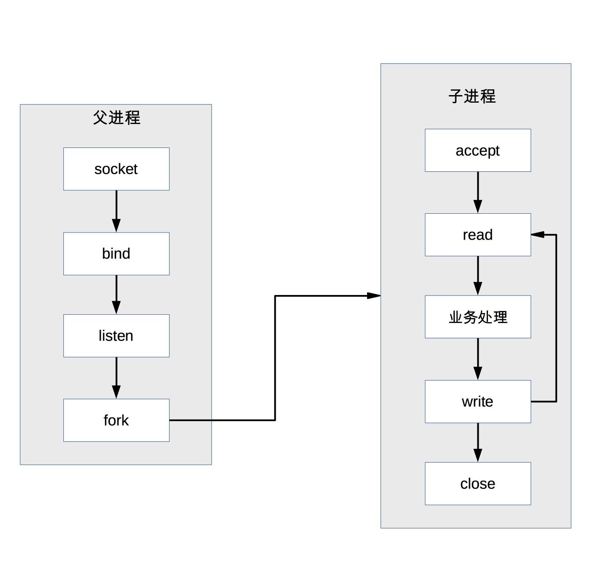

# 18 | 单服务器高性能模式：PPC与TPC

## 笔记

### 高性能架构设计

* 尽量提升单服务器的性能, 将单服务器的心梗发挥到极致.
* 如果单服务器无法支撑性能, 设计服务器集群方案.

**架构设计决定系统性能的上限, 实现细节决定系统性能的下限**.

### 并发模型

* I/O模型
	* 阻塞
	* 非阻塞
	* 同步
	* 异步
* 进程模型
	* 单进程
	* 多进程
	* 多线程

### PPC

PPR(Process Per Connection). 每次有新的连接就新建一个进程去专门处理这个连接的请求.


* 父进程接受连接
* 父进程`fork`子进程
* 子进程处理连接的读写请求
* 子进程关闭连接

```
父进程调用 close, 并没有直接关闭连接, 只是将链接的文件描述符引用计数减一, 真正的关闭连接是等子进程也调用了close后, 连接对应用的文件描述符引用计数变为 0 后, 操作系统次啊会真正关闭连接.
```

#### 缺点

* `fork`代价高.
* 父子进程通信复杂, 需要采用`IPC`
* 支持的并发连接数有限

### prefork

prefork就是**提前创建进程(pre-frok)**. 系统在启动的时候就预先创建好进程, 然后才开始接受用户的请求. 当有新的连接进来的时候, 就可以省去`fork`进程的操作.



Apache 提供了`MPM prefork`模式.

#### 惊群

实现的关键是**多个子进程都`accept`同一个`socket`**, 当有新的连接进入时, 操作系统保证只有一个进程能最后`accept`成功. 

**惊群**就是指虽然只有一个子进程能`accept`成功, 但所有阻塞在`accept`上的子进程都会被唤醒, 这样就导致了不必要的进程调度和上下文切换. Linux2.6 版本后内核已经解决了`accept`惊群问题.

### TPC

TPC(Thread Per Connection). 每次有新的连接就新建一个**线程**去专门处理连接的请求.


* 主进程不用`close`, 因为子线程是共享主进程的进程空间, 只需要一次`close`即可.
* 创建线程比创建进程的代价低.
* 无需进程间通信, 但是会有线程互斥的问题, 容易导致死锁.
* 多线程互相影响, 某个线程出现异常, 可能会导致整个进程退出.

### prethread

`prethread`会预先创建线.


* 主进程`accept`, 然后将链接交给某个线程处理.
* 子线程都尝试去`accept`, 最终只有一个线程`accept`成功.

Apache 提供了`MPM worker`模式. 但是做了改进.

* 首先创建多个进程
* 每个进程里面再创阿金多个线程

注释要考虑**稳定性**, 某个子进程里面的某个线程异常导致整个子进程退出, 还会有其他子进程继续提供服务, 不会道正整个服务器全部挂掉.

## 扩展

### tcp_nodelay

为什么会将响应时间从2毫秒延长到40毫秒.

是`TCP`协议中的 Nagle‘s Algorithm 和 TCP Delayed Acknoledgement 共同起作用所造成的结果.

#### Nagle’s Algorithm

Nagle’s Algorithm 是为了提高带宽利用率设计的算法，其做法是合并小的TCP 包为一个，避免了过多的小报文的 TCP 头所浪费的带宽。如果开启了这个算法 （默认），则协议栈会累积数据直到以下两个条件之一满足的时候才真正发送出去:

* 积累的数据量到达最大的 TCP Segment Size
* 收到了一个 Ack

#### TCP Delayed Acknoledgement

假如需要单独确认每一个包的话，那么网络中将会充斥着无数的ACK，从而降低了网络性能

**不再针对单个包发送ACK，而是一次确认两个包，或者在发送响应数据的同时捎带着发送ACK，又或者触发超时时间后再发送ACK**

#### Nagle和DelayedAcknowledgment是如何影响性能的

如果一个 TCP 连接的一端启用了 Nagle‘s Algorithm，而另一端启用了 TCP Delayed Ack，而发送的数据包又比较小，则可能会出现这样的情况:

* 发送端在等待接收端对上一个packet 的 Ack 才发送当前的 packet.
* 收端则正好延迟了此 Ack 的发送，那么这个正要被发送的 packet 就会同样被延迟.

**Delayed Ack 是有个超时机制的，而默认的超时正好就是 40ms**.

#### 如何会触发

仅当协议的交互是发送端连续发送两个 packet，然后立刻 read 的 时候才会出现问题.

#### 设置`TCP_NODELAY`

现在让我们假设某个应用程序发出了一个请求，希望发送小块数据。我们可以选择立即发送数据或者等待产生更多的数据然后再一次发送两种策略.

当我们正在发送一个较短的请求并且等候较大的响应时，相关过载与传输的数据总量相比就会比较低，而且，如果请求立即发出那么响应时间也会快一些. **设置`TCP_NODELAY`, 禁用`Nagle`算法**.

### tcp_nopush

TCP_CORK选项的功能类似于在发送数据管道出口处插入一个“塞子”, 使得发送数据全部被阻塞, 直到取消TCP_CORK选项(即拔去塞子)或被阻塞数据长度已超过MSS才将其发送出去.

* 选项`TCP_NODELAY`是禁用`Nagle`算法, 即数据包立即发送出去.
* `TCP_CORK`与此相反, 可以认为它是`Nagle`算法的进一步增强, 即阻塞数据包发送.

```
比如收到接收端的ACK确认后，Nagle算法可以让当前待发送数据包发送出去，即便它的当前长度仍然不够一个MSS.

但选项TCP_CORK则会要求继续等待，这在前面的tcp_nagle_check()函数分析时已提到这一点，即如果包数据长度小于当前MSS &&（（加塞 || …）|| …），那么缓存数据而不立即发送.

在TCP_NODELAY模式下，假设有3个小包要发送，第一个小包发出后，接下来的小包需要等待之前的小包被ack，在这期间小包会合并，直到接收到之前包的ack后才会发生；

而在TCP_CORK模式下，第一个小包都不会发生成功，因为包太小，发生管道被阻塞，同一目的地的小包彼此合并后组成一个大于mss的包后，才会被发生
```

