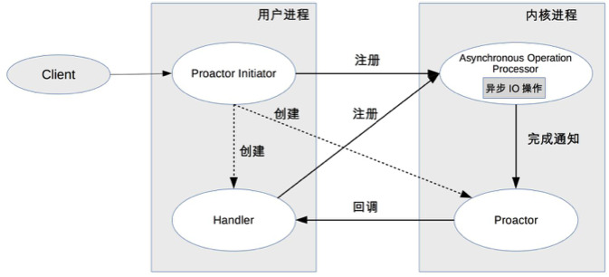

# 19 | 单服务器高性能模式：Reactor与Proactor

## 笔记

### Reactor

`PPC`(TPC), 连接结束后进程就销毁了, 很大的浪费.

资源复用, 不再单独为每个连接创建进程, 而是创建一个**进程池**, **将连接分配给进程, 一个进程可以处理多个链接的业务**.

#### I/O多路复用

传统, `read->业务处理->wriet`. 如果一个进程处理多个连接, 进程阻塞在某个连接的`read`操作上, 此时即使其他连接有数据可读, 进程也无法去处理.

将`read`操作改为非阻塞, 然后进程不断轮询多个连接. 但是效率低下. 如果**只有当连接上有数据的数据进程采取处理, `I/O`复用**

* 当多条链接共用一个阻塞对象后, 进程只需要在一个阻塞对象上等待, 而无须在轮询所有连接
	* select
	* epoll
	* kequeue
* 当某条连接有新的数据可以处理时, 操作系统会通知进程, 进程从阻塞状态返回, 开始进行业务处理

#### 事件反应

来了一个事件我就有相应的反应.

`Reactor`也叫`Dispatcher`.

**I/O多路复用统一监听事件, 收到事件后分配(Dispatch)给某个进程**

#### Reactor 模式

* Reactor
* 处理资源池(进程池或线程)

灵活多变:

* Reactor 数量可以变化, 可以是一个`Reactor`, 也可以是多个.
* 资源池的数量可以变化: 可以是单个进程, 也可以是多个进程.

* 三种典型实现方案:

* 单`Reactor`单进程/线程. (多`Reactor`单进程/线程, 即复杂有没有性能优势)
* 单`Reactor`多线程.
* 多`Reactor`多进程/线程.

示例

* java 使用线程
* C 进程和线程都可以
* Nginx 使用进程
* memcache 使用线程

### 单`Reactor`单进程/线程

* `Reactor`对象通过`select`监控连接事件, 收到事件后通过`dispatch`进行分发
* 如果是连接建立事件, 择由`Acceptor`处理, `Acceptro`通过`accept`接受连接, 并创建一个`Handler`来处理连接后续各种事件.
* 如果不是连接建立事件, 则`Reactor`会调用连接对应的`Handler`来进行响应(第二步创建的Handler).
* `Handler`会完成`read`->业务处理->`send`的完整业务流程.

优点:

* 没有进程间通信
* 没有进程竞争

缺点:

* 只有一个进程, 无法发挥多核CPU的性能. 只能部署多个系统来利用多核`CPU`,
* `Handler`在处理某个连接上的业务时, 整个进程无法处理其他连接的事件, 会导致性能瓶颈.

**适用于业务处理非常快速的场景**

`Redis`就是使用该方案.

### 单`Reactor`多线程

* 主线程中, `Reactor`对象通过`select`监控连接事件, 收到事件后通过`dispatch`进行分发.
* 如果是连接建立事件, 择由`Acceptor`处理, `Acceptro`通过`accept`接受连接, 并创建一个`Handler`来处理连接后续各种事件.
* 如果不是连接建立事件, 则`Reactor`会调用连接对应的`Handler`来进行响应(第二步创建的Handler).
* `Handler`只负责响应事件, 不进行业务处理, `Handler`通过`read`读取到数据后, 会发给`Processor`进行业务处理.
* `Processor`会在独立的子线程中完成真正的业务处理, 然后将相应结果发给主线程的`Handler`处理. `Handler`收到响应后通过`send`将相应结果返回给`client`.

可以充分利用多核多CPU的处理能力, 缺点:

* 多线程数据共享访问比较复杂. 
* `Reactor`承担所有事件的监听和响应, 只在主线程中运行, 瞬间高并发时会成为性能瓶颈.

### 多`Reactor`多进程/线程

* 父进程`mainReactor`对象通过`select`监控连接建立事件, 收到事件后通过`Acceptor`接收, 将新的链接分配给某个子进程.
* 子进程的`subReactor`将`mainReactor`分配的连接加入连接队列进行监听, 并创建一个`Handler`用于处理连接的各种事件.
* 当有新的事件发生时, `subReactor`会调用连接对应的`Handler`.(即第2步中创建的`Handler`来进行响应).
* `Handler`完成`read->业务处理->send`的完整业务流程.

优点:

* 父进程和子进程的职责非常明确
	* 父进程只负责接收新连接
	* 子进程负责完成后续的业务处理
* 父进程和子进程的交互很简单, 父进程只需要把新连接传给子进程, 子进程无须返回数据
* 子进程之间是互相独立的, 无须同步共享之类的处理.

示例:

* `Nginx`多`Reactor`多进程
	* 主进程仅仅创建了监听端口, 并没有创建`mainReactor`来`accept`连接
	* 由子进程的`Reactor`来`accept`连接, 通过锁来控制一次只有一个子进程进行`accept`, 子进程`accept`新连接后就放到自己的`Reactor`进行处理, 不再分配给其他子进程.
* `Memcached`多`Reactor`多线程

### Proactor

`Reactor`是非阻塞同步网络模型, 因为真正的`read`和`sedn`操作都需要用户进程同步操作.
**同步**是指用户进程在执行`read`和`send`这类`I/O`操作的时候是同步的. 如果把`I/O`操作改为异步就能够进一步提升性能, 这就是异步网络模型`Proactor`.

* `Reactor`: 来了事件我通知你, 你来处理.
* `Proactor`: 来了事件我来处理, 处理完了我通知你.
	* 我: 操作系统系统内核
	* 事件: 新连接,有数据可读, 有数据可写的`I/O`事件
	* 你: 程序代码

* `Proactor Initiator`负责创建`Proactor`和`Handler`, 并将`Proactor`和`Handler`都通过`Asynchronous Operation Processor`注册到内核
* `Asynchronous Operation Processor`负责处理注册请求, 并完成`I/O`操作
* `Asynchronous Operation Processor`完成`I/O`操作后通知`Proactor`
* `Proactor`根据不同的事件类型回调不同的`Handler`进行业务处理.
* `Handler`完成业务处理, `Handler`也可以注册新的`Handler`到内核进程.

## 扩展