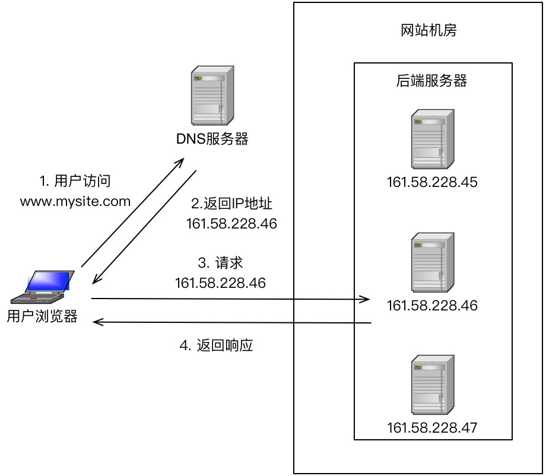

# 20 | 高性能负载均衡：分类及架构 

## 笔记

### 高性能集群设计

计算本身存在一个特点**同样的输入数据和逻辑, 无论在哪台服务器上执行,都应该得到相同的输出**.

高性能集群设计的复杂度主要体现在任务分配这部分: **设计合理的任务分配策略,将计算任务分配到多态服务器上执行**

**高性能集群的复杂性主要体现在需要增加一个任务分配器, 以及为任务选择一个合适的任务分配算法**.

### 负载均衡器

上面的**任务分配器**也叫**负载均衡器**.

但是, 负载均衡器不只是为了计算单元的负载达到均衡状态.

* 基于负载
* 基于性能(吞吐, 响应时间)
* 基于业务
* ...

### 负载均衡分类

#### DNS 负载均衡

一般用来实现**地理级别**的均衡. 北方用户访问北京机房, 南方用户访问深圳的机房.

`DNS`负载均衡的本质是`DNS`解析同一个域名可以**返回不同的`IP`地址**.



优点:

* 简单, 成本低
* 就近访问, 提升访问速度

缺点:

* 更新不及时, DNS缓存的时间长.
* 扩展性差: DNS负载均衡的扩职权在域名商那里.
* 分配策略简单, 也无法感知后端服务器的状态.

自己实现`HTTP-DNS`, 优缺点和通用`DNS`相反.

#### 硬件负载均衡

通过单独硬件设备来实现负载均衡功能, 和路由器, 交换机类似. 可以裂解为一个用于负载均衡的基础网络设备.
常用的设备:

* `F5`
* `A10`

优点:

* 功能强大: 支持各层级的负载均衡.
* 性能强大: 软件支持到`10`万就很强大了, 硬件可以支撑到`100`万.
* 稳定性高
* 支持安全防护: 还具备防火墙, 防`DDoS`攻击等安全功能.

缺点:

* 价格昂贵
* 扩展能力差

#### 软件负载均衡

常见有`Nginx`和`LVS`.

* `Nginx`是7层负载均衡. **协议**, 性能大概能到`5万/s`
	* HTTP
	* E-mail
* `LVS`是`Linux`内核的4层负载均衡. **灵活**, 性能大概能都`10万-80万/s`
	* 和协议无关, 几乎所有应用都可以做

这里的服务器是指`32核48G内存`.


优点:

* 简单
* 便宜
* 灵活

缺点:

* 性能一般
* 功能没有硬件负载均衡那么强大
* 一般不具备防火墙和`DDoS`攻击等安全功能

### 负载均衡典型架构

根据上述负载均衡组合使用:

* `DNS`负载均衡用于实现**地理级别**的负载均衡.
* 硬件负载均衡用于实现**集群级别**的负载均衡.
* 软件负载均衡用于实现**机器级别**的负载均衡.


## 扩展

### 计算示例

日活1000万论坛.

```
1000万DAU, 换算成秒级,约等于116.

流量评估: 

1. 考虑每个用户操作次数，假定10，换算成平均QPS=1160.
2. 考虑峰值是均值倍数，假定10，换算成峰值QPS=11600.
3. 考虑静态资源、图片资源、服务拆分等，流量放大效应，假定10，QPS*10=116000.

容量规划

1. 高可用、异地多活，QPS*2=232000
2. 未来半年增长，QPS*1.5=348000

```

### TPS 和 QPS

* TPS, `T`ransaction, 写请求
* QPS, `Q`uery, 读请求