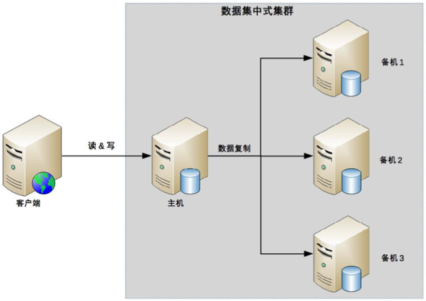

# 26 | 高可用存储架构：集群和分区 

## 笔记

### 数据集群

* 数据集中集群
	* 适合数据量不大, 集群机器数量不多的业务场景.
* 数据分散集群
	* 适合业务数据量巨大, 集群机器数量庞大的业务场景.

#### 数据集中集群

数据只能往主机中写.

复杂度:

* 主机如何将数据复制给备机
	* 多条复制通道会增大主机复制的压力
	* 多条复制通道可能会导致多个备机之间数据不一致
* 备机如何检测主机状态
	* 处理不同备机对主机状态的不同判断
* 主机故障后, 如何决定新的主机
	* 多台备机可以升为主机, 哪一台备机作为新的主机

#### 数据分散集群

多个服务器组成一个集群, 每台服务器都会负责存储一部分数据. 同时, 为了提升硬件利用率, 每台服务器又会备份一部分数据.

数据如何分配到不同的服务器上, 算法需要考虑:

* 均衡性
	* 数据分区基本是均衡的
* 容错性
	* 当出现部分服务器故障, 算法需要将原来分配给故障服务器的数据分区分配给其他服务器
* 可伸缩性
	* 容量不够, 扩充新的服务器后, 算法能够自动将部分数据分区迁移到新服务器, 并保证扩容后所有服务器的均衡性

特点:

* 每台服务器都可以处理读写请求
* 必须有一个角色来负责执行数据分配算法
	* 可以是独立的一台服务器
	* 有也是集群自己选举出的一台服务器

##### 示例

`Hadoop`: 独立的服务器负责数据分区的分配(`Namenode`).

`Elasticsearch`: 通过选举一台服务器来做数据分区的分配.(`master node`).

### 数据分区

基于地理级别的故障来设计高可用架构, 数据分区架构产生的背景.

按照一定的规则进行分区, 不同分区分布在不同的地理位置上, 每个分区存储一部分数据. 就算受影响也只会影响一部分数据.

数据分区架构考量方面:

* 数据量, 数据量越大, 分区规则越复杂
* 分区规则
* 复制规则, 数据分区也要避免分区本身的数据损坏或者丢失. 同样需要考虑复制方案.
	* 集中式
	* 互备式
	* 独立式

#### 集中式

一个总的备份中心, 所有的分区都将数据备份到备份中心.

特点:

* 设计简单, 各分区之间并无直接联系.
* 扩展容易, 数据复制到新的备份中心即可.
* 成本较高, 独立的备份中心.

#### 互备式

每个分区备份另外一个分区的数据

特点:

* 设计比较复杂
	* 各个分区除了要承担业务数据存储, 还要承担备份功能
* 扩展麻烦
	* 增加一个分区, 需要考虑原来已经备份了的数据
* 成本低
	* 直接利用已有的设备

#### 独立式

每个分区自有独立的备份中心.

各个分区的备份并不和原来的分区在一个地方.

北京分区的备份放到了天津, 上海的放到了杭州.... 目的是规避同城或者相同地理位置同时发生灾难性故障的极端情况.

特点:

* 设计简单, 各分区互不影响
* 扩展容易, 新增加的分区只需要搭建自己的备份中心即可
* 成本高, 每个分区需要独立的备份中心.

## 扩展