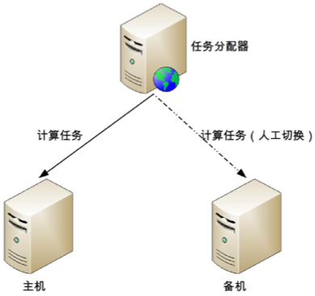
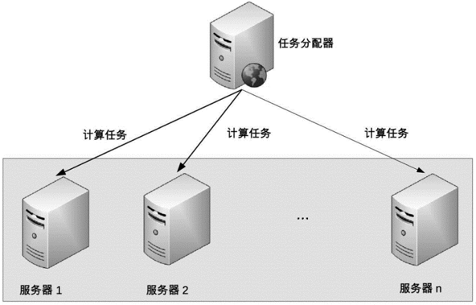

# 27 | 如何设计计算高可用架构？

## 笔记

### 高可用

高可用的本质是**通过冗余来规避部分故障的风险**, 通过增加更多的服务器来达到计算高可用.

复杂度主要体现在**任务管理**方面

### 任务管理

* 哪些服务器可以执行任务
	* 每个服务器都可以执行任务(例如访问某个网站页面)
	* 特定服务器可以执行任务, 当故障后, 需要挑选新的服务器来执行(如ZooKeeper的Leader)
* 任务如何重新执行
	* 已经分配的任务即使执行失败不也不做任何处理, **系统只需要保证新的任务能够分配到其他非故障服务器上执行即可**
	* 设计一个任务管理器来管理需要执行的计算任务, 服务器执行完成任务后, 需要向任务管理器反馈任务执行结果, **任务管理器根据任务执行结果来决定是否需要将任务重新分配到另外的服务器上执行**

#### 任务分配

是一个**逻辑上的概念**

* `Nginx`反向代理

### 高可用架构 - 主备

* 主机处理所有业务
* 当主机故障时, 任务分配器**不会自动**将计算任务发给备机, 此时**系统处于不可用状态**
* 如果主机能够恢复, 任务分配器继续发给主机
* 如果主机不能够恢复, 需要**人工操作**, 将备机提升为主机

#### 冷备

程序包和配置文件已经准备好, 业务系统没有启动.

#### 温备

备机上业务系统已经启动, 只是不对外提供服务.

#### 冷备 和 温备

* 冷备可以节省一定的资源
* 温备减少时间

#### 主备适用场景

人数不多, 适用频率不高. 不适合在线的业务.

### 高可用架构 - 主从

任务分配器需要将任务进行分类, 确定哪些任务可以发给主机执行, 哪些任务可以发送给备机执行.

* 正常情况下, 主机执行部分计算任务(`A`), 备机执行部分计算任务(`B`)
* 当主机故障, 任务分配器不会自动将原来发送给主机的任务发送给从机, 而是**继续发送给主机, 不管这些任务执行是否成功**.
* 如果主机能够恢复, 任务分配器继续按照原有的设计策略分配任务.
* 如果主机不能够恢复, 则需要人工操作
	* 将原来的从机升为主机
	* 增加新的机器作为从机

优缺点:

* 优点: 从机也执行任务, 发挥了从机硬件性能.
* 缺点: 主从架构需要将任务分类, 任务分配器会复杂一些.

### 高可用架构 - 集群

集群方案: 系统能够自动完成切换操作.

根据集群中服务器节点角色的不同:

* 对称集群: 集群中每个服务器的角色都是一样的, 都可以执行所有任务.
* 非对称集群: 分为多个不同的角色, 不同的角色执行不同的任务(`Master-Slave`).

#### 对称集群

也叫**负载均衡集群**

设计:

* 正常情况下, 任务分配器采取某种策略(随机, 轮询等)将计算任务分配给集群中的不同服务器.
* 当集群中的某台服务器故障后, 任务分配器**不再将任务分配给它, 而是将任务分配给其他服务器执行**.
* 当故障的服务器恢复后, 任务分配器**重新将任务分配给它执行**.

关键点:

* 任务分配器的**分配策略**.
* 任务分配器需要**检测服务器状态**.

#### 非对称集群

不同服务器的角色是不同的, 不同角色的服务器承担不同的职责.

设计:

* 集群通过某种方式区分不同服务器的角色.
* 任务分配器将不同任务发送给不同服务器.
* 当指定类型服务器故障时, 需要重新分配角色.
	* `master`挂了, 从`slave`选举一台新的`master`.
	* `salve`故障, 不需要重新分配, 踢出故障服务器即可.

相比对称集群的复杂度:

* 任务分配策略复杂: 不同任务分配给不同角色的集群节点.
* 角色分配策略实现复杂.
	* ZAB(ZooKeeper)
	* Raft

## 扩展