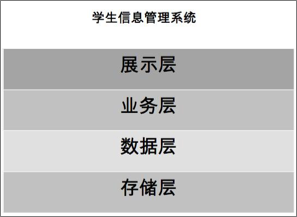
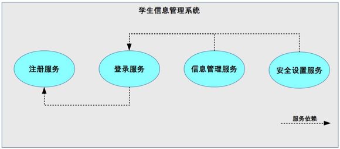

# 32 | 可扩展架构的基本思想和模式 

## 笔记

### 可扩展的基本思想

**拆**: 将原本大一统的系统拆分成多个规模小的部分, 扩展时只修改其中一部分即可, 无须整个系统到处都改, 通过这种方式来减少改动范围, 降低改动风险.

拆分思路:

* 面向流程拆分: 将整个**业务流程**拆分为几个阶段, 每个阶段作为一部分.
* 面向服务拆分: 将系统提供的**服务**拆分, 每个服务作为一部分.
* 面向功能拆分: 将系统提供的**功能**拆分, 每个功能作为一部分.

* 流程
	* `TCP/IP`网络通信流程是: 应用层 -> 传输层 -> 网络层 -> 链路层 -> 物理层. 
* 服务
	* 应用层: HTTP, FTP, SMTP 服务
	* HTTP: Web服务
	* FTP: 文件服务
	* SMTP: 邮件服务
* 功能: 每个服务都会提供相应功能
	* HTTP服务: `GET`, `POST`功能
	* FTP服务: 上传下载功能
	* SMTP服务: 邮件发送和收取功能

### 拆分示例 - 学生信息管理系统

#### 1. 面向流程拆分

**展示层->业务层->数据层->存储层**

#### 2. 面向服务拆分

**注册, 登录, 信息管理, 安全设置**

#### 3. 面向功能拆分

**每个服务都可以拆分为更多细粒度功能**

按照功能拆分:

* 注册服务
* 登录服务
* 信心管理服务
* 安全设置服务

**不同拆分的方式, 本质上决定了系统的扩展方式**

#### 服务和功能

可以理解**服务是一组相似功能的集合**, 例如用户登录是服务, 这个服务支持手机号登录, 微信登录, QQ登录3个登录功能, 当然, 如果你真的需要把手机号登录做成一个独立的服务也是可以的, 不存在绝对的界限.

### 可扩展方式

合理的拆分, 能够强制保证即使程序员出错, 出错的范围也不会太广, 影响也不会太大.

### 优势

* 面向流程拆分
	* 扩展时大部分情况只需要修改某一层. 存储层从`MySQL`改为支持`Mysql`和`Oracle`只需要扩展存储层和数据层即可.
* 面向服务拆分
	* 增加新的服务时, 只需要扩展相关服务即可.
* 面向功能拆分
	* 对某个功能扩展, 只需要扩展相关功能

* 面向流程拆分: 分层架构
* 面向服务拆分: SOA, 微服务
* 面向功能拆分: 微内核架构

## 扩展