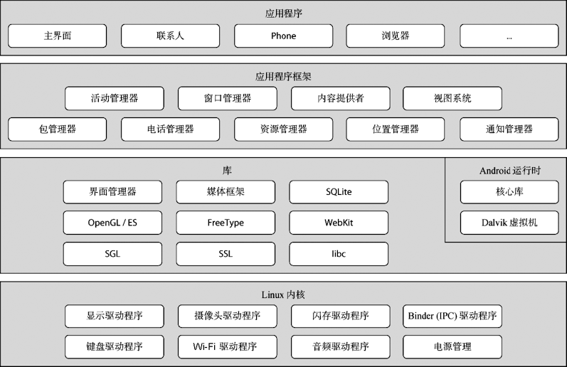
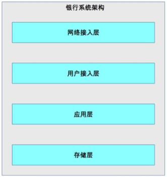
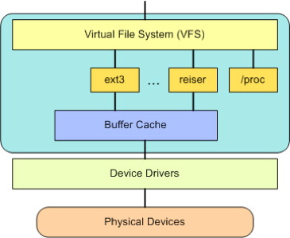
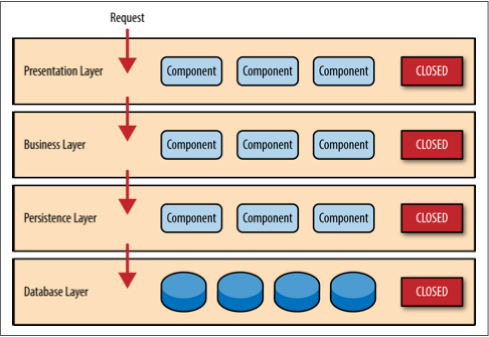

# 33 | 传统的可扩展架构模式：分层架构和SOA 

## 笔记

### 分层架构

#### 1. C/S 架构, B/S 架构

* 划分的对象: 整个业务系统
* 划分的维度: 用户交互

将和用户交互的部分独立为一层, 支撑用户交互的后台作为另外一层.

#### 2. MVC架构, MVP架构

* 划分的对象: 单个业务子系统
* 花费的维度: 职责

将**不同的职责**划分到独立层, 但各层的依赖关系比较灵活.

#### 3. 逻辑分层架构

逻辑分层架构中的层是**自顶向下依赖的**

`J2EE`的逻辑分层:

针对整个业务系统进行逻辑分层:

**分层架构核心**: 需要保证各层之间的差异足够清晰, 边界足够明显, 让人看到架构图后就能看懂整个架构.

分层如果太多, 容易让开发人员混淆.

分层系统的本质是**隔离关注点(separation of concerns)**, 每个层中的组件只会处理本层的逻辑. 在扩展某层时, 其它层是不受影响的. **开放封闭原则**

分层时候要保证层与层之间的依赖是稳定的, 才能真正支撑快速扩展.

`Linux`内核为了支撑不同的文件系统格式, **抽象**了`VFS`文件系统接口.

**分层结构特点**: 层层传递, 一旦分层确定, 整个业务流程按照层进行依次传递的, 不能在层之间进行跳跃.

**分层架构的缺点**: 冗余, 不管这个业务有多么简单, 每层都必须要参与处理.

### SOA

面向服务的架构.

`SOA`的3个关键概念:

#### 1. 服务

所有业务功能都是一项服务, 服务就意味着要对外提供开放能力. 服务可大可小, 需要自己划分.

#### 2. ESB

**企业服务总线**. 参考了计算机总线的概念. 计算机中的总线将各个不同设备连接在一起, `ESB`将企业中各个不同的服务连接在一起. 因为各个独立的服务是异构的, `SOA`使用`ESB`来屏蔽异构系统对外提供各种不同的接口方式, 以此来达到服务间高效的互联互通.

#### 3. 松耦合

松耦合的目的是减少各个服务间的依赖和互相影响. 

`SOA`架构是比较高层级的架构设计理念.

**解决**传统IT系统重复建设和扩展效率低的问题.

`ESB`需要事先与各种系统间的协议转换, 数据转换， 透明的动态理由等功能. 当`ESB`承载的消息太多时, `ESB`本身会成为整个系统的性能瓶颈.

**SOA主要不是为了拆分, 而是将已经存在的异构系统整合起来**

## 扩展