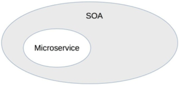
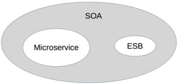
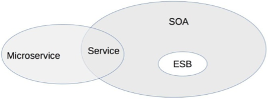

# 34 | 深入理解微服务架构：银弹 or 焦油坑？ 

## 笔记

### 微服务与`SOA`的关系

* 微服务是`SOA`的实现方式
	* `SOA`是一种架构理念
	* 微服务是`SOA`理念的一种具体实现方式
		* 微服务就是使用`HTTP RESTful`协议来实现`ESB`的`SOA`
		* 微服务就是更细粒度的`SOA`

* 微服务是去掉`ESB`后的`SOA`
	* 将`ESB`去掉改为轻量级的`HTTP`实现

* 微服务是一种和`SOA`相似但本质上不同的架构理念
	* 两者都关注"服务", 通过服务的拆分来解决**可扩展性**问题

#### 1. 服务粒度

* `SOA`的服务粒度要更粗一些
* 微服务的服务粒度要更细一些

* 员工管理系统
	* `SOA`: 是一个服务
	* 微服务:
		* 员工信息管理
		* 员工考勤管理
		* 员工假期管理
		* ...

#### 2. 服务通信

* `SOA`采用`ESB`作为服务间通信的关键组件
* 微服务使用统一的协议和格式. **聪明的终端, 愚蠢的管道**, 微服务的管道仅仅做消息传递, 对消息格式和内容一无所知.

#### 3. 服务交付

* `SOA`考虑的是兼容已有的系统
* 微服务的架构理念是**快速交付**
	* 自动化测试
	* 持续集成
	* 自动化部署

#### 4. 应用场景

* `SOA`适合庞大, 复杂, 异构的企业系统, 目的是**兼容**(使用ESB)
	* 企业已有系统改造成本高, 业务上有要求其互通, 才会有`SOA`
* 微服务适合快速, 轻量级, 基于`Web`的互联网系统

#### SOA和微服务的对比

**微服务是一种和`SOA`相似但本质上不同的架构理念**

### 微服务的陷阱 

#### 1. 服务划分过细, 服务间关系复杂

服务划分过细, 单个服务的复杂度下降, 但**整个系统的复杂度上升了**, **微服务将系统内的复杂度转移为系统间的复杂度**

#### 2. 服务数量太多, 团队效率急剧下降

拆分太多, 团队每个人负责的服务增多.

#### 3. 调用链太长, 性能下降

调用过多, 性能消耗过多.

#### 4. 调用链太长, 问题定位难

如果多个微服务同时发生不同类型的故障, 则定位故障更加复杂.

#### 5. 没有自动化支撑, 无法快速交付

* 自动化测试
* 自动化部署
* 自动化监控

#### 6. 没有服务治理, 微服务数量多了后管理混乱

* 服务路由
* 服务故障隔离
* 服务注册和发现

## 扩展