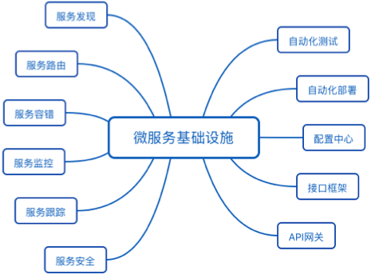

# 35 | 微服务架构最佳实践 - 方法篇  

## 笔记

### 避免踩陷阱

* 微服务拆分过细, 过分强调`small`
* 微服务基础设施不健全, 忽略了`automated`
* 微服务不轻量级, 规模大了后 `lightweight`不再适应

### 服务粒度

基于团队规模拆分.

**两个披萨理论**, 每个团队的人数不能多到两张披萨都不够吃的地步.

一个微服务, 3个人开发.

### 拆分方法

1. 基于业务逻辑拆分
	* 将系统中的业务模块按照职责范围识别出来, 每个单独的业务模块拆分为一个独立的服务.
2. 基于可扩展拆分
	* 将系统中的业务模块按照稳定性排序
		* 将已经成熟和改动不大的服务拆分为**稳定服务**
			* 粒度可以粗一些
		* 将经常变化和迭代的服务拆分为**变动服务**
			* 粒度可以细一些
		* 避免开发的时候, 影响了已有的成熟功能导致线上问题.
3. 基于可靠性拆分
	* 业务模块按照优先级排序
		* 核心服务需要**高可用**
		* 非核心服务
	* 优点
		* 避免非核心服务故障影响核心服务(日志不重要的功能不能影响重要的功能)
		* 核心服务高可用方案可以更简单
			* 拆分后
				* 逻辑更加简单
				* 存储的数据更少
				* 用到的组件会更少
		* 降低高可用成本
			* 核心服务高可用
4. 基于性能拆分
	* 将性能要求高或者性能压力大的模块拆分出来, 避免性能压力的服务影响其他服务.

根据实际情况**组合**拆分方式.

### 基础设施

真正决定微服务成败的, 是`automated`.

基础设施**优先级**

1. 微服务基础设施
	* 服务发现
	* 服务路由
	* 服务容错
2. 提升与外部服务对接的效率
	* API网关
3. 提升测试和运维效率
	* 自动化部署
	* 自动化跟踪
	* 配置中心
4. 提升运维效率
	* 服务监控
	* 服务跟踪
	* 服务安全

3和4两类基础设施, 重要性会随着微服务节点数量增加而越来越重要.

## 扩展