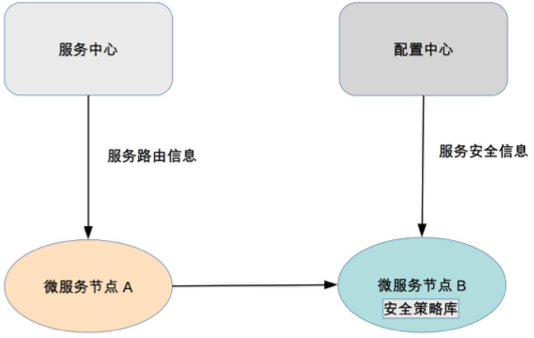

# 36 | 微服务架构最佳实践 - 基础设施篇

## 笔记

### 自动化测试

* 代码级的单元测试
* 单个系统级的集成测试
* 系统间的接口测试
	
### 自动化部署

微服务的补数频率会大幅提升.

自动化部署包括:

* 版本管理
* 资源管理
	* 机器管理
	* 虚拟机管理
* 部署操作
* 回退操作

### 配置中心

* 配置版本管理
* 增删改查配置
* 节点管理
* 配置同步
* 配置推送

### 接口框架

* 统一的接口协议: `HTTP/REST`
* 统一接口窜地的数据格式

### API网关

外部系统不需要理解这么多微服务的职责分工和边界. 关注的是需要的能力, 而不会关注这个能力应该由哪个微服务提供.

`API`网关是外部系统访问的接口, 所有的外部系统接入系统都需要通过`API`网关.

* 鉴权(是否允许接入)
* 权限控制(可以访问哪些功能)
* 传输加密
* 请求路由
* 流量控制

### 服务发现

* 微服务种类和数量多
* 微服务节点经常变化

**节点的变化能够及时同步到所有其他依赖的微服务**

#### 服务发现方式 - 自理式

每个微服务自己完成服务发现.

`SERVICE INSTANCE A`自己去`SERVICE REGISTRY`获取服务注册信息, 然后直接访问`SERVICE INSTANCE B`.

#### 服务发现模式 - 代理式

代理式结构就是指微服务之间有一个负载均衡系统, 由负载均衡系统来完成微服务之间的服务发现.

#### 服务发现核心

核心功能就是**服务注册表**, 注册表记录了所有的服务节点的配置和状态, 每个微服务启动后都需要将自己的信息注册到服务注册表, 然后由**微服务**或者**LOAD BALANCER**系统到服务注册表查询可用服务.

### 服务路由

服务路由和服务发现紧密相关.

核心功能是**路由算法**

* 随机路由
* 轮询路由
* 最小压力路由
* 最小连接数路由

### 服务容错

拆分后, 单个微服务故障的概率变小, 故障影响范围也减少, 但是微服务的节点量大大增加, 所以故障的概率会大大增加.

服务容错:

* 请求重试
* 流控
* 服务隔离

服务容错会集成在服务发现和服务路由系统中.

### 服务监控

系统拆分后, 节点数量大大增加. 需要有服务监控系统来完成微服务节点的监控.

服务监控作用:

* 实时搜集信息并进行分析, 避免故障后再来分析, 减少了处理时间.
* 服务监控可以在实时分析的基础上预警, 在问题萌芽阶段发觉并预警

一般是独立系统.

### 服务跟踪

需要跟踪**某一个请求在微服务中的完整路径**

### 服务安全

拆分后, 数据分散在各个微服务节点上. 

* 从系统连接的角度来说, 任意微服务都可以访问所有其他微服务节点.
* 从业务角度来说, 部分敏感数据或者操作, 只能部分微服务可以访问.

服务安全主要分为:

* 接入安全
* 数据安全
* 传输安全

一般会把策略封装成通用的库提供给各个微服务调用.

## 扩展