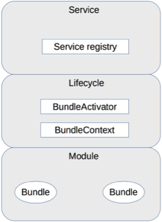

# 37 | 微内核架构详解

## 笔记

微内核架构(Microkernel Architecture), 也被称为**插件化架构(Plug-in Architecture)**. 是面向功能进行拆分的可扩展性架构.

### 基本架构

* 核心系统(core system): 负责和具体业务功能无关的通用功能
* 插件模块(plug-in modules): 负责实现具体的业务逻辑

**微内核架构本质就是将变化部分封装在插件里面, 从而达到快速灵活扩展的目的, 而又不影响整体系统的稳定**.

### 设计关键点

#### 1. 插件管理

管理插件, 常见的实现方法是**插件注册表机制**.

插件注册表含有每个插件模块的信息, 包括:

* 名字
* 位置
* 加载时机
	* 启动就加载
	* 按需加载

#### 2. 插件连接

插件如何连接到核心系统.

核心系统必须制定和系统系统的**连接规范**.

常见链接机制有:

* OSGI(Eclipse)
* 消息模式
* 依赖注入(Spring)

#### 3. 插件通信

某个业务流程需要多个插件协作， 这就要求两个插件间进行通信. 微内核的核心系统需要提供通信机制, 让各个插件之间进行正常的通信.

### OSGi 架构简析

`Open Services Gateway initiative`. 构建一个在广域网和局域网或设备上展开业务的基础平台. 最早设计是针对嵌入式应用.

**OSGi**是一个插件化的标准, 不是一个可运行的框架.

#### 1. 模块层(Module层)

模块层实现插件管理功能. 插件被称为`Bundle`.

#### 2. 生命周期层(Lifecycle 层)

生命周期层实现插件连接功能, 提供了执行时模块管理, 模块对底层OSGi框架的访问.

定义了`Bundle`生命周期的操作：

* 安装
* 更新
* 启动
* 停止
* 卸载

#### 3. 服务层(Service 层)

服务层实现插件通信功能.

### 规则引擎架构简析

* 可扩展
* 易理解
* 高效率

## 扩展