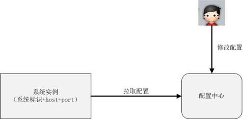
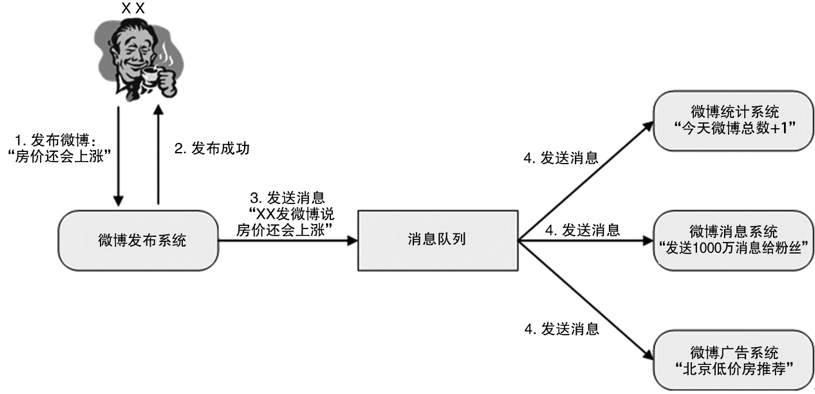

# 41 | 互联网架构模板：“开发层”和“服务层”技术 

## 笔记

### 开发层技术

* 开发框架
* `Web`服务器
* 容器
	* 运维方式变化
	* 设计模式发生变化

### 服务层技术

**目标: 降低系统间相互关联的复杂度**

#### 1. 配置中心

优点:

* 集中配置多个系统, 操作效率高
* 配置集中在一个地方, 检查方便, 协作效率高
* 实现程序化的规则检查(自动糊安检查)
* 备份了系统的配置

通过**系统标识 + host + port**来标识唯一一个系统运行实例.

#### 2. 服务中心

解决跨系统依赖的**配置**和**调度**的问题.

##### 服务名字系统

服务名字系统是为了将`Service`名称解析为`host + port + 接口名称`

##### 服务总线系统

由总线系统完成调用, 服务请求方都不需要直接和服务提供方交互了.

#### 3. 消息队列

传统的异步通知是由消息生产者**直接调用**消息消费者提供的接口进行通知.

消息队列:

* 1对1
* 1对多

**消息可以使用订阅模式?**

优点:

* 接口从网状接口变为**线性结构**
* 消息生产和消息消费**解耦**
* 增加新的消息消费者, 消息生产者不用改动, **扩展方便**
* 消息对类系统可以用做高可用, 高性能
* 业务子系统**关注业务即可**

## 扩展