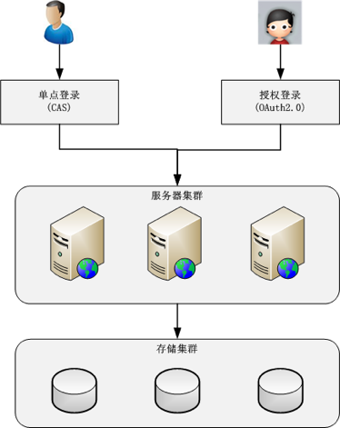

# 43 | 互联网架构模板：“用户层”和“业务层”技术

## 笔记

### 用户层技术

#### 1. 用户管理

* 单点登录
	* cookie
	* JSONP
	* token

`CAS`

* 授权登录: `OAuth 2.0`

用户管理基本架构

#### 2. 消息推送

* IOS
	* APNS
* Android
	* 设备管理(唯一标识，注册, 注销)
	* 连接管理
	* 消息管理

#### 3. 存储云, 图片云

* 数据量大
* 文件体积小
* 访问有时效性

技术实现: CDN + 小文件存储

### 业务层技术

主要挑战: **复杂度**

**拆**

**合**

按照"高内聚, 低耦合"将职责关联比较强的子系统合成一个**虚拟业务域**(领域?), 通过网关对外统一呈现. 类似设计模式的`Facade`模式.

虚拟业务与: "5+-2"比较合适.

## 扩展