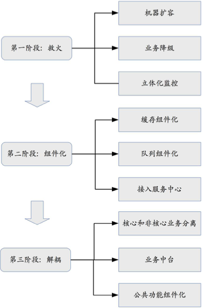

# 47 | 架构重构内功心法第三式：运筹帷幄

## 笔记

* 区分问题的优先级
* 问题分类
* 不要光挑简单的问题处理

**将要解决的问题根据优先级, 重要性, 实施难度等划分为不同的阶段, 每个阶段聚焦于一个整体目标, 集中精力和资源解决一类问题**

* 阶段目标明确
* 阶段工作量不大
* 每个阶段改动不会太大, 降低了总体风险

### 分段实施策略

* 优先级排序
* 问题分类
* 先易后难
* 循序渐进

## 扩展