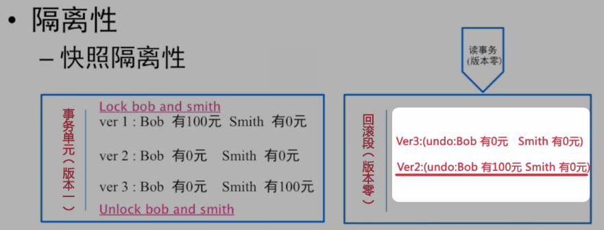

#1 事务与分布式事务原理与实践

###笔记

---

####事务简介

**事务是什么**

核心就是`锁`和`并发`.将多个`不同`的命令组装到一起的过程.

在数据库里做针对同一个事务单元的操作的时候需要几个`毫秒`的时间,因为要`记录日志`.

**事务优势**

* 容易理解
* 性能较低

**模型**

容易理解的模型性能都不好,性能好的模型都不容易理解

`性能好`,锁的`颗粒度较小`,难以理解

**单个事务单元**

	`Bob给smith 100块`
	
			1. 锁定Bob账户
			2. 锁定Smith账户
			3. 查看Bob是否100元
			4. 从Bob账号中减少100元
			5. 给Smith账户中增加100元
			6. 解锁Bob账户
			7. 解锁Smith账户
			
事务要保证的问题就是`一致性`.

`ACID保证事务完整性`

**这些也是一个事务单元**

* 商品要建立一个基于BMT_Modified的索引
* 从数据库中读取一行记录
* 向数据库中写入一行记录,同时更新这行记录的所有索引
* 删除整张表
* Etc...

针对数据库的`每一个`操作都可以认为是一个`事务`.

`BEGIN TRANSACTION` 和 `COMMIT` 包裹之间的操作也是一个`大`的事务单元.

**一组事务单元**

1. Bob 给 smith 100 块
2. Smith 给 Joe 100 块(因为1中smith账户已经被锁,所以需要等待)
3. Smith 给了Bob 100 块

每一个事务单元在运行过程中`不能看见中间状态`.

`2PL(Two Phase Lock)`,针对单机事务.`2PC`是针对`2PL`在分布式系统的一种扩展.

`2PL`:

1. 锁住数据
2. 更新数据
3. 解锁

`COMMIT`: 解锁,刷日志 操作.

**事务产生的原因**

事务单元之间的Happen-before关系:

1. `读写`
2. `写读`
3. `读读`
4. `写写`

`何如能够以最快的速度完成?`
`如果保证上面四种操作的逻辑顺序`

####处理事务的常见思路

**序列化读写**

完成顺序读写,不会死锁.不能并行.所有`读写串行`.

**排他锁**

原来是一个队列,分散到很多队列上.用锁来`实现`并发.

只要保证针对这个事务单元内的数据没有出现冲突,就不应该冲突

		1. Bob 给 Smith 100 元
		2. 李磊 给 韩梅梅 100 元
		
这两个事务完全`没有冲突`.所以可以并行起来

但是 

		1. 李磊 给 韩梅梅 100 元
		2. 韩梅梅 给 李磊 100 元

共享事务单元内的数据,有`冲突`不能并行.

**读写锁**

在延续上面的例子,把用`读锁`和`写锁`把`读`和`写`场景完全分离开,就可以让`读完全并行`.

* `读读` 并行
* `写读` 串行
* `读写` 串行
* `写写` 串行

对于读多,写少 进一步提升并行度.

**可重复读(隔离级别)**

`读`未释放,`写`等待.可以保证上一次读的数据.

读写没法`完全并行`.

**读已提交(隔离级别)**

放弃读锁,进一步提升并行度.

**事务-MVCC**

能偶做到写不阻塞读. 

`copy on write`

针对`写读`场景优化,并发度高.系统实现复杂度高.

* `读读` 不冲突
* `写读` 不冲突
* `写写` 冲突
* `读写` 不冲突

可以实现大事务,因为和读不会冲突.不会造成`读等待`.

####事务处理的常见问题

* 多个事务,谁先谁后?
* 如何故障恢复?
* 碰到死锁了怎么办?

**事务谁先谁后**

一个读请求应该读哪一个写之后的数据?

`逻辑时间戳`(只是保证`先后顺序`,不是时间描述):

* SCN(Oracle)
* Trx_id(Innodb)
* ETC...

内存维持一个自增,每次有写,+1.

Happen Before,事务的先后关系通过自增id号来保证.

`物理时间戳`(时间描述)

####事务处理故障恢复

`可能的错误情况`:

* 业务属性不匹配(回滚)
* 系统崩溃(数据恢复,回滚操作)

####死锁与死锁检测

**死锁产生的原因**

* 两个线程
* 不同方向
* 相同资源

举例:
	
		事务单元1：		

		Bob给Smith转账
		Lock Bob
		Lock Smith

		事务单元2:
		
		Smith给Bob转账
		Lock Smith
		Lock Bob

**死锁的解决方案**

* 尽可能不死锁
* 碰撞检测
	
	所有人维持锁和等待的锁下来。
	
* 等锁超时

####从单机事务到分布式事务

* 分布式事务与单机事务,相同与不同
* 分布式事务的主要难题
* 传统数据库的分布式事务
* 心形互联网行业的分布式事务尝试

####深入单机事务

* 事务的ACID
* 单机事务的典型一场应对策略
* 事务的调优原则

**事务的ACID**

* 原子性

	* 一个事务要么全部成功,要么全部失败.
	
	  `undo日志,记录回滚段,回滚到之前的版本`
	  
			ver 1: Bob 有100元 Smith 有0元
			ver 2: Bob 有0元 Smith 有0元
				(undo: Bob 有100元 Smith 有0元)
			ver 3: Bob 有0元 Smith 有100元
				(undo: Bob 有0元 Smith 有0元)
		
	 * 如果只考虑`原子性`(因为是要么`全部`成功,要么`全部`失败),不用考虑`中间版本ver2`信息,`一致性`信息.
	 
* 一致性 `保证能看到系统内的所有更改`

	* Can (happen before) 
	
		通过加锁的方式,把`视点3`移到`视点1`(MVCC 把所有读都放到`视点1`)
		
		
	
	* 一个事务单元,保证事务单元全部成功后才可见,就是`一致性的保证`
	
* 隔离级别 (因为要保证`一致性`,系统并发级别上不来,加锁时间太长,用隔离级别对一致性破坏,增加并发)
	* 以性能为理由,对一致性的破坏
	* `序列化读写`(SERIALIZABLE):绝对的`强一致性`,理论上来说都是`串行`.用`排它锁`把事务单元锁住,系统性能差	
	
		
	* `读写锁`
		* `可重复读`(REPEATABLE READ),读锁不能被写锁升级
		* `读已提交`(READ COMMITTED),读锁可以被写锁升级,读读并行,读写并行(写读不行)
		* `读未提交`(READ UNCOMMITTED),只加写锁,读不加锁,读读并行,读写并行,写读并行.
			* 因为读未加锁,可能读到写过程中的数据
			
**隔离性小结**

`SQL 92标准`定义的隔离性:

* 序列化
* 可重复读
* 读已提交
* 读未提交

**新的隔离级别**

`快照`(SNAPSHOT ISOLATION),核心就是`MVCC`.核心思路就是`Copy on Write`和`无锁编程`.			

**快照隔离性**

* 针对读多写少场景优化
* 并行度能达到或超过读未提交, 而隔离级别很高

`快照读`的情况下能保证在读到`一致性`的同时实现`读未提交`(无锁).用新方式实现传统意义上`读未提交的场景`,同时保证`可序列化`的隔离级别.

新的隔离级别`没办法`放到`旧的`(4个)隔离级别里面去,于是将`快照读`映射回`读已提交`和`读未提交`里面去.

`传统隔离级别,读在事务单元外等待`

将每一次的更新都记录到回滚段里面去,有一个写发生时有一个并行的读的时候,会先生成一个版本号,现在读的是`版本0`,发现`读`可以在`回滚段`里面进行.(读`ver2`,因为`ver3`是中间状态)

**持久性**

事务完成以后,该事务对数据库所做的更改便持久的保存在数据库之中.(物理性的固化在存储中)

`如何才能保证数据不丢失`:

* RAID的持久性(应对磁盘物理损坏)

如何攒够一批在提交到磁盘上(每一次Commit都要fsync到磁盘上导致系统性能下降,但是数据在内存中存留已丢失.`持久性和延迟的对立`)

* 提交请求到内存后返回(不好,不负责任)
* 将内存的数据打包到磁盘(group commit 提升系统吞吐量, `组提交`会进一步提升延迟,因为要等待其他数据提交了才发送)
	* 追求`iops`,需要尽可能缩小`group commit`等待时间
	* 追求`吞吐量更大`,尽可能增加`group commit`等待时间
	* `iops`和`吞吐量`的比值是`经验比值`(`最大吞吐`和`最优iops`)

**ACID核心目的**

`提升并行度`.

####单机事务的典型异常应对策略

`业务属性不匹配`:

* 原子性
* 一致性
* 回滚

####事务的调优原则

`在不影响业务应用的前提下`:

* 减少锁的`覆盖范围`
	
		Myisam 表锁 -> Innodb 行锁 (提升并行度)
		
		MVCC 本质上也是减少锁的覆盖范围的问题 （原位锁 -> MVCC 多版本）
		
* 增加锁上`可并行的线程数`
		
		读锁写锁分离, 允许并行读取数据
		
		多线程并行读取
		
		允许更多人读取
		
* 选择`正确锁类型`

	* 悲观锁: 数据本身加锁就会使现成到`blocking`状态,`cpu调度`时`不会`调度(blocking 状态). 通知信息ok(等待的锁ok的时候)才会切回`等待状态`(正常原始状态).
`换入换出`(需要把寄存器的数据换下去,换成另外一个线程,另外一个现成的数据换上来,缓存清空,cpu的cache清空)会`增加系统开销`. 适合`并发争抢比较严重的场景`.
	
	* 乐观锁: 适合`并发争抢不太严重的场景`.

如果数据争抢`严重`,选择`悲观锁`.反之选择`乐观锁`.

####单机事务拾遗

* 事务单元扩展
* 死锁扩展 - U锁
* MVCC拾遗

**死锁扩展 - U锁**

可重复隔离级别下:

* Trx1 申请A读锁 - 成功
* Trx2 申请A读锁 - 成功
* Trx1: 申请A读锁升级为写锁 - 等待Trx2读锁释放
* Trx2: 申请A读锁升级为写锁 - 等待Trx1读锁释放

	
		UPDATE SET A = A-1 WHERE id = 100
		
		对应2个原子操作:
		
		1. 查询 id = 100 的数据 (申请读锁)
		2. 更新 A = A -1 (申请写锁)
		
单纯的`读写锁`在这个语句的高并发场景下会造成死锁(因为有读锁,和写锁).所有有了`U锁`(Update 锁)解决这个问题.

`U锁(Update 锁,更新所)`: 先去判断这个事务有没有针对某一个数据的写,如果有针对某一个数据写的情况,会提前在申请锁的时候,把`原来的读锁升级为写锁`.

		查询 id = 100 的数据 (读锁直接申请为写锁)
		
把读锁升级为写锁,`规避死锁`的情况.
		
**乐观锁并发方案**

`让版本低的并发更新回滚`

* 优势: 并发低时性能好
* 代价: 并发高时失败率高		
		
###整理知识点

---

**快照隔离性**
