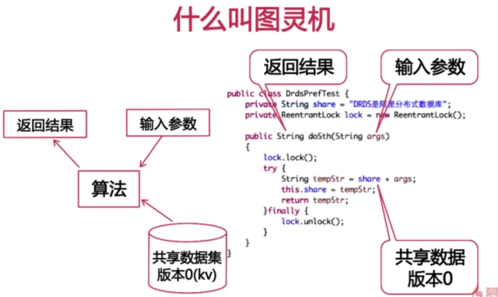
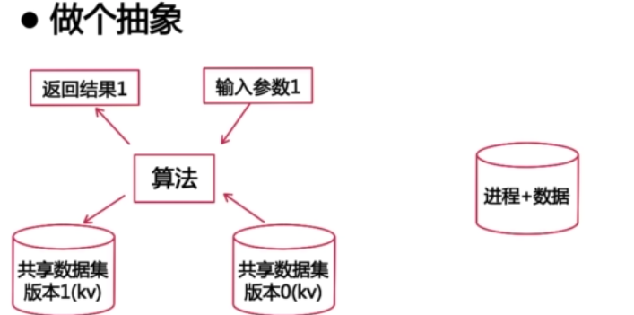

#2 分布式事物

---

###笔记

---

####分布式事物目标

* 像传统单机事物一样的操作方式

####分布式事物的尝试与问题

* 什么是事物
* 网络带来的,网络失去的
* 基于锁的事物实现中遇到的问题
	* 从2PL到2PC
	* 分布式事物异常处理
	* 分布式日志记录
	* 分布式事物延迟变大问题
* 结合`MVCC`的事物实现中遇到的问题 
	* 分布式顺序问题 

#####什么是事物

* 让很多步操作`顺序`发生
* 多进程/线程看上去就像是`一步操作`

**事物的`好处`**

方便我们理解, 同时不会让计算机出现故障(多线程并发如果没加锁引起的问题).

**事物的`代价`**

会有`加锁`和`去锁`的操作.加锁去锁的本质就是并发的同一个数据的更新,变成串行的对同一个数据的更新.

**图灵机**

电脑无论怎么伪装: 我们玩的仍然是个图灵机

图灵机: 有输入参数,经过一个算法,返回一个结果.

**什么是图灵机**

* 输入参数
* 共享数据
	* 共享数据不断变化,我们追加一个版本.
* 返回结果
* 修改共享数据,共享数据从原来的`版本0`变为`版本1`

**做个抽象**

进程操作数据返回结果,这就是一个图灵机事件.

####共享数据

* 共享数据不能同时修改,这样数据会错乱.

####网络带来的和网络失去的

**网络带来的(去中兴化)**

* 理论无限的扩展能力
* 理论无限的数据安全性
* 理论无限的服务可用性

**网络失去的**

* 共享数据困难
* 更多的延迟
* 确定丧失性
* 超时到底是成功还是失败?
* 共享数据会导致系统有瓶颈
* 光速并不是无限的
* 并发编程难度上升

**消息传递**

数据在写入时复制一次.

数据消息传递有延迟.

网络传递数据可能有`丢包`(丧失性).

###整理知识点

---