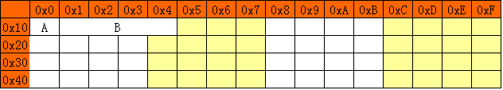
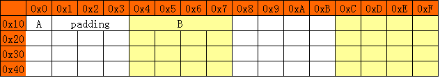

#地址对齐

----

**为什么要地址对齐**

各个硬件平台对存储空间的处理上有很大的不同.一些平台对某些特定的类型的数据只能从某些特定的地址开始存取.其它平台可能没有这些限制,但是最常见是的如果不按照适合其平台的要求对数据存储进行对齐,会在存取效率上带来损失.

比如有些平台每次读都是从偶数地址开始,如果一个 int 型(假设是 32 位)如果存放在偶数地址开始的地方,那么一个时钟周期就可以读出.而如果是存放在一个奇数地址开始的地方,就可能会需要 2 个时钟周期,并对两次读出的结果的高低字节进行拼凑才能得到该 int 型数据.

`示例:`

假设机器字长是32位的,现在有2个变量:

		char A;
		int B;
		
假设这2个变量是从内存地址0开始分配的,如果不考虑对齐,应该是这样存储的(以intel上的little endian为例)
	

因为计算机的字长是4字节的,所以在处理变量A与B时的过程可能大致为:

* 将`0x00`-`0x03`共`32`位读入寄存器,再通过`左移24位再右移24位`运算得到a的值(或与0x000000FF做与运算)

* 将`0x00`-`0x03`这`32`位读入寄存器,通过位运算得到`低24位`的值.再将`0x04`-`0x07`这`32`位读入寄存器,通过位运算得到`高8位`的值;再与最先得到的`24位`做`位运算`,才可得到整个32位的值.

`缺点`:对a的处理是最简处理,可对b的处理,本身是个32位数,处理的时候却得折成2部分,之后再合并,效率上就有些低了.

就需要付出几个字节浪费的代价,`解决方案`:

A的处理过程不变,B却简单得多了:只需将`0x04`-`0x07`这32位读入寄存器就OK了.

**对齐的实现**

编译器会替我们选择适合目标平台的对齐策略.

**对齐算法**

假设结构体定义如下:

		struct A {
			int a;//4字节  
			char b;//1字节 
			short c;//2字节 
		}
		
		4 + 1 + 2 = 7
		
		但是对齐后sizeof(struct A) = 8
		
`调整结构体顺序`:

		struct A {
			char b;//1字节
			int a;//4字节
			short c;//2字节
		}
		
		sizeof(struct A) = 12
		
**基本概念**

`基本数据类型自身的对齐值`: 就是基本数据的长度,如 sizeof(char),sizeof(int),sizeof(short).

`指定的对齐值`: 使用 `#pragma pack(value)` 指令指定的值.

`结构体或者类的自身对齐值`: 其成员中自身对齐值`最大`的那个值.

`数据成员,结构体和类的有效对齐值`: 其自身对齐值和指定对齐值是`较小`的.

有效对齐值`N`是最终用来决定数据存放地址方式的值,有效对齐N,就是表示"`对齐在N上`",也就是说该数据的"存放`起始`地址`%N=0`".而数据结构中的数据变量都是按定义的先后顺序来排放的.`第一个数据变量的起始地址就是数据结构的起始地址`.结构体的成员变量要对齐排放,`结构体本身也要根据自身的有效对齐值圆整`(就是结构体成员变量占用总长度需要是对结构体有效对齐值的整数倍).

`分析`:

		struct B { char b; int a; short c; };
		
		假设B从地址空间0×0000开始排放.
		该例子中没有定义指定对齐值.(测试环境,该值默认为4).
		
		第一个成员变量b的自身对齐值是1,比指定或者默认指定对齐值4小,所以其有效对齐值为1,所以其存放地址0×0000符合0×0000%1=0.
		
		第二个成员变量a,其自身对齐值为4,所以有效对齐值也为4,所以只能存放在起始地址为0×0004到0×0007这四个连续的字节空间中,复合0×0004%4=0,且紧靠第一个变量.
		
		第三个变量c,自身对齐值为2,所以有效对齐值也是2,可以存放在0×0008到0×0009这两个字节空间中,符合0×0008%2=0.所以从0×0000到0×0009存放的都是B内容.
		
		再看数据结构B的自身对齐值为其变量中最大对齐值(这里是b)所以就是4,所以结构体的有效对齐值也是4.
		
		根据结构体圆整的要求,0×0009到0×0000=10字节,(10＋2)％4＝0.所以0x0000A到0x000B也为结构体B所占用.故B从0×0000到0x000B共有12个字节,sizeof(struct B)=12;
		
		
		#pragma pack(2) /*指定按2字节对齐*/ 
		struct C { char b; int a; short c; };
		#pragma pack() /*取消指定对齐，恢复缺省对齐*/
		
		第一个变量b的自身对齐值为1,指定对齐值为2,所以,其有效对齐值为1,假设C从0×0000开始,那么b存放在0×0000,符合0×0000%1=0;
		
		第二个变量,自身对齐值为4,指定对齐值为2,所以有效对齐值为2,所以顺序存放在0×0002、0×0003、0×0004、0×0005四个连续字节中,符合0×0002%2=0
		
		第三个变量c的自身对齐值为2,所以有效对齐值为2,顺序存放在0×0006、0×0007中,符合0×0006%2=0. 所以从0×0000到0×00007共八字节存放的是C的变量.
		
		C的自身对齐值为4,C的有效对齐值为2.
		
		8%2=0,C只占用0×0000到0×0007的八个字节.所以sizeof(struct C)=8.

**共用体内存对齐**

	union data1{
       double  d;//8
       int     i;
       char    c1;
       char    c2[9]; 
	};
	sizeof(uniondata1)的值为16.在编译器默认设置的情况下,该共用体最大基本类型为double,它占8字节,所以此共用体以8来对齐.字符数组c2占9个字节,那么整个共用体应该占9个字节,但按照对齐原则,实际分配给它的内存为16字节
	
	union data1{
       int     i;
       char    c1;
       char    c2[9]; 
	};
	3倍的int,sizeof(union data1) = 12.	
	
	union data1{
       char    c1;
       char    c2[9]; 
	};
	sizeof(union data1) = 9