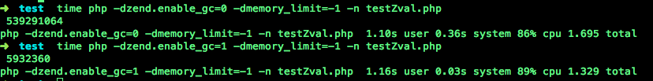

#PHP垃圾回收机制

---

每个php变量存在一个叫"zval"的变量容器中.一个zval变量容器,除了包含变量的类型和值,还包括`两个字节的额外信息`.第一个是`"is_ref"`,是个`bool`值,用来标识这个变量是否`是属于引用集合(reference set)`.通过这个字节,php引擎才能把普通变量和引用变量区分开来,由于php允许用户通过使用&来使用自定义引用,zval变量容器中还有一个内部引用计数机制,来优化内存使用.第二个额外字节是`"refcount"`,用以表示指向这个zval变量容器的`变量(也称符号即symbol)个数`.所有的符号存在一个符号表中,其中每个符号都有作用域(scope),那些主脚本(比如：通过浏览器请求的的脚本)和每个函数或者方法也都有作用域. 

**生成一个新的zval容器**

		<?php
		$a = "new string";
		xdebug_debug_zval('a');
		?>

输出:

		a: (refcount=1, is_ref=0)='new string'
					
新的变量a,是在当前作用域中生成的.并且生成了类型为 string 和值为new string的变量容器.在额外的两个字节信息中,`"is_ref"被默认设置为 FALSE`,因为没有任何自定义的引用生成.`"refcount" 被设定为 1`,因为这里只有一个变量使用这个变量容器. 注意到当"refcount"的值是1时,"is_ref"的值总是FALSE. 

**增加一个zval的引用计数**
		
		<?php
		$a = "new string";
		$b = $a;
		xdebug_debug_zval( 'a' );
		?>

输出:

	    a: (refcount=2, is_ref=0)='new string'
	    
**减少引用计数**
	
列子1:	
		
		<?php
		$a = "new string";
		$c = $b = $a;
		xdebug_debug_zval( 'a' );
		unset( $b, $c );
		xdebug_debug_zval( 'a' );
		?>

输出:

		a: (refcount=3, is_ref=0)='new string'
		a: (refcount=1, is_ref=0)='new string'
		
列子2:
		
		
		<?php
		$a = "new string";
		$c = $b = $a;
		xdebug_debug_zval( 'a' );
		xdebug_debug_zval( 'c' );
		unset( $a, $c );
		xdebug_debug_zval( 'b' );
		?>

输出:
		
		a: (refcount=3, is_ref=0)='new string'
		c: (refcount=3, is_ref=0)='new string'
		b: (refcount=1, is_ref=0)='new string'

如果我们现在执行 unset($a);,包含类型和值的这个变量容器就会从内存中删除.

###复合类型(Compound Types)

---

当考虑像 array和object这样的复合类型时,事情就稍微有点复杂. 与 标量(scalar)类型的值不同,array和 object类型的变量把它们的成员或属性存在自己的符号表中.这意味着下面的例子将生成三个zval变量容器. 

		
		<?php
		$a = array( 'meaning' => 'life', 'number' => 42 );
		xdebug_debug_zval( 'a' );
		?>
输出:

		a: (refcount=1, is_ref=0)=array (
   			'meaning' => (refcount=1, is_ref=0)='life',
   			'number' => (refcount=1, is_ref=0)=42
		)
		

这三个zval变量容器是: a,meaning和 number.

**添加一个已经存在的元素到数组中**

		
		<?php
		$a = array( 'meaning' => 'life', 'number' => 42 );
		$a['life'] = $a['meaning'];
		xdebug_debug_zval( 'a' );
		?>
输出:

		a: (refcount=1, is_ref=0)=array (
   		'meaning' => (refcount=2, is_ref=0)='life',
   		'number' => (refcount=1, is_ref=0)=42,
  		'life' => (refcount=2, is_ref=0)='life'
		)

从以上的xdebug输出信息,我们看到原有的数组元素和新添加的数组元素关联到同一个"refcount"2的zval变量容器. 尽管 Xdebug的输出显示两个值为'life'的 zval 变量容器,`其实是同一个`. 函数xdebug_debug_zval()不显示这个信息,但是你能通过显示内存指针信息来看到.

删除数组中的一个元素,就是类似于从作用域中删除一个变量. 删除后,数组中的这个元素所在的容器的“refcount”值减少,同样,`当“refcount”为0时,这个变量容器就从内存中被删除`,下列说明:

**从数组中删除一个元素**

		<?php
		$a = array( 'meaning' => 'life', 'number' => 42 );
		$a['life'] = $a['meaning'];
		unset( $a['meaning'], $a['number'] );
		xdebug_debug_zval( 'a' );
		?>

输出:

		a: (refcount=1, is_ref=0)=array (
   		'life' => (refcount=1, is_ref=0)='life'
		)

**把数组作为一个元素添加到自己**

		
		<?php
		$a = array( 'one' );
		$a[] =& $a;
		xdebug_debug_zval( 'a' );
		?>

输出:

		a: (refcount=2, is_ref=1)=array (
   			0 => (refcount=1, is_ref=0)='one',
   			1 => (refcount=2, is_ref=1)=...
		)
		

能看到数组变量 (`a`) 同时也是这个数组的第二个元素(`1`) 指向的变量容器中“refcount”为 2.上面的输出结果中的"..."说明发生了递归操作, 显然在这种情况下意味着"..."指向原始数组. 

跟刚刚一样,对一个变量调用unset,将删除这个符号,且它指向的变量容器中的引用次数也减1.所以,如果我们在执行完上面的代码后,对变量$a调用unset, 那么变量 $a 和数组元素 "1" 所指向的变量容器的引用次数减1, 从"2"变成"1". 下例可以说明: 

**Unsetting $a**

		(refcount=1, is_ref=1)=array (
  		 0 => (refcount=1, is_ref=0)='one',
   		 1 => (refcount=1, is_ref=1)=...
		)

*@chloroplast:未能找见实现代码,这里只是模拟结果.*

图示:

		
###清理变量容器的问题(Cleanup Problems)

---

尽管不再有某个作用域中的任何符号指向这个结构(就是变量容器),由于数组元素“1”仍然指向数组本身,所以这个容器不能被清除.因为没有另外的符号指向它,用户没有办法清除这个结构,结果就会导致内存泄漏.庆幸的是,php将在脚本执行结束时清除这个数据结构,但是在php清除之前,将耗费不少内存.

如果你要实现分析算法,或者要做其他像一个子元素指向它的父元素这样的事情,这种情况就会经常发生.当然,同样的情况也会发生在对象上,实际上对象更有可能出现这种情况,因为对象总是隐式的被引用. 

###回收周期(Collecting Cycles)

---

对算法的完全说明有点超出这部分内容的范围,将只介绍其中基础部分.首先,我们先要建立一些基本规则,如果一个引用计数增加,它将继续被使用,当然就不再在垃圾中.如果引用计数减少到零,所在变量容器将被清除(free).就是说,仅仅在引用计数减少到非零值时,才会产生垃圾周期(garbage cycle).其次,在一个垃圾周期中,通过检查引用计数是否减1,并且检查哪些变量容器的引用次数是零,来发现哪部分是垃圾.

To avoid having to call the checking of garbage cycles with every possible decrease of a refcount, the algorithm instead puts all `possible roots` (zvals) in the "`root buffer`" (marking them "`purple`"). It also makes sure that each possible garbage root ends up in the buffer only once. Only when the root buffer is full does the collection mechanism start for all the different zvals inside. See step A in the figure above.

In step B, the algorithm runs a depth-first search on all possible roots to `decrease by one` the refcounts of each zval it finds, making sure not to decrease a refcount on the same zval twice (by marking them as "`grey`"). In step C, the algorithm again runs a depth-first search from each root node, to check the refcount of each zval again. If it finds that the `refcount is zero`, the zval is marked "`white`" (blue in the figure). If it's `larger than zero`, it `reverts the decreasing of the refcount by one` with a depth-first search from that point on, and they are marked "`black`" again. In the last step (D), the algorithm walks over the root buffer removing the zval roots from there, and meanwhile, `checks which zvals have been marked "white" in the previous step. Every zval marked as "white" will be freed`.

*@me:中文翻译不好,引用英文*

算法中都是模拟删除、模拟恢复、真的删除,都使用简单的遍历即可（最典型的深搜遍历）.复杂度为执行模拟操作的节点数正相关,不只是紫色的那些疑似垃圾变量.

当垃圾回收机制打开时,每当根缓存区存满时,就会执行上面描述的循环查找算法.根缓存区有固定的大小,可存10,000个可能根,当然你可以通过修改PHP源码文件Zend/zend_gc.c中的常量`GC_ROOT_BUFFER_MAX_ENTRIES`,然后重新编译PHP,来修改这个10,000值.当垃圾回收机制关闭时,循环查找算法永不执行,然而,可能根将一直存在根缓冲区中,不管在配置中垃圾回收机制是否激活.  

当垃圾回收机制关闭时,如果根缓冲区存满了可能根,更多的可能根显然不会被记录.那些没被记录的可能根,将不会被这个算法来分析处理.如果他们是循环引用周期的一部分,将永不能被清除进而导致内存泄漏. 

即使在垃圾回收机制不可用时,可能根也被记录的原因是,相对于每次找到可能根后检查垃圾回收机制是否打开而言,记录可能根的操作更快.不过垃圾回收和分析机制本身要耗不少时间. 

除了修改配置zend.enable_gc ,也能通过分别调用`gc_enable()` 和 `gc_disable()`函数来打开和关闭垃圾回收机制.调用这些函数,与修改配置项来打开或关闭垃圾回收机制的效果是一样的.即使在可能根缓冲区还没满时,也能强制执行周期回收.你能调用`gc_collect_cycles()`函数达到这个目的.这个函数将返回使用这个算法回收的周期数. 

允许打开和关闭垃圾回收机制并且允许自主的初始化的原因,是由于你的应用程序的某部分可能是高时效性的.在这种情况下,你可能不想使用垃圾回收机制.当然,对你的应用程序的某部分关闭垃圾回收机制,是在冒着可能内存泄漏的风险,因为一些可能根也许存不进有限的根缓冲区.因此,就在你调用gc_disable()函数释放内存之前,先调用gc_collect_cycles()函数可能比较明智.因为这将清除已存放在根缓冲区中的所有可能根,然后在垃圾回收机制被关闭时,可留下空缓冲区以有更多空间存储可能根. 

###内存占用空间的节省

---

在PHP执行中,一旦根缓冲区满了或者调用gc_collect_cycles() 函数时,就会执行垃圾回收.

**内存使用示例**

		
		<?php
		class Foo
		{
    		public $var = '3.1415962654';
		}

		$baseMemory = memory_get_usage();

		for ( $i = 0; $i <= 100000; $i++ )
		{
    		$a = new Foo;
    		$a->self = $a;
    		if ( $i % 500 === 0 )
    		{
       		 echo sprintf( '%8d: ', $i ), memory_get_usage() - $baseMemory, "\n";
   		 	}
		}
	    ?>

在这个很理论性的例子中,我们创建了一个对象,这个对象中的一个属性被设置为指回对象本身.在循环的下一个重复(iteration)中,当脚本中的变量被重新复制时,就会发生典型性的内存泄漏.在这个例子中,两个变量容器是泄漏的(对象容器和属性容器),但是仅仅能找到一个可能根：就是被unset的那个变量.在10,000次重复后(也就产生总共10,000个可能根),当根缓冲区满时,就执行垃圾回收机制,并且释放那些关联的可能根的内存.这从PHP 5.3的锯齿型内存占用图中很容易就能看到.每次执行完10,000次重复后,执行垃圾回收,并释放相关的重复使用的引用变量.在这个例子中由于泄漏的数据结构非常简单,所以垃圾回收机制本身不必做太多工作.从这个图表中,你能看到 PHP 5.3的最大内存占用大概是9 Mb,而PHP 5.2的内存占用一直增加. 

###执行时间增加(Run-Time Slowdowns)

---

**GC性能影响**

		
		<?php
		class Foo
		{
    		public $var = '3.1415962654';
		}

		for ( $i = 0; $i <= 1000000; $i++ )
		{
    		$a = new Foo;
    		$a->self = $a;
		}

		echo memory_get_peak_usage(), "\n";
		?>
		
我们将运行这个脚本两次,一次通过配置zend.enable_gc 打开垃圾回收机制时,另一次是它关闭时. 

执行以上脚本:

		time php -dzend.enable_gc=0 -dmemory_limit=-1 -n example2.php
		# and
		time php -dzend.enable_gc=1 -dmemory_limit=-1 -n example2.php

###PHP内部 GC 统计信息

---

在PHP内部,可以显示更多的关于垃圾回收机制如何运行的信息.但是要显示这些信息,你需要先重新编译PHP使benchmark和data-collecting code可用.你需要在按照你的意愿运行./configure前,把环境变量CFLAGS设置成-DGC_BENCH=1.

**重新编译PHP以启用GC benchmarking**

		export CFLAGS=-DGC_BENCH=1
		./config.nice
		make clean
		make
		
当你用新编译的PHP二进制文件来重新执行上面的例子代码,在PHP执行结束后,你将看到下面的信息： 

**GC 统计数据**

		GC Statistics
		-------------
		Runs:               110
		Collected:          2072204
		Root buffer length: 0
		Root buffer peak:   10000

      		  Possible            Remove from  Marked
       		    Root    Buffered     buffer     grey
      		  --------  --------  -----------  ------
		ZVAL   7175487   1491291    1241690   3611871
		ZOBJ  28506264   1527980     677581   1025731
		
主要的信息统计在第一个块.你能看到垃圾回收机制运行了110次,而且在这110次运行中,总共有超过两百万的内存分配被释放.只要垃圾回收机制运行了至少一次,根缓冲区峰值(Root buffer peak)总是10000. 

###结论

---

通常,PHP中的垃圾回收机制,仅仅在循环回收算法确实运行时会有时间消耗上的增加.但是在平常的(更小的)脚本中应根本就没有性能影响.

然而,在平常脚本中有循环回收机制运行的情况下,内存的节省将允许更多这种脚本同时运行在你的服务器上.因为总共使用的内存没达到上限. 