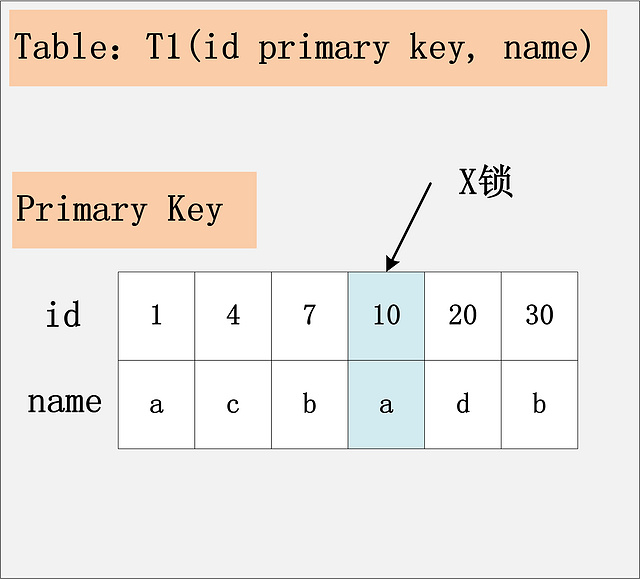
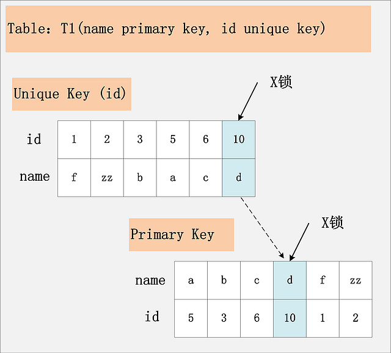
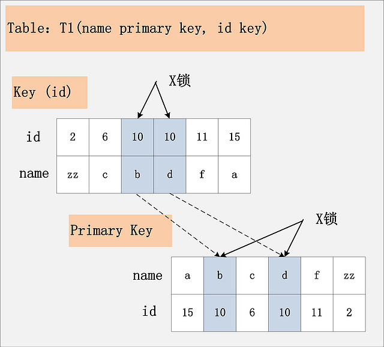
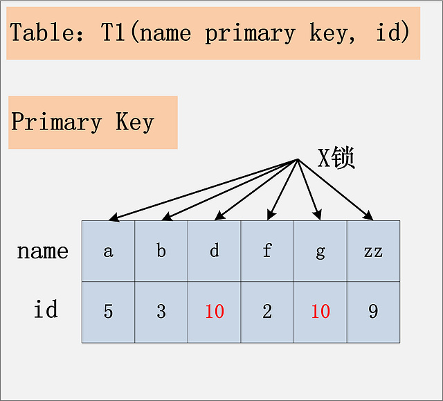
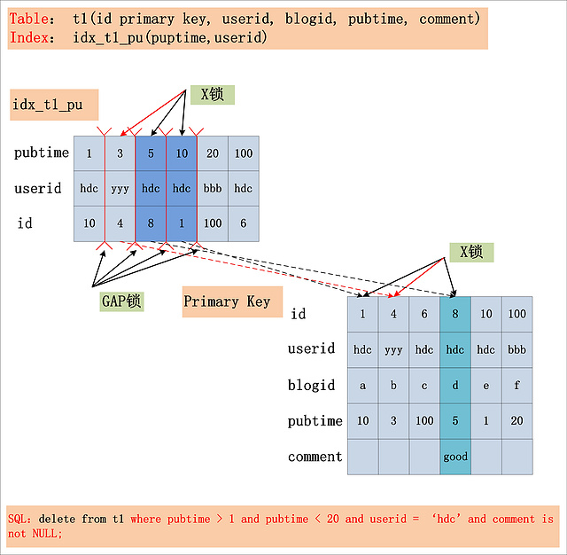

#MySQL加锁处理分析

---

[MySQL加锁处理分析](http://hedengcheng.com/?p=771#_Toc374698307 "MySQL加锁处理分析")

本文是针对`Mysql/InnoDB`.

MVCC并发控制中读操作可以分成两类: 

* 快照读（snapshot read)
* 当前读 (current read)

**快照度**

读取的是记录的可见版本(有可能是历史版本),不用加锁.

**当前读**

当前读,读取的是记录的最新版本,并且,当前读返回的记录,都会加上锁,保证其他事务不会再并发修改这条记录.

特殊的读操作,插入/更新/删除操作,属于当前读,需要加锁:

* select * from table where ? lock in share mode;
* select * from table where ? for update;
* insert into table values (…);
* update table set ? where ?;
* delete from table where ?;

所有以上的语句m都属于当前读,读取记录的最新版本.并且,读取之后,还需要保证其他并发事务不能修改当前记录,对读取记录加锁.其中,除了第一条语句,对读取记录加S锁(共享锁)外,其他的操作,都加的是X锁(排它锁).

###为什么将 插入/更新/删除 操作,都归为当前读

**一个Update操作的具体流程:**

1. 当Update SQL被发给MySQL后,MySQL Server会根据where条件,`读取第一条满足条件的记录`,然后InnoDB引擎会将第一条记录返回,并加锁(current read).
2. 待MySQL Server收到这条加锁的记录之后,会再发起一个Update请求,更新这条记录.
3. 一条记录操作完成,再读取下一条记录,直至没有满足条件的记录为止.
4. 因此,Update操作内部,就`包含了一个当前读`.

Delete操作也一样.

Insert操作`可能会触发Unique Key的冲突检查`,也会进行一个当前读.

**一条一条进行操作**

根据上图的交互,针对一条当前读的SQL语句,`InnoDB与MySQL Server的交互`,是一条一条进行的,因此,加锁也是一条一条进行的.先对一条满足条件的记录加锁,返回给MySQL Server,做一些DML操作;然后在读取下一条加锁,直至读取完.

###2PL:Two-Phase Locking

锁操作分为两个阶段:`加锁阶段`与`解锁阶段`,并且保证加锁阶段与解锁阶段不相交.

2PL就是将加锁/解锁分为两个完全不相交的阶段.加锁阶段:`只加锁`,`不放锁`.解锁阶段:只放锁,不加锁.

###一条简单SQL的加锁实现分析

**select * from t1 where id = 10;**
		
select操作均不加锁,采用的是快照读

**delete from t1 where id = 10;**

缺少哪些条件?

1. id列是不是主键？
2. 当前系统的隔离级别是什么？
3. id列如果不是主键,那么id列上有索引吗？
4. id列上如果有二级索引,那么这个索引是唯一索引吗?
5. 两个SQL的执行计划是什么?
6. 索引扫描?全表扫描?

有下面这些组合:

1. id列是主键,RC隔离级别
3. id列是主键,RR隔离级别
4. id列是二级唯一索引,RC隔离级别
5. id列是二级唯一索引,RR隔离级别
6. id列是二级非唯一索引,RC隔离级别
7. id列是二级非唯一索引,RR隔离级别
8. id列上没有索引,RC隔离级别
9. id列上没有索引,RR隔离级别
10. Serializable隔离级别

**id列是主键,RC隔离级别**

id是主键,Read Committed隔离级别.只需要给主键上,id=10的记录加上x锁即可.

`id是主键时,此SQL只需要在id=10这条记录上加X锁即可`.

**id列是主键,RR隔离级别**

与`id列是主键,RC隔离级别`一致.

**id列是二级唯一索引,RC隔离级别**

id不是主键,而是一个Unique的二级索引键值.

`id是unique索引,而主键是name列`.

加锁的情况由于组合一有所不同.由于id是unique索引,因此delete语句会选择走id列的索引进行where条件的过滤,在找到id=10的记录后,首先会将unique索引上的id=10索引记录加上X锁,同时，会根据读取到的name列,回主键索引(聚簇索引),然后将聚簇索引上的name = ‘d’ 对应的主键索引项加X锁.

为什么聚簇索引上的记录也要加锁?试想一下,如果并发的一个SQL,是通过主键索引来更新:update t1 set id = 100 where name = ‘d';此时,如果delete语句没有将主键索引上的记录加锁,那么并发的update就会感知不到delete语句的存在,违背了同一记录上的更新/删除需要串行执行的约束.

`若id列是unique列,其上有unique索引.那么SQL需要加两个X锁,一个对应于id unique索引上的id = 10的记录,另一把锁对应于聚簇索引上的[name=’d’,id=10]的记录`.

**id列是二级唯一索引,RR隔离级别**

与`id列是二级唯一索引,RC隔离级别`一致.两个X锁,id唯一索引满足条件的记录上一个,对应的聚簇索引上的记录一个.

**id列是二级非唯一索引,RC隔离级别**

id列上的约束又降低了,`id列不再唯一`,只有一个普通的索引.

首先,id列索引上,满足id = 10查询条件的记录,均已加锁.同时,这些记录对应的主键索引上的记录也都加上了锁.与上面列子的区别是,上面列子(唯一索引)多只有一个满足等值查询的记录,而本例(非唯一索引)会`将所有满足查询条件的记录都加锁`.

`若id列上有非唯一索引,那么对应的所有满足SQL查询条件的记录,都会被加锁.同时,这些记录在主键索引上的记录,也会被加锁`.

**id列是二级非唯一索引,RR隔离级别**

RC隔离级别允许幻读,而RR隔离级别,不允许存在幻读.`那么RR隔离级别下,如何防止幻读呢`.

Repeatable Read隔离级别,id上有一个非唯一索引,执行delete from t1 where id = 10;假设选择id列上的索引进行条件过滤,最后的加锁行为:

与`id列是二级非唯一索引,RC隔离级别`区别是多了一个GAP锁,而且GAP锁看起来也不是加在记录上的,倒像是加载两条记录之间的位置.

其实这个多出来的GAP锁,就是RR隔离级别,相对于RC隔离级别,不会出现幻读的关键.确实,GAP锁锁住的位置,也不是记录本身,而是两条记录之间的GAP.

所谓`幻读`,就是同一个事务,连续做两次当前读(例如：select * from t1 where id = 10 for update;),那么这两次当前读返回的是完全相同的记录(记录数量一致，记录本身也一致),第二次的当前读,不会比第一次返回更多的记录(幻象).

如何保证两次当前读返回一致的记录,那就需要在第一次当前读与第二次当前读之间,其他的事务不会插入新的满足条件的记录并提交.为了实现这个功能,GAP锁应运而生.

如图所示,有哪些位置可以插入新的满足条件的项(id = 10),考虑到B+树索引的有序性,满足条件的项一定是连续存放的.

1. 记录[6,c]之前,不会插入id=10的记录
2. [6,c]与[10,b]间可以插入[10, aa]
3. [10,b]与[10,d]间,可以插入新的[10,bb],[10,c]等
4. [10,d]与[11,f]间可以插入满足条件的[10,e],[10,z]等
5. 而[11,f]之后也不会插入满足条件的记录

因此,为了保证[6,c]与[10,b]间,[10,b]与[10,d]间,[10,d]与[11,f]不会插入新的满足条件的记录,MySQL选择了用GAP锁,将这三个GAP给锁起来.

Insert操作,如insert [10,aa],首先会定位到[6,c]与[10,b]间,然后在插入前,会检查这个GAP是否已经被锁上,如果被锁上,则Insert不能插入记录.因此,通过第一遍的当前读,不仅将满足条件的记录锁上(X锁),与`id列是二级非唯一索引,RC隔离级别`类似.同时还是增加3把GAP锁,将可能插入满足条件记录的3个GAP给锁上.保证后续的Insert不能插入新的id=10的记录,也就杜绝了同一事务的第二次当前读,出现幻象的情况.

`GAP锁的目的,是为了防止同一事务的两次当前读,出现幻读的情况`.

`id列是主键,RR隔离级别`和`id列是二级唯一索引,RR隔离级别`为什么不用`GAP锁`?
id是主键和id是unique键,都能够保证唯一性.一个等值查询,最多只能返回一条记录,而且新的相同取值的记录,一定不会在新插入进来,因此也就避免了GAP锁的使用.

`Repeatable Read隔离级别下,id列上有一个非唯一索引,对应SQL：delete from t1 where id = 10;首先,通过id索引定位到第一条满足查询条件的记录,加记录上的X锁,加GAP上的GAP锁,然后加主键聚簇索引上的记录X锁,然后返回;然后读取下一条,重复进行.直至进行到第一条不满足条件的记录[11,f],此时,不需要加记录X锁,但是仍旧需要加GAP锁,最后返回结束`.

**id列上没有索引,RC隔离级别**

id列上没有索引,where id = 10;这个过滤条件,没法通过索引进行过滤,那么只能走全表扫描做过滤.

由于id列上没有索引，因此只能走聚簇索引，进行全部扫描。从图中可以看到，满足删除条件的记录有两条,但是,聚簇索引上所有的记录,都被加上了X锁.无论记录是否满足条件,全部被加上X锁.既不是加表锁,也不是在满足条件的记录上加行锁.

`为什么不是只在满足条件的记录上加锁呢`:

这是由于MySQL的实现决定的.如果一个条件无法通过索引快速过滤,那么存储引擎层面就会将所有记录加锁后返回,然后由MySQL Server层进行过滤.因此也就把所有的记录,都锁上了.

`若id列上没有索引,SQL会走聚簇索引的全扫描进行过滤,由于过滤是由MySQL Server层面进行的.因此每条记录,无论是否满足条件,都会被加上X锁.但是,为了效率考量,MySQL做了优化,对于不满足条件的记录,会在判断后放锁,最终持有的,是满足条件的记录上的锁,但是不满足条件的记录上的加锁/放锁动作不会省略.同时,优化也违背了2PL的约束`.

**id列上没有索引,RR隔离级别**

首先,聚簇索引上的所有记录,都被加上了X锁.其次,聚簇索引每条记录间的间隙(GAP),也同时被加上了GAP锁.这个示例表,只有6条记录,一共需要6个记录锁,7个GAP锁.

在这种情况下,这个表上,除了不加锁的快照度,其他任何加锁的并发SQL,均不能执行.不能更新,不能删除,不能插入,全表被锁死.

`在Repeatable Read隔离级别下,如果进行全表扫描的当前读,那么会锁上表中的所有记录，同时会锁上聚簇索引内的所有GAP,杜绝所有的并发,更新/删除/插入操作.当然,也可以通过触发semi-consistent read,来缓解加锁开销与并发影响，但是semi-consistent read本身也会带来其他问题,不建议使用.

**Serializable**

delete from t1 where id = 10; 来说,Serializable隔离级别与Repeatable Read隔离级别完全一致.

Serializable隔离级别,影响的是SQL1:select * from t1 where id = 10; 这条SQL，在RC，RR隔离级别下,都是快照读,不加锁.但是在Serializable隔离级别,SQL1会加读锁,也就是说快照读不复存在,MVCC并发控制降级为Lock-Based CC.

`Serializable隔离级别,读不加锁就不再成立,所有的读操作,都是当前读`.

###一条复杂的SQL分析锁

**假设条件**

* 假定在Repeatable Read隔离级别下
* 假设SQL走的是idx_t1_pu索引

**Index key**

pubtime > 1 and puptime < 20。此条件,用于确定SQL在idx_t1_pu索引上的查询范围.

**Index Filter**

userid = ‘hdc’.此条件,可以在idx_t1_pu索引上进行过滤,但不属于Index Key.

**Table Filter**

comment is not NULL.此条件,在idx_t1_pu索引上`无法过滤`,只能`在聚簇索引上过滤`.

**加锁情况**

在分析出SQL where条件的构成之后,再来看看这条SQL的加锁情况(RR隔离级别),如下图所示:

* 在Repeatable Read隔离级别下,由Index Key所确定的范围,被加上了GAP锁
* Index Filter锁给定的条件(userid = ‘hdc’)何时过滤,视MySQL的版本而定,在MySQL 5.6版本之前,不支持Index Condition Pushdown(ICP),因此Index Filter在MySQL Server层过滤,在5.6后支持了Index Condition Pushdown,则在index上过滤.若不支持ICP,不满足Index Filter的记录,也需要加上记录X锁,若支持ICP,则不满足Index Filter的记录,无需加记录X锁(图中,`用红色箭头标出的X锁,是否要加,视是否支持ICP而定`)；
* 而Table Filter对应的过滤条件,则`在聚簇索引中读取后`,`在MySQL Server层面过滤`,因此聚簇索引上也需要X锁.
* 最后,选取出了一条满足条件的记录[8,hdc,d,5,good],但是`加锁的数量`,`要远远大于满足条件的记录数量`.

**结论**

在Repeatable Read隔离级别下,针对一个复杂的SQL,首先:

1. 需要提取其where条件.Index Key确定的范围,需要加上GAP锁;
2. Index Filter过滤条件,视MySQL版本是否支持ICP,若支持ICP,则不满足Index Filter的记录,不加X锁,否则需要X锁;
3. Table Filter过滤条件,无论是否满足,都需要加X锁.

