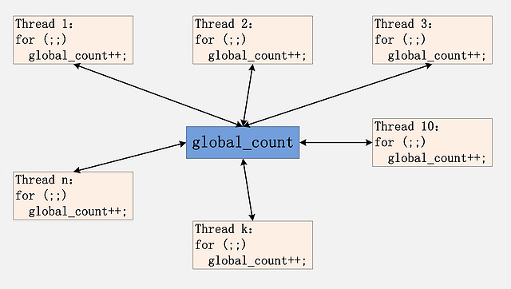
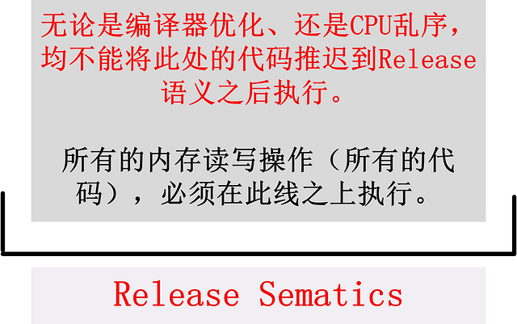

#锁的意义

---

[锁的意义](http://hedengcheng.com/?p=803 "锁的意义")

多线程程序,如果涉及到`对共享资源的并发读写`,就会产生`资源争用(Data Race)`.解决资源争用,最直接的想法就是引入锁,对并发读写的数据进行保护.(在高级是无锁编程,Lock Free Programming).

###一个测试用例

并发程序处理中,面临的一个最简单,也是最常见的共享资源的争用,就是针对一个全局变量进行并发的更新和读取.这个全局变量,可以是一个全局计数器,统计某个事件在多线程中发生的次数;或者是一个全局递增序列,每个线程需要获取属于其的唯一标识.诸如此类,多个线程,针对一个全局变量的并发读写,是十分常见的.如下图所示:

此用例中,N个线程,并发更新一个全局变量.让我们先来看一个简单的测试,全局变量global_count没有任何保护,此时会发生什么?

**测试场景**

500个线程,每个线程做10000次global_count++操作,主线程首先将global_count初始化为0,然后等待这500线程运行结束.待500个线程运行结束之后,由于每个线程都做了10000次global_count++,那么可以确定,最后的global_count取值应该是5000000.

主线程等待所有500个线程结束之后,进行判断,若global_count不等于5000000,则打印出当前global_count的取值.运行结果如下:

通过上图,可以发现,global_count并不是每次都等于5000000,很大的几率,global_count要小于5000000.多线程对一个全局变量进行++操作,并不能保证最终得到的结果的正确性.究其内部原因,是因为++操作并不是一个原子操作(Atomic Operation),而是对应至少3条汇编语句,考虑如下两个线程的 ++ 操作并发:

线程1,2,分别读取了global_count的当前值,分别加1后写出.线程2的写覆盖了线程1的写,最后导致两次 ++ 操作,实际上却对global_count只加了1次.

将global_count的++操作,通过**Spinlock**保护起来.一个全局的Spinlock,500个线程,在++操作前,需要获取Spinlock,然后进行global_count的++操作,完成后释放Spinlock.对应的每个线程代码修改如下:

主线程,仍旧是同样的逻辑,等待所有的500个线程执行结束之后,判断global_count取值是否等于5000000,如果不相等,则打印出来.此时,同样执行此测试程序,没有任何一条数据打印出来,每一个循环,都满足global_count等于5000000.通过引入了Spinlock,完美了解决上面的问题.

###索的意义

**Spinlock的功能**

Spinlock是一把`互斥锁`,同一时间,只能有一个线程持有Spinlock锁,而所有其他的线程，处于等待Spinlock锁.当持有Spinlock的线程放锁之后,所有等待获取Spinlock的线程一起争抢,一个Lucky的线程,抢到这把锁,大部分Unlucky的线程,只能继续等待下一次抢锁的机会.

在spinlock锁保护下的代码片段,同一时间只能有一个线程(获得Spinlock的线程)能够执行,而其他的线程,在获取spinlock之前,不可进入spinlock锁保护下的代码片段进行执行.
前面的测试用例,由于spinlock保护了global_count++的代码,因此global_count++操作,同时只能有一个线程执行,不可能出现前面提到的两线程并发修改global_count变量出现的问题.

###内存模型

内存模型规定了一种内存操作可见的顺序.为了提高程序运行的效率,编译器可能会对你写的程序进行重写,执行顺序调整等等,同样,CPU也会对其执行的汇编执行进行顺序的调整,这就是所谓的`乱序执行`.

`编译乱序与指令执行乱序,关系到锁之所以能够称之为锁,能够用来保护共享资源的关键`.

**为什么乱序没有引发问题**

在存在编译乱序与指令执行乱序的情况下,怎么保证锁所保护的代码片段,不会被提前到加锁之前,或者是放锁之后执行?如果编译器将锁保护下的代码,通过编译优化,放到了加锁之前运行?又如果CPU在执行指令时,将锁保护下的汇编代码,延迟到了放锁之后执行?

如果编译器做了它不该做的优化,或者CPU做了其不该做的乱序,那么spinlock保护下的代码片段,同一时刻,一定只有一个线程能够执行的假设被打破了.此时,虽然spinlock仍旧只能有一个线程持有,但是spinlock保护下的代码,被提到了spinlock保护之外执行,spinlock哪怕功能再强大,也不能保护锁之外的代码,提取到spinlock锁之外的代码,能够并发执行.

**Lock Acquire(加锁)和Unlock Release(解锁)**

`加`(Acquire)锁,`解`(Release)锁.

但是,spinlock保护下的global_count++操作,在多线程下能够正确执行.锁的意义:`Lock Acquire`和`Unlock Release`.

`Acquire semantics` is a property which can only apply to operations which read from shared memory, whether they are read-modify-write operations or plain loads. The operation is then considered a read-acquire. Acquire semantics prevent memory reordering of the read-acquire with any read or write operation which follows it in program order. 

Acquire语义是一个作用于内存读操作上的特性,此内存读操作即被视为read-acquire.`Acquire语义禁止read-acquire之后所有的内存读写操作,被提前到read-acquire操作之前进行`.

`Release semantics` is a property which can only apply to operations which write to shared memory, whether they are read-modify-write operations or plain stores. The operation is then considered a write-release. Release semantics prevent memory reordering of the write-release with any read or write operation which precedes it in program order.

Release语义作用于内存写操作之上的特性,此内存写操作即被视为write-release.Release语义禁止write-release之前所有的内存读写操作,被推迟到write-release操作之后进行.

* `Acquire语义`限制了编译器优化、CPU乱序,`不能将含有Acquire语义的操作之后的代码,提到含有Acquire语义的操作代码之前执行`.(注意是**获取锁之后的操作不能放到之前操作**)

* `Release语义`限制了编译器优化、CPU乱序,`不能将含有Release语义的操作之前的代码,推迟到含有Release语义的操作代码之后执行`.(注意是**释放锁之前的操作不能放到之后操作**)

**结论**

加锁操作自带Acquire语义,解锁操作自带Release语义.将加锁、解锁的两个语义结合起来，就构成了以下的完整的锁的含义图:

只有带有了`Acquire`和`Release`语义,才算是一个真正完整可用的锁——Acquire与Release语义间,构成了一个`临界区`.

一般我们使用的锁,加锁操作都自带了`acquire`语义,`解锁`操作都自带了`release`语义.