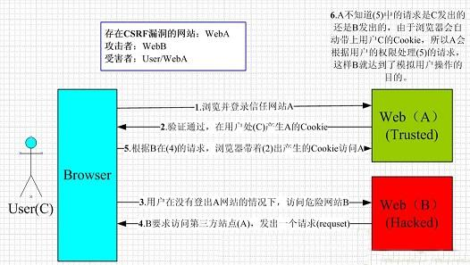

# 第十一章 程序安全性

### 程序的漏洞与攻击方法

#### 4种软件漏洞

* `DoS` 攻击
* 信息泄露
* 权限夺取
* 权限升格

**`DoS`**

`DoS (Denial of Service)`也称拒绝服务攻击.

#### 多样化的攻击手段

* 缓冲区溢出
* 整数溢出
* 跨站点脚本攻击 (XSS)
* SQL 注入
* 跨站点伪造请求 (CSRF)

#### 缓冲区溢出

向固定长的缓冲区(buffer:为保存数据而确保的内存区域)输入了比假定的长度要长很多的数据,使程序异常终止.或者是更改堆栈的跳转地址,劫持程序.

C语言中, 局部变量是放在系统堆栈上的,往系统堆栈上以某种特定规格写入,就有可能更改函数的返回地址.

#### 整数溢出

		void * malloc_elements(size_t esize, size_t n)
		{
			return malloc(esize *n);
		}
		
C等很多的语言,整数只能表示一定范围内的数.超过此范围,就会发生溢出,也不发警告就将数值舍入.

`n`虽然在`size_t`的范围之内,但当`esize * n`超越了`size_t`的范围时,就会发生问题.

		esize = 30
		n = 134500000
		esize * n = 4304000000 (本来的值)
		
		C 语言的计算结果就成为
		esize * n = 9032704 (32 位舍入)
		
		需要分配前添加检查
		siez_t len = esize * n;
		if (n != 0 && esize != len / n) {
			return NULL;
		}
		
高级语言(`Ruby`),生疏溢出发生以后,自动切换到多倍长整数.

#### SQL 注入

在`INERT`时,如果不做输入检查.假设名字填写为

		Robert'); DROP TABLE Students;--
		
		会导致 SQL 语句变为
		
		INSERT INTO Sudents ('姓', '名')
		VALUES ('Smith', 'Robert'); DROP TABLE Students;--')
		
`INSERT`语句执行完以后,分号之后接着又执行了`DROP TABLE`的语句.

#### Shell 注入

		System("ls #{input}")
		
上面的程序,调用 shell的时候,如果输入 `input` 的值是

		data; rm -rf /
		
如果不进行检查就不能传递给`system`等危险函数.

#### 跨站点脚本攻击

#### 跨站点伪造请求

CSRF 的原理:

构成 Web 应用程序的每一页由两部分构成:

1. 一个来自网络浏览器的 HTTP 请求
2. 一个是 HTTP 服务器的响应

本来, HTTP 里不含状态, 为了识别网上程序一连串的交互(会话),使用了 cookie 或者请求中的会话 ID.

**我个人理解**

在请求中添加`token`验证,每次请求都需要验证.

### 用异常进行错误处理