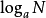

# 对数

## 概念

对数是对求幂的逆运算.

如果`a`的`x`次方等于`N(a>0, 且a不等于1)`,那么数`x`叫做**以`a`为底`N`的对数(logarithm)**, 记作`x=logaN`. 其中, `a`叫做对数的**底数**，`N`叫做**真数**.

以`a`为底`N`的对数记作.

把以`10`为底的常用对数记作**lgN**

以无理数`e`为底的**自然对数**分别记作**lnN**
