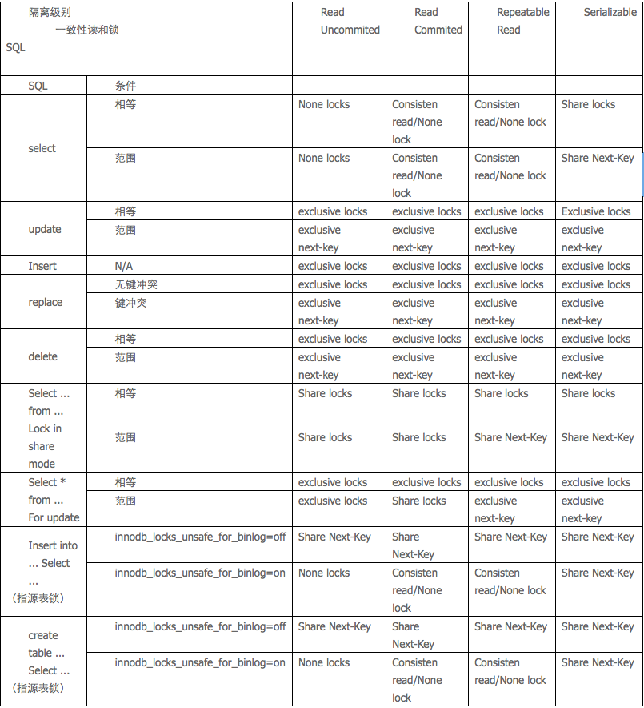

#锁问题

----

##MySQL锁概述

---

`MyISAM`存储引擎采用的是`表级锁`(table-level locking).

`MEMORY`存储引擎采用的是`表级锁`(table-level locking).

`BDB`存储引擎采用的是页面锁(page-level locking),但也支持表级锁.

`InnoDB`存储引擎既支持`行级锁`(row-level locking),也支持表级锁,但默认情况下是采用行级锁.

**表级锁**

开销小,加锁快;不会出现死锁;锁定粒度大,发生锁冲突的概率最高,并发度最低.

**行级锁**

开销小,加锁快;不会出现死锁;锁定粒度大,发生锁冲突的概率最高,并发度最低.

**页面锁**

开销和加锁时间界于表锁和行锁之间;会出现死锁;锁定粒度界于表锁和行锁之间,并发度一般.

##MyISAM表锁

---

MyISAM存储引擎只支持表锁.

###查询表级锁争用情况

通过检查`table_locks_waited`和`table_locks_immediate`状态变量来分析系统上的表锁定争夺.

		mysql> show status like 'table%';
		+-----------------------+-------+
		| Variable_name         | Value |
		+-----------------------+-------+
		| Table_locks_immediate | 2979  |
		| Table_locks_waited    | 0     |
		+-----------------------+-------+
		2 rows in set (0.00 sec))

如果`Table_locks_waited`的值比较高,则说明存在着较严重的表级锁争用情况.

###MySQL表级锁的锁模式

MySQL的表级锁有两种模式:表共享读锁(Table Read Lock)和表独占写锁(Table Write Lock).兼容性如下:

* 对MyISAM表的读操作,不会阻塞其他用户对同一表的读请求,但会阻塞对同一表的写请求;
* 对MyISAM表的写操作,则会阻塞其他用户对同一表的读和写操作;

MyISAM表的读操作与写操作之间,以及写操作之间是`串行`的.

**MyISAM存储引擎的写阻塞例子**

当一个线程获得对一个表的写锁后,只有持有锁的线程可以对表进行更新操作.其他线程的读、写操作都会等待,直到锁被释放为止.

第一步:

* session1:
		
		获得表film_text的WRITE锁定

		mysql> lock table film_text write;

		Query OK, 0 rows affected (0.00 sec)

第二步:

* session1:
	
	`当前session对锁定表的查询、更新、插入操作都可以执行`
			
		mysql> select film_id,title from film_text where film_id = 1001;
		+---------+-------------+
		| film_id | title       |
		+---------+-------------+
		| 1001    | Update Test |
		+---------+-------------+
		1 row in set (0.00 sec)
		
		mysql> insert into film_text (film_id,title) values(1003,'Test');
		Query OK, 1 row affected (0.00 sec)

		mysql> update film_text set title = 'Test' where film_id = 1001;
		Query OK, 1 row affected (0.00 sec)

		Rows matched: 1  Changed: 1  Warnings: 0
		
* session2:
	
	`其他session对锁定表的查询被阻塞，需要等待锁被释放`
	
		mysql> select film_id,title from film_text where film_id = 1001;

		等待

第三步:

* session1:
	
	`释放锁`
		
		mysql> unlock tables;
		Query OK, 0 rows affected (0.00 sec)

* session2:

		等待
		
第四步:

* session2 :

	`获得锁,查询返回`
	
		mysql> select film_id,title from film_text where film_id = 1001;
		+---------+-------+
		| film_id | title |
		+---------+-------+
		| 1001    | Test  |
		+---------+-------+
		1 row in set (57.59 sec)

###如何加表锁

* MyISAM在执行查询语句(SELECT)前,会`自动`给涉及的所有表`加读锁`.
* 在执行更新操作(UPDATE、DELETE、INSERT等)前,会自动给涉及的表加写锁.

不需要用户干预.`一般不需要直接用LOCK TABLE命令给MyISAM表显式加锁`.

**显示加锁模拟事务操作**

给MyISAM表显示加锁,一般是为了在一定程度模拟事务操作,实现对某一时间点多个表的一致性读取.

比如:

有一个订单表orders,其中记录有各订单的总金额total,同时还有一个订单明细表order_detail,其中记录有各订单每一产品的金额小计subtotal,假设我们需要检查这两个表的金额合计是否相符,可能就需要执行如下两条SQL:

		Select sum(total) from orders;
		Select sum(subtotal) from order_detail;
		
`如果不先给两个表加锁`,就可能产生错误的结果,`因为第一条语句执行过程中,order_detail表可能已经发生了改变`.正确方法如下:

		Lock tables orders read local, order_detail read local;
		Select sum(total) from orders;
		Select sum(subtotal) from order_detail;
		Unlock tables;
		
* LOCK TABLES时加了"local"选项,作用就是在满足MyISAM表并发插入条件的情况下,允许其他用户在表尾并发插入记录.
* 在用LOCK TABLES给表显式加表锁时,`必须同时取得所有涉及到表的锁`,并且MySQL不支持锁升级.

**MyISAM表不会出现死锁(Deadlock Free)的原因**

在执行LOCK TABLES后,只能访问显式加锁的这些表,不能访问未加锁的表;同时,如果加的是读锁,那么只能执行查询操作,而不能执行更新操作.其实,在自动加锁的情况下也基本如此,MyISAM总是一次获得SQL语句所需要的全部锁.

**MyISAM存储引擎的读阻塞写例子**

第一步:

* session1:

	`获得表film_text的READ锁定`
	
		mysql> lock table film_text read;

		Query OK, 0 rows affected (0.00 sec)
第二步:

* session1:

	`当前session可以查询该表记录`
		
		mysql> select film_id,title from film_text where film_id = 1001;

		+---------+------------------+
		| film_id | title            |
		+---------+------------------+
		| 1001    | ACADEMY DINOSAUR |
		+---------+------------------+
		1 row in set (0.00 sec)

* session2:

	`其他session也可以查询该表的记录`
	
		mysql> select film_id,title from film_text where film_id = 1001;

		+---------+------------------+
		| film_id | title            |
		+---------+------------------+
		| 1001    | ACADEMY DINOSAUR |
		+---------+------------------+
		1 row in set (0.00 sec)

第三步:

* session1:

	`当前session不能查询没有锁定的表`
	
		mysql> select film_id,title from film where film_id = 1001;

		ERROR 1100 (HY000): Table 'film' was not locked with LOCK TABLES
		
* session2:

	`其他session可以查询或者更新未锁定的表`
	
		mysql> select film_id,title from film where film_id = 1001;

		+---------+---------------+
		| film_id | title         |
		+---------+---------------+
		| 1001    | update record |
		+---------+---------------+
		1 row in set (0.00 sec)

		mysql> update film set title = 'Test' where film_id = 1001;
		Query OK, 1 row affected (0.04 sec)
		Rows matched: 1  Changed: 1  Warnings: 0
		
第四步:

* session1:

	`当前session中插入或者更新锁定的表都会提示错误`
	
		mysql> insert into film_text (film_id,title) values(1002,'Test');

		ERROR 1099 (HY000): Table 'film_text' was locked with a READ lock and can't be updated

		mysql> update film_text set title = 'Test' where film_id = 1001;

		ERROR 1099 (HY000): Table 'film_text' was locked with a READ lock and can't be updated

* session2:

	`其他session更新锁定表会等待获得锁`
	
		mysql> update film_text set title = 'Test' where film_id = 1001;
		等待

第四步:

* session1:

	`释放锁`
		
		mysql> unlock tables;
		Query OK, 0 rows affected (0.00 sec)
		
* session2:

		等待

第五步:

* session2:
	
	`获得锁,更新操作完成`
		
		mysql> update film_text set title = 'Test' where film_id = 1001;

		Query OK, 1 row affected (1 min 0.71 sec)
		Rows matched: 1  Changed: 1  Warnings: 0
		
**别名锁定**

当使用LOCK TABLES时,不仅需要一次锁定用到的所有表,而且,同一个表在SQL语句中出现多少次,就要通过与SQL语句中相同的别名锁定多少次,否则也会出错.

1. 对actor表获得读锁
	
		mysql> lock table actor read;
		Query OK, 0 rows affected (0.00 sec)

2. 但是通过`别名`访问会提示错误

		mysql> select a.first_name,a.last_name,b.first_name,b.last_name 
		from actor a,actor b where a.first_name = b.first_name and 
		a.first_name = 'Lisa' and a.last_name = 'Tom' and a.last_name <> b.last_name;
		ERROR 1100 (HY000): Table 'a' was not locked with LOCK TABLES

3. 需要对`别名分别锁定`

		mysql> lock table actor as a read,actor as b read;
		Query OK, 0 rows affected (0.00 sec)
		
4. 按照别名的查询可以正确执行

		mysql> select a.first_name,a.last_name,b.first_name,
		b.last_name 
		from actor a,actor b 
		where a.first_name = b.first_name and a.first_name = 'Lisa' and a.last_name = 'Tom' and a.last_name <> b.last_name;

		+------------+-----------+------------+-----------+
		| first_name | last_name | first_name | last_name |
		+------------+-----------+------------+-----------+
		| Lisa       | Tom       | LISA       | MONROE    |
		+------------+-----------+------------+-----------+
		1 row in set (0.00 sec)
	

###并发插入

MyISAM存储引擎有一个系统变量`concurrent_insert`,专门用以控制其并发插入的行为,其值分别可以为0、1或2.

* 当concurrent_insert设置为`0`时,不允许并发插入.
* 当concurrent_insert设置为`1`时,如果MyISAM表中没有空洞(即表的中间没有被删除的行),MyISAM`允许在一个进程读表的同时,另一个进程从表尾插入记录`.`这也是MySQL的默认设置`.(注意是`读表`时)
* 当concurrent_insert设置为`2`时,无论MyISAM表中有没有空洞,都允许在表尾并发插入记录.

**MyISAM存储引擎的读写(INSERT)并发例子**

第一步:

* session1:

	`获得表film_text的READ LOCAL锁定`
	
		mysql> lock table film_text read local;
		Query OK, 0 rows affected (0.00 sec)

第二步:

* session1:

	`当前session不能对锁定表进行更新或者插入操作`
	
		mysql> insert into film_text (film_id,title) values(1002,'Test');

		ERROR 1099 (HY000): Table 'film_text' was locked with a READ lock and can't be updated

		mysql> update film_text set title = 'Test' where film_id = 1001;

		ERROR 1099 (HY000): Table 'film_text' was locked with a READ lock and can't be updated
		
* session2:

	`其他session可以进行插入操作,但是更新会等待`

		mysql> insert into film_text (film_id,title) values(1002,'Test');
		Query OK, 1 row affected (0.00 sec)
		
		mysql> update film_text set title = 'Update Test' where film_id = 1001;
		等待
		
第三步:

* session1:

	`当前session不能访问其他session插入的记录`
	
		mysql> select film_id,title from film_text where film_id = 1002;
		Empty set (0.00 sec)
		
第四步:

* session1:

	`释放锁`
	
		mysql> unlock tables;
		Query OK, 0 rows affected (0.00 sec)
		
* session2:

		等待
		
第五步:

* session1:

	`当前session解锁后可以获得其他session插入的记录`
		
		mysql> select film_id,title from film_text where film_id = 1002;

		+---------+-------+
		| film_id | title |
		+---------+-------+
		| 1002    | Test  |
		+---------+-------+
		1 row in set (0.00 sec)
		

* session2:

	`获得锁,更新操作完成`
	
		mysql> update film_text set title = 'Update Test' where film_id = 1001;

		Query OK, 1 row affected (1 min 17.75 sec)

		Rows matched: 1  Changed: 1  Warnings: 0
		
###MyISAM的锁调度

MyISAM存储引擎的读锁和写锁是互斥的,读写操作是串行的.

**读写锁调度**

`写进程先获得锁`.`即使读请求先到锁等待队列`,写请求后到,`写锁也会插到读锁请求之前`!

因为MySQL认为`写请求一般比读请求要重要`.

**MyISAM不适合有大量更新操作和查询操作**

大量的更新操作会造成查询操作很难获得读锁,从而可能永远`阻塞`.

**调节MyISAM调度**

* 通过指定启动参数`low-priority-updates`,使MyISAM引擎默认给予读请求以优先的权利.

* 通过执行命令SET `LOW_PRIORITY_UPDATES=1`m使该连接发出的更新请求优先级降低.

* 通过指定INSERT、UPDATE、DELETE语句的`LOW_PRIORITY`属性,降低该语句的优先级.

* 系统参数`max_write_lock_count`,当一个表的读锁达到这个值后,MySQL就暂时将写请求的优先级降低,给读进程一定获得锁的机会.

**不要总想用一条SELECT语句来解决问题**

一些需要长时间运行的查询操作,也会使写进程"饿死"(读写操作是串行的).

尽量避免出现长时间运行的查询操作,看似巧妙的`一条SQL语句`,往往比较复杂,执行时间较长.

通过使用中间表等措施对SQL语句做一定的"分解",使每一步查询都能在较短时间完成,从而减少锁冲突.

##InnoDB锁问题

---

###事务

事务是由一组SQL语句组成的逻辑处理单元.

####ACID

事务具有ACID属性,

**原子性(Atomicity)**

事务是一个原子操作单元,其对数据的修改,要么`全都执行`,要么`全都不执行`,不可能停滞在中间某个环节.

事务在执行过程中发生错误,会被回滚(Rollback)到事务开始前的状态,就像这个事务从来没有执行过一样.

**一致性(Consistent)**

在事务开始和完成时,数据都必须保持一致状态,`数据库的完整性约束没有被破坏`.

`数据库事务不能破坏关系数据的完整性以及业务逻辑上的一致性`.

比如表与表之间存在外键约束关系,那么你对数据库进行的修改操作就必需要满足约束条件,即如果你修改了一张表中的数据,那你还需要修改与之存在外键约束关系的其他表中对应的数据,以达到一致性.

**隔离性(Isolation)**

多个事务并发访问时,事务之间是隔离的,一个事务不应该影响其它事务运行效果.

在并发环境中,当不同的事务同时操纵相同的数据时,每个事务都有`各自的完整数据空间`.由并发事务所做的修改必须与任何其他并发事务所做的修改隔离.事务查看数据更新时,数据所处的状态`要么是另一事务修改它之前的状态`,`要么是另一事务修改它之后的状态`,`事务不会查看到中间状态的数据`.

**持久性(Durable)**

在事务完成以后,该事务所对数据库所作的更改便持久的保存在数据库之中,并不会被回滚.

对于数据的修改是永久性的,即使出现系统故障也能够保持.

####实现ACID

**Write Ahead logging (预写日志系统)**

WAL日志是数据库中一种高效的日志算法.实现的是redo日志模式.

对数据文件的修改(它们是表和索引的载体)必须是只能发生在这些修改已经记录了日志之后 -- 也就是说,在日志记录冲刷到永久存储器之后.

修改数据库时,不直接修改数据库内容,而是将修改完的数据写入日志中,并同步到磁盘上,这样对其他读进程就没有影响.如果数据库崩溃,重启扫描日志文件,然后更新到数据库中.

		我们就不需要在每次事务提交的时候都把数据页冲刷到磁盘,因为我们知道在出现崩溃的情况下,我们可以用日志来恢复数据库:任何尚未附加到数据页的记录都将先从日志记录中重做(这叫向前滚动恢复,也叫做REDO)然后那些未提交的事务做的修改将被从数据页中删除(这叫向后滚动恢复 - UNDO).

**Shadow Paging**

当一个事务需要修改逻辑页时,系统将分配一个新的空闲页作为该逻辑页的影子页,将修改后的数据保存在影子页中,并在影子页的带外区(spare area)中保存`逻辑页号`,`事务的ID`、`事务的提交标识等信息`.

提交事务或中止事务时,通过影子页的带外区中事务提交标识,就可以跟踪事务的状态.在事务的更新、中止、提交过程中,都没有写入任何日志,减少了日志的数量,因此也减少了写操作和擦出操作的次数.

* 优点: 实现简单, 消除了写日志记录的开销,恢复的速度也快(不需要redo和undo).
* 缺点: 事务提交时要输出多个块,提交的开销很大,而且以块为单位,很那引用到允许多个事务并发执行的情况.

####并发事务处理带来的问题

并发事务处理能大大增加数据库资源的利用率,提高数据库系统的事务吞吐量,从而可以支持更多的用户.

**更新丢失(Lost Update)**

当两个或多个事务选择同一行,然后基于最初选定的值更新该行时,由于每个事务都不知道其他事务的存在,就会发生丢失更新问题.`最后的更新覆盖了由其他事务所做的更新`.

		两个编辑人员制作了同一文档的电子副本.每个编辑人员独立地更改其副本,然后保存更改后的副本,这样就覆盖了原始文档.最后保存其更改副本的编辑人员覆盖另一个编辑人员所做的更改.如果在一个编辑人员完成并提交事务之前,另一个编辑人员不能访问同一文件,则可避免此问题.

**脏读(Dirty Reads)**

一个事务正在对一条记录做修改,在这个事务完成并提交前,这条记录的数据就处于不一致状态;这时,另一个事务也来读取同一条记录,如果不加控制,第二个事务读取了这些"脏"数据,并据此做进一步的处理,就会产生未提交的数据依赖关系.这种现象被形象地叫做"脏读".

**不可重复读(Non-Repeatable Reads)**

不可重复读的重点是`修改`.

一个事务在读取某些数据后的某个时间,再次`读取`以前读过的数据,却发现其读出的数据已经发生了改变,或某些记录已经被删除了.这种现象就叫做"不可重复读".

**幻读(Phantom Reads)**

幻读的重点在于`新增`或者`删除`.

一个事务按相同的查询条件重新读取以前检索过的数据,却发现其他事务`插入`了满足其查询条件的新数据,这种现象就称为"幻读".

####事务隔离级别

防止`更新丢失`是`应用的责任`.

`脏读`,`不可重复读`和`幻读`都是数据库`读一致性的问题`,必须由数据库的事务隔离机制来解决.

**数据库实现事务隔离的方式**

1. 在读取数据前,对其加锁,阻止其他事务对数据进行修改.
2. 用加任何锁,通过一定机制生成一个数据请求时间点的一致性数据快照(Snapshot),并用这个快照来提供一定级别(语句级或事务级)的一致性读取.

**MVCC**

上述第2种方案,从用户角度看,好像是数据库可以提供统一数据的多个版本,因此这种技术叫做数据多版本并发控制(`M`ulti `V`ersion `C`oncurrency `C`ontrol),或多版本数据库.

**总结**

数据库的事务隔离越严格,并发副作用越小,但付出的代价也就越大,因为`事务隔离实质上就是使事务在一定程度上"串行化"进行,这显然与"并发"是矛盾的`.

**4个事务隔离级别**

`SQL92`定义了4个事务隔离级别.

1. Read Uncommitted
2. Read committed
3. Repeatable read
4. Serializable

**读未提交(Read Uncommitted)**

* 读数据一致性: 最低级别,只能保证不读取物理上损坏的数据.
* 脏读: 是
* 不可重复读: 是
* 幻读: 是

		公司发工资,领导把5000元打到singo的账号上,但是该事务并未提交,而singo正好去查看账户,发现工资已经到账,是5000元整,非常高兴.可是不幸的是,领导发现发给singo的工资金额不对,是2000元,于是迅速回滚了事务,修改金额后,将事务提交,最后singo实际的工资只有2000元,singo空欢喜一场.
		
另个并发的事务:

* 事务A: 领导给singo发工资
* 事务B: singo查询工资账户

`事务B读取了事务A尚未提交的数据`,既是我们所说的脏读.

`可以读取未提交记录.此隔离级别,不会使用,忽略`.

**读已提交(Read committed)**

* 读数据一致性: 语句级.
* 脏读: 否
* 不可重复读: 是
* 幻读: 是

		singo拿着工资卡去消费,系统读取到卡里确实有2000元,而此时她的老婆也正好在网上转账,把singo工资卡的2000元转到另一账户,并在singo之前提交了事务,当singo扣款时,系统检查到singo的工资卡已经没有钱,扣款失败,singo十分纳闷,明明卡里有钱,为何......

上述情况就是`不可重复读`,两个并发的事务,"事务A:singo消费"、"事务B:singo的老婆网上转账",事务A事先读取了数据,事务B紧接了更新了数据,并提交了事务,而事务A再次读取该数据时,数据已经发生了改变.

`当隔离级别设置为Read committed时,避免了脏读.但是可能会造成不可重复读`.

*Sql Server,Oracle数据库的默认级别就是Read Committed*

`针对当前读,RC隔离级别保证对读取到的记录加锁(记录锁),存在幻读现象`.

**可重复读(Repeatable Read)**

* 读数据一致性: 事务级.
* 脏读: 否
* 不可重复读: 否
* 幻读: 是

可以避免`不可重复读`.

		当singo拿着工资卡去消费时,一旦系统开始读取工资卡信息(即事务开始),singo的老婆就不可能对该记录进行修改,也就是singo的老婆不能在此时转账.
		
虽然Repeatable Read避免了不可重复读,但还有可能出现`幻读`.

		singo的老婆工作在银行部门,她时常通过银行内部系统查看singo的信用卡消费记录.有一天,她正在查询到singo当月信用卡的总消费金额(select sum(amount)from transaction where month = 本月)为80元,而singo此时正好在外面胡吃海塞后在收银台买单,消费1000元,即新增了一条1000元的消费记录(insert transaction ... ),并提交了事务,随后singo的老婆将singo当月信用卡消费的明细打印到A4纸上,却发现消费总额为1080元,singo的老婆很诧异,以为出现了幻觉,幻读就这样产生了.
		
*Mysql的默认隔离级别就是Repeatable Read*

`RR隔离级别保证对读取到的记录加锁(记录锁),同时保证对读取的范围加锁,新的满足查询条件的记录不能够插入(间隙锁),不存在幻读现象`.

**可序列化(Serializable)**

* 读数据一致性: 最高界别,事务级.
* 脏读: 否
* 不可重复读: 否
* 幻读: 否

花费代价最高,性能很低.在该级别下,`事务顺序执行`。

可以避免`脏读`,`不可重复读`,`幻读`.

`从MVCC并发控制退化为基于锁的并发控制.不区别快照读与当前读,所有的读操作均为当前读,读加读锁(S锁),写加写锁(X锁)`.

###获取InnoDB行锁争用情况

可以通过检查InnoDB_row_lock状态变量来分析系统上的行锁的争夺情况:

		mysql> show status like 'innodb_row_lock%';
		+-------------------------------+-------+
		| Variable_name                 | Value |
		+-------------------------------+-------+
		| InnoDB_row_lock_current_waits | 0     | 
		| InnoDB_row_lock_time          | 0     |
		| InnoDB_row_lock_time_avg      | 0     |
		| InnoDB_row_lock_time_max      | 0     |
		| InnoDB_row_lock_waits         | 0     |
		+-------------------------------+-------+
		5 rows in set (0.01 sec)

如果发现锁争用比较严重,如`InnoDB_row_lock_waits`和` InnoDB_row_lock_time_avg`的值比较高,还可以通过设置InnoDB Monitors来进一步观察发生锁冲突的表,数据行等,并分析锁争用的原因.

具体方法如下:

	mysql> CREATE TABLE innodb_monitor(a INT) ENGINE=INNODB;
	Query OK, 0 rows affected (0.14 sec) 

然后就可以用下面的语句来进行查看:

	mysql> Show innodb status\G;
	*************************** 1. row ***************************
	Type: InnoDB
	Name: 
	Status:
	…
	…
	------------
	TRANSACTIONS
	------------
	Trx id counter 0 117472192
	Purge done for trx's n:o < 0 117472190 undo n:o < 0 0
	History list length 17
	Total number of lock structs in row lock hash table 0
	LIST OF TRANSACTIONS FOR EACH SESSION:
	---TRANSACTION 0 117472185, not started, process no 11052, 
	OS thread id 1158191456
	MySQL thread id 200610, query id 291197 localhost root
	---TRANSACTION 0 117472183, not started, process no 11052, 
	OS thread id 1158723936
	MySQL thread id 199285, query id 291199 localhost root
	Show innodb status
	…

监视器可以通过发出下列语句来停止查看：

	mysql> DROP TABLE innodb_monitor;
	Query OK, 0 rows affected (0.05 sec)

设置监视器后,在SHOW INNODB STATUS的显示内容中,会有详细的当前锁等待的信息,包括表名、锁类型、锁定记录的情况等,便于进行进一步的分析和问题的确定.打开监视器以后,默认情况下每15秒会向日志中记录监控的内容,如果长时间打开会导致.err文件变得非常的巨大,所以用户在确认问题原因之后,要记得删除监控表以关闭监视器,或者通过使用“--console”选项来启动服务器以关闭写日志文件.

###InnoDB的行锁模式及加锁方法

InnoDB实现了以下两种类型的`行锁`.

**共享锁(S)**

允许一个事务去读一行,`阻止`其他事务获得相同数据集的`排他锁`.

		若事务T对数据对象A加上S锁,则其它事务只能再对A加S锁,而不能加X锁,直到T释放A上的S锁.

**排他锁**

允许`获得排他锁`的事务`更新数据`,`阻止`其他事务取得相同数据集的`共享读锁`和`排他锁`.在更新操作(INSERT、UPDATE 或 DELETE)过程中始终应用排他锁.

		若事务T对数据对象A加上X锁,则只允许T读取和修改A,其它任何事务都不能再对A加任何类型的锁,直到T释放A上的锁.它防止任何其它事务获取资源上的锁,直到在事务的末尾将资源上的原始锁释放为止.

**意向锁(Intention Locks)**

为了允许行锁和表锁共存,实现多粒度锁机制,InnoDB还有两种内部使用的意向锁(Intention Locks),这两种意向锁都是表锁.

意向锁是放置在资源层次结构的一个级别上的锁,以保护较低级别资源上的共享或排他锁.

意向锁是用来提高所冲突监测性能的:

		假设有一个张表Student,有100万条数据,其中有三行:
		
		Name 	Age

      	张三    -11

      	李四    -13

      	王五    14
      	
       程序员A发现数据有错误,有一些学生的年龄有负数,他连接数据库,打算把所有的负数变成正数,并且希望在修改的时候,别人不可以读取数据.此时他对两行数据加了X排他锁.
       
        程序员B发现有几个的姓名写错了,要修改,这时他打算给整张表加上S锁,也就是,别人可以读取数据,但是不能修改.这时数据库需要判断,这张表是否可以加S锁?如何判断呢:要看这张表中的100万行数据中有没有X锁,如果被加锁的这两行数据刚好在最后,那么要判断100万次才能得出结论:有一行加了X锁,该表不能加S锁,请等待该锁释放!显然这速度慢得多.
        
        假如有了意向锁,在A连接的时候,给行加上X锁的时候,对该表加上IX锁.B连接申请表的S锁之前,先看到该表有IX锁,就马上知道需要等待,而不需要去判断每一行的锁了.

**意向共享锁(IS)**

事务打算给数据行加行共享锁,`事务在给一个数据行加共享锁前必须先取得该表的IS锁`.

**意向排他锁(IX)**

事务打算给数据行加行排他锁,`事务在给一个数据行加排他锁前必须先取得该表的IX锁`.

**锁兼容情况**

如果一个事务请求的锁模式与当前的锁兼容,InnoDB就将请求的锁授予该事务;反之,如果两者不兼容,该事务就要等待锁释放.

`意向锁是InnoDB自动加的`,不需用户干预.

对于UPDATE、DELETE和INSERT语句,InnoDB会自动给涉及数据集`加排他锁(X)`;对于普通SELECT语句,InnoDB`不会加任何锁`；

事务可以通过以下语句显示给记录集加共享锁或排他锁:

* 共享锁(S): `LOCK IN SHARE MODE`
	
		SELECT * FROM table_name WHERE ... LOCK IN SHARE MODE
		
	主要用在需要数据依存关系时来确认某行记录是否存在,并确保没有人对这个记录进行UPDATE或者DELETE操作.
	
* 排他锁(X): ` FOR UPDATE`
		
		SELECT * FROM table_name WHERE ... FOR UPDATE
	
	对于锁定行记录后需要进行更新操作的应用,应该使用SELECT...FOR UPDATE方式获得排他锁.
	
**InnoDB存储引擎的共享锁例子**

第一步:

* session1:
	
		mysql> set autocommit = 0;
		Query OK, 0 rows affected (0.00 sec)
		mysql> select actor_id,first_name,last_name from actor where actor_id = 178;  
		+----------+------------+-----------+  
		| actor_id | first_name | last_name |  
		+----------+------------+-----------+  
		| 178      | LISA       | MONROE    |  
		+----------+------------+-----------+  
		1 row in set (0.00 sec)

* session2:

		mysql> set autocommit = 0;
		Query OK, 0 rows affected (0.00 sec)
		mysql> select actor_id,first_name,last_name from actor where actor_id = 178;
		+----------+------------+-----------+
		| actor_id | first_name | last_name |
		+----------+------------+-----------+
		| 178      | LISA       | MONROE    |
		+----------+------------+-----------+
		1 row in set (0.00 sec)

第二步:

* session1:
	
	`当前session对actor_id=178的记录加share mode 的共享锁`：
		
		mysql> select actor_id,first_name,last_name from actor where actor_id = 178 lock in share mode;
		+----------+------------+-----------+  
		| actor_id | first_name | last_name |  
		+----------+------------+-----------+    
		| 178      | LISA       | MONROE    |  
		+----------+------------+-----------+  
		1 row in set (0.01 sec)

* session2:

	`其他session仍然可以查询记录，并也可以对该记录加share mode的共享锁`:

		mysql> select actor_id,first_name,last_name from actor where actor_id = 178 lock in share mode;
		+----------+------------+-----------+  
		| actor_id | first_name | last_name |
		+----------+------------+-----------+  
		| 178      | LISA       | MONROE    |
		+----------+------------+-----------+
		1 row in set (0.01 sec)
	
第三步:  

* session1:

	`当前session对锁定的记录进行更新操作,等待锁`:
		
		mysql> update actor set last_name = 'MONROE T' where actor_id = 178;
		等待

	
* session2:
	
	`其他session也对该记录进行更新操作，则会导致死锁退出`:
	
		mysql> update actor set last_name = 'MONROE T' where actor_id = 178;
		ERROR 1213 (40001): Deadlock found when trying to get lock; try restarting transaction

第四步:

* session1: 

		`获得锁后，可以成功更新`:

			mysql> update actor set last_name = 'MONROE T' where actor_id = 178;
		Query OK, 1 row affected (17.67 sec)
		Rows matched: 1  Changed: 1  Warnings: 0

**InnoDB存储引擎的排他锁例子**

第一步:


* session1:

		mysql> set autocommit = 0;
		Query OK, 0 rows affected (0.00 sec)
		mysql> select actor_id,first_name,last_name from actor where actor_id = 178;
		+----------+------------+-----------+
		| actor_id | first_name | last_name |
		+----------+------------+-----------+
		| 178      | LISA       | MONROE    |
		+----------+------------+-----------+
		1 row in set (0.00 sec)
		
* session2:

		mysql> set autocommit = 0;
		Query OK, 0 rows affected (0.00 sec)
		mysql> select actor_id,first_name,last_name from actor where actor_id = 178;
		+----------+------------+-----------+
		| actor_id | first_name | last_name |
		+----------+------------+-----------+
		| 178      | LISA       | MONROE    |
		+----------+------------+-----------+
		1 row in set (0.00 sec)

第二步:

* session1:

	`当前session对actor_id=178的记录加for update的排他锁`

		mysql> select actor_id,first_name,last_name from actor where actor_id = 178 for update;
		+----------+------------+-----------+
		| actor_id | first_name | last_name |
		+----------+------------+-----------+
		| 178      | LISA       | MONROE    |
		+----------+------------+-----------+
		1 row in set (0.00 sec)

* session2:

	`其他session可以查询该记录，但是不能对该记录加共享锁，会等待获得锁`

		mysql> select actor_id,first_name,last_name from actor where actor_id = 178;
		+----------+------------+-----------+
		| actor_id | first_name | last_name |
		+----------+------------+-----------+
		| 178      | LISA       | MONROE    |
		+----------+------------+-----------+
		1 row in set (0.00 sec)
		mysql> select actor_id,first_name,last_name from actor where actor_id = 178 for update;
		
		等待
第三步:

* session1:
	
	`当前session可以对锁定的记录进行更新操作，更新后释放锁`
		
		mysql> update actor set last_name = 'MONROE T' where actor_id = 178;
		Query OK, 1 row affected (0.00 sec)
		Rows matched: 1  Changed: 1  Warnings: 0
		mysql> commit;
		Query OK, 0 rows affected (0.01 sec)

* session2:

	`其他session获得锁，得到其他session提交的记录`

		mysql> select actor_id,first_name,last_name from actor where actor_id = 178 for update;
		+----------+------------+-----------+
		| actor_id | first_name | last_name |
		+----------+------------+-----------+
		| 178      | LISA       | MONROE T  |
		+----------+------------+-----------+
		1 row in set (9.59 sec)

		
###InnoDB行锁实现方式

`InnoDB行锁是通过给索引上的索引项加锁来实现的`.

**与Oracle不同**

Oracle是通过在数据块中对相应数据行加锁来实现的.

**行锁的使用**

InnoDB 只有通过`索引条件检索数据`,InnoDB才使用`行锁`,否则,InnoDB将使用`表锁`!

**在不通过索引条件查询的时候,InnoDB确实使用的是表锁,而不是行锁**

第一步:
	
		创建表table_no_index.
	
		mysql> create table tab_no_index(id int,name varchar(10)) engine=innodb;
		Query OK, 0 rows affected (0.15 sec)
		mysql> insert into tab_no_index values(1,'1'),(2,'2'),(3,'3'),		(4,'4');
		Query OK, 4 rows affected (0.00 sec)
		Records: 4  Duplicates: 0  Warnings: 0
第二步:

* session1:

		mysql> set autocommit=0;
		Query OK, 0 rows affected (0.00 sec)
		mysql> select * from tab_no_index where id = 1 ;
		+------+------+
		| id   | name |
		+------+------+
		| 1    | 1    |
		+------+------+
		1 row in set (0.00 sec)

* session2:

		mysql> set autocommit=0;
		Query OK, 0 rows affected (0.00 sec)
		mysql> select * from tab_no_index where id = 2 ;
		+------+------+
		| id   | name |
		+------+------+
		| 2    | 2    |
		+------+------+
		1 row in set (0.00 sec)

第三步:

* session1:

	`给一行加了排他锁`

		mysql> select * from tab_no_index where id = 1 for update;
		+------+------+
		| id   | name |
		+------+------+
		| 1    | 1    |
		+------+------+
		1 row in set (0.00 sec)

* session2:

	`求其他行的排他锁时,却出现了锁等待.原因就是在没有索引的情况下,InnoDB只能使用表锁`

		mysql> select * from tab_no_index where id = 2 for update;
		
		等待


**通过索引条件查询的时候,InnoDB使用的是行锁**


第一步:

		创建tab_with_index表,id字段有普通索引

		mysql> create table tab_with_index(id int,name varchar(10)) engine=innodb;
		Query OK, 0 rows affected (0.15 sec)
		mysql> alter table tab_with_index add index id(id);
		Query OK, 4 rows affected (0.24 sec)
		Records: 4  Duplicates: 0  Warnings: 0

第二步:

* session1:


		mysql> set autocommit=0;
		Query OK, 0 rows affected (0.00 sec)
		mysql> select * from tab_with_index where id = 1 ;
		+------+------+
		| id   | name |
		+------+------+
		| 1    | 1    |
		+------+------+
		1 row in set (0.00 sec)

* session2:

		mysql> set autocommit=0;
		Query OK, 0 rows affected (0.00 sec)
		mysql> select * from tab_with_index where id = 2 ;
		+------+------+
		| id   | name |
		+------+------+
		| 2    | 2    |
		+------+------+
		1 row in set (0.00 sec)

第三步:

* session1:

	`给一行加了排他锁`

		mysql> select * from tab_with_index where id = 1 for update;
		+------+------+
		| id   | name |
		+------+------+
		| 1    | 1    |
		+------+------+
		1 row in set (0.00 sec)

* session2:

	`使用了索引条件查询时,InnoDB就只锁定了符合条件的行`
		
		mysql> select * from tab_with_index where id = 2 for update;
		+------+------+
		| id   | name |
		+------+------+
		| 2    | 2    |
		+------+------+
		1 row in set (0.00 sec)

**不同的行如果使用相同的索引键,会出现锁冲突的**

由于MySQL的行锁是针对索引加的锁,不是针对记录加的锁,所以虽然是访问不同行的记录,但是如果是使用相同的索引键,是会出现锁冲突的.

第一步:

		mysql> insert into tab_with_index  values(1,'4');
		Query OK, 1 row affected (0.00 sec)
		mysql> select * from tab_with_index where id = 1;
		+------+------+
		| id   | name |
		+------+------+
		| 1    | 1    |
		| 1    | 4    |
		+------+------+
		2 rows in set (0.00 sec)

第二步:

* session1:

		mysql> set autocommit=0;
		Query OK, 0 rows affected (0.00 sec)
* session2:

		mysql> set autocommit=0;
		Query OK, 0 rows affected (0.00 sec)

第三步:

* session1:

		mysql> select * from tab_with_index where id = 1 and name = '1' for update;
		+------+------+
		| id   | name |
		+------+------+
		| 1    | 1    |
		+------+------+
		1 row in set (0.00 sec)

* session2:

	`虽然session_2访问的是和session_1不同的记录,但是因为使用了相同的索引,所以需要等待锁`

		mysql> select * from tab_with_index where id = 1 and name = '4' for update;

		等待
		
**表有多个索引的时候,不同的事务可以使用不同的索引锁定不同的行**

当表有多个索引的时候,不同的事务可以使用不同的索引锁定不同的行,另外,不论是使用主键索引、唯一索引或普通索引,InnoDB都会使用行锁来对数据加锁.

		因为其他索引会指向主键索引,如果没有主键索引则选择第一个不包含NULL的unique索引为主键索引,如果也没有这样的唯一索引,则InnoDB会选择内置6字节长的ROWID作为隐含的聚集索引(ROWID随着行记录的写入而主键递增,这个ROWID不像ORACLE的ROWID那样可引用,是隐含的

第一步:

`增加name字段普通索引`
		
		mysql> alter table tab_with_index add index name(name);
		Query OK, 5 rows affected (0.23 sec)
		Records: 5  Duplicates: 0  Warnings: 0

第二步:

* session1:

		mysql> set autocommit=0;
		Query OK, 0 rows affected (0.00 sec)

* session2:

		mysql> set autocommit=0;
		Query OK, 0 rows affected (0.00 sec)

第三步:

* session1:

		mysql> select * from tab_with_index where id = 1 for update;
		+------+------+
		| id   | name |
		+------+------+
		| 1    | 1    |
		| 1    | 4    |
		+------+------+
		2 rows in set (0.00 sec)

* session2:

	`使用name的索引访问记录,因为记录没有被索引,所以可以获得锁`

		mysql> select * from tab_with_index 
		where name = '2' for update;
		+------+------+
		| id   | name |
		+------+------+
		| 2    | 2    |
		+------+------+
		1 row in set (0.00 sec)

第四步:

* session2:

	`由于访问的记录已经被session_1锁定,所以等待获得锁`

		mysql> select * from tab_with_index where name = '4' for update;

		等待

**一些情况即时使用索引查询InnoDB也未必使用行锁**

即便在条件中使用了索引字段,但是否使用索引来检索数据是由MySQL通过判断不同执行计划的代价来决定的,如果MySQL认为全表扫描效率更高,比如对一些很小的表,它就不会使用索引,这种情况下InnoDB将使用表锁,而不是行锁.

取消`name`索引:

		mysql> alter table tab_no_index add index name(name);
		Query OK, 4 rows affected (8.06 sec)
		Records: 4  Duplicates: 0  Warnings: 0

例子一:
	
`不是和varchar类型(name的类型)比较,对name进行类型转换,执行全表扫描`

		mysql> explain select * from tab_with_index where name = 1 \G

		*************************** 1. row ***************************
        id: 1
  		select_type: SIMPLE
        table: tab_with_index
        type: ALL
		possible_keys: name
        key: NULL
      	key_len: NULL
        ref: NULL
        rows: 4
        Extra: Using where
		1 row in set (0.00 sec)

例子二:

`查询类型和varchar类型匹配,使用索引`

		mysql> explain select * from tab_with_index where name = '1' \G
		*************************** 1. row ***************************
        id: 1
  		select_type: SIMPLE
        table: tab_with_index
        type: ref
		possible_keys: name
        key: name
     	key_len: 23
        ref: const
        rows: 1
        Extra: Using where
		1 row in set (0.00 sec)

###间隙锁(Next-Key锁)

**间隙(GAP)**

当我们用范围条件而不是相等条件检索数据,并请求共享或排他锁时,InnoDB会给符合条件的已有数据记录的索引项加锁;`对于键值在条件范围内但并不存在的记录,叫做"间隙(GAP)"`.

**间隙锁(Next-Key锁)**

InnoDB也会对这个“间隙”加锁,这种锁机制就是所谓的间隙锁(Next-Key锁)

**举例**

假如emp表中只有101条记录,其empid的值分别是 1,2,...,100,101

	Select * from  emp where empid > 100 for update;

是一个范围条件的检索,InnoDB不仅会对符合条件的empid值为101的记录加锁,也会对empid大于101(这些记录并不存在)的"间隙"加锁.

InnoDB除了通过范围条件加锁时使用间隙锁外,如果`使用相等条件`请求给一个不存在的记录加锁,InnoDB也会使用间隙锁.

**防止幻读**

如果其他事务插入了empid大于100的任何记录,那么本事务如果再次执行上述语句,就会发生幻读.

**缺点**

InnoDB这种加锁机制会阻塞符合条件范围内键值的并发插入,这往往会造成严重的锁等待.

尽量使用相等条件来访问更新数据,避免使用范围条件.
		
**InnoDB存储引擎的间隙锁阻塞例子**

第一步:

* session1:

		mysql> select @@tx_isolation;

		+-----------------+
		| @@tx_isolation  |
		+-----------------+
		| REPEATABLE-READ |
		+-----------------+
		1 row in set (0.00 sec)
	
		mysql> set autocommit = 0;
		Query OK, 0 rows affected (0.00 sec)	

* session2:

		mysql> select @@tx_isolation;

		+-----------------+
		| @@tx_isolation  |
		+-----------------+
		| REPEATABLE-READ |
		+-----------------+
		1 row in set (0.00 sec)

		mysql> set autocommit = 0;
		Query OK, 0 rows affected (0.00 sec)
		
第二步:

* session1:

	`当前session对不存在的记录加for update的锁`
	
		mysql> select * from emp where empid = 201 for update;
		Empty set (0.00 sec)
		
* session2:

	`这时,如果其他session插入empid为201的记录(注意:这条记录并不存在),也会出现锁等待`
	
		mysql>insert into emp(empid,...) values(201,...);

		阻塞等待
		
第三步:

* session1:

	`执行rollback`
	
		mysql> rollback;
		Query OK, 0 rows affected (13.04 sec)

* session2:

	`由于其他session1回退后释放了Next-Key锁,当前session2可以获得锁并成功插入记录`
		
		mysql>insert into emp(empid,...) values(201,...);
		Query OK, 1 row affected (13.35 sec)

###恢复和复制的需要,对InnoDB锁机制的影响

MySQL通过BINLOG录执行成功的INSERT、UPDATE、DELETE等更新数据的SQL语句,并由此实现MySQL数据库的恢复和主从复制.

**MySQL的恢复机制**

1. MySQL的恢复是SQL语句级的,也就是重新执行BINLOG中的SQL语句.这与Oracle数据库不同,Oracle是基于数据库文件块的.
2. MySQL的Binlog是按照事务提交的先后顺序记录的,恢复也是按这个顺序进行的.这点也与Oralce不同,Oracle是按照系统更新号(System Change Number，SCN)来恢复数据的,每个事务开始时,Oracle都会分配一个全局唯一的SCN,SCN的顺序与事务开始的时间顺序是一致的.

**CTAS操作给原表加锁例子**

CTAS是:

1. insert  into target_tab select * from source_tab where ...
2. create  table new_tab ...select ... From  source_tab where ...

第一步:

* session1:

		mysql> set autocommit = 0;
		Query OK, 0 rows affected (0.00 sec)

		mysql> select * from target_tab;
		Empty set (0.00 sec)

 		mysql> select * from source_tab where name = '1';

		+----+------+----+
		| d1 | name | d2 |
		+----+------+----+
		|  4 | 1    |  1 |
		|  5 | 1    |  1 |
		|  6 | 1    |  1 |
		|  7 | 1    |  1 |
		|  8 | 1    |  1 |
		+----+------+----+
		5 rows in set (0.00 sec)

* session2:

		mysql> set autocommit = 0;
		Query OK, 0 rows affected (0.00 sec)

		mysql> select * from target_tab;
		Empty set (0.00 sec)
		
		mysql> select * from source_tab where name = '1';

		+----+------+----+
		| d1 | name | d2 |
		+----+------+----+
		|  4 | 1    |  1 |
		|  5 | 1    |  1 |
		|  6 | 1    |  1 |
		|  7 | 1    |  1 |
		|  8 | 1    |  1 |
		+----+------+----+
		5 rows in set (0.00 sec)

第二步:

* session1:

		mysql> insert into target_tab select d1,name from source_tab where name = '1';
		Query OK, 5 rows affected (0.00 sec)
		Records: 5  Duplicates: 0  Warnings: 0

* session2:
		
		mysql> update source_tab set name = '1' where name = '8';
		等待

第三步:

* session1:
		
		commit

* session2:
		
		返回结果
		commit;

但这里InnoDB却给source_tab`加了共享锁`,`并没有使用多版本数据一致性读技术`.

目的是为了保证恢复和复制的正确性.因为不加锁的话,如果在上述语句执行过程中,其他事务对source_tab做了更新操作,就可能导致数据恢复的结果错误.

**CTAS操作不给原表加锁带来的安全问题例子**

`将系统变量innodb_locks_unsafe_for_binlog的值设置为"on"(默认值是off)`

第一步:

* session1:
	
		mysql> set autocommit = 0;
		Query OK, 0 rows affected (0.00 sec)
		
		mysql>set innodb_locks_unsafe_for_binlog='on'
		Query OK, 0 rows affected (0.00 sec)

		mysql> select * from target_tab;
		Empty set (0.00 sec)

 		mysql> select * from source_tab where name = '1';

		+----+------+----+
		| d1 | name | d2 |
		+----+------+----+
		|  4 | 1    |  1 |
		|  5 | 1    |  1 |
		|  6 | 1    |  1 |
		|  7 | 1    |  1 |
		|  8 | 1    |  1 |
		+----+------+----+
		5 rows in set (0.00 sec)
		
* session2:
	
		mysql> set autocommit = 0;
		Query OK, 0 rows affected (0.00 sec)

		mysql> select * from target_tab;
		Empty set (0.00 sec)
		
		mysql> select * from source_tab where name = '1';

		+----+------+----+
		| d1 | name | d2 |
		+----+------+----+
		|  4 | 1    |  1 |
		|  5 | 1    |  1 |
		|  6 | 1    |  1 |
		|  7 | 1    |  1 |
		|  8 | 1    |  1 |
		+----+------+----+
		5 rows in set (0.00 sec)

第二步:

* session1:
	
		mysql> insert into target_tab select d1,name from source_tab where name = '1';
		Query OK, 5 rows affected (0.00 sec)
		Records: 5  Duplicates: 0  Warnings: 0

* session2:

	`session1未提交,可以对session1的select的记录进行更新操作`
	
		mysql> update source_tab set name = '8' where name = '1';
		Query OK, 5 rows affected (0.00 sec)
		Rows matched: 5  Changed: 5  Warnings: 0

 		mysql> select * from source_tab where name = '8';
		
		+----+------+----+
		| d1 | name | d2 |
		+----+------+----+
		|  4 | 8    |  1 |
		|  5 | 8    |  1 |
		|  6 | 8    |  1 |
		|  7 | 8    |  1 |
		|  8 | 8    |  1 |
		+----+------+----+
		5 rows in set (0.00 sec)

第三步:

* session2:
		
		更新操作先提交
		mysql> commit;
		Query OK, 0 rows affected (0.05 sec)

* session1:

		插入操作后提交
		mysql> commit;
		Query OK, 0 rows affected (0.07 sec)

第四步:

* session1:

	`此时查看数据,target_tab中可以插入source_tab更新前的结果,这符合应用逻辑`
	
		mysql> select * from source_tab where name = '8';
		
		+----+------+----+
		| d1 | name | d2 |
		+----+------+----+
		|  4 | 8    |  1 |
		|  5 | 8    |  1 |
		|  6 | 8    |  1 |
		|  7 | 8    |  1 |
		|  8 | 8    |  1 |
		+----+------+----+
		5 rows in set (0.00 sec)
		
		mysql> select * from target_tab;

		+------+------+
		| id   | name |
		+------+------+
		| 4    | 1.00 |
		| 5    | 1.00 |
		| 6    | 1.00 |
		| 7    | 1.00 |
		| 8    | 1.00 |
		+------+------+
		5 rows in set (0.00 sec)

* session2:

		mysql> select * from tt1 where name = '1';
		Empty set (0.00 sec)

		mysql> select * from source_tab where name = '8';
		
		+----+------+----+
		| d1 | name | d2 |
		+----+------+----+
		|  4 | 8    |  1 |
		|  5 | 8    |  1 |
		|  6 | 8    |  1 |
		|  7 | 8    |  1 |
		|  8 | 8    |  1 |
		+----+------+----+
		5 rows in set (0.00 sec)
		
		mysql> select * from target_tab;

		+------+------+
		| id   | name |
		+------+------+
		| 4    | 1.00 |
		| 5    | 1.00 |
		| 6    | 1.00 |
		| 7    | 1.00 |
		| 8    | 1.00 |
		+------+------+
		5 rows in set (0.00 sec)

innodb_locks_unsafe_for_binlog的值为"on"后,InnoDB不再对source_tab加锁,结果也符合应用逻辑

**分析BINLOG**

		......
		SET TIMESTAMP=1169175130;
		BEGIN;
		# at 274
		#070119 10:51:57 server id 1  end_log_pos 105   Query   
		thread_id=1     exec_time=0     error_code=0
		SET TIMESTAMP=1169175117;
		update source_tab set name = '8' where name = '1';
		# at 379
		#070119 10:52:10 server id 1  end_log_pos 406   Xid = 5
		COMMIT;
		# at 406
		#070119 10:52:14 server id 1  end_log_pos 474   Query   
		thread_id=2     exec_time=0     error_code=0
		SET TIMESTAMP=1169175134;
		BEGIN;
		# at 474
		#070119 10:51:29 server id 1  end_log_pos 119   Query   
		thread_id=2     exec_time=0     error_code=0
		SET TIMESTAMP=1169175089;
		insert into target_tab select d1,name from source_tab where name = '1';
		# at 593
		#070119 10:52:14 server id 1  end_log_pos 620   Xid = 7
		COMMIT;
		......
		
`更新操作的位置在INSERT...SELECT之前`,如果使用这个BINLOG进行数据库恢复，恢复的结果与实际的`应用逻辑不符`;如果进行复制,就会`导致主从数据库不一致`.

如果上述语句的SELECT是范围条件,InnoDB还会给源表加间隙锁(Next-Lock)

MySQL将这种SQL叫作不确定(non-deterministic)的SQL.会阻止对源表的并发更新,造成对源表锁的等待.

**解决方案**

使用`"select * from source_tab ... Into outfile"`和`"load data infile ..."`语句组合来间接实现,采用这种方式MySQL不会给source_tab加锁.

###InnoDB在不同隔离级别下的一致性读及锁的差异

隔离级别越高,InnoDB给记录集加的锁就越严格.产生锁冲突的可能性也就越高.从而对并发性事务处理性能的影响也就越大.

对于一些确实需要更高隔离级别的事务,可以通过在程序中执行`SET SESSION TRANSACTION ISOLATION LEVEL REPEATABLE READ`或`SET SESSION TRANSACTION ISOLATION LEVEL SERIALIZABLE`动态改变隔离级别的方式满足需求.

###InnoDB什么时候使用表锁

* `事务需要更新大部分或全部数据`,`表又比较大`,如果使用默认的行锁,不仅这个事务执行效率低,而且可`能造成其他事务长时间锁等待和锁冲突`,这种情况下可以考虑使用表锁来提高该事务的执行速度.
* 事务涉及多个表,比较复杂,很可能引起死锁,造成大量事务回滚.这种情况也可以考虑一次性锁定事务涉及的表,从而避免死锁、减少数据库因事务回滚带来的开销.

**注意要点**

* 将AUROCOMMIT设为0,否则MySQL不会给表加锁.
* 事务结束前,`不要用UNLOCK TABLES释放表锁`,因为UNLOCK TABLES`会隐含地提交事务`.
* COMMIT或ROLLBACK`并不能释放用LOCK TABLES加的表级锁`,必须用UNLOCK TABLES释放表锁.

		例如，如果需要写表t1并从表t读，可以按如下做：
		
		SET AUTOCOMMIT=0;
		LOCK TABLES t1 WRITE, t2 READ, ...;
		[do something with tables t1 and t2 here];
		COMMIT;
		UNLOCK TABLES;
		
###关于死锁

**MyISAM不会有死锁**

MyISAM总是一次获得所需的全部锁,要么全部满足,要么等待,因此不会出现死锁.

**InnoDB存在死锁**

除单个SQL组成的事务外,锁是逐步获得的.有可能发生死锁.

**InnoDB存储引擎中的死锁例子**

`两个事务都需要获得对方持有的排他锁才能继续完成事务,这种循环锁等待就是典型的死锁`	

第一步:

* session1:
	
		mysql> set autocommit = 0;
		Query OK, 0 rows affected (0.00 sec)

		mysql> select * from table_1 where where id=1 for update;
		...
		做一些其他处理...

* session2:

		mysql> set autocommit = 0;
		Query OK, 0 rows affected (0.00 sec)

		mysql> select * from table_2 where id=1 for update;
		...
		
第二步:

* session1:

		select * from table_2 where id =1 for update;
		
		因session2已取得排他锁,等待
		
* session2:

		做一些其他处理...
		
第三步:

* session2:

		mysql> select * from table_1 where where id=1 for update;

		死锁

**innodb_lock_wait_timeout**

发生死锁后,InnoDB一般都能自动检测到,并使一个事务释放锁并回退,另一个事务获得锁,继续完成事务.

但在涉及外部锁,或涉及表锁的情况下,InnoDB并不能完全自动检测到死锁.

`innodb_lock_wait_timeout`:这个参数并不是只用来解决死锁问题,在并发访问比较高的情况下,如果大量事务因无法立即获得所需的锁而挂起,会占用大量计算机资源,造成严重性能问题,甚至拖跨数据库.我们通过设置合适的锁等待超时阈值,可以避免这种情况发生.

####避免死锁

1. 如果不同的程序会并发存取多个表,应尽量`约定以相同的顺序来访问表`,这样可以大大降低产生死锁的机会.
	
	**InnoDB存储引擎中表顺序造成的死锁例子**
	
	第一步:
	
	* session1:
		
			mysql> set autocommit=0;
			Query OK, 0 rows affected (0.00 sec)
			
	* session2:
	
			mysql> set autocommit=0;
			Query OK, 0 rows affected (0.00 sec)
	
	第二步:
	
	* session1:
	
			mysql> select first_name,last_name from actor where actor_id = 1 for update;

			+------------+-----------+
			| first_name | last_name |
			+------------+-----------+
			| PENELOPE   | GUINESS   |
			+------------+-----------+
			1 row in set (0.00 sec)
	
	第三步:
	
	* session2:
	
			mysql> insert into country (country_id,country) values(110,'Test');

			Query OK, 1 row affected (0.00 sec)
	
	第四步:
	
	* session1:
	
			mysql>  insert into country (country_id,country) values(110,'Test');
			
			等待
	
	第五步:
	
	* session2:
	
			mysql> select first_name,last_name from actor where actor_id = 1 for update;

			+------------+-----------+
			| first_name | last_name |
			+------------+-----------+
			| PENELOPE   | GUINESS   |
			+------------+-----------+
			1 row in set (0.00 sec)		
			
	第六步:
	
	* session1:
	
			mysql>  insert into country (country_id,country) values(110,'Test');

			ERROR 1213 (40001): Deadlock found when trying to get lock; try restarting transaction

2. 在程序以批量方式处理数据的时候,如果`事先对数据排序`,保证每个线程按固定的顺序来处理记录,也可以大大降低出现死锁的可能.

	**InnoDB存储引擎中表数据操作顺序不一致造成的死锁例子**
	
	第一步:
	
	* session1:
	
			mysql> set autocommit=0;
			Query OK, 0 rows affected (0.00 sec)
			
	* session2:
	
			mysql> set autocommit=0;
			Query OK, 0 rows affected (0.00 sec)
			
	第二步:
	
	* session1:
			
			mysql> select first_name,last_name from actor where actor_id = 1 for update;

			+------------+-----------+
			| first_name | last_name |
			+------------+-----------+
			| PENELOPE   | GUINESS   |
			+------------+-----------+
			1 row in set (0.00 sec)
	
	* session2:
	
			mysql> select first_name,last_name from actor where actor_id = 3 for update;

			+------------+-----------+
			| first_name | last_name |
			+------------+-----------+
			| ED         | CHASE     |
			+------------+-----------+
			1 row in set (0.00 sec)
	
	第三步:
	
	* session1:
			
			mysql> select first_name,last_name from actor where actor_id = 3 for update;
			
			等待
	
	* session2:
			
			mysql> select first_name,last_name from actor where actor_id = 1 for update;

			ERROR 1213 (40001): Deadlock found when trying to get lock; try restarting transaction
	
	第四部:
	
	* session1:
	
			mysql> select first_name,last_name from actor where actor_id = 3 for update;

			+------------+-----------+
			| first_name | last_name |
			+------------+-----------+
			| ED         | CHASE     |
			+------------+-----------+
			1 row in set (4.71 sec)

3. 在事务中,如果要更新记录,应该`直接申请足够级别的锁`,即`排他锁`,而`不应先申请共享锁`,更新时`再申请排他锁`,因为当用户申请排他锁时,其他事务可能又已经获得了相同记录的共享锁,从而造成锁冲突,甚至死锁.

4. 在REPEATABLE-READ隔离级别下,如果两个线程同时对相同条件记录用SELECT...FOR UPDATE加排他锁,在没有符合该条件记录情况下,两个线程都会加锁成功.程序发现记录尚不存在,就试图插入一条新记录,如果两个线程都这么做,就会出现死锁.这种情况下,将隔离级别改成READ COMMITTED,就可避免问题

	**InnoDB存储引擎中隔离级别引起的死锁例子**
	
	第一步:
	
	* session1:
	
			mysql> select @@tx_isolation;

			+-----------------+
			| @@tx_isolation  |
			+-----------------+
			| REPEATABLE-READ |
			+-----------------+
			1 row in set (0.00 sec)

 
			mysql> set autocommit = 0;
			Query OK, 0 rows affected (0.00 sec)
	
	* session2:
	
			mysql> select @@tx_isolation;

			+-----------------+
			| @@tx_isolation  |
			+-----------------+
			| REPEATABLE-READ |
			+-----------------+
			1 row in set (0.00 sec)

 
			mysql> set autocommit = 0;
			Query OK, 0 rows affected (0.00 sec)
			
	第二步:
	
	* session1:
			
		`当前session对不存在的记录加for update的锁`
		
			mysql> select actor_id,first_name,last_name from actor where actor_id = 201 for update;
			Empty set (0.00 sec)
	
	* session2:
	
		`其他session也可以对不存在的记录加for update的锁`
		
			mysql> select actor_id,first_name,last_name from actor where actor_id = 201 for update;
			Empty set (0.00 sec)
	
	第三步:
	
	* session1:
	
		`因为其他session也对该记录加了锁,所以当前的插入会等待`
		
			mysql> insert into actor (actor_id , first_name , last_name) values(201,'Lisa','Tom');

			等待
	
	* session2:
	
		`因为其他session已经对记录进行了更新，这时候再插入记录就会提示死锁并退出`
			
			mysql> insert into actor (actor_id, first_name , last_name) values(201,'Lisa','Tom');

			ERROR 1213 (40001): Deadlock found when trying to get lock; try restarting transaction
			
	第四步:
	
	* session1:
			
		`由于其他session已经退出,当前session可以获得锁并成功插入记录`
		
			mysql> insert into actor (actor_id , first_name , last_name) values(201,'Lisa','Tom');
			Query OK, 1 row affected (13.35 sec)
			
5. 当隔离级别为READ COMMITTED时,如果两个线程都先执行SELECT...FOR UPDATE.判断是否存在符合条件的记录,如果没有,就插入记录.此时,只有一个线程能插入成功,另一个线程会出现锁等待,当第1个线程提交后,第2个线程会因主键重出错,但虽然这个线程出错了,却会获得一个排他锁!这时如果有第3个线程又来申请排他锁,也会出现死锁.

	第一步:
	
	* session1:
	
			mysql> select @@tx_isolation;
			
			+----------------+
			| @@tx_isolation |
			+----------------+
			| READ-COMMITTED |
			+----------------+
			1 row in set (0.00 sec)

 			mysql> set autocommit=0;
			Query OK, 0 rows affected (0.01 sec)
			
	* session2:
	
			mysql> select @@tx_isolation;
			
			+----------------+
			| @@tx_isolation |
			+----------------+
			| READ-COMMITTED |
			+----------------+
			1 row in set (0.00 sec)

 			mysql> set autocommit=0;
			Query OK, 0 rows affected (0.01 sec)
	
	* session3:
	
			mysql> select @@tx_isolation;
			
			+----------------+
			| @@tx_isolation |
			+----------------+
			| READ-COMMITTED |
			+----------------+
			1 row in set (0.00 sec)

 			mysql> set autocommit=0;
			Query OK, 0 rows affected (0.01 sec)
			
	第二步:
	
	* session1:
	
		`session1获得for update的共享锁`
		
			mysql> select actor_id, first_name,last_name from actor where actor_id = 201 for update;
			Empty set (0.00 sec)
			
	* session2:
	
		`由于记录不存在,session2也可以获得for update的共享锁`
		
			mysql> select actor_id, first_name,last_name from actor where actor_id = 201 for update;
			Empty set (0.00 sec)
			
	第三步:
	
	* session1:
		
		`session1可以成功插入记录`
		
			mysql> insert into actor (actor_id,first_name,last_name) values(201,'Lisa','Tom');
			Query OK, 1 row affected (0.00 sec)
			
	* session2:
	
		`session2插入申请等待获得锁`
		
			mysql> insert into actor (actor_id,first_name,last_name) values(201,'Lisa','Tom');
			
			等待
	
	第四步:
	
	* session1:
	
			mysql> commit;
			Query OK, 0 rows affected (0.04 sec)
			
	* session2:
		
		`session2获得锁,发现插入记录主键重,这个时候抛出了异常,但是并没有释放排他锁`
		
			mysql> insert into actor (actor_id,first_name,last_name) values(201,'Lisa','Tom');
			ERROR 1062 (23000): Duplicate entry '201' for key 'PRIMARY'
	
	* session3:
		
		`session3申请获得排他锁,因为session2已经锁定该记录,所以session3需要等待`
			
			mysql> select actor_id, first_name,last_name from actor where actor_id = 201 for update;

			等待
	
	第五步:
	
	* session2:
	
		`如果session2直接对记录进行更新操作,则会抛出死锁的异常`
		
			mysql> update actor set last_name='Lan' where actor_id = 201;

			ERROR 1213 (40001): Deadlock found when trying to get lock; try restarting transaction
	
	* session3:
	
		`session2释放锁后,session3获得锁`
		
			mysql> select first_name, last_name from actor where actor_id = 201 for update;

			+------------+-----------+
			| first_name | last_name |
			+------------+-----------+
			| Lisa       | Tom       |
			+------------+-----------+
			1 row in set (31.12 sec)
		
**死锁分析**

`SHOW INNODB STATUS`命令来确定最后一个死锁产生的原因.