# BABOOK

## 1. Introduction

### 1.1

* 6知识领域
	* Business Analysis Planning and Monitoring
	* Elicitation and Collaboration: 启发与合作
	* Requirements Life Cycle Management
	* Strategy Analysis
	* Requirements Analysis and Design Definition (RADD)
	* Solution Evaluation

### 1.2

Business analysis is the practice of enabling change in an enterprise by defining needs and recommending solutions that deliver value to stakeholders. Business analysis enables an enterprise to articulate needs and the rationale for change, and to design and describe solutions that can deliver value.

to understand the current state, to define the future state, and to determine the activities required to move from the current to the future state.

### 1.3 

The activities that business analysts perform include

* understanding enterprise problems and goals
* analyzing needs and solutions
* devising strategies,
* driving change, and
* facilitating stakeholder collaboration.

### 1.4

## 2. Business Analysis Key Concepts

6 core concept:

* Change
* Need
* Solution
* Stakeholder
* Value
* Context

### 2.1 The Business Analysis Core Concept Model

#### Change

The act of transformation in response to a need.

Change works to improve the performance of an enterprise. These improvements are deliberate and controlled through business analysis activities.

#### Need

A problem or opportunity to be addressed.

Needs can cause changes by motivating stakeholders to act. Changes can also cause needs by eroding or enhancing the value delivered by existing solutions.

#### Solution

A specific way of satisfying one or more needs in a context.

A solution satisfies a need by resolving a problem faced by stakeholders or enabling stakeholders to take advantage of an opportunity.

#### Stakeholder

A group or individual with a relationship to the change, the need, or the solution.

Stakeholders are often defined in terms of interest in, impact on, and influence over the change. Stakeholders are grouped based on their relationship to the needs, changes, and solutions.

#### Value

The worth, importance, or usefulness of something to a stakeholder within a context.

Value can be seen as potential or realized returns, gains, and improvements. It is also possible to have a decrease in value in the form of losses, risks, and costs.

Value can be tangible or intangible. Tangible value is directly measurable. Tangible value often has a significant monetary component. Intangible value is measured indirectly. Intangible value often has a significant motivational component, such as a company's reputation or employee morale.
In some cases, value can be assessed in absolute terms, but in many cases is assessed in relative terms: one solution option is more valuable than another from the perspective of a given set of stakeholders.

#### context 

The circumstances that influence, are influenced by, and provide understanding of the change.
Changes occur within a context. The context is everything relevant to the change that is within the environment. Context may include attitudes, behaviours, beliefs, competitors, culture, demographics, goals, governments, infrastructure, languages, losses, processes, products, projects, sales, seasons, terminology, technology, weather, and any other element meeting the definition.

### 2.2 KeyTerms

#### Design

Design focuses on understanding how value might be realized by a solution if it is built

#### Enterprise

#### Organization

#### Plan

A plan is a proposal for doing or achieving something. Plans describe a set of events, the dependencies among the events, the expected sequence, the schedule, the results or outcomes, the materials and resources needed, and the stakeholders involved.

#### Requirement

Requirements focus on understanding what kind of value could be delivered if a requirement is fulfilled

#### Risk

Risk is the effect of uncertainty on the value of a change, a solution, or the enterprise.

### 2.3 Requirements Classification Schema

#### Business requirements

statements of goals, objectives, and outcomes that describe why a change has been initiated. They can apply to the whole of an enterprise, a business area, or a specific initiative.

#### Stakeholder requirements

describe the needs of stakeholders that must be met in order to achieve the business requirements. They may serve as a bridge between business and solution requirements.

#### Solution requirements

escribe the capabilities and qualities of a solution that meets the stakeholder requirements. They provide the appropriate level of detail to allow for the development and implementation of the solution. Solution requirements can be divided into two sub-categories:

* functional requirements
* non-functional requirements or quality of service requirements

#### Transition requirements

describe the capabilities that the solution must have and the conditions the solution must meet to facilitate transition from the current state to the future state, but which are not needed once the change is complete. They are differentiated from other requirements types because they are of a temporary nature. Transition requirements address topics such as data conversion, training, and business continuity.

### 2.4 Stakeholders

* business analyst
* customer
* domain subject matter expert
* end user
* implementation subject matter expert
* operational support
* project manager

### 2.5 Requirements and Designs

Requirements are focused on the need; designs are focused on the solution.

## 3. Business Analysis Planning and Monitoring

* Plan Business Analysis Approach
* Plan Stakeholder Engagement
* Plan Business Analysis Governance
* Plan Business Analysis Information Management
* Identify Business Analysis Performance Improvements

Core Concept  | During Business Analysis Planning and Monitoring, business analysts...
------------- | -------------
**Change**: the act of transformation in response to a need. | are responsible for determining how changes to business analysis results will be requested and authorized.
**Need**: a problem or opportunity to be addressed. | choose a business analysis approach that provides adequate analysis for the change.
**Solution**: a specific way of satisfying one or more needs in a context. | evaluate if business analysis performance was a key contributor to the successful implementation of a solution.
**Stakeholder**: a group or individual with a relationship to the change, the need, or the solution. | perform a stakeholder analysis to ensure planning and monitoring activities reflect stakeholder needs and account for stakeholder characteristics.
**Value**: the worth, importance, or usefulness of something to a stakeholder within a context. | conduct performance analysis to ensure business analysis activities continue to produce sufficient value for the stakeholders.
**Context**: the circumstances that influence, are influenced by, and provide understanding of the change. | ensure a complete understanding of the context under analysis in order to develop an efficient business analysis approach.

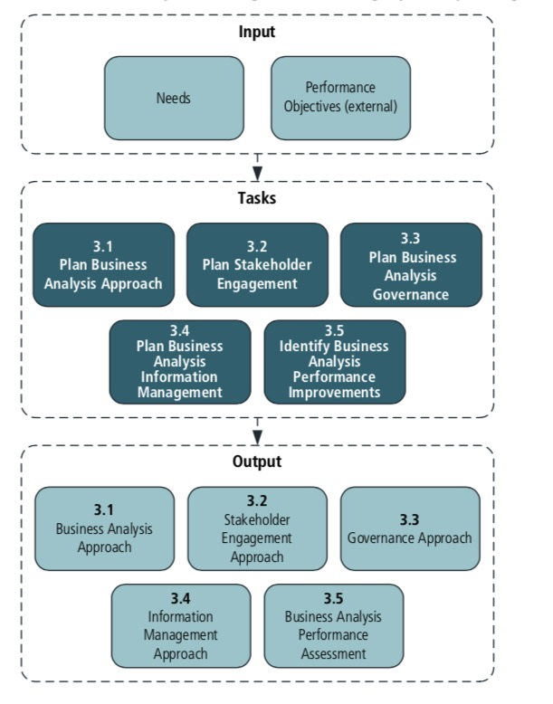

### 3.1 Plan Business Analysis Approach

The **purpose** of Plan Business Analysis Approach is to define an appropriate method to conduct business analysis activities.

#### 3.1.3 Inputs

**Needs**

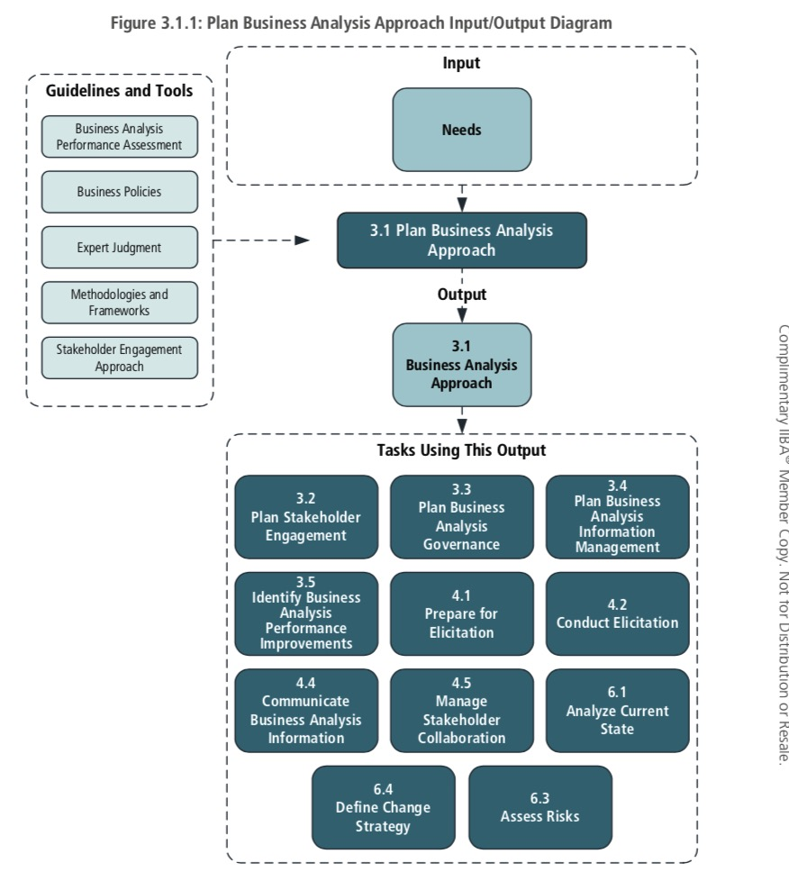

#### 3.1.4 Elements

* Predictive approaches 预测型方法
* Adaptive approaches 适应性方法

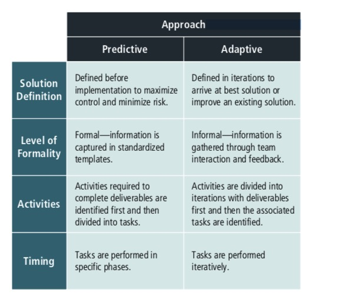

#### 3.1.5 Guidlines and tools

* Business Analysis Performance Assessment
* Business Policies
* Expert Judgment
* Methodologies and Frameworks
* Stakeholder Engagement Approach

#### 3.1.6 Techniques

* Brainstorming
* Business Cases
* Document Analysis
* Estimation
* Financial Analysis
* Functional Decomposition
* Interviews
* Item Tracking
* Lessons Learned
* Process Modelling
* Reviews
* Risk Analusis and Management
* Scope Modelling
* Survey or Questionnaire
* Workshops

#### 3.1.7 Stakeholders

* Domain Subject Matter Expert
* Project Manager
* Regulator
* Sponsor

#### 3.1.8 Outputs

* Business Analysis Approach

### 3.2 Plan Stakeholder Engagement

#### 3.2.1 Purpose

#### 3.2.2 Description

#### 3.2.3 Inputs

* Needs
* Business Analysis Approach 

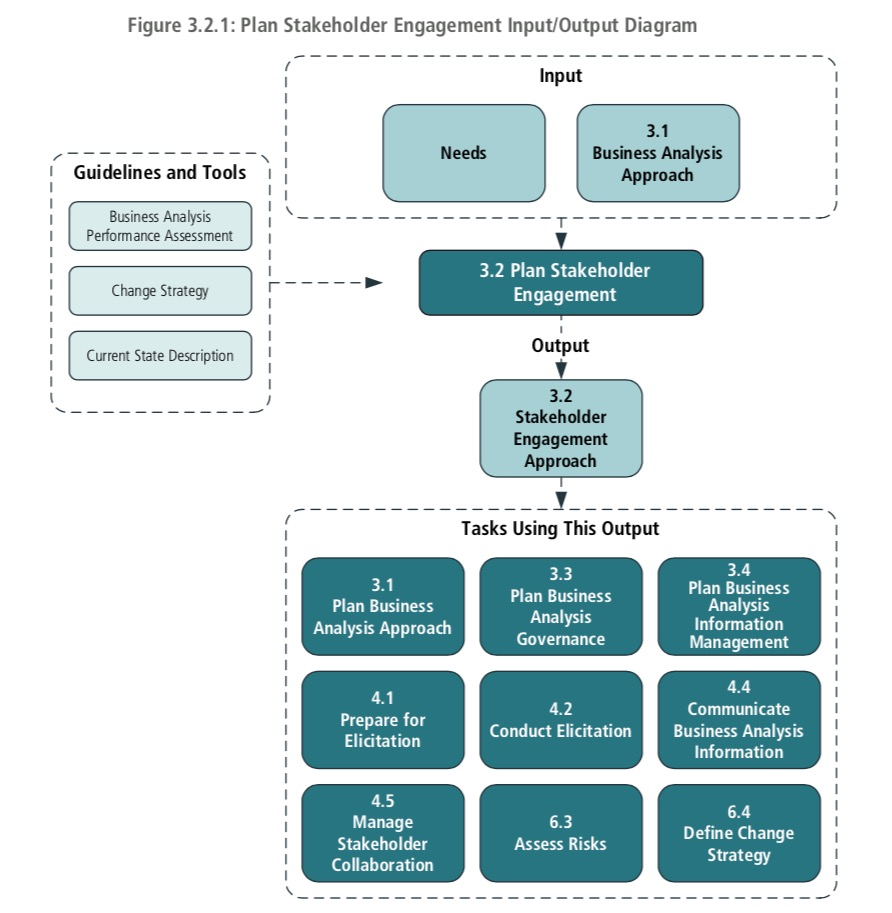

#### 3.2.4 Elements

#### 3.2.5 Guidelines and Tools

* Business Analysis Performance Assessment
* Change Strategy
* Current State Description

#### 3.2.6 Techniques

* Brainstorming
* Business Rules Analysis
* Document Analysis
* Interviews
* Lessons Learned
* Mind Mapping
* Organizational Modelling
* Process Modelling
* Risk Analysis and Management
* Scope Modelling
* Stakeholder List, Map, or Personas
* Survey or Questionnaire
* Workshops

#### 3.2.7 Stakeholders

* Customers
* Domain Subject Matter Expert
* End User
* Project Manager
* Regulator
* Sponsor
* Supplier

#### 3.2.8 Outputs

* Stakeholder Engagement Approach

### 3.3 Plan Business Analysis Governance

#### 3.3.3 Inputs

* Business Analysis Approach
* Stakeholder Engagement Approach
 
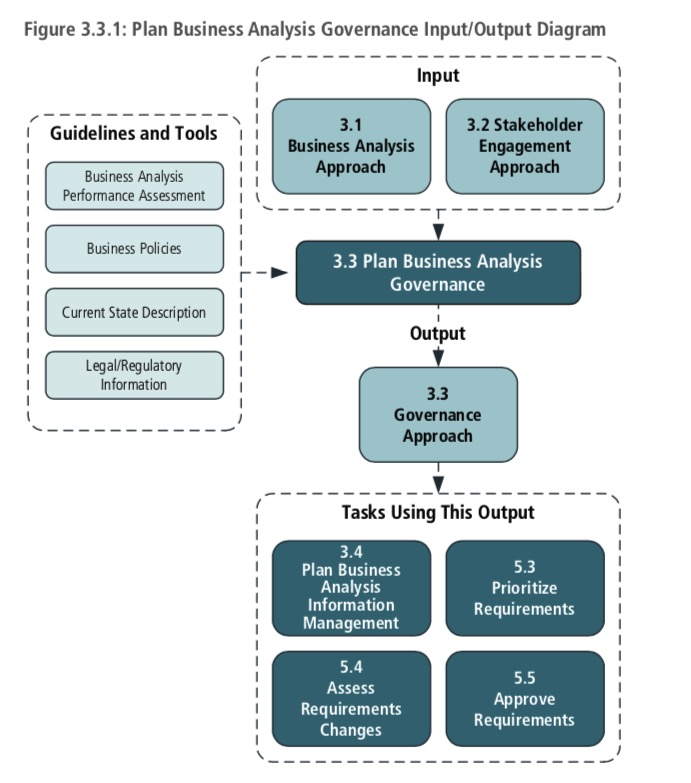 

#### 3.3.4 Elements

* Decision Making
* Change Control Process
	* Determine the process for requesting changes
	* Determine the elements of the change request
	* Determine how changes will be prioritized
	* Determine how changes will be documented
	* Determine how changes will be communicated
	* Determine who will perform the impact analysis
	* Determine who will authorize changes
* Plan Prioritization Approach
 
#### 3.3.5 Guidelines and Tools

* Business Analysis Performance Assessment
* Business Policies
* Current State Description
* Legal/Regulatory Information

#### 3.3.6 Techniques

* Brainstorming
* Document Analysis
* Interviews
* Item Tracking
* Lessons Learned
* Organizational Modelling
* Process Modelling
* Reviews
* Survey or Questionnaire
* Workshops

#### 3.3.7 Stakeholders

* Domain Subject Matter Expert
* Project Manager
* Regulator
* Sponsor

#### 3.3.8 Outputs

* Goverance Approach

### 3.4 Plan Business Analusis Information Management

#### 3.4.1 Purpose

how business analysis information will be stored and accessed
 
#### 3.4.2 Description

Information management entails identifying

* how information should be organized
* the level of detail at which information should be captured
* any relationships between the information
* how information may be used across multiple initiatives and throughout the enterprise
* how information should be accessed and stored, and
* characteristics about the information that must be maintained

#### 3.4.3 Inputs

* Business Analysis Approach
* Governance Approach
* Stakeholder Engagement Approach

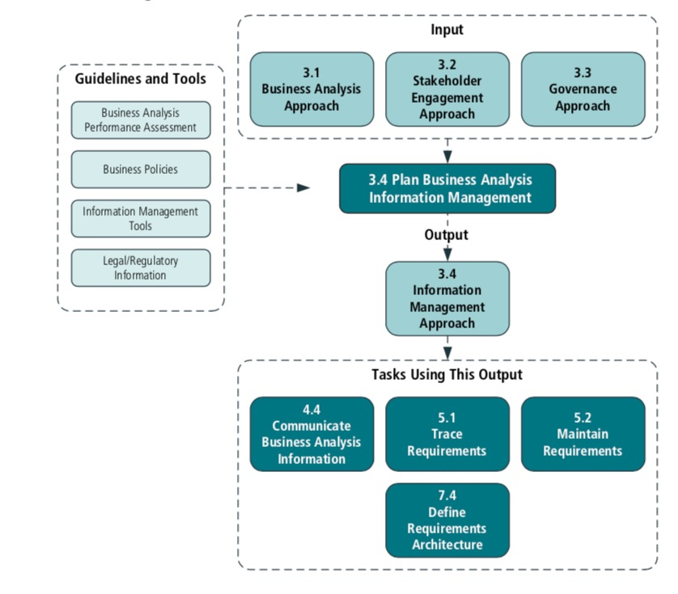

#### 3.4.4 Elements

* Organization of Business Analysis Information
* Level of Abstraction
* Plan Traceability Approach
* Plan for Requirements Reuse
* Storage and Access
* Requirements Attributes
	* Absolute reference
	* Author
	* Complexity
	* Ownership
	* Priority
	* Risks
	* Source
	* Stability
	* Status
	* Urgency

#### 3.4.5 Guidelines and Tools

* Business Analysis Performance Assessment
* Business Policies
* Information Management Tools
* Legal/Regulatory Information

#### 3.4.6 Techniques

* Brainstorming
* Interviews
* Item Tracking
* Lessons Learned
* Mind Mapping
* Process Modelling
* Survey or Questionnaire
* Workshops
 
#### 3.4.7 Stakeholders

* Domain Subject Matter Expert
* Regulator
* Sponsor

#### 3.4.8 Outputs

* Information Management Approach

### 3.5 Identify Business Analysis Performance Improvements 

#### 3.5.3 Inputes

* Business Analysis Approach
* Performance Objectives (external)

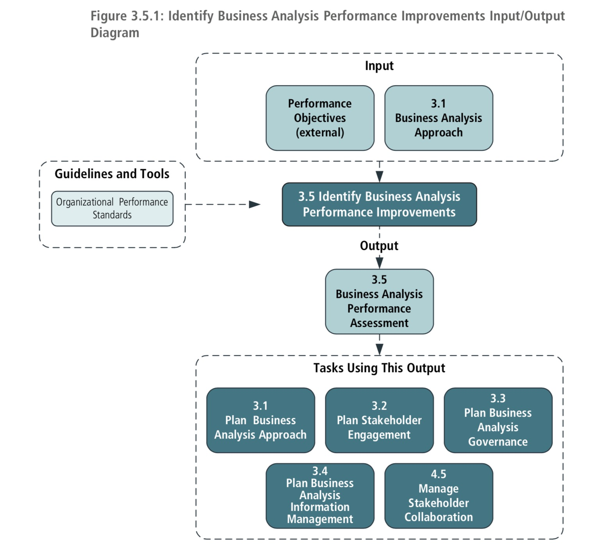

#### 3.5.4 Elements

* Performance Analysis
* Assessment Measures
	* Accuracy and Completeness
	* Knowledge
	* Effectiveness
	* Organizational Support
	* Significance
	* Strategic
	* Timeliness
* Analyze Results
* Recommend Actions for Improvement
	* Preventive
	* Corrective
	* Improvement

#### 3.5.5 Guidelines and Tools

* Organizational Performance Standard

#### 3.5.6 Techniques

* Brainstorming
* Interviews
* Item Tracking
* Lessons Learned
* Metrics and Key Performance Indicators (KPIs):
* Observation
* Process Analysis
* Process Modelling
* Reviews
* Risk Analysis and Management
* Root Cause Analysis
* Survey or Questionnaire
* Workshops

#### 3.5.7 Stakeholders

* Domain Subject Matter Experts
* Project Manager
* Sponsor

#### 3.5.8 

* Business Analysis Performance Assessment
 
## 4. Elicitation and Collaboration

* Prepare for Elicitation
* Conduct Elicitation
* Confirm Elicitation Results

Core Concept | During Elicitation and Collaboration, business analysts...
---- | ---
**Change**: the act of transformation in response to a need. | use a variety of elicitation techniques to fully identify the characteristics of the change including concerns that stakeholders have about the change. The change itself may determine the appropriate types and extent of elicitation and collaboration.
**Need**: a problem or opportunity to be addressed. | elicit, confirm, and communicate needs and supporting business analysis information. As elicitation is iterative and incremental, the understanding of needs may evolve over time.
**Solution**: a specific way of satisfying one or more needs in a context. | elicit, confirm, and communicate necessary or desired characteristics of proposed solutions.
**Stakeholder**: a group or individual with a relationship to the change, the need, or the solution. | manage the collaboration with the stakeholders who participate in the business analysis work. All stakeholders may participate in different roles and at different times during a change.
**Value**: the worth, importance, or usefulness of something to a stakeholder within a context. | collaborate with stakeholders to assess the relative value of information provided through elicitation, and apply a variety of techniques to confirm and communicate that value.
**Context**: the circumstances that influence, are influenced by, and provide understanding of the change. | apply a variety of elicitation techniques to identify business analysis information about the context that may affect the change.

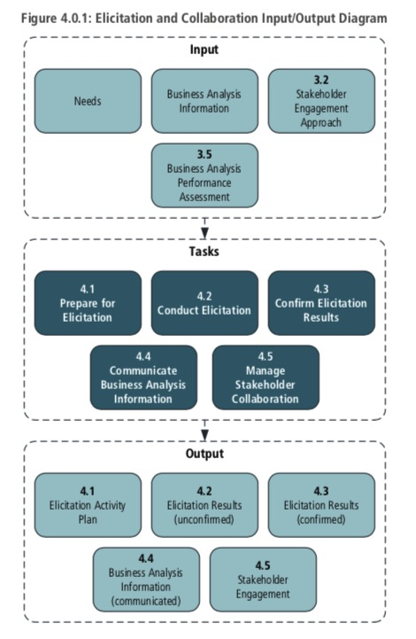

### 4.1 Prepare for Elicitation

#### 4.1.1 Purpose

#### 4.1.2 Description

#### 4.1.3 Inputs

* **Needs**: guides the preparation in terms of the scope and purpose of elicitation activities. Elicitation can be used to discover the needs, but in order to get started there must be some need that exists—even if it has not yet been fully elicited or understood.
* **Stakeholder Engagement Approach**: understanding stakeholders' communication and collaboration needs helps plan and prepare appropriate and effective elicitation events.

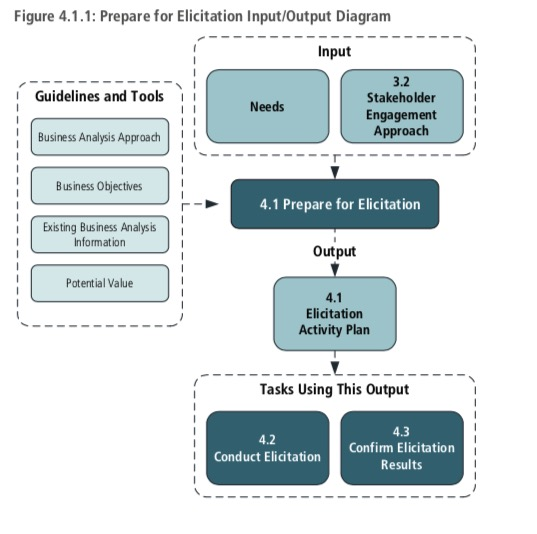

#### 4.1.4 Elements

1. Understand the Scope of Elicitation
	* business domain
	* overall corporate culture and environment
	* stakeholder locations
	* stakeholders who are involved and their group dynamics
	* expected outputs the elicitation activities will feed
	* other elicitation activities planned to complement this one
	* strategy or solution approach
	* scope of future solution, and
	* possible sources of the business analysis information that might feed into the specific elicitation activity.
2. Select Elicitation Techniques
3. Set Up Logistics
	* the activity's goals
	* participants and their roles
	* scheduled resources, including people, rooms, and tools,
	* locations,
	* communication channels,
	* techniques, and
	* languages used by stakeholders (oral and written).
4. Secure Supporting Material
5. Prepare Stakeholders

#### 4.1.5 Guidelines and Tools

* Business Analysis Approach
* Business Objectives
* Existing Business Analysis Information
* Potential Value

#### 4.1.6 Techniques

* Brainstorming
* Data Mining
* Document Analysis
* Estimation
* Interviews
* Mind Mapping
* Risk Analysis and Management
* Stakeholder List, Map, or Personas

#### 4.1.7 Stakeholders

* Domain Subject Matter Expert
* Project Manager
* Sponsor

#### 4.1.8 Outputs

* Elicitation Activity Plan

### 4.2 Conduct Elicitation

#### 4.2.1 Purpose

**draw out, explore, and identify information relevant to the change.**

#### 4.2.2 Description

* Collaborative
* Research
* Experiments

#### 4.2.3 Inputs

* Elicitation Activity Plan

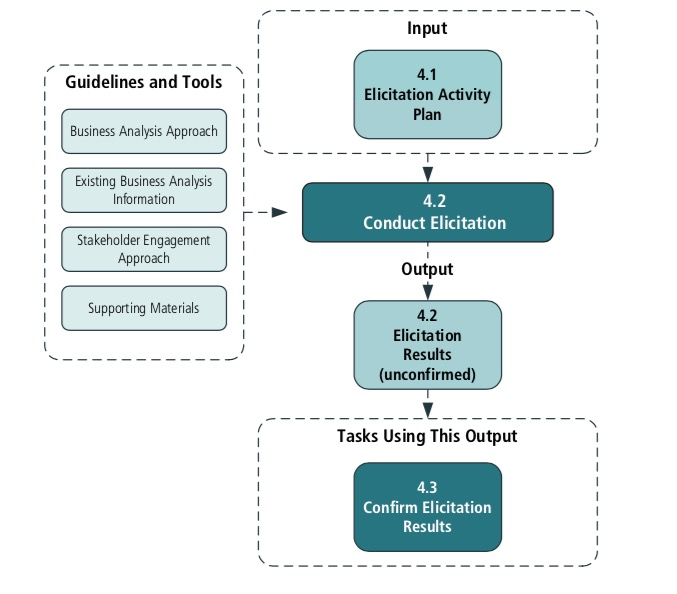

#### 4.2.4 Elements

* Guide Elicitation Activity
* Capture Elicitation Outcomes

#### 4.2.5 Guidelines and Tools

* Business Analysis Approach
* Existing Business Analysis Information
* Stakeholder Engagement Approach
* Supporting Materials

#### 4.2.6 Techniques

* Benchmarking and Market Analysis
* Brainstorming
* Business Rules Analysis
* Collaborative Games
* Concept Modelling
* Data Mining
* Data Modelling
* Document Analysis
* Focus Groups
* Interface Analysis
* Interviews
* Mind Mapping
* Observation
* Process Analysis
* Process Modelling
* Prototyping
* Survey or Questionnaire
* Workshops

#### 4.2.7 Stakeholders

* Customer
* Domain Subject Matter Expert
* End User
* Implementation Subject Matter Expert
* Sponsor
* Any stakeholders
* Any stakeholders

#### 4.2.8 Outputs

* Elicitation Results (unconfirmed)

### 4.3 Confirm Elicitation Results

#### 4.3.1 Purpose

**check the information gathered during an elicitation session for accuracy and consistency with other information**

#### 4.3.2 Description

#### 4.3.3 Inputs

* Elicitation Results (unconfirmed)

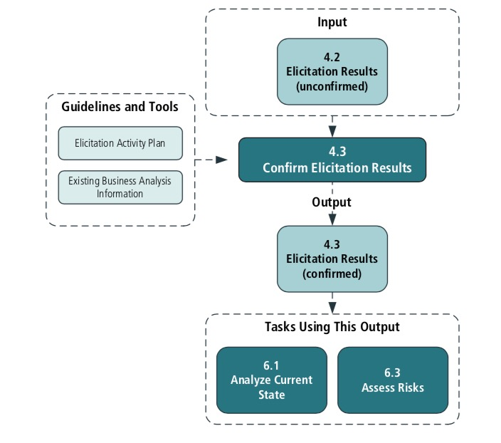

#### 4.3.4 Elements

1. Compare Elicitation Results Against Source Information
2. Compare Elicitation Results Against Other Elicitation Results

#### 4.3.5 Guidelnes and Tools

* Elicitation Activity Plan
* Existing Business Analysis Information

#### 4.3.6 Techniques

* Document Analysis
* Interviews
* Reviews
* Workshops

#### 4.3.7 Stakeholders

* Domain Subject Matter Experts
* Any stakeholder

#### 4.3.8 Outputs

* Elicitation Results (confirmed)

### 4.4 Communicate Business Analysis Information

#### 4.4.1 Purpose

**ensure stakeholders have a shared understanding of business analysis information**

#### 4.4.2 Description

#### 4.4.3 Inputs

* Business Analysis Information
* Stakeholder Engagement Approach

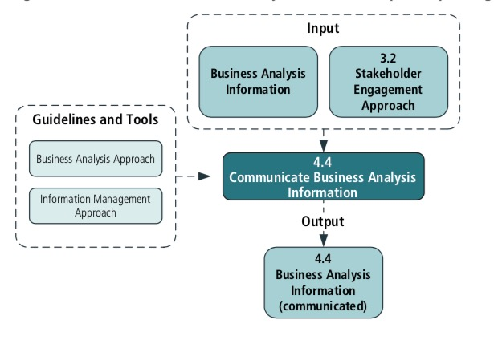

#### 4.4.4 Elements

1. Determine Objectives and Format of Communication

Possible forms for packages may include

* Formal Documentation
* Informal Documentation
* Presentations

2. Communicate Business Analysis Package

Common communication platforms include:

* Group collaboration
* Individual collaboration
* E-mail or other non-verbal methods

#### 4.4.5 Guidelines and Tools

* Business Analysis Approach
* Information Management Approach

#### 4.4.6 Techniques

* Interviews
* Reviews
* Workshops

#### 4.4.7 Stakeholders

* End User
* Customer
* Domain Subject Matter Expert
* Implementation Subject Matter Expert
* Tester
* Any stakeholder

#### 4.4.8 Outputs

* Business Analysis Information (communicated)

### 4.5 Manage Stakeholder Collaboration

#### 4.5.1 Purpose

**encourage stakeholders to work towards a common goal**

#### 4.5.2 Description

#### 4.5.3 Inputs

* Stakeholder Engagement Approach
* Business Analysis Performance Assessment

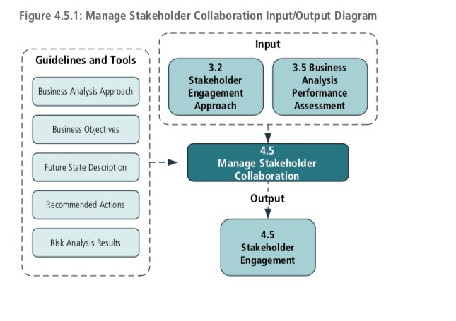

#### 4.5.4 Elements

1. Gain Agreement on Commitments
2. Monitor Stakeholder Engagement
3. Collaboration

#### 4.5.5 Guidelines and Tools

* Business Analysis Approach
* Business Objectives
* Future State Description
* Recommended Actions
* Risk Analysis Results

#### 4.5.6 Techniques

* Collaborative Games
* Lessons Learned
* Risk Analysis and Management
* Stakeholder List, Map, or Personas

#### 4.5.7 Stakeholders

* All stakeholders

#### 4.5.8 Outputs

* Stakeholder Engagement

## 5. Requirements Life Cycle Management

The management of requirements does not end once a solution is implemented. Throughout the life of a solution, requirements continue to provide value when they are managed appropriately.

Life cycle refers to the existence of various phases or states that requirements pass through as part of any change. Requirements may be in multiple states at one time.

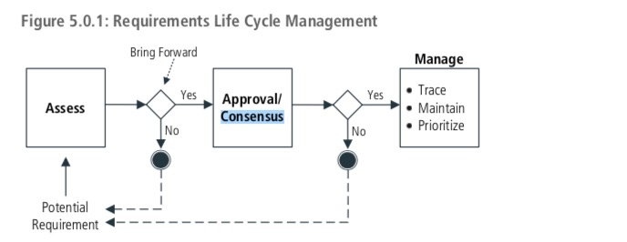

The Requirements Life Cycle Management knowledge area includes the following tasks:

* Trace Requirements
* Maintain Requirements
* Prioritize Requirements
* Assess Requirements Changes
* Approve Requirements

### The Core Concept Model in Requirements Life Cycle Management

Core Concept | During Requirements Life Cycle Management, business analysts...
---- | ---
Change: the act of transformation in response to a need. | manage how proposed changes to requirements and designs are evaluated during an initiative.
Need: a problem or opportunity to be addressed. | trace, prioritize and maintain requirements to ensure that the need is met.
Solution: a specific way of satisfying one or more needs in a context. | trace requirements and designs to solution components to ensure that the solution satisfies the need.
Stakeholder: a group or individual with a relationship to the change, the need, or the solution. | work closely with key stakeholders to maintain understanding, agreement, and approval of requirements and designs.
Value: the worth, importance, or usefulness of something to a stakeholder within a context. | maintain requirements for reuse to extend value beyond the current initiative.
Context: the circumstances that influence, are influenced by, and provide understanding of the change. | analyze the context to support tracing and prioritization activities.

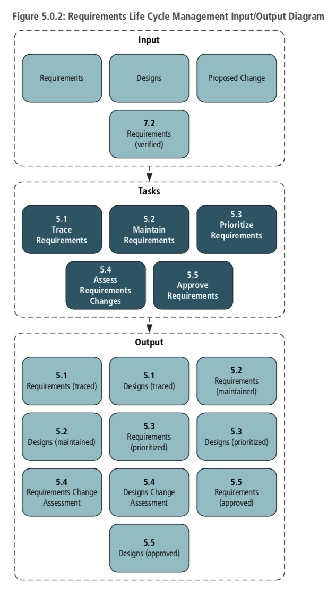

### 5.1 Trace Requirements

#### 5.1.1 Purpose

**requirements and designs at different levels are aligned to one another, and to manage the effects of change to one level on related requirements.**

#### 5.1.2 Description

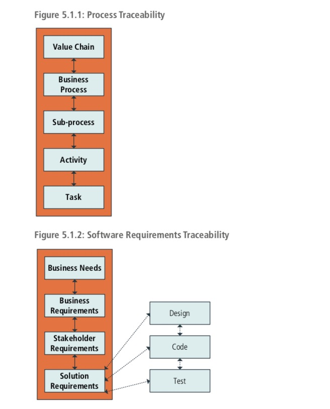

#### 5.1.3 Inputs

* Requirements
* Designs

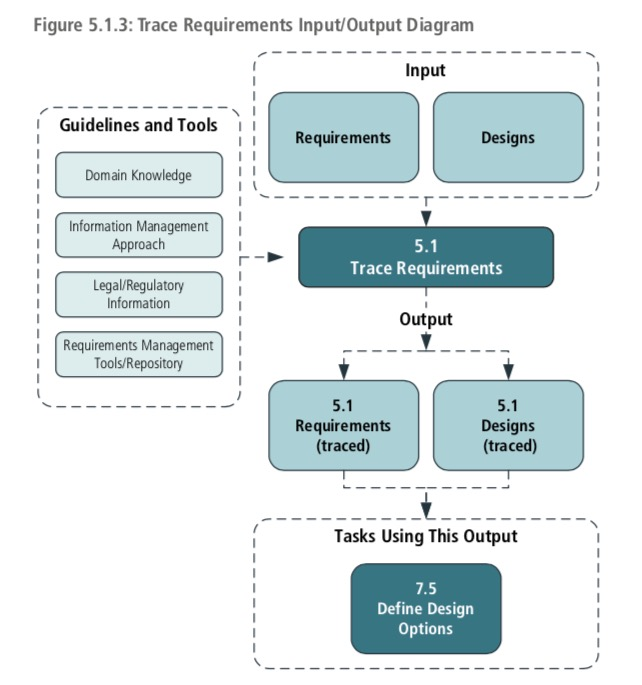

#### 5.1.4 Elements

1. Level Of Formality
2. Relationships
	* Derive
	* Depends
		* Necessity
		* Effort
	* Satisfy
	* Validate
3. Traceability Repository

#### 5.1.5 Guidelines and Tools

* Domain Knowledge
* Information Management Approach
* Legal/Regulatory Information
* Requirements Management Tools/Repository

#### 5.1.6 Techniques

* Business Rules Analysis
* Functional Decomposition
* Process Modelling
* Scope Modelling

#### 5.1.7 Stakeholders

* Customers
* Domain Subject Matter Expert
* End User
* Implementation Subject Matter Expert
* Operational Support
* Project Manager
* Sponsor
* Suppliers
* Tester

#### 5.1.8 Outputs

* Requirements (traced)
* Designs (traced)

### 5.2 Maintain Requirements

#### 5.2.1 Purpose

**retain requirement accuracy and consistency throughout and beyond the change during the entire requirements life cycle, and to support reuse of requirements in other solutions**

#### 5.2.2 Description

the requirements should be:

* consistently represented,
* reviewed and approved for maintenance using a standardized process that defines proper access rights and ensures quality, and
* easily accessible and understandable.

#### 5.2.3 Inputs

* Requirements
* Designs

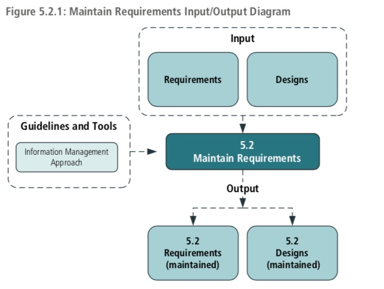

#### 5.2.4 Elements

1. Maintain Requirements
2. Maintain Attributes
3. Reusing Requirements

#### 5.2.5 Guidelines and Tools

* Information Management Approach

#### 5.2.6 Techniques

* Business Rules Analysis
* Data Flow Diagrams
* Data Modelling
* Document Analysis
* Functional Decomposition
* Process Modelling
* Use Cases and Scenarios
* User Stories

#### 5.2.7 Stakeholders

* Domain Subject Matter Expert
* Implementation Subject Matter Expert
* Operational Support
* Regulator
* Tester

#### 5.2.8 Outputs

* Requirements (maintained)
* Designs (maintained)

### 5.3 Prioritize Requirements

#### 5.3.1 Purpose

**rank requirements in the order of relative importance**

#### 5.3.2 Description

Prioritization is the act of ranking requirements to determine their relative importance to stakeholders.

#### 5.3.3 Inputs

* Requirements
* Designs

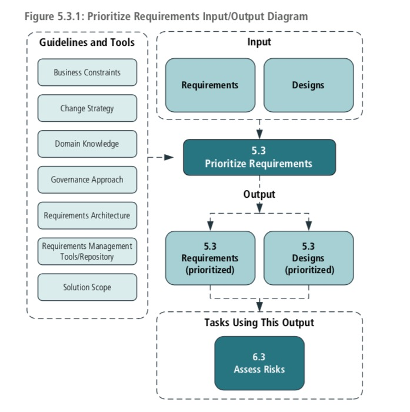

#### 5.3.4 Elements

1. Basis for Prioritization

The basis on which requirements are prioritized is agreed upon by relevant stakeholders as defined in the Business Analysis Planning and Monitoring knowledge area.

Typical factors that influence prioritization include:

* Benefit
* Penalty
* Cost
* Risk
* Dependencies
* Time Sensitivity
* Stability
* Regulatory or Policy Compliance

2. Challenges of Prioritization
3. Continual Prioritization

#### 5.3.5 Guidelines and Tools

* Business Constraints
* Change Strategy
* Domain Knowledge
* Governance Approach
* Requirements Architecture
* Requirements Management Tools/Repository
* Solution Scope

#### 5.3.6 Techniques

* Backlog Management
* Business Cases
* Decision Analysis
* Estimation
* Financial Analysis
* Interviews
* Item Tracking
* Prioritization
* Risk Analysis and Management
* Workshops

#### 5.3.7 Stakeholders

* Customer
* End User
* Implementation Subject Matter Expert
* Project Manager
* Regulator
* Sponsor

#### 5.3.8 Outputs

* Requirements (prioritized)
* Designs (prioritized)

### 5.4 Assess Requirements Changes

#### 5.4.1 Purpose

**evaluate the implications of proposed changes to requirements and designs**

#### 5.4.2 Description

When assessing changes, business analysts consider if each proposed change:

* aligns with the overall strategy,
* affects value delivered to the business or stakeholder groups,
* impacts the time to deliver or the resources required to deliver the value, and
* alters any risks, opportunities, or constraints associated with the overall initiative.

#### 5.4.3 Inputs

* Proposed Change
* Requirements
* Designs

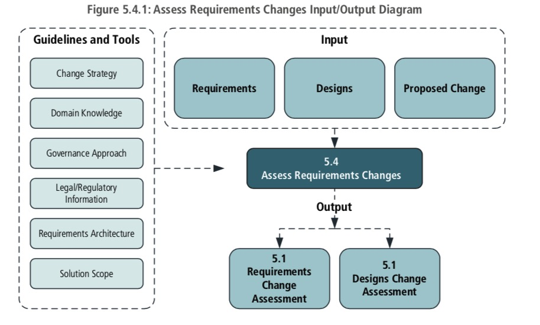

#### 5.4.4 Elements

1. Assessment Formality
2. Impact Analysis

When considering changes or additions to existing requirements, business analysts assess the impact of the proposed change by considering:

* Benefit
* Cost
* Impact
* Schedule
* Urgency

3. Impact Resolution

#### 5.4.5 Guidelines and Tools

* Change Strategy
* Domain Knowledge
* Governance Approach
* Legal/Regulatory Information
* Requirements Architecture
* Solution Scope

#### 5.4.6 Techniques

* Business Cases
* Business Rules Analysis
* Decision Analysis
* Document Analysis
* Estimation
* Financial Analysis
* Interface Analysis
* Interviews
* Item Tracking
* Risk Analysis and Management
* Workshops

#### 5.4.7 Stakeholders

* Customer
* Domain Subject Matter Expert
* End User
* Operational Support
* Project Manager
* Regulator
* Sponsor
* Tester

#### 5.4.8 Outputs

* Requirements Change Assessment
* Designs Change Assessment

### 5.5 Approve Requirements

#### 5.5.1 Purpose

**to obtain agreement on and approval of requirements and designs for business analysis work to continue and/or solution construction to proceed**.

#### 5.5.2 Description

#### 5.5.3 Inputs

* Requirements (verified)
* Designs

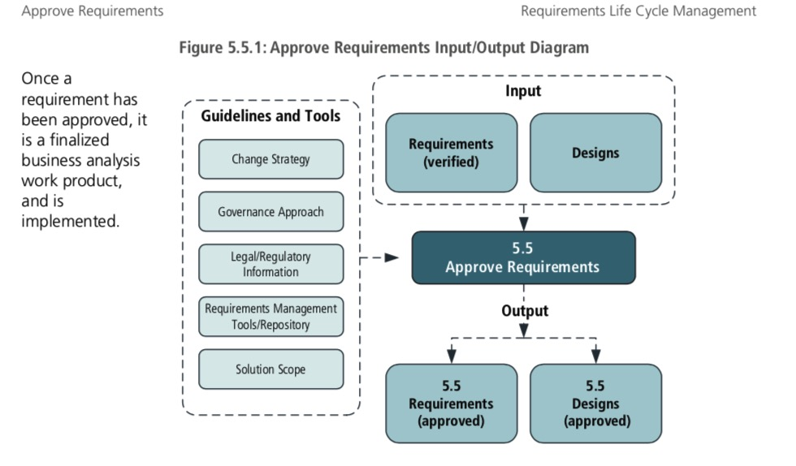

#### 5.5.4 Elements

1. Understand Stakeholder Roles
2. Conflict and Issue Management
3. Gain Consensus
4. Track and Communicate Approval

#### 5.5.5 Guidelines and Tools

* Change Strategy
* Governance Approach
* Legal/Regulatory Information
* Requirement Management Tools/Repository
* Solution Scope

#### 5.5.6 Techniques

* Acceptance and Evaluation Criteria
* Decision Analysis
* Item Tracking
* Reviews
* Workshops

#### 5.5.7 Stakeholders

* Customer
* Domain Subject Matter Expert
* End User
* Operational Support
* Project Manager
* Regulator
* Sponsor
* Tester

#### 5.5.8 Outputs

* Requirements (approved)
* Designs (approved)

## 6. Strategy Analysis

The Strategy Analysis knowledge area includes the following tasks:

* Analyze Current State
* Define Future State
* Assess Risks
* Define Change Strategy

### The Core Concept Model in Strategy Analysis

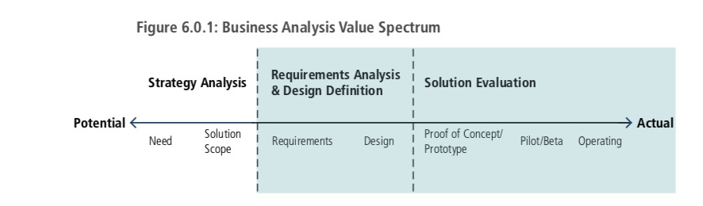

Core Concept | During Strategy Analysis, business analysts...
---- | ----
Change: the act of transformation in response to a need. | define the future state and develop a change strategy to achieve the future state.
Need: a problem or opportunity to be addressed. | identify needs within the current state and prioritize needs to determine the desired future state.
Solution: a specific way of satisfying one or more needs in a context. | define the scope of a solution as part of developing a change strategy.
Stakeholder: a group or individual with a relationship to the change, the need, or the solution. | collaborate with stakeholders to understand the business need and to develop a change strategy and future state that will meet those needs.
Value: the worth, importance, or usefulness of something to a stakeholder in a context. | examine the potential value of the solution to determine if a change is justified.
Context: the circumstances that influence, are influenced by, and provide understanding of the change. | consider the context of the enterprise in developing a change strategy.

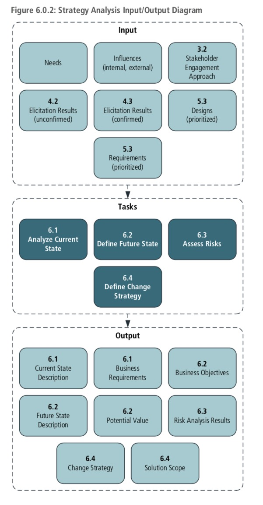

### 6.1 Analyze Current State

#### 6.1.1 Purpose

**to understand the reasons why an enterprise needs to change some aspect of how it operates and what would be directly or indirectly affected by the change**.

#### 6.1.2 Description

#### 6.1.3 Inputs

* Elicitation Results
* Needs

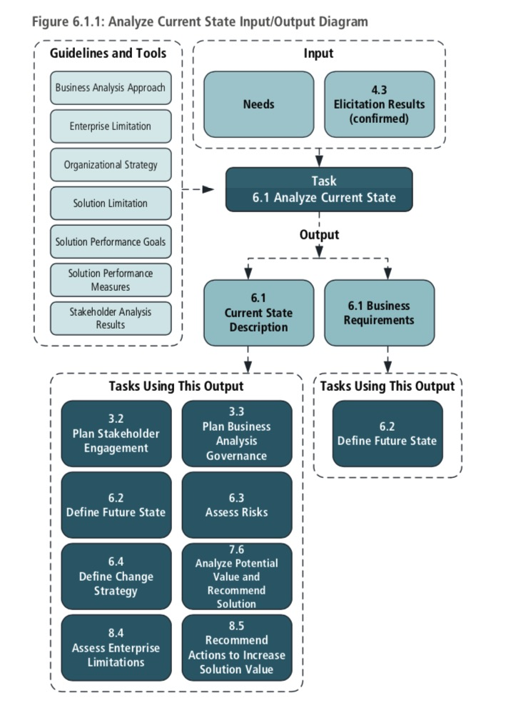

#### 6.1.4 Elements

1. Business Needs

**p105**