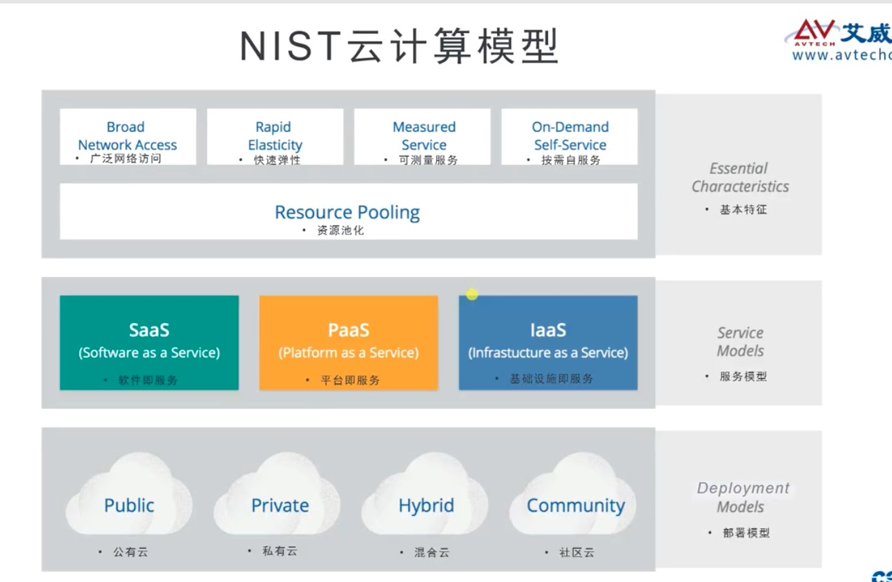
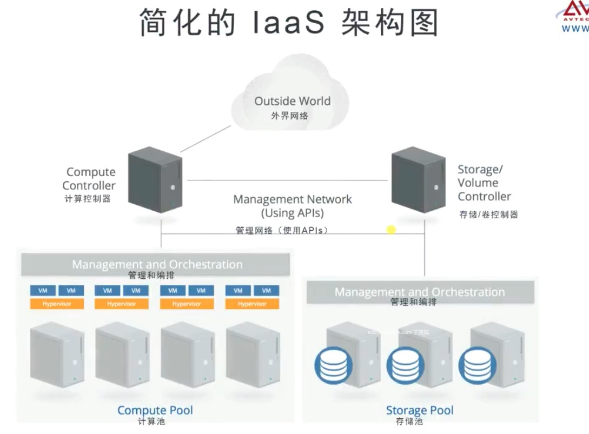
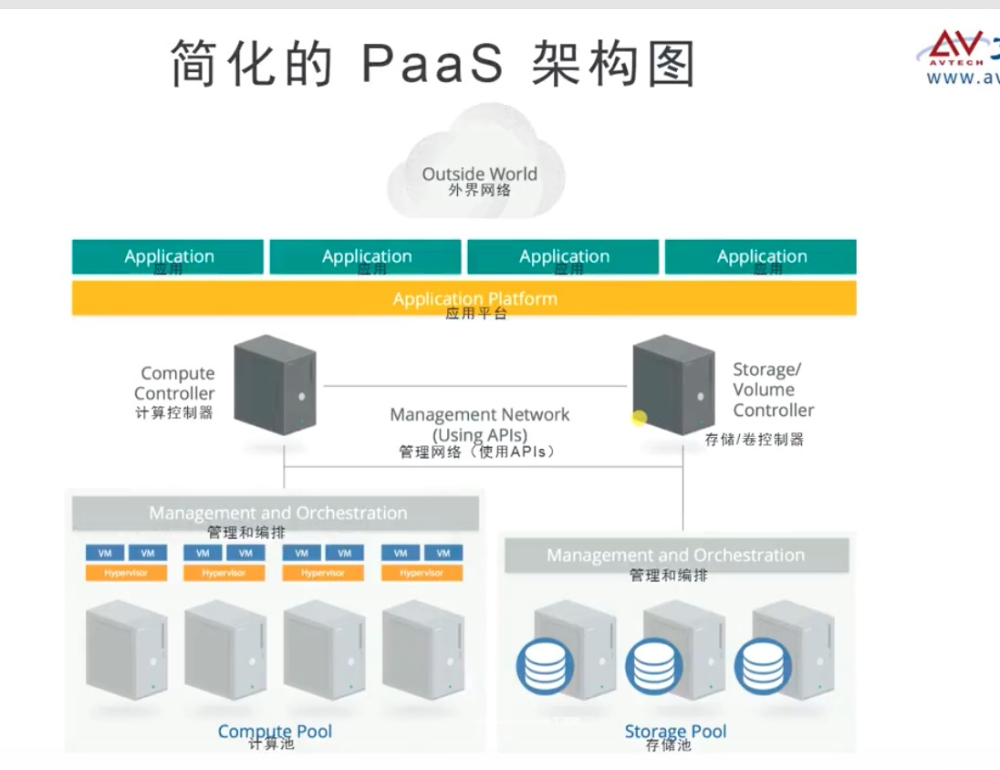
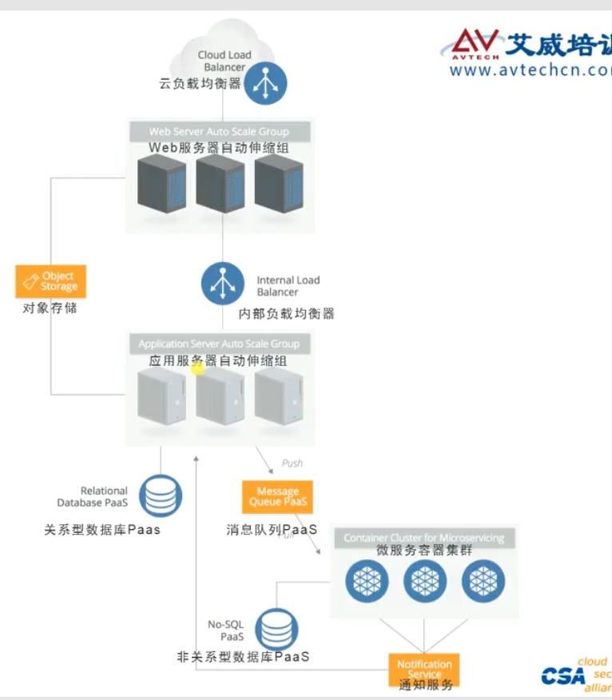
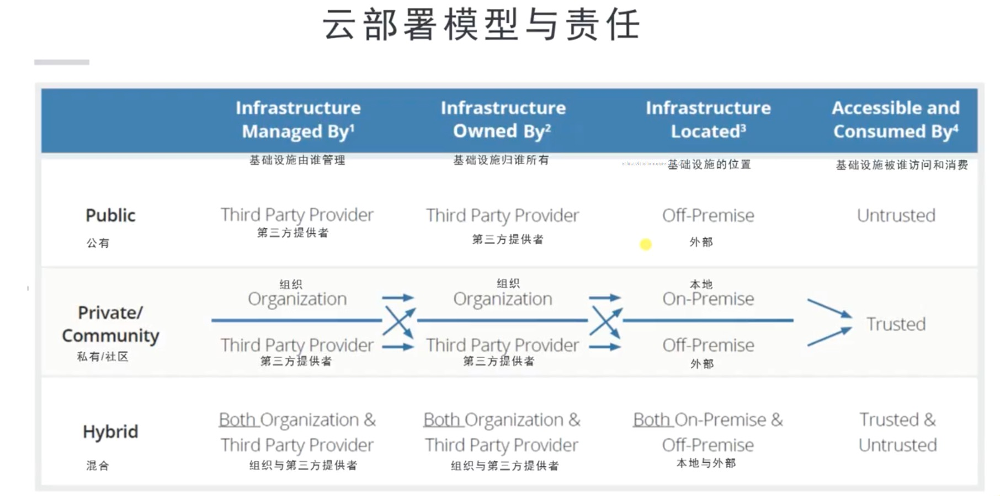
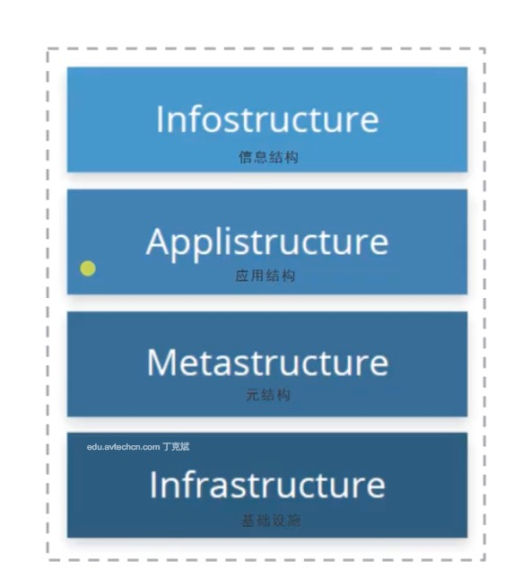
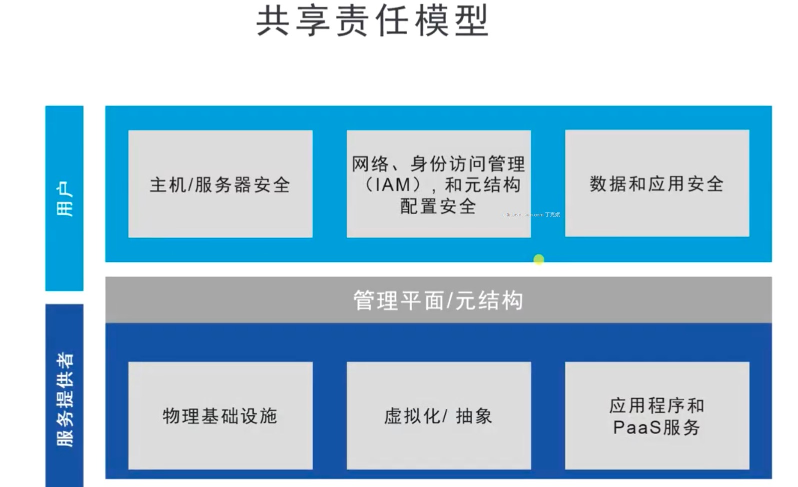
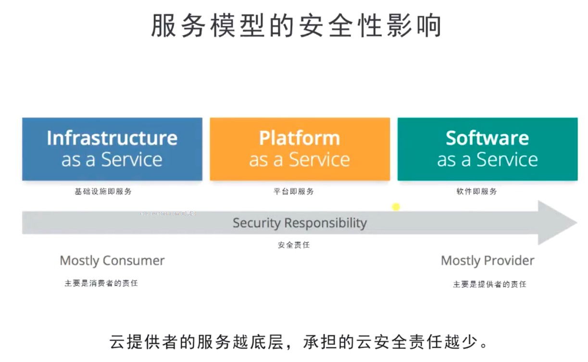
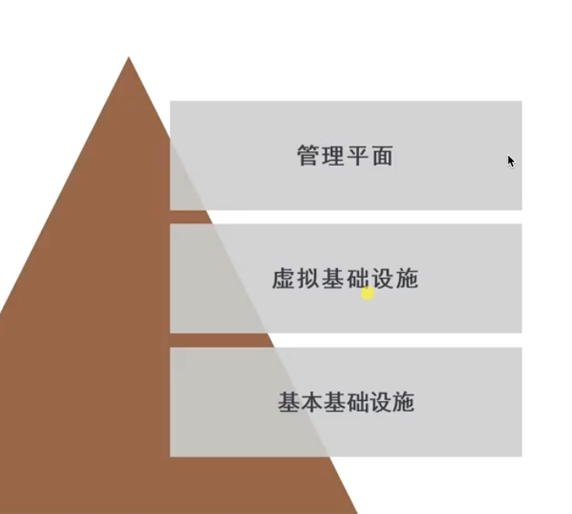
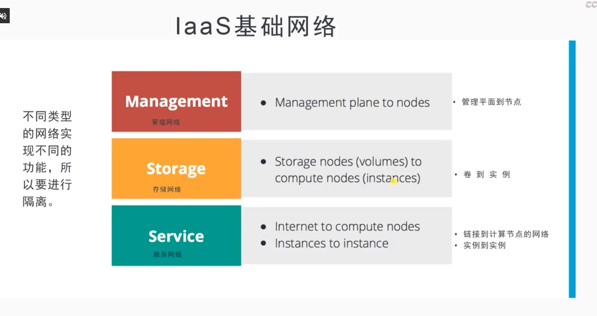

# 视频笔记

## 第一章 云计算简介与云架构

### 1 学习目标

云理论知识

额外材料

* CSA指南
* 共识评估倡议问卷(CAIQ), 自评估问卷
* 云控制矩阵(CCM), 云的风险和控制措施对应关系
* ENISA风险报告

### 2 

附件**知识点.xlsx**

### 3 学习目标

* 定义云计算和你为什么关注它
* 讨论云计算的不同组件
* 过云参考模型工作并了解个模型下安全该从何介入

### 4 云计算基本概念

* 抽象化
* 自动化(编排)

虚拟化只是抽象化，不具备编排特性。

没有虚拟化，没有云。云利用虚拟化，给客户提供快速虚拟化的能力。

传统虚拟化

* 从物理基础设施抽象出计算，网络与存储资源
* 通常是由管理员手工分配资源
* 不支持自助服务，需要管理员介入
* 由于缺乏自动化而不具备弹性

云计算

* 从屋里基础设施抽象出计算，网络与存储资源（甚至更多）
* 可以自动化并协调资源池的管理（自动编排）
* 自助服务。用户根据策略从自己分配的资源池中获取资源

#### 4.1 云计算是什么

**NIST**

* 云将应用程序和信息资源与底层基础设施以及用于交付它们的机制分开。
* 云描述了由计算，网络，信息和存储资源池组成的服务，应用，信息和基础设施的集合。
* 这些资源可以快速编排，提供，实施，退役，同时实现资源伸缩。
* 云提供按需，按小勇的分配和消费模型。

**NIST**

云计算是一种模型，用于支持无处不在的，便捷的，按需的，广泛网络访问的共享计算资源池（例如网络，服务器，存储，应用程序和服务），这些资源可以在最少的管理，最少的服务商交互的情况下快速提供和发布。

**ISO/IEC**

允许通过网络访问的，可扩展的，弹性的，可共享的物理或虚拟资源池，并按需提供自助服务和管理。

### 5 云计算的潜在收益，NIST云计算模型

#### 5.1 云计算潜在收益

**敏捷+弹性+经济**

* 无资本支出（使用公有云）
* 更敏捷
* 规模无限
* 提升资源利用率
* 客户可控制的迁移
* 弹性（安全性+连续性）
* 按用量付费（经济型）

### 6 云基本特征, 资源池化&多租户

#### 6.1 云的五种基本特性

1. 广泛的网络访问（
	* 基于属性的访问控制，传统是基于角色的访问控制
2. 快速弹性
	* 快速灵活地提供服务, 自动快速扩展和释放（收缩）
3. 可测量服务
	* 自动控制和优化资源使用
	* 利用某种抽象界别的计算能力
	* 效用计算 - 只为你使用的部分付费
4. 按需自服务
	* 前提是可以度量（测量） 
	* 使用者可以根据需要自动提供计算能力, 不需要人工交互
5. 资源池化
	* 资源被池化, 并使用多租户的模式对多个客户提供服务（不同的物理和虚拟资源）
	* 位置独立性（客户不能控制资源的精确位置）

#### 6.2 资源池化 和 多租户

* 策略驱动执行
* 分段
* 隔离
* 治理 (合同, SLA)
* 服务级别
* 计费模型

### 7. 云服务模型

* 软件即服务(SaaS)
* 平台即服务(PaaS)
* 基础设施即服务(IaaS)

* IaaS: 从租车公司租一辆车，汽车的维修、安检都由租车公司承担。你只需要提供燃料（需要提供操作系统+应用软件）
* PaaS: 除了基础设施（汽车），还为你提供司机。类似出租车。只需要提供目的地，汽车的行驶和运行都有司机决定。（只需要提供应用软件）。
* SaaS:类似于做轨道交通， 一切都是由别人控制。只有较少的定制化功能。

#### 7.1 IaaS

* 提供处理，存储，网络和其他基础计算资源
* 用户可以部署和运行任意软件
	* 包括操作系统和应用程序

IaaS（Infrastructure as a service – 基础设施即服务）：用户可以在云服务提供商提供的基础设施上部署和运行任何软件，包括操作系统和应用软件。用户没有权限管理和访问底层的基础设施，如服务器、交换机、硬盘等，但是有权管理操作系统、存储内容，可以安装管理应用程序，甚至是有权管理网络组件。简单的说用户使用IaaS，有权管理操作系统之上的一切功能。我们常见的IaaS服务有虚拟机、虚拟网络、以及存储。

#### 7.2 PaaS

* 应用开发框架，中间件能力，以及数据库，消息，队列等功能
* 将用户创建或获取的服务部署到云基础设施
* 使用云提供者支持的编程语言和工具创建应用

PaaS（Platform as a service – 平台即服务）：PaaS给用户提供的能力是使用由云服务提供商支持的编程语言、库、服务以及开发工具来创建、开发应用程序并部署在相关的基础设施上。用户无需管理底层的基础设施，包括网络、服务器，操作系统或者存储。他们只能控制部署在基础设施中操作系统上的应用程序，配置应用程序所托管的环境的可配置参数。常见的PaaS服务有数据库服务、web应用以及容器服务。成熟的PaaS服务会简化开发人员，提供完备的PC端和移动端软件开发套件（SDK），拥有丰富的开发环境（Inteli、Eclipse、VS等），完全可托管的数据库服务，可配置式的应用程序构建，支持多语言的开发，面向应用市场。

#### 7.3 SaaS

* 用户使用服务商的应用程序
* `SaaS`不一定运行在`IaaS`或`PaaS`上, 当仍然需要具备云的基本特征
* 用户不能管理或控制底层基础设施包括网络，服务器，操作系统，存储，甚至个人应用能力

SaaS（Software as a Service – 软件即服务）：SaaS给用户提供的能力是使用在云基础架构上运行的云服务提供商的应用程序。可以通过轻量的客户端接口（诸如web浏览器（例如，基于web的电子邮件））或程序接口从各种客户端设备访问应用程序。 用户无需管理或控制底层云基础架构，包括网络，服务器，操作系统，存储甚至单独的应用程序功能，可能的例外是有限的用户特定应用程序配置设置。类似的服务有：各类的网盘(Dropbox、百度网盘等)，JIRA，GitLab等服务。而这些应用的提供者不仅仅是云服务提供商，还有众多的第三方提供商（ISV: independent software provider）。

**元数据**

* 数据字典
* 注册表

### 8 云部署模型

* 公有云
* 社区云
* 私有云
* 混合云
	* 直连网络通道
	* 虚拟网络通道

### 9 逻辑模型及共享责任模型

* 数据和信息
* 应用组件/服务
* 管理平面
* 核心基础设施

* Inforstructure
	* 信息
* Applistructure
	* 应用
* Infrastructure
	* 计算，网络，存储 物理资源虚拟化
* Metastructur
	* 协议，机制。提供基础结构层和其它层之间的**接口**。实际就是**管理平面**。

共享责任模型

* IaaS 消费者责任
* SaaS 提供者责任

### 10 云安全及模块总结

* 确定需求
* 选择提供者，服务和部署模型
* 定义架构
* 访问安全控制
* 确定控制差距
* 设计和实施控制
* 管理变更

## 第二章 云计算基础设施安全

### 11 学习目标

* 理解云基础设施的组件
* 评估虚拟网络和工作负载的安全影响
* 了解使用云基础设施的安全优势和劣势
* 评估如何保护云管理平面
* 学习如何管理云计算的业务连续性

### 12 保护基础设施

* 基础设施组件
* 虚拟机管理程序
* 网络
* 管理平面

### 13 保护虚拟网络

* 要使用单独的物理网络
* 将云网络与局域网隔离

#### 13.1 VLAN 和 SDN

* LVAN
	* 利用现有网络中的技术
	* 转为单租户环境中的网络分段设计而不是为隔离租户
	* 作为安全屏障是无效的
	* 如果在云环境中在规模上就要有性能和地址空间的限制
* SDN
	* 软件定义网络实现了控制平面与底层硬件的解耦
	* 从传统的LAN限制中抽象出虚拟网络
	* 非常灵活(如在相同的物理硬件上重叠IP地址范围)
	* 多种实现，标准和专有的
	* 可以实现有效安全屏障

#### 13.2 SDN 安全优势

* 更容易隔离
* SDN 防火墙/安全组
* 拓扑不受物理结构限制
* 基于标记和其他上下文的安全策略和控制

#### 13.3 软件定义边界 SDP

结合`SDN`做网络安全管理

#### 网络安全建议

* 建议使用`SDN`
* 为多个虚拟网络和多个云账户/分段使用`SDN`功能，以增强网络隔离
* 与传统的数据中心对比，独立的账户和虚拟网络极大地限制了危害范围
* 在云防火墙上实现默认拒绝
* 基于每个工作负载还不是基于每个网络应用云防火墙
* 尽可能使用云防火墙策略限制统一虚拟子网中的工作负载之间的通信，比如使用安全组

### 14 保护公计算工作负载

工作负载

* 虚拟机
* 容器
* 基于平台（如`paas`上的存储过程，如数据库）
* 无服务器（代码执行）

**不可变** 使用`image`镜像**替换**代替**升级**

#### 14.1 不可变的

* 基于镜像自动部署(例如使用自动伸缩组)
* 登录已禁用，因为更改不会传播到其他实例
* 用新版本替换旧版本，而不是对旧版本打补丁
* 非常容器实现安全加固(例如禁用`SSH`)

#### 14.2 自动配置管理

* 使用基于模板/策略的工具(`Chef/Puppet/Ansible/Salt`)
* 禁用手动更改，因为自动化会覆盖

#### 14.3 标准/长时间运行

* 像传统服务器一样管理

### 15 管理平面

* 关键功能
	* 提供资源
	* 启动/停止/终止
	* 配置资源
* 安全注意事项
	* 身份验证
	* 访问控制
	* 日志/监控

访问和凭证, `WEB`和`APIs`

#### 15.1 `ROOT`账户安全

* 启用硬件多因素身份验证(`MFA`)
	* 存储在一个锁定的中心位置
* 使用孤立的凭证
	* 云账户不要用作其他用途
	* 使用带有随机种子的名称来减少网络钓鱼
* 使用账户安全问题
	* 安全地记录和存储账户安全问题及其答案
* 除紧急情况外，切勿使用`root`账户

### 16 业务连续性和灾难恢复