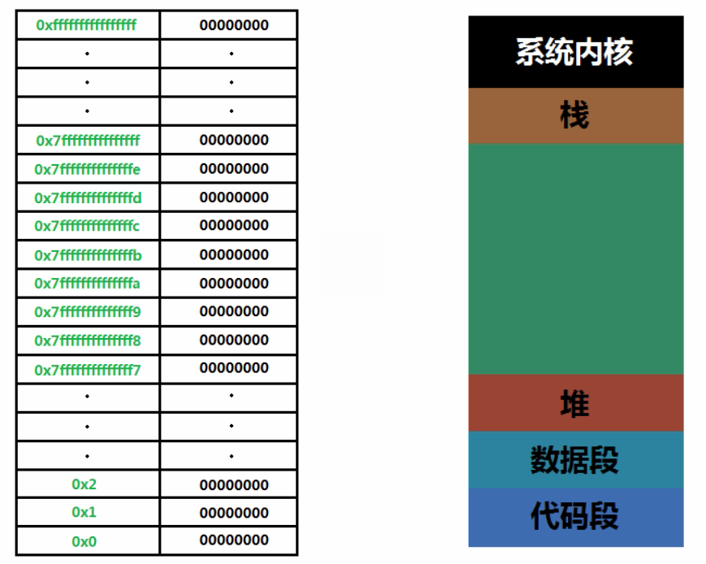

#Linux C语言指针与内存

[地址](http://www.imooc.com/learn/394 "地址")

###笔记

---

####指针与内存

**计算机数据表示方法**

最小单位: 字节(byte)

1byte = 8bit (8个2进制位)

`2进制`:

* `高电位`: 1
* `低电位`: 0

* `计算`用`二`进制
* `显示`用`十`进制
* `编程`用`十六`进制

**内存管理**

`32`位系统最大使用`4G`内存: 地址总线是`32`位,也就是寻址空间是`32`位. `给内存的编号只能编到32个二进制位`.

`32`根地址总线就有`2^32`个状态.

2^32 = 

* 2^10 * 2^10 * 2^10 * 2^2
* 1024 * 1024 * 4k
* 1024 * 4M
* 4G

`32`位最多可以管理`4G`内存.

`操作系统`

* 对所有内存进行`编号`, `编号` = `唯一`的内存字节的地址. `1`个字节存放`8`个`二进制`位的数据.
* 对内存做一定的规划

`用户内存隔离开的好处`:

1. 操作系统的内存不会被大量占用.
2. 避免机器卡主, 卡死, 死机等状态
3. 可通过操作系统把应用程序关闭
4. 使得操作系统更安全 

`操作系统对内存的规划`:

`64位操作系统中`: 程序员使用的内存为前面的48位.

`高位内存`: 计算机系统使用(系统内核)

`代码段`: 程序源代码编译后存放在此

`数据段`: 声明一些`全局变量`或者声明一些`常量`,`静态变量`

`自由可分配的内存`(绿色区域): 应用程序可以动态分配的内存.

`堆(heap)`: 堆是用于存放进程运行中被动态分配的内存段,它的大小并不固定,可动态扩张或缩减.当进程调用`malloc`等函数分配内存时,新分配的内存就被动态添加到堆上(堆被扩张);当利用`free`等函数释放内存时,被释放的内存从堆中被剔除(堆被缩减).**申请**

`栈(stack)又称堆栈`: 用户存放程序临时创建的`局部变量`,也就是说我们函数括弧"{}"中定义的变量(但不包括static声明的变量,static意味着在数据段中存放变量). 在函数被调用时,其参数也会被压入发起调用的`进程栈`中,并且待到调用结束后,函数的返回值也会被存放回栈中.由于栈的先进先出特点,所以栈特别方便用来保存/恢复调用现场.从这个意义上讲,我们可以把堆栈看成一个寄存、交换临时数据的内存区.**编译时自动分配**

**变量和指针的本质**

`变量的本质是什么`:

`变量名`它只是一个代号.  
变量的`本质`就是`内存`.

`指针保存的就是内存地址`.

**操作系统对内存的管理**

通常说变量地址是多少,代指起始地址.

`编译器优化`: 为了提速程序执行效率, 编译后的指令存储和编写时指令顺序不一样.
把同一类型变量声明放到一起.

`指针`在`32`位系统中占`4`个字节. `64`位系统占`8`个字节.

每当调用一个函数,申请一个栈内存.

`代码段`内存`分配`由低位到高位.

`栈`内存`分配`由高位到低位(越往后调用函数内存地址越小).

####字符串与数组

**数组声明的内存排列**

内存是挨个连续排放

**?程序不能执行**

输出结果:

		*p = 3 //a的值
		*p = 1 //i的值
		*p = 2 //b的值
		*p = 1 //array[0]的值
		*p = 10 //array[1]的值
		*p = 100 //array[2]的值
		-----------------
		*p = 3
		*p = 1
		*p = 2
		*p = 1
		*p = 10
		*p = 100

**指针运算**

指针++, 根据类型判断比如整形就自动在地址移动一格(移动4个字节). 这就是`指针偏移`运算.

对指针做`+/-`实际上做的是地址的偏移.

数组就是内存地址.

`示例`:

		#include <stdio.h>
		int main(){
			int a=3;
			int b=2;
			int array[2];
			
			array[0]=1;
			array[1]=10;
			array[2]=100;
			
			int *p=&a;
			p+=3; //尝试修改array[0]
			*p=101;//等同于p[3] = 101
			
			int i;
			for(i=0;i<6;i++){
				...
			}
			...
		}
		
		
		因为cpu优化,把同一类型变量声明放到一起.
		
		*p=&a;//a
		移动一位 -> b
		移动一位 -> i
		移动一位 -> array[0]

**字符串与数组**

字符串是数组,所以字符串也就是内存地址.

`对于整形`:

		int a;
		scanf("%d", &a);
		
`对于字符串`:
		
		char str3[10];
		scanf("%s",str3);//注意没有 & 符号, 因为数组就是内存地址
		

`内存写入`:

		char str[] = "hello"; // 可以写入
		char *str2 = "world"; // 常量, 不能写入
		char str3[10]; // 可以写入	
	
**字符数组深入理解**

	
	
###整理知识点

---

####内存

**内存的区域**

* 栈区(stack): 由`编译器`自动分配释放,存放函数的`参数值`,`局部变量的值`等. 操作方式类似数据结构中的栈.
* 堆区(heap): 由`程序员`分配释放,若程序员不释放, 程序结束时可能由os回收. 与数据结构中的堆不同, 分配方式类似链表.(用`malloc`, `calloc`, `realloc` 等分配内存的函数分配得到的就是在堆上)
* 全局区(静态区)(static): `全局变量`和`静态变量`的存储是放在一块的. `初始化`的全局变量和静态变量在一块区域(`DATA段`). `未初始化`的全局变量和未初始化的静态变量在相邻的另一块区域(`BSS段`). - 程序结束后由系统释放.
* 文字常量区: `常量字符串`就是放在这里的. 程序结束后由系统释放.
* 程序代码区: 存放`函数体`的二进制代码.

**示例**

		#include<stdio.h>
		#include<stdlib.h>
		#include<iostream>
		#include<string.h>
		using namespace std;

		static int a=1;//全局初始化区,初始化静态变量
		int b=2;//全局初始化区,初始化全局变量
		char *p;//全局未初始化区,初始化全局变量
		char *p2;//全局未初始化区,初始化全局变量
		int *p3;//全局未初始化区,初始化全局变量
		int *p4;//全局未初始化区,初始化全局变量
		char *p5={"555555555"};//全局初始化区,初始化全局变量

		int main(){
    		static int c=3;
    		int d=4;//内存栈,局部变量
    		int e=7;//内存栈,局部变量
    
    		char *p6={"555555555"};
    		p=(char*)malloc(sizeof(char)*10);//内存堆,malloc函数
    		p2=(char*)malloc(sizeof(char)*10);//内存堆,malloc函数
   			p3=(int*)malloc(sizeof(int));//内存堆,malloc函数
   		 	p4=(int*)malloc(sizeof(int)*10);//内存堆,malloc函数
    		for(int i=0;i<=9;i++)p4[i]=0x1;

    		*p3=0x123;
    		strcpy(p,"123456789");//文字常量区
    		strcpy(p2,"987654321");
    		strcpy(p2,"123456789");
}

`示例:.bbs段未初始化变量初始化为0`:

			All statics and globals are initialized, it's just a question of whether they are initialized to zero or some other value. Variables initialized to zero go into the __bss section of the __DATA segment. Other variables will go into other sections of the __DATA segment.

			int f = 6;
			int e;
			int h = 7;
			
			
			int main(){
			
				printf("%p-->%d\n", &f, f);//6
				printf("%p-->%d\n",&h,h);//7
				printf("%p-->%d\n",&e,e);//0 .bss 段,初始化0
			}

`示例:验证各个段的变化`:

* 初始化

		   int main(){
				return 1;
			}		
		   text	   data	    bss	    dec	    hex	filename
   		   1040	    484	     16	   1540	    604	a.out
   		   
* 增加未初始化全局变量,bss段增加:

   		   int g_data;
		   int main(){
 			  return 1;
		   }
		   text	   data	    bss	    dec	    hex	filename
   		   1040	    484	     24	   1548	    60c	a.out
   		   
* 修改未初始化全局变量,为初始化, `bss段减少,data段增加`(验证未初始化全局变量在bss段,初始化全局变量在data段):
			
		  int g_data = 1;
		  int main(){
 			  return 1;
		   }

		  text	   data	    bss	    dec	    hex	filename
   		  1040	    488	     16	   1544	    608	a.out

* 未初始化的静态变量保存在BSS段,bss段变大:

		  int g_data = 1;
		  int main(){
		  	  static int b;
 			  return 1;
		   }

		  text	   data	    bss	    dec	    hex	filename
   		  1040	    488	     24	   1544	    608	a.out

* 经过初始化的静态变量保存在数据段中,bss段变小,data段变大:

		  int g_data = 1;
		  int main(){
		  	  static int b = 2;
 			  return 1;
		   }
		
		  text	   data	    bss	    dec	    hex	filename
   		  1040	    492	     16	   1548	    60c	a.out

* 函数内部声明的局部变量保存在堆栈段(text):
			
		 int g_data = 1;
		 int main(){
		  	 static int b = 2;
		  	 int i_data = 3;
 			 return 1;
		  }
		
		 text	   data	    bss	    dec	    hex	filename
   		 1056	    492	     16	   1564	    61c	a.out

* const修饰的全局变量保存在文本段,text增大:

		int g_data = 1;
		int main(){
		  	static int b = 2;
		  	int i_data = 3;
		  	const int ci_data = 3;
 			return 1;
		}
		
		text	   data	    bss	    dec	    hex	filename
   		1060	    492	     16	   1564	    61c	a.out

* const修饰的局部变量保存在堆栈段,text增大:

		int main(){
			const int cj_data = 3;
			return 1;
		}	
		
		之前:
		text	   data	    bss	    dec	    hex	filename
   		1040	    484	     16	   1540	    604	a.out
   		之后:
   		text	   data	    bss	    dec	    hex	filename
   		1056	    484	     16	   1540	    604	a.out

* 声明字符串变量:

		int main(){
			char *p = "";
			return 1;
		}	
		之前:
		text	   data	    bss	    dec	    hex	filename
   		1040	    484	     16	   1540	    604	a.out
   		之后:
		text	   data	    bss	    dec	    hex	filename
   		1057	    484	     16	   1557	    615	a.out

* 初始化字符串变量,字符串常量保存在文本段中:
		
		int main(){
			char *p = "ABC";
			return 1;
		}	
		之前:
		text	   data	    bss	    dec	    hex	filename
   		1057	    484	     16	   1540	    604	a.out
   		之后:
		text	   data	    bss	    dec	    hex	filename
   		1060	    484	     16	   1560	    618	a.out		
		
**文字常量区**

		String str = "abc"; 
		
1. 先在栈中创建一个对String类的对象指针str
2. 查找文字常量区中有没有存放"abc"
3. 如果没有,则将"abc"存放进`文字常量区`,并`令str指向”abc”`,如果已经有"abc" 则直接令str指向"abc".

		char *b = "abc";
		char *d = "abc";
		
		printf("%p--->%p---->%lu\n", b, &b, sizeof(b));
		printf("%p--->%p---->%lu\n", d, &d, sizeof(d));
		printf("%p--->%lu\n", &("abc"),sizeof("abc"));
		
		输出:
		b指向字符串,地址  变量b本身的地址     指针占8字节
		0x1082abf76--->0x7fff57954ab0---->8
		
		d指向字符串,地址  变量d本身的地址     指针占8字节
		0x1082abf76--->0x7fff57954aa8---->8
		
		字符串abc的地址 "abc\0"
		0x1082abf76--->4
		
		指向同一个字符串"abc"地址,变量自己本身的地址都不同
		
**为什么字符串常量占内存?**

`原来`:
		int i=4;
		过去 常量 4 要放到 常量区。
		int i,  要分配 变量 存放单元。
		然后再把常量区的那个存4的单元里的4 赋给 i。

`现在`:`int i=4;`处理为 `声明与初始化`. `int i`,  要分配 `变量`存放单元.`接着初始化存值4`.这样,`常量就不另占单元`.

`但是`:
		
		char *p="abcd";
		"abcd"  -- 仍要放入常量区
		char *p  -- 指针占4个字节。
		
		