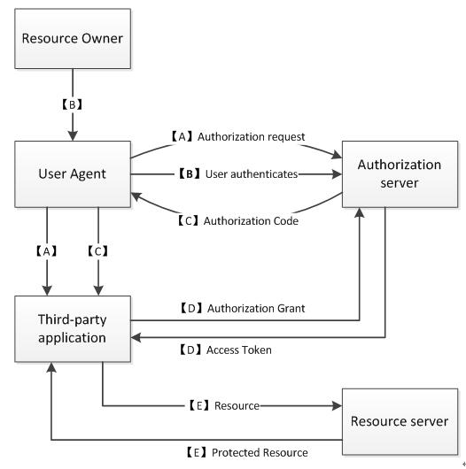

# OAuth2.0 协议

---

### 什么是`OAuth`

`O`pen `Auth`orization.

`OAuth`协议为用户资源的授权提供了一个==安全==的, ==开放==而又==简易==的标准. 与以往的授权方式不同之处是`OAuth`的授权不会使第三方触及到用户的账户信息(如用户名与密码), 即第三方无需使用用户的用户名与密码就可以申请获得该用户资源的授权, 因此`OAuth`是安全的.

### `OAuth`协议简介

* OAuth 1.0 发布于 2007 年末
* OAuth 2.0 发布于 2010 年初

### `OAuth`授权流程详解

#### 三个重要步骤

* 请求`OAuth`登录页
* 在 `OAuth`登录页输入 用户名 和 密码
* 返回登录结果, 判断是否登录成功

#### 请求`OAuth`登录页

Request Token URL : 未授权的令牌请求服务地址.

用户未授权的.

可以理解为:

xxx网请求QQ登录页面时使用的带有==特定参数的URL==.每个站点的登录参数都不一样.

* appid
* appkey
* reditect_uri 回调地址

#### 用户使用QQ号登录并授权

登录成功会返回一个加密过的参数`code`

```php
http://www.xxx.com/user/qqcallback?code=xxxx
```

#### 返回登录结果

User Authorization URL : 用户授权的令牌请求服务地址

用户已授权的.

可以理解为:

用户QQ登录授权之后需要请求的一个带有==特定参数的URL==.

这个链接是内部传输的.

```php
https://xxx.qq.com/oauth/...?...&clinet_id=xxxx&...
&client_secret=xxxxx&...
&code=xxxx
```

这个`code`就是`Request Token URL`获取到的参数.

再次检验第三方服务器是否合法.

检查`code`是否在有效时间内且是上一个接口返回的.

`code`是个==有生命周期==且==只可使用一次==的字符串.

#### 关于`AccessToken`

AccessToken 用户通过第三方应用访问OAuth接口的令牌.

QQ 发给第三方网站的令牌.

#### `AccessToken`与`RefreshToken`

带有`AccessToken`参数的特定`URL`使用`POST`请求 Open Authorization API.

API 返回 `xml,json`数据.

`AccessToken` 具有较长生命周期.

`RefreshToken` 请求获取新的`AccessToken`.

#### `OAuth`的原理



* `A`: 用户请求访问客户端,或者将前者导向至认证服务器,带上参数:
	* `client_id`
	* `redirect_url`
* `B`: 用户登录认证服务器,并选择是否授权给客户端访问.
* `C`: 用户选择同意授权,认证服务器把用户导向至`redirect_url`,并且附上授权码`authorization code`.
* `D`: 客户端向认证服务器请求`access token`, 需要带上参数:
	* `client_id`
	* `client_secret`
	* `redirect_url`
	* `authorization code`(上一步获取的).

认证服务器检查参数正确则返回`access token`表示授权成功.
* `E`: 客户端说那个`access token`请求资源服务器获取用户资源.


