# 第一部分

## 前言

### 六个过程组

* 定义和匹配
* 启动
* 规划
* 执行
* 监控
* 发布

### 六个知识领域

* 需要评估
* 相关方参与
* 启发
* 分析
* 跟踪和监督
* 解决方案评价

## 1. 引论

### 1.1 本指南概述和目的

组织希望了解:

* 战略上利用商业分析以确保将投资分配给最高价值的项目
* 足够资金, 使产品团队拥有需要的资源来正确识别和解决恰当的问题
* 交付可测量的商业价值和满足相关方期望的解决方案.

目的是交付**最有价值**的解决方案.

组织需要关注以下三个关键领域, 改进其商业分析能力的有效性:

* 人员, 正确运用商业分析的人力资源.
* 过程, 标准化过程.
* 文化, 高层的合理支持和承诺.

**商业分析**是指应用知识, 技能, 工具和技术于

* 确定问题和机会.
* 识别商业**需要**并提出可行的**解决方案**, 以满足这些需要并**支持战略决策**.
* 启发, 分析, 明确, 沟通和管理需求和其他产品信息.
* 定义测量和实现价值的效益和方法, 并对结果进行分析.

**产品**, 制造出来, 可量化的构件. 可以是有形的或无形的. 产品是为了满足商业需要, 而作为解决方案的一部分被创建或更新. 产品提供商业价值.

**产品需求**, 定义为在产品, 服务或成果中需要满足商业需要的条件或能力.

#### 产品需求类型

* 商业需求: 组织高层级的需要.
* 相关方需求: 相关方需要.
* 解决方案需求: 满足商业需求和相关方需求的产品特性, 服务功能和成果特征.
	* 功能需求: 产品的行为.
	* 非功能需求: 产品正常运行所需的环境条件和质量要求. 也被称为产品质量要求或服务质量要求.
* 过度需求: 从"当前状态"过度到"将来状态"所需的临时能力和运营变更.
* 项目需求(不是商业分析工作的一部分, 侧重于项目执行): 项目需要满足的行动, 过程或其他条件. 包括里程碑日期, 合同责任和制约因素.
* 质量需求(不是商业分析工作的一部分, 侧重于项目执行): 用于确认项目可交付成果的成功完成或其他项目需求的实现的任何条件和标准. 包括测试, 认证和确认.

##### 非功能需求 和 质量需求

* 商业分析的重点是通过开发**非功能需求**确保**产品具有足够高的质量**.
* 项目管理的重点是通过开发**质量需求**确保交付**解决方案的实施过程是高质量的**.

当解决方案符合非功能需求, 交付解决方案的过程遵守质量需求时, 能使解决方案满足商业需要的概率最大化.

#### 解决方案

解决方案是为满足相关方的商业需要和期望而交付的可测量的商业价值所产生的成果.

#### 相关方

* 项目经理识别和分析相关方是为了在最大限度上管理好项目.
* 商业分析专业人士识别和分析相关方是为了最大限度地管理好商业分析活动.

在商业分析中, **相关方识别开始于定义商业需要和情境说明的商业分析执行活动, 并贯穿商业论证和章程的开发过程**.

### 1.2 基本要素

商业分析侧重于产品, 项目管理侧重于交付项目来创建或演变产品.

产品**生命周期**

* 概念
* 交付
* 成长
* 成熟
* 维护
* 退市

产品生命周期可能由多个项目生命周期组成. 商业分析侧重于整个产品生命周期.

商业价值以定义为效益, 效益可以是有形的, 无形的, 或者两者兼有之.

项目的成功应该取决于项目是否交付了预期的商业价值.

测量项目组合, 项目集或项目成功时, 可以分析和记录的信息类型包括:

* 商业目标. 可测量的目标, 包括测量的时间点.
* 战略一致性. 商业目标和组织整体战略的一致性.
* 效益所有者.  在整个计划中, 对已实现效益进行监督, 记录和报告的负责人.
* 测量计划. 描述测量什么, 如何测量, 以及何时测量商业目标是否达成的计划.
* 风险. 影响商业目标实现的不确定事件或条件.
* 假设条件. 在定义商业目标及如何实现这些目标所做出的假设.

### 1.3 指南的组成部分

组织过程资产, 事业环境因素, 专家判断和商业分析计划 通常都被用作所有的商业分析过程输入.

#### 商业分析过程组

过程组**不是**项目生命周期阶段, 没有规定的顺序和时序.

* **定义和匹配** 调查和评估发起产品的**可行性**, **定义范围**并将产品, 项目组合, 项目集和项目与整体**组织战略相匹配**所实施的过程.
* **启动** **定义项目目标**, 将资源应用于项目阶段所实施的过程.
* **规划** 确定执行商业分析活动的最佳**方法**及所**实施**的过程, 如何适应项目所选择的项目生命周期.
* **执行** 为启发, 分析, 建模, 定义, 核实, 确认, 排序和批准所有类型的产品信息所实施的过程.
* **监控** **持续进行的过程**, 用来评估项目所建议的产品变更的影响, 以评估商业分析绩效, 并且促进与相关方的持续沟通和参与.
* **发布** 确定是否应发布所有或部分解决方案, 并且获得所有或部分解决方案准备好过度给对接解决方案负责的运营团队验收的过程.

#### 商业分析知识领域

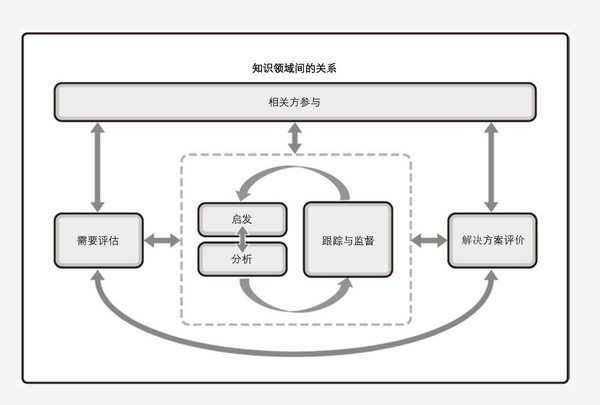

* **需要评估**. 分析**当前的商业问题或机会**, 了解什么是实现未来期望状态所必须的.
* **相关方参与**. 识别和分析那些和解决方案的结果有利益相关的人, 以确定如何与他们协作和沟通.
* **启发**. 规划和准备启发, 实施启发, 确认启发结果, 以**从来源处获取信息**.
* **分析**. 检查, 分解, 综合和澄清信息, 理解, 完成并改进它.
* **跟踪与监督**. **跟踪, 批准和评估产品信息的变更**, 以在整个商业分析工作中对其进行管理.
* **解决方案评价**. 确认将被执行, 或已经被实时的完整解决方案或部分解决方案, 以**确定解决方案如何满足商业需要并向组织交付价值**.

#### 商业分析

商业分析包括选择适当的商业分析过程, 工具, 技术, 输入和输出, 以用于特定的项目组合, 项目集或项目.

## 2. 商业分析实时环境

### 2.1 概述

* **事业环境因素(EEFs)**. 项目团队不能直接控制的, 并且将对项目组合, 项目集或项目产生影响, 限制或指导作用的各种条件. 限制或指导商业分析如何实施, 而不受商业分析专业人士的控制. 来自企业外部和内部.
* **组织过程资产(OPAs)**. 执行组织所特庸的并没其使用的计划, 过程, 正常, 程序和知识库. 来自企业内部.

事业环境因素(EEFs) 和 组织过程资产(OPAs) **都是所有商业分析过程的默认输入**.

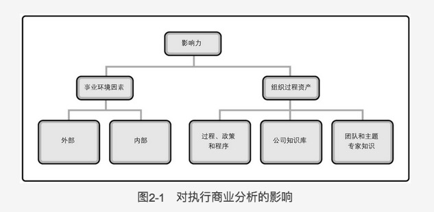

### 2.2 事业环境因素(EEFs)

* 组织外部 
	* 影响商业分析的执行方式
		* 市场条件
		* 社会和文化的影响与问题
		* 相关方期望和风险偏好
		* 法律和合同限制
		* 外部专业商业分析标准
	* 额外信息源以支持产品开发和改进
		* 商业数据库
			* 表单对照结果
			* 标准化的成本估算数据
			* 行业风险研究信息
			* 风险数据库
		* 学术研究
		* 政府或行业标准
		* 财务因素的考虑
		* 物理环境因素
* 组织内部
	* 组织文化, 结构和治理
	* 相关方期望和风险偏好
	* 设施和资源的地理分布
	* 市场研究与实验
	* 架构和基础设施
	* 信息技术软件
	* 对复用商业分析结果的兴趣和承诺等级
	* 人力资源管理政策和程序
	* 资源政策, 过程和可用性
	* 员工的能力
	* 保密策略, 过程和协议

### 2.3 组织过程资产(OPAs)
	
`OPAs`是执行组织所特有的并有其使用的**计划, 过程, 政策, 程序和知识库**.

`OPAs`示例包括**模板, 工具, 方法或内部和外部开发标准**.

组织过程资产属于组织内部的, 组织过程资产分为三类

* 商业分析过程, 政策和程序
* 企业知识库(经验教训)
* 团第和主题专家知识

#### 过程, 政策和程序

* 指南和标准
* 具体组织标准
* 项目生命周期
* 模板
* 产品需求和其他产品信息变更控制程序
* 需求管理工具程序
* 财务控制程序
* 适用于产品需求和其他产品信息的问题和缺陷管理程序
* 适用于商业分析过程的组织沟通需求
* 程序
* 风险管理模板
* 标准化指南
* 项目收尾指南或要求

#### 公司知识库

用于**存储**和**检索**产品需求, 其他产品信息和商业分析实践.

* 商业知识库: 版本化的项目和产品文件.
* 配置管理知识库: 软硬件组件的版本和所有执行的组织标准, 政策和程序的基准.
* 历史信息和经验教育知识库
* 问题和缺陷管理数据库
* 指标数据库

### 2.4 组织系统对商业分析实施方式的影响

组织系统通过如下因素影响商业分析的实施方式:

* 组织选用的项目生命周期
* 为商业分析实践提供的支持类型及其在组织中的位置
* 与其他职能领域的个人协作

## 3. 商业分析专业人士的角色

### 3.1 概述

### 3.2 商业分析专业人士的定义

### 3.3 商业分析专业人士的影响力

商业分析专业人士的目标是**确保相关方在整个商业分析过程中保持参与, 从而不断发现和协作来获得构建解决方案的信息, 并且使得解决方案的设计最终满足商业需要**.

从**需要评估**开始, 以**解决方案评价**结束, 所有活动都以产品为中心. 产品可以使有形的或无形的.

项目经理 和 商业分析专业人士

* 项目经理负责项目的成功交付.
* 商业分析专业人士负责产品的成功交付, 产品关注点需要对战略的理解, 以调整提出的解决方案, 并且实现组织和商业目标.

商业分析专业人士的关系

* 商业相关方和客户
* 设计团队
* 治理
* 政府
* 职能经理
* 项目组合和项目集经理
* 项目经理
* 项目发起人
* 产品团队
* 项目团队
* 产品质量控制(QC)
* 与其他商业分析专业人士的关系
* 主题专家(SMEs)

#### 3.4 商业分析专业人士的能力

* 分析技能
* 专家判断
* 沟通技能
* 个人技能
* 领导力技能
* 工具知识

## 需要评估

分析当前商业问题或机会, 分析当前状态和将来状态来确定优化的解决方案, 从而提供价值并满足需要. 组合分析结果为决策者提供相关信息, 以便他们决定对所提议的解决投资是否可行.

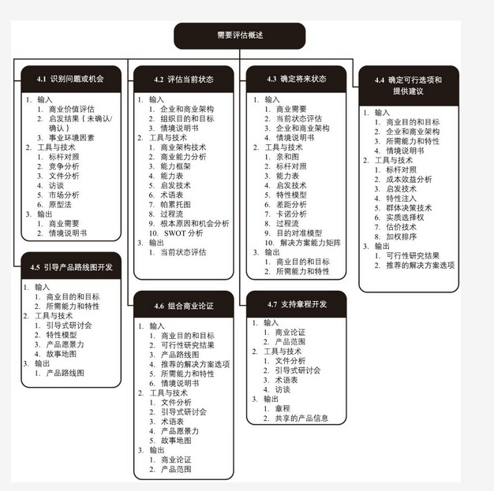

### 4.1 识别问题或机会

**识别待解决的问题或待寻求的机会的过程**.

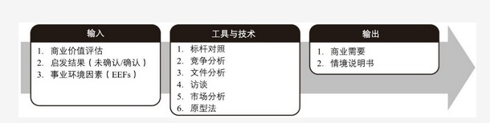

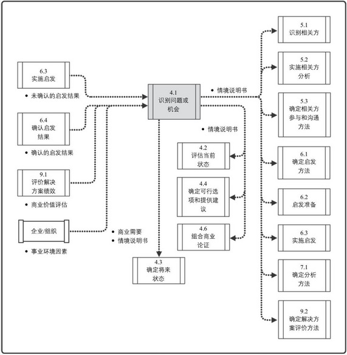

#### 4.1.1 输入

* 商业价值评估
	* 商业分析审查已实施或部分实施的解决方案, 来评估组织预期提供的商业价值是否被交付. 如果有差异就需要实施**需要评估**. 商业价值的评估是**负数**是问题, 商业价值的评估是**正数**是机会.
* 启发结果(未确认/确认)
	* 从启发活动获得商业分析信息. 识别**问题或机会**是启发的结果. **启发和分析**是迭代本质. 
* 事业环境因素

#### 4.1.2 工具与技术

* 标杆对照
	* 将组织的实践, 过程和策略结果与确立的标准(或其他一流组织)进行比较.
* 竞争分析
	* 获取和分析组织外部环境信息的技术. 可以用来识别客户需求中没有得到满足或完全被忽略的地方.
* 文件分析
	* 启发技术, 分析现有文件以识别与需求相关的信息.
* 访谈
	* 向个人或相关方群体提问并记录其反馈的方式, 来启发信息的正式或非正式的方法.
* 市场分析
	* 获取和分析组织所在市场领域的市场特征和条件, 然后将这些信息与组织的增长计划和预测相叠加.
* 原型法
	* 模型, 获取需的早期反馈方法.

#### 4.1.3 输出

* 商业需要
	* 基于现有的**问题或机会**的背景信息, 推动组织变化的动力.
* 情境说明书
	* 对**问题和机会**的**客观说明**,

### 4.2 评估当前状态

**检查所分析的当前环境以了解组织内部或外部的重要因素的过程, 这些重要因素可能是问题或机会的原因**.

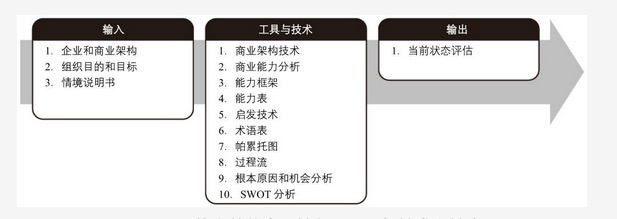

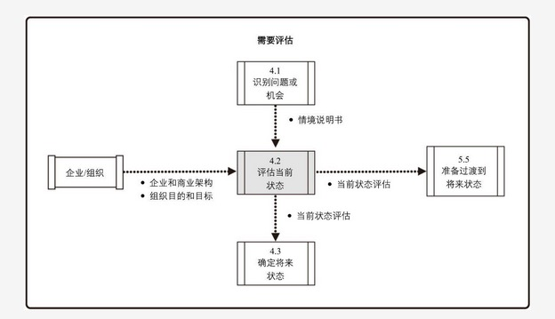

#### 4.2.1 输入

* 企业和商业架构
	* 运作企业所必须的商业及技术组件集合. 企业架构是以示意图和模型组合的, 用于了解变革对企业各个方面的战略和运营影响.商业架构是企业架构的子集, 包括组织的商业功能, 组织结构, 位置和过程等组件.
* 组织目的和目标
	* **目的**定义了企业为实现其战略而建立的**可衡量的目标**. **目的**是广义的, 长时间的. **目标**是为了成就目的, 更具体, 时间跨度短.
* 情境说明书

#### 4.2.2 工具与技术

* 商业架构技术
	* 对商业架构的组织框架**建模**
* 商业能力分析
	* 分析**绩效**
* 能力框架
	* 关于组织的关键技能, 知识, 行为, 能力, 系统及整体价值竞争力的描述. 也被称为**成熟度模型**.
* 能力表
	* 分析当前或将来状态的能力.情境, 根本原因和解决情境所需能力之间的**关系**.
* 启发技术
	* 文件分析
	* 访谈
	* 观察法, 查看个人在其自身环境中执行工作和执行过程的方法.
	* 问卷调查
* 术语表
	* 关于产品的术语和缩略语的定义清单.
* 帕累托图
	* 根本原因分析的结果.**80/20原则**, `80%`的问题与`20%`的原因相关.
* 过程流
	* 描述商业过程和相关方与这些过程交互的方式. 现有环境下如何执行工作的**可视化的背景**.
* 根本原因和机会分析
	* 因果图/鱼骨图/石川图
	* 关联图
	* 五问法
* `SWOT`分析
	* 评估组织**战略, 目的和目标**
	* 内部
		* 优势, 劣势
	* 外部
		* 机会, 威胁

#### 4.2.3 输出

* 评估当前状态
	* 对当前运营模式和组织初始状态的理解.

### 4.3 确定将来状态

**确定现有能力中存在的差距, 以及为了达到所期望的将来状态而需要提出一系列变更的过程, 以解决分析中存在的问题或抓住分析中出现的机会**.

识别出组织所需要的一组能力, 以便能够从当前状态转变到期望的将来状态并满足需要.

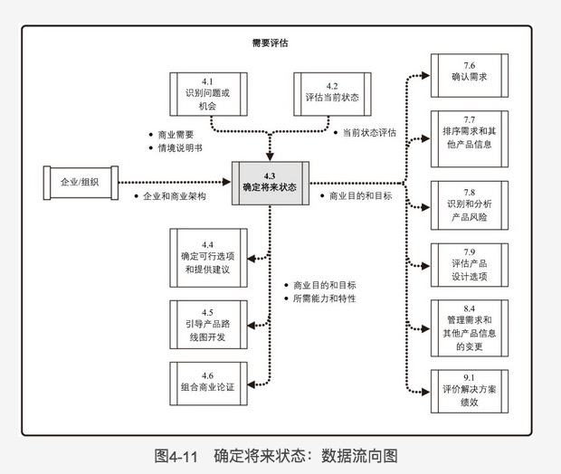

#### 4.3.1 输入

* 商业需要
* 当前状态评估
* 企业和商业架构
* 情境说明书

#### 4.3.2 工具与技术

* 亲和图
	* 头脑风暴是亲和图的配套技术. 将信息按类别分组(亲和能力).
* 标杆对照
* 能力表
* 启发技术
	* 头脑风暴
	* 引导式研讨会, 结构化会议.
* 特性模型, 可视化的方式(树状或层级结构)表示解决方案的所有特性.
* 差距分析, 检查当前状态和将来状态间的差异.
* 卡诺分析
* 过程流
* 目的对准模型, 将选项与它所支持的商业目的进行对齐, 从而对选项进行分类. 形成决策基础. 将商业战略与产品战略联系起来.
	* 区分者, 提供高度的市场差异化.
	* 同等者, 不提供竞争优势, 确保组织的业务与竞争对手保持同等水平.
	* 合作伙伴, 不是关键任务, 但是帮助组织在市场上脱颖而出. 组织将从外部寻求合作.
	* 谁在乎
* 解决方案能力矩阵

#### 4.3.3 输出

* 商业目的和目标
	* 与组织目的和目标是一致的, 处于**较低**水平.
* 所需能力和特性

### 4.4 确定可行选项和提供建议

**应用各种分析技术来检查可能的解决方案, 这些解决方案可以满足商业目的和目标, 并且确定哪些选项是组织所追求的最佳方案**.

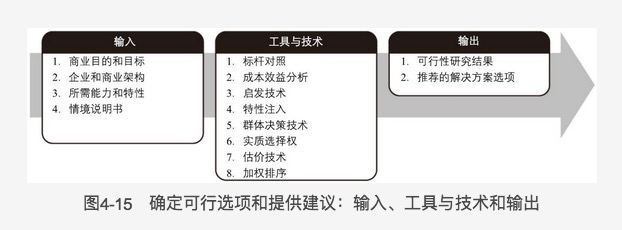

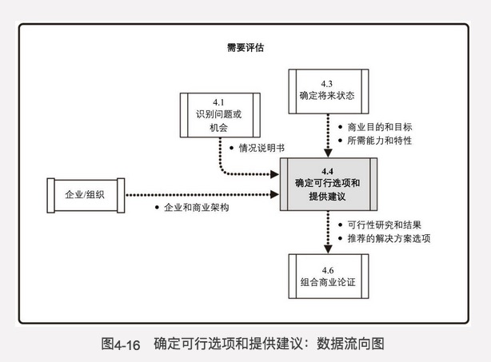

进行活动:

* 确定可行选项: 使用当前和将来状态分析的结果确定哪些解决方案是最佳选项.
* 进行可行性分析: 评估不同的因素, 确定所考虑的选项的可行性.
	* 制约因素,  限制性因素.
	* 假设
	* 产品风险, 正面或负面效应的不确定事件或条件.
	* 依赖性, 解决方案得以成功实施所依赖的任何关系.
	* 文化, 事业环境因素.
	* 运营可行性, 组织对变更的接受程度.
	* 技术可行性
	* 保障性, 非功能性需求类别, 用于评估组织随着时间的推移维护和管理每个选项的成本, 工作量和易用性.
	* 成本效益可行性, 对选项预期交付的成本和价值进行初始的粗略估算.
	* 时间可行性, 评估是否在可以指定的时间限制内交付解决方案的选项.
	* 价值, 商业价值.
	* 确认, 确保解决方案将满足客户和其他已确定的相关方的需要.
* 定义初步产品范围, 高层级范围
* 定义高层级过度需求
* 推荐最可行的选项

#### 4.4.1 输入

* 商业目的和目标
* 企业和商业架构
* 所需能和特性
* 情境说明书

#### 4.4.2 工具

* 标杆对照
* 成本效益分析
* 启发技术
* 特性注入, 引导团队只分析那些被认为是最高价值的特性. 可以使用目的对准模型, 也可以使用其他价值模型.
* 群体决策技术, 群体参与者对所讨论的话题做出最终决定.
* 实质选择权, 帮助团队"何时"做出决策. 减少短期内需要做出的决策数量, 尽可能延迟所有的决策.
* 估价技术
	* 内部收益率(`IRR`), 预计年收益率, 包含了初始成本和持续成本. **越高越好**
	* 净现值(`NPV`), 预期收益的未来价值. **越高越好**
	* 投资回收期(`PBP`), 收回投资所需的时间. **越小越好**
	* 投资回报率(`ROI`), 初始投资的回报率. **越高越好**
* 加权排序

#### 4.4.3 输出

* 可行性研究结果, 通过完成可行性分析而得到的总结性结果.
* 推荐的解决方案选项
	
### 4.5 引导产品线路图开发

**支持产品路线图开发的过程**.

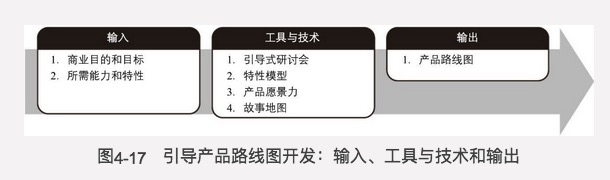

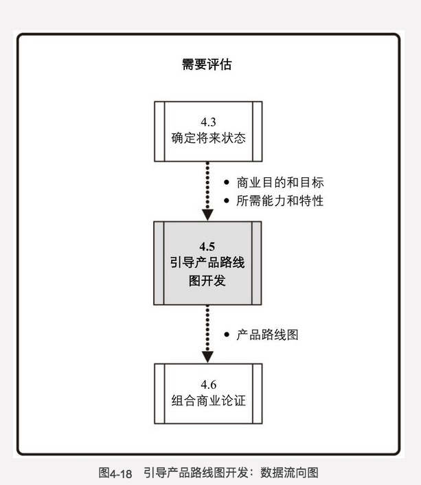

记录的关键要素

* 战略信息
* 项目组合
* 项目集
* 举措, 与不同项目的概述信息.
* 产品愿景
* 成功标准
* 市场力量
* 产品发布
* 特性, 产品发布相匹配的能力
* 时间线

#### 4.5.1 输入

* 商业目的和目标
* 所需能力和特性

#### 4.5.2 工具与技术

* 引导式研讨会, 结构化会议. 有经验且中立的引导式和一组相关方共同领导.
* 特性模型, 范围模型, 用树状或层级结构排列, 以可视化的方式表示解决方案的所有特性.
* 产品愿景力, 为产品或产品发布设定高层级方向的技术. 把团队对产品的设想进行可视化并获得一致意见.
* 故事地图, 

#### 4.5.3 输出

* 产品路线图, 产品特性的高层级视图, 以及构建和交付这些特性的顺序.

### 4.6 组合商业论证

**选择最佳的项目组合组件, 项目集或项目, 从而达成商业目的和目标的过程**.

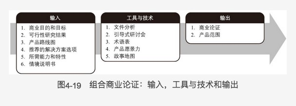

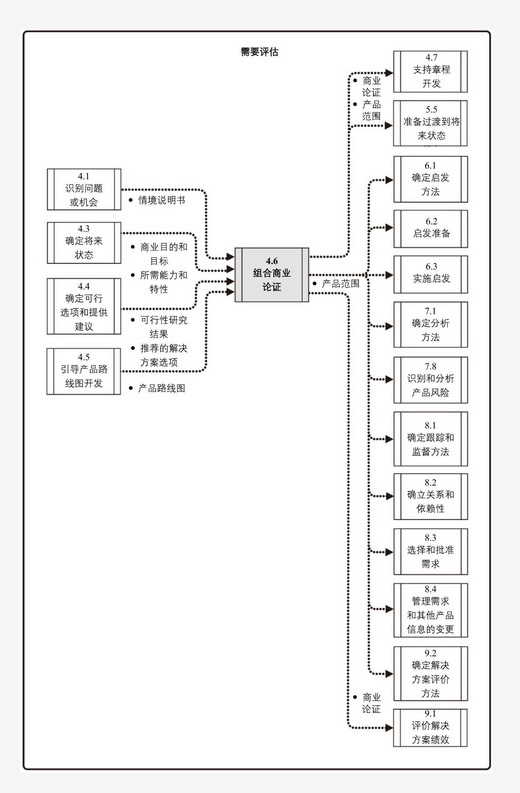

商业论证提供了文档化的经济可行性研究, 确立了项目交付的效益的有效性. 商业论证提供信息来确定组织是否应该解决问题或抓住机会.

商业论证中的通用组件至少包含以下内容:

* 问题/机会
* 情境分析,  描述一个潜在方案将如何支持商业目的和目标.
* 建议, 给出每个潜在选项的可行性分析结果.
* 评价, 衡量效益实现的计划. 此计划用于评估解决方案如何对商业目的和目标做出贡献的指标.

开发商业论证的驱动因素:

* 市场需求
* 组织需要
* 客户请求
* 战略机会
* 技术进步
* 法律和法规需求
* 生态影响
* 社会需要

#### 4.6.1 输入

* 商业目的和目标
* 可行性研究结果
* 产品路线图
* 推荐的解决方案选项
* 所需能力和特性
* 情境说明书

#### 4.6.2 工具与技术

* 文件分析
* 引导研讨会
* 术语表
* 产品愿景力
* 故事地图

#### 4.6.3 输出

* 商业论证, 文档化的经济可行性研究报告.
* 产品范围

### 4.7 支持章程开发

**与发起人实体和相关方资源协作开发章程的过程**.

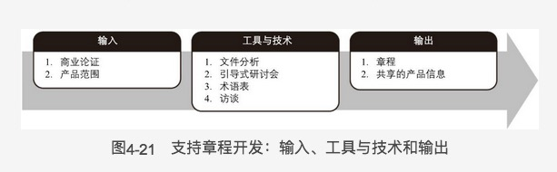

项目组合章程, 授权和指定了项目组合结构, 将项目组合与组织的战略目标联系起来.

项目集章程授权了项目集管理团队使用组织资源来执行项目集, 将项目集与组织的战略目标联系起来.

项目章程有发起人发布, 是正式授权项目的存在,  为项目经理提供将组织资源应用于项目获得的权限.

章程建立了范围边界, 为项目的启动创建了记录文件.

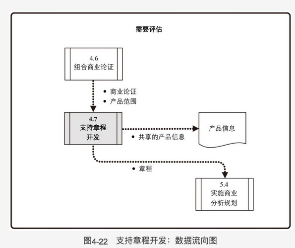

创建章程的过程建立了对解决方案, 风险, 资源需求, 高层级进度计划和成功标准的共同理解, 从而实现了商业的目的和目标.

章程信息包括:

* 描述和目标
* 商业目的/目标
* 高层级产品和项目组合, 项目集或项目的范围
* 风险
* 里程碑进度计划概要
* 预算概要信息
* 高层级风险和依赖性
* 成功标准
* 与项目(组, 集)的内部和外部信息, 受项目影响的人或组织(相关方).

章程提供对解决方案的高层级描述和特征, 以便以后可以制定详细的需求.

#### 4.7.1 输入

* 商业论证
* 产品范围, 章程可以包括关于超出范围特性的信息, 以便清楚地识别任何已经从范围内推迟或删除的特性.

#### 4.7.2 工具与技术

* 文件分析
* 引导式研讨会
* 术语表
* 访谈

#### 4.7.3 输出

* 章程
* 共享的产品信息

## 相关方参与

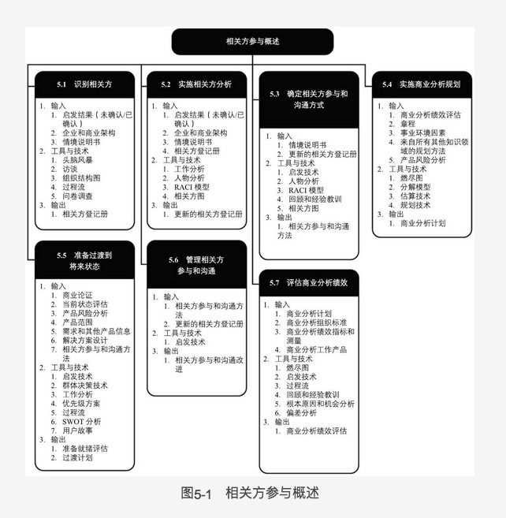

### 5.1 识别相关方

**识别可能影响, 受影响或被认为受影响的个人, 群体和组织的过程**

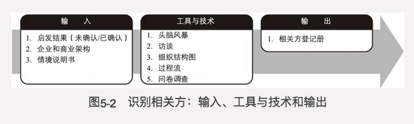

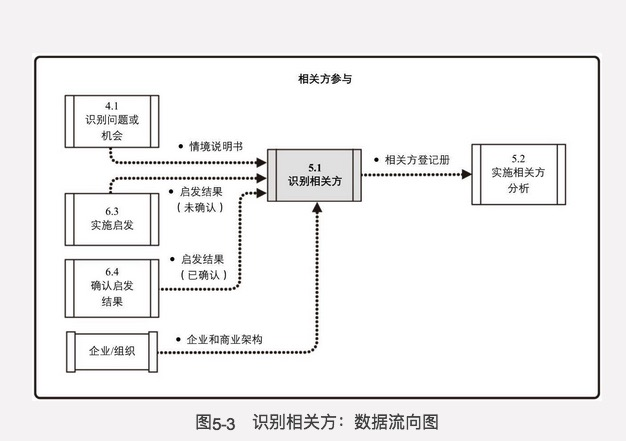

#### 5.1.1 输入

* 启发结果(未确认/已确认), 启发贯穿整个商业分析过程.
* 企业和商业架构
* 情境说明书

#### 5.1.2 工具与技术

* 头脑风暴
* 访谈
* 组织结构图, 组织内部报告结构的模型.
* 过程流, 记录人们在工作中或与产品交互时所执行的步骤或任务
* 问卷调查

#### 5.1.3 输出

* 相关方登记册

### 5.2 实时相关方分析

**调研和分析相关方的定量和定性信息的过程**

提供相关方的重要见解.

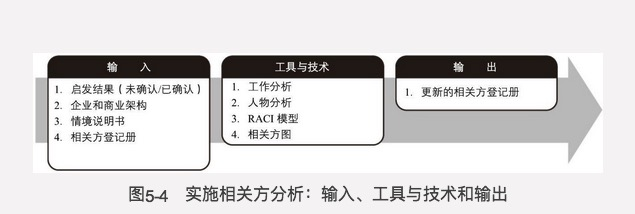

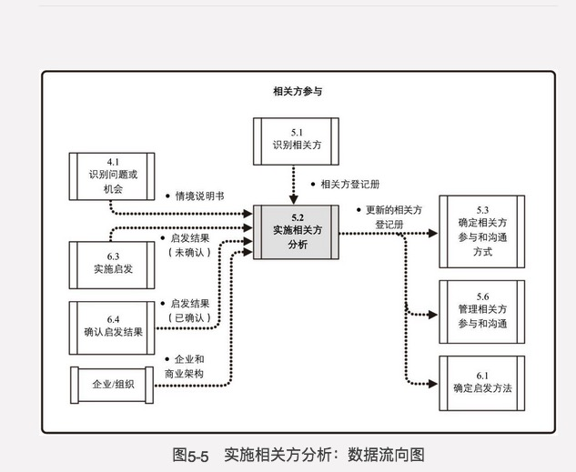

相关方特征:

* 态度
* 经验
* 利益
* 影响力水平

#### 5.2.1 输入

* 启发结果(未确认/已确认)
* 企业和商业架构
* 情境说明书
* 相关方登记册

#### 5.2.2 工具与技术

* 工作分析, 用于识别工作需求和在特定工作中有效执行的能力的技术, 作为撰写招聘职位的先决条件.
* 人物分析, 虚构的角色. 是一种用来分析一类用户或过程执行者的技术.
* `RACI`模型
	* `R` 负责
	* `A` 批准
	* `C` 咨询
	* `I` 告知
* 相关方图
	* 相关方矩阵, 用象限或矩阵来分析一组相关方的技术. 用于分析的变量为
		* 影响, 相关方对产品产生的影响.
		* 冲击, 解决方案实施后对相关方产生的印象概念股.
	* 洋葱图, 简洁的方式表示相关方之间的关系
		* 中心, 与解决方案有最密切或最紧密关系的人
		* 外圈, 与解决方案有不太重要关系的人

#### 5.2.3 输出

* 更新的相关方登记册	

### 5.3 确定相关方参与和沟通方法

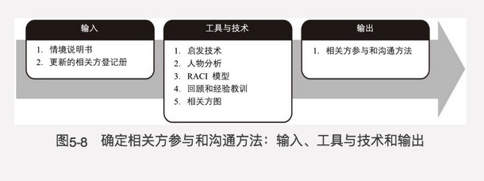

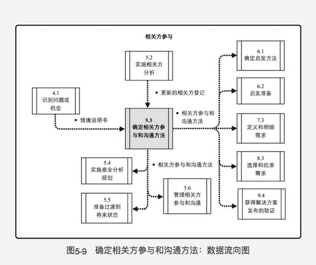

组成部分

* 每个相关方或相关方群体的参与程度
* 决策方法
* 获得批准的方法
* 如何组织, 存储和维护产品和项目的信息, 以支持向相关方和其他人员提供信息. 尽可能考虑相关方偏好.
* 如何让相关方获知最新的产品和项目工作情况.尽可能考虑相关方偏好.

#### 5.3.1 输入

* 情境说明书
* 更新的相关方登记册

#### 5.3.2 工具与技术

* 启发技术
	* 头脑风暴
	* 引导式研讨会
	* 访谈
* 人物分析
* `RACI`模型
* 回顾和经验教训
* 相关方图

#### 5.3.3. 输出

* 相关方参与和沟通方法

### 5.4 实施商业分析规划

**获取关于团队将要执行的商业分析活动, 以及所需任务的角色分配, 职责和技能组合的共同协议而执行的过程, 目的是完成商业分析工作**

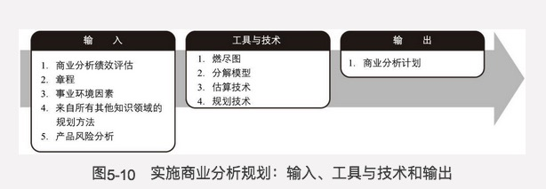

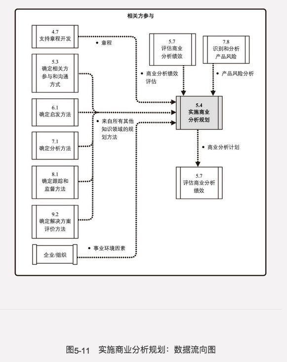

目标

* 将所有知识领域的方法整合到一系列有关如何实施商业分析的协议和决策中.
* 对商业分析活动的工作级别进行估算.
* 对方法组件估算中组合商业分析计划.

#### 5.4.1 输入

* 商业分绩效评估, 该文件汇总了在过去工作中使用的商业分析过程和技术的有效性. 用于调整商业分析的过程和技术.
* 章程, 确立边界, 创建启动记录. 提供范围, 背景和理由.
* 事业环境因素
	* 可能影响商业分析工作的形式
	* 可能影响支持商业分析的技术和工具的选择的因素
	* 可能影响或约束商业分析结果的因素
* 来自所有其他知识领域的规划方法
	* 相关方参与和沟通方法
	* 启发方法
	* 分析方法
	* 跟踪和监督方法
	* 解决方案评价方法
* 产品风险分析

#### 5.4.2 工具与技术

* 燃尽图
* 分解模型, 将高层级描述的信息分解为更小, 更细分的层级结构.
* 估算技术
	* 亲和估算, (T恤衫尺码, 小号, 中号, 大号和特大号)
	* 自下而上估算, 分解模型识别低层级任务. 汇总低层级任务的估算来估算项目持续时间或成本的方法.
	* 德尔菲法, 匿名估算获得共识及决策.
	* 估算扑克, 斐波那契数列. 估算最高和最低需要解释, 然后重新估算直到结果趋同.
	* 相对估算, 对相似的工作主体进行比较而不是基于成本或时间的绝对单位进行估算.
	* 宽带德尔菲技术, 比德尔菲多了沟通和人际协作. 成员通过协作来讨论估算, 然后以匿名的方式重新估算.
* 规划技术
	* 产品未完项
	* 滚动式规划, 对近期要完成的工作详细规划, 对远期工作只做粗略规划.
	* 故事地图
	* 工作分解结构(WBS)

#### 5.4.3 输出

* 商业分析计划, 定义商业分析方法, 涵盖了整个商业分析方法, 从相关方参与到如何管理需求的决策. 比需求管理计划更广泛, 需求管理计划关注如何启发, 分析, 记录和管理需求.

### 5.5 准备过渡到将来状态

**确定组织是否准备好进行过度, 以及组织将如何从当前状态转移到将来状态, 以便将解决方案或部分解决方案整合到组织运营中的过程**

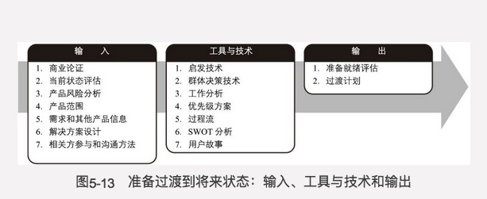

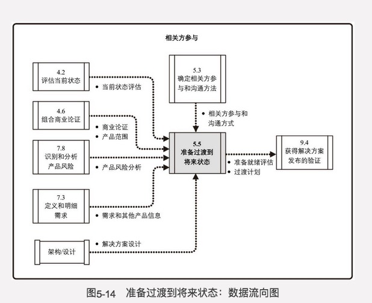

评估组织可以成功地从产品开发过渡到运营的准备情况.

常用策略

* 大规模一次性地切换到将来状态
* 按目标片段分阶段发布将来状态
* 当前和将来状态的"时间盒"式共存, 随后在将来的特定日期进行最终切换
* 当前和将来状态的永久式共存

#### 5.5.1 输入

* 商业论证
* 当前状态评估
	* 解决方案设计领域
		* 提供比当前状态更少的功能
		* 用新的或改进的能力替换当前状态功能
		* 提供了先前在当前状态中不存在的能力
* 产品风险分析
* 产品范围
* 需求和其他产品信息, 过度需求是其中一部分, 描述了临时能力
* 解决方案设计, 确定了将来状态
* 相关方参与和沟通方法

#### 5.5.2 工具与技术

* 启发技术
	* 头脑风暴
	* 引导式研讨会
	* 访谈
	* 群体决策技术
	* 工作分析
* 优先级方案, 应用于分段过度, 分段过度的典型原因包括
	* 需要处理大量的过度需求和准备就绪问题
	* 存在复杂的过度需求或问题
	* 需要在多个地点进行过度
* 过程流
* SWOT分析
* 用户故事

#### 5.5.3

* 准备就绪评估, 评估用于识别准备就绪的任何缺口, 以及应对缺口的风险对策.
* 过渡计划, 包括可操作和可测试的过渡需求.

### 5.6 管理相关方参与和沟通

**促进相关方适当参与的过程, 持续促进了相关方参与商业分析过程和定义解决方案, 并且与相关方保持了持续沟通**

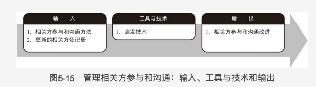

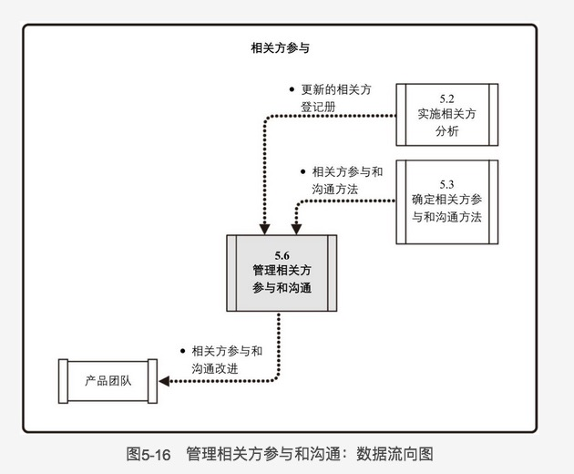

 监督相关方在商业分析活动中的参与, 以确保相关方全程参与并评估他们的参与是否足以让他们清楚地理解需求和其他产品信息.
 
#### 5.6.1 输入

* 相关方参与和沟通方法
* 更新的相关方登记册, 相关方特征是评估相关方最理想的关键因素.
 
#### 5.6.2 工具与技术

* 启发技术

#### 5.6.3 输出

*  相关方参与和沟通改进

### 5.7 评估商业分析绩效

**考虑组织应用的商业分析实践有效性的过程**, 提供了调整商业分析实践的机会.

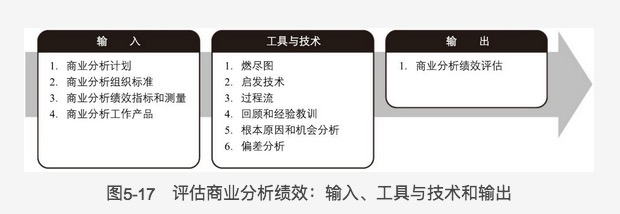

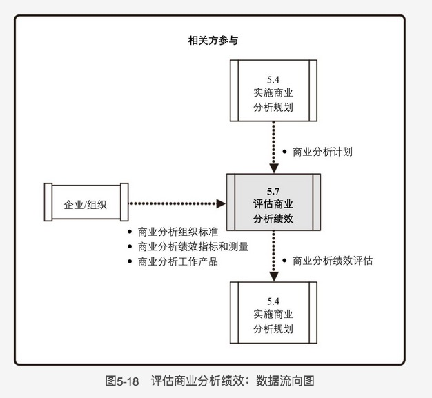

考虑哪些商业分析工具和技术工作良好

* 所使用的技术如何满足参与者和其他相关方的需要?
* 启发和分析是否实施得有效?
* 是否有足够的时间实施商业分析?
* 相关方是否充分参与?
* 是否有相关方被遗漏?
* 是否有需求被遗漏或没有被充分理解?
* 是否存在于商业分析工作的质量或完整性直接相关的产品缺陷?

#### 5.7.1 输入

* 商业分析计划
* 商业分析组织标准
* 商业分析绩效指标和测量, 可测量指标
	* 需求缺陷占所有缺陷的百分比
	* 遗漏的需求的百分比
	* 措施的商业目标数量
	* 不稳定, 易变更的需求的百分比
	* 需求得到客户验收的平均耗时
	* 进行经验总结或回顾的团队的百分比
	* 团队使用标准商业分析模板的百分比
	* 完成商业分析可交付成功的百分比
	* 商业分析可交付成果的交付日期的延误
	* 按"状态"来统计需求的数量
	* 相关方的评论数量
	* 关键绩效指标(KPI)和服务水平协议
* 商业分析工作产品

#### 5.7.2 工具与技术

* 燃尽图, 对于适应型团队速度减缓意味着用户故事没有被正确的切片或定义.
* 启发技术
	* 头脑风暴
	* 引导式研讨会
	* 访谈
	* 调查问卷
* 过程流
* 回顾和经验教训
	* 回顾, 协作游戏
		* 频繁
	* 经验教训, 对完成项目活动的反馈进行讨论,分级和记录的会议.
		* 一个阶段结束时进行
		* 记录结果正式, 存储在知识库中以供参考和后续行动.
* 根本原因和机会分析
* 偏差分析, 一种确定实际绩效与基准的差异程度及原因的技术.

#### 5.7.3 输出

*  商业分析绩效评估, 有效性的知识.

#### 5.7.5 协作点

* 适应型, 团队成员分担检查和调整所有实践的责任.
* 预测型, 质量控制分析师.

## 6. 启发

从各种来源抽取需要, 需求, 以及其他产品信息.

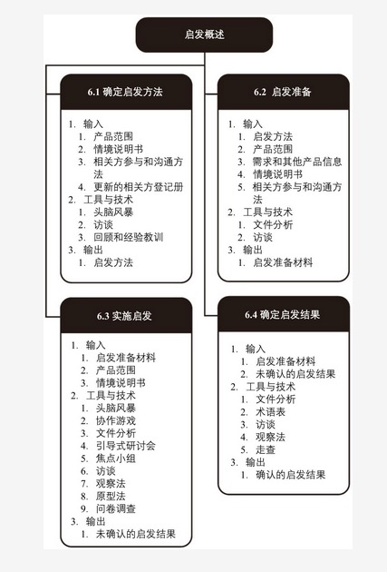

启发和分析的迭代本质

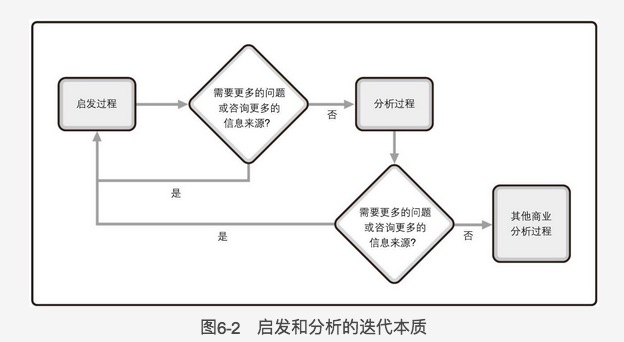

### 6.1 确定启发方法

**如何实施启发活动, 涉及哪些相关方,  使用哪些启发技术, 启发活动的最佳实施顺序**

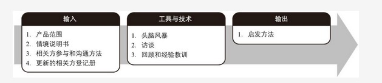

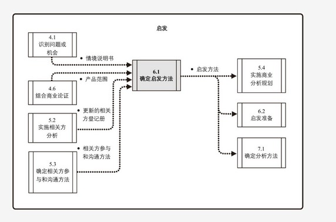

启发活动要素

* 要启发什么信息
* 在哪里找到这些信息
* 如何获取信息
* 合适实施启发活动

#### 6.1.1 输入

* 产品范围
* 情境说明书
* 相关方参与和沟通方法
* 相关方登记册

#### 6.1.2 工具与技术

* 头脑风暴
* 访谈
* 回顾和经验教训

#### 6.1.3 输出

* 启发方法
	* 如何实施启发
	* 启发什么信息
	* 在哪里找到信息
	* 如何获得信息
	* 如何实施启发活动

### 6.2 启发准备

**组织和调度资源并为单个启发活动准备必要材料的过程**

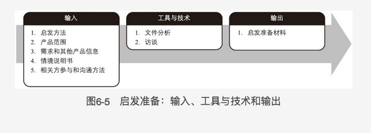

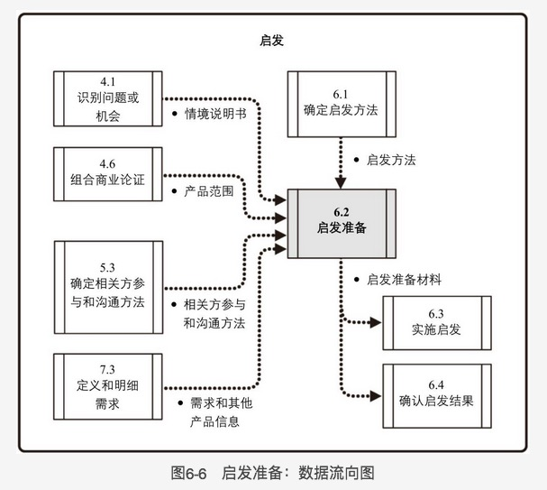

实施以下活动为启发活动做准备

* 确定目标
* 确定参与者
* 识别资源
* 识别启发活动的问题
* 设置议程
* 安排启发活动, 时间和材料

#### 6.2.1 输入

* 启发方法
* 产品范围
* 需求和其他产品信息
* 情境说明书
* 相关方参与和沟通方法

#### 6.2.2 工具与技术

* 文件分析
* 访谈, 正式或非正式的方法

#### 6.2.3 输出

* 启发准备材料
	* 启发活动目标
	* 议程
	* 背景信息
	* 需要讨论的问题
	* 支持启发技术的基本规则和/或质量
	* 用来帮助构建启发活动的演示材料和/或产品信息(包括模型)

### 6.3 实施启发

**应用各种启发技术从相关方和其他来源抽取信息的过程**

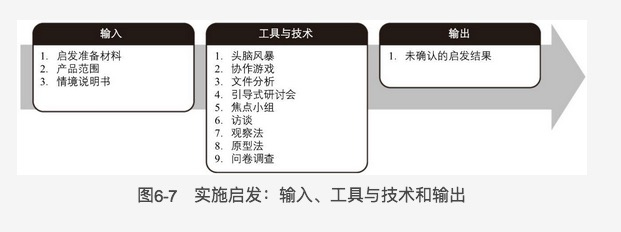

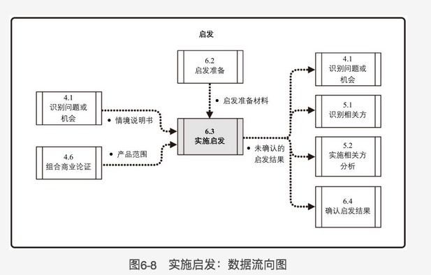

启发活动分为三个阶段

* 开场
* 主体
* 收尾

#### 6.3.1 输入

* 启发准备材料
* 产品范围
* 情境说明书

#### 6.3.2 工具与技术

* 头脑风暴
* 协作游戏
	* 产品盒, 提供了对客户最有价值的效益和特性的洞察. 参与者分成几个团队设计产品包装盒.
	* 快艇, 启发有关客户/相关法发现有问题的产品特性的信息. 锚为消极影响, 船帆是积极影响. 团队讨论移走锚(消极问题)可以让那个艇的行驶速度快多少.
	* 蜘蛛网, 产品与其他产品之间的未知关系.
* 文件分析
* 引导式研讨会
* 焦点小组, 相关方和主题专家聚到一起, 以了解他们对所提议的解决方案的期望和态度.
* 访谈
* 观察法
	* 主动观察
	* 被动观察
	* 参与式观察
	* 仿真
* 原型法
	* 故事板, 通过一系列图像或插图显示序列或导航的原型技术.
	* 线框图, 表示用户界面的静态蓝图或示意图的图形, 用于识别基本功能.
	* 演进式原型, 过程中的实际完成的解决方案的原型.
* 问卷调查

#### 6.3.3 输出

* 未确认的启发结果

### 6.4 确认启发结果

**对启发结果执行跟进活动, 确定使用了适当的正式程度, 与相关方一起评审准确性与完整性, 以及历史信息进行比较的过程**.

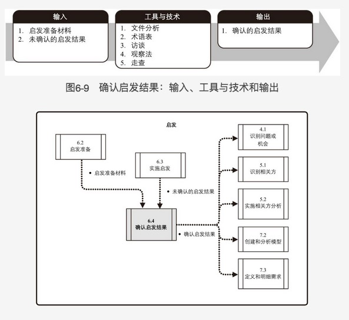

确认了在启发过程中理解了相关方和启发结果.

启发结果可能需要:

* 被细化和/或被更正, 以及被消除多余信息
* 被组织, 分类和整合
* 与先前启发的信息进行比较, 并且在未来的启发中被跟踪差异
* 根据相关方的需要转化为适当的正式程度
* 被打包以便用于分发

#### 6.4.1 输入

* 启发准备材料
* 未确认的启发结果

#### 6.4.2 工具与技术

* 文件分析, 用来比较启发结果和历史信息.
* 术语表
* 访谈
* 观察法
* 走查, 同行评审

#### 6.4.3 输出

* 确认启发结果, 从完成的启发活动中获得的商业分析信息. 表名产品团队已经达成共识, 并且就启发信息的准确性达成一致. 可以在启发后获得, 也可以在实施启发时同步获得.

## 7. 分析

对产品信息进行足够详细的检查和记录的过程, 以确保能反映相关方的需要, 与相关方的目的和商业目标保持一致, 并且能够识别可行的解决方案设计. 

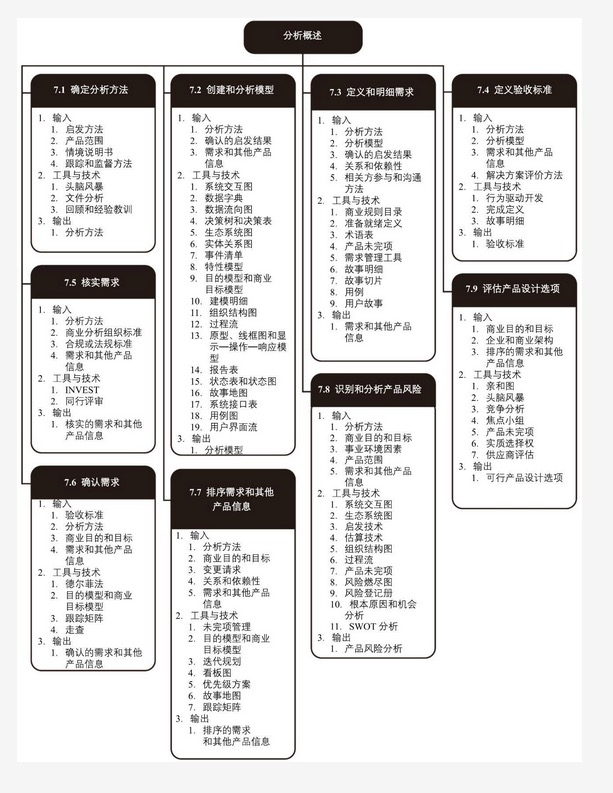

**分析的核心概念**, 分析是对信息进行检查, 分解, 合成和澄清以进一步理解, 完善和改进信息的过程. 分析过程通常以迭代方式进行, 并且与启发过程同时进行.

### 7.1 确定分析方法

**提前考虑如何实施分析的过程, 需求和其他产品信息将如何被核实, 确认和排序**

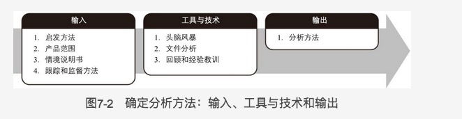

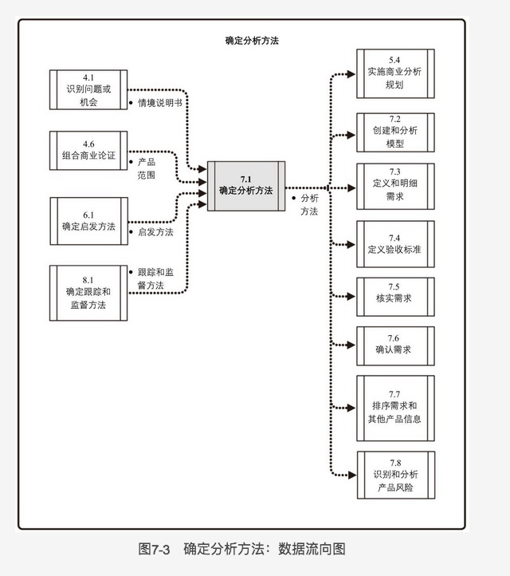

确定分析方法应对包括

* 何时和如何创建分析模型
* 何时对需求进行定义和明细
* 定义验收标准的方法
* 核实的方法
* 如何确认需求
* 早期排序方法
* 识别和管理风险的方法
* 早期评估产品设计的方法

#### 7.1.1 输入

* 启发方法
* 产品范围
* 情境说明书
* 跟踪和监督方法, 在项目中执行跟踪和变更管理过程

#### 7.1.2 工具与技术

* 头脑风暴
* 文件分析
* 回顾和经验教育

#### 7.1.3 输出

* 分析方法, 描述如何展开分析.

### 7.2 创建和分析模型

**创建任何产品信息的结构化表示的过程, 识别信息中的差距或发现无关信息促进更深入的分析**

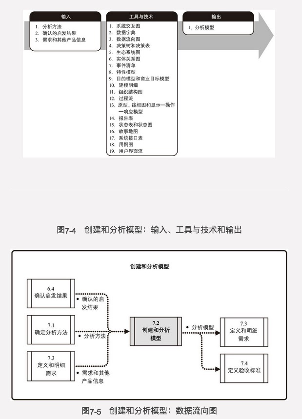

以下活动的实施可能需要更新现有模型或创建新模型

* 定义和明细需求
* 建立信息共识
* 绘制项目组合, 项目集和项目内部和之间的关系和依赖性地图
* 寻找需要进行额外启发的信息差距
* 识别以前未涵盖的相关方
* 在启发或评审过程中促进相关方对信息的理解
* 评估产品的当前状态和将来状态之间的能力差距
* 分析变更以识别产品受影响的领域
* 理解什么对用户是有价值的
* 在项目组合中排序产品信息或项目
* 估算商业分析工作
* 为架构设计提供商业前景

模型分类

* 范围模型, 界定解决方案范围
	* 系统交互图
	* 生态系统图
	* 事件清单
	* 特性模型
	* 目的模型和商业目标模型
	* 组织结构图
	* 用例图 
* 过程模型, 如何使用解决方案
	* 过程流
	* 用例
	* 用户故事
* 规则模型, 解决方案需要遵守的规则
	* 商业规则目录
	* 决策表
	* 决策树
* 数据模型, 在过程或系统中使用的数据及数据的生命周期
	* 数据字典
	* 数据流向图
	* 实体关系图
	* 状态图
	* 状态表
* 接口模型, 解决方案如何与其他系统和用户交互
	* 显示-操作-响应模型
	* 原型图
	* 报告表
	* 系统接口表
	* 用户界面流
	* 线框图

#### 7.2.1 输入

* 分析方法
* 确认启发结果
* 需求和其他产品信息

#### 7.2.2 工具与技术

* **系统交互图**, 范围模型. 描述了系统与系统之间的交互关系.
* **数据字典**, 罗列数据对象的数据域及其属性的一种数据模型.
* **数据流向图**, 数据在外部实体, 数据存储和过程之间流动的一种数据模型.
* **决策树和决策表**, 常用于商业规则建模.
* **生态系统图**, 范围模型, 显示了所有相关的系统, 系统之间的关系, 以及流经他们的可选的任何数据对象. 这些系统是逻辑系统(商业角度)
* **实体关系图**, 商业数据图. 一种显示产品中的商业数据对象(商业角度), 以及对象之间的基数关系(一个实体和其他实体发生关系的次数)的数据模型.
* **事件清单**, 系统对任何事件触发器的响应.
* **特性模型**, 类似亲和图. 树状或层级结构排列. 有助于说明特性是如何组合在一起的, 以及哪个特性是其他特性的子特性.
* **目的模型和商业目标明细**, 显示了解决方案的相关方目的, 并且指出了任何支持或冲突的目的关系, 商业目标模型关联商业问题, 商业目标 最终和产品概念的特性进行关联.
* **建模明细**, 使用模型组合来进一步识别产品信息中的差距, 不一致或冗余的技术.
	* 跟踪矩阵
		* 将需求反向跟踪到特性和商业目标上
		* 正向跟踪到代码或其他开发工件或测试用例上
	* 交互矩阵, 轻量级跟踪矩阵, 实体与需求的关系
	* `CRUD`矩阵, 可用于数据或对象的操作
* **组织结构**, 展示组织内部或部分组织内部报告结构的范围模型.
* **过程流**, 泳道图, 过程地图, 过程图或过程流图. 描述人们在工作中或解决方案交互式所执行的步骤或任务.
	* **价值流图**, 额外显示了过程中发生的任何延迟, 排队或切换. 用于识别过程中花费的非增值时间以简化过程.
	* **序列图**, 用于描述用户或系统过程如何在任何设计的用户或系统中相互作用,  以及对执行的过程或步骤进行顺序.
* **原型, 线框图和显示-操作-响应模型**, 接口模型.
* **报告表**
* **状态表和状态图**, 单个对象在一个解决方案中所具有的所有状态, 以及该对象在状态之间如何过渡.
* **故事地图**
	* `MVP`, 最小可行产品. 第一个版本的解决方案, 要实现其目的的应具有的最小能力集.
	* `MMF`, 最小可售特性. 相关方接收或实现解决方案所需功能的端到端完整集合.
* **系统接口表**
* **用例图**, 范围模型, 显示了解决方案范围内的所有用例. 把用户和相关用例关联.
* **用户界面流**, 接口模型. 描绘了用户如何在界面间导航.

#### 7.2.3 输出

* 分析模型,  产品信息的可视化表示. 反映了所有已创建模型的总和, 即使他们可能并不是同时创建的.

### 7.3 定义和明细需求

**不同受众所需的合适的详细程度, 格式和正式程度来细化和记录需求及其他类型的产品信息的过程**

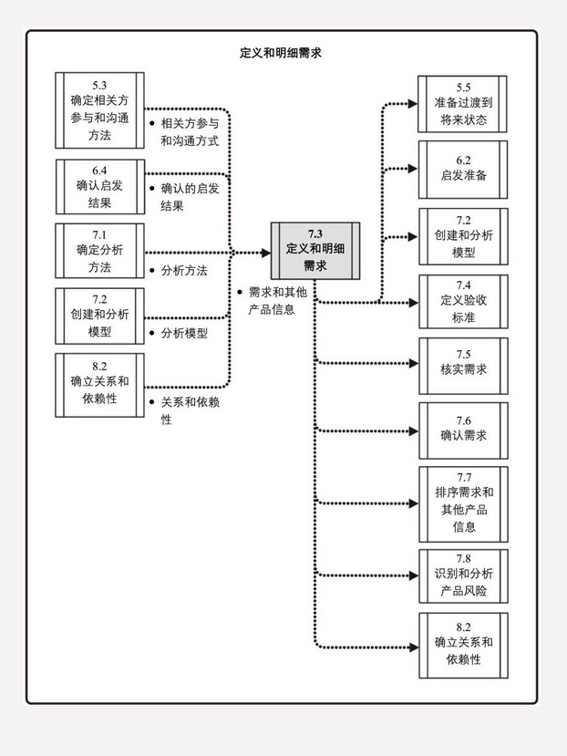

关键效益

* 帮助澄清关于产品信息的细节
* 以所有相关方可访问和处理的方式来存储产品信息

产品信息通常包含以下内容

* 假设
* 约束
* 依赖性
* 问题
* 产品风险

#### 7.3.1 输入

* 分析方法
* 分析模型
* 确认的启发结果
* 关系和依赖性
* 相关方参与和沟通方法, 描述了构建和存储需求的计划, 被用于确定可交付成果或需求包的正式程度, 详细程度及形式

#### 7.3.2 工具与技术

* 商业规则目录
* 准备就绪定义, 用户故事已被充分明细并准备进行迭代, 设计, 构建和交付
* 术语表
* 产品未完项, `DEEP`
	* 详略适宜的
	* 可估算的
	* 涌现的, 产品未完项不断变化, 随着新的输入产品未完项条目可能被添加, 调整, 移除或重新排序
	* 排序的
* 需求管理工具, 资源库存储和捕获产品信息
* 故事明细
* 故事切片, 高级别故事划分为低级别故事
* 用例, 描述系统-用户的交互以成功完成目的的过程模型. 有时被用来代替过程流.
* 用户故事

#### 7.3.3 输出

*  需求和其他产品信息
	* 需求
	* 其他产品信息
		* 假设
		* 依赖
		* 约束
		* 问题
		* 风险

### 7.4 定义验收标准

**证明解决方案的一个或多个方便已被成功开发达成一致的过程**

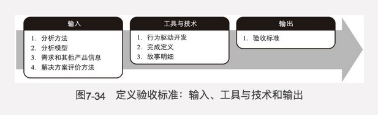

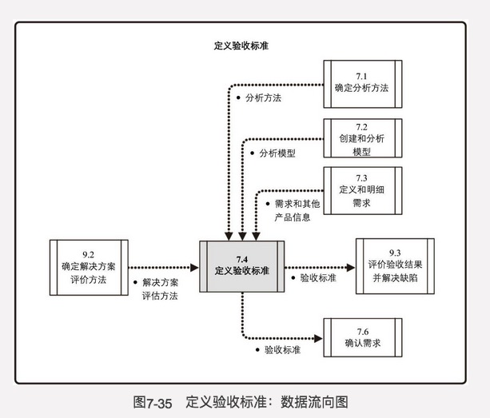

#### 7.4.1 输入

* 分析方法
* 分析模型
* 需求和其他产品信息
* 解决方案评价方法, 定义将什么类型的指标来测量解决方案绩效

#### 7.4.2 工具与技术

* 行为驱动开发
* 完成定义, `DOD`
	* 满足验收标准
	* 符合开发, 测试和缺陷标准
	* 满足高层级的非功能性和可用性需求
* 故事明细, 补充用户故事信息

#### 7.4.3 输出

* 验收标准, 一系列条件, 产品要通过商业相关方和客户的验收则必须满足这些条件.

#### 7.4.4 协作点

质量控制团队的成员协助.

### 7.5 核实需求

**检查需求是否质量过关的过程**

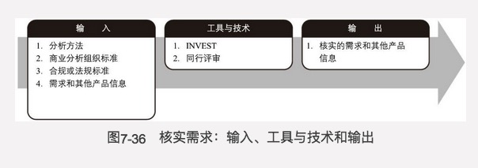

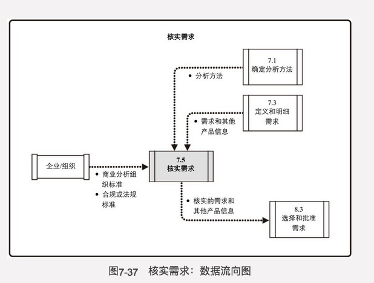

**确认**是确保产品能够满足客户其他已识别相关方的需要.

#### 7.5.1 输入

* 分析方法
* 商业分析组织标准
* 合规或法规标准
* 需求和其他产品信息

#### 7.5.2 工具与技术

* `INVEST`
	* 独立的
	* 可协商的
	* 有价值的
	* 可估算的
	* 短小的
	* 可测试的
* 同行评审
	* 同行桌面检查
	* 走查, 口头提供反馈
	* 检查, 正式而严格的形式.

#### 7.5.3 输出

* 合适的需求和其他产品信息, 已评价的产品信息, 以确保其不受错误影响, 并且符合信息所依据的质量标准.

### 7.6 确认需求

**检查需求是否满足商业目的和目标的过程**

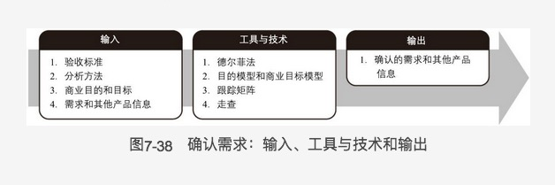

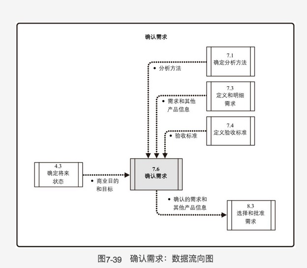

每项需求匹配一项或多项商业需求的过程, 确认是正确的解决方案.

#### 7.6.1 输入

* 验收标准
* 分析方法
* 商业目的和目标
* 需求和其他产品信息
* 跟踪矩阵
* 走查

#### 7.6.2 输出

* 确认的需求和其他产品信息, 相关方同意的信息, 满足了商业目的和目标.

#### 7.6.2 工具与技术

* 德尔菲法, 专家, 匿名输入
* 目的模型和商业目标模型

### 7.7 排序需求和其他产品信息

**排序**

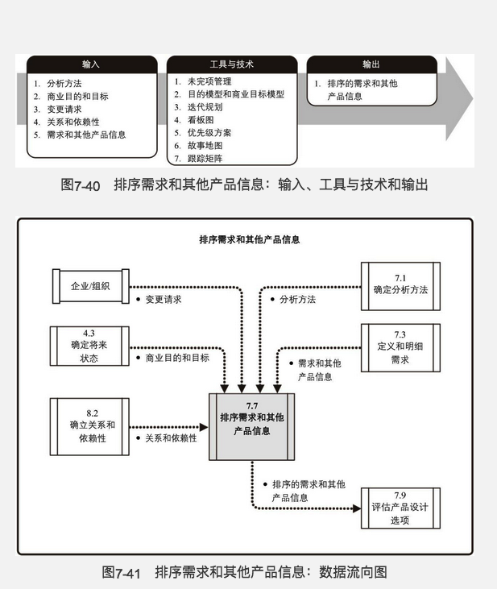

#### 7.7.1 输入

* 分析方法
* 商业目的和目标
* 变更请求
* 关系和依赖性, 定义了需求之间的链接
* 需求和其他产品信息

#### 7.7.2 工具与技术

* 未完项管理, 主要用于适应型项目.
* 目的模型和商业目标模型
* 迭代规划
* 看板图
* 优先级方案
	* 购买特性, 模拟货币来购买选择的特性. 特性以总金额排序.
	* 德尔菲法, 专家匿名
	* 最小可行产品(`MVP`)
	* `MoSCoW`
	* 多票制, 为需求投票. 需求按照票数排序.
	* 目的对准模型
	* 时间盒法
	* 加权排序
	* 加权最短优先作业(`WSJF`)， 更多的维度来排序用户故事(商业价值, 时间临界, 风险减少, 机会启用及成果）
* 故事地图
* 跟踪矩阵

#### 7.7.3 输出

* 排序的需求和其他产品信息

### 7.8 识别和分析产品风险

**积极或消极的影响**

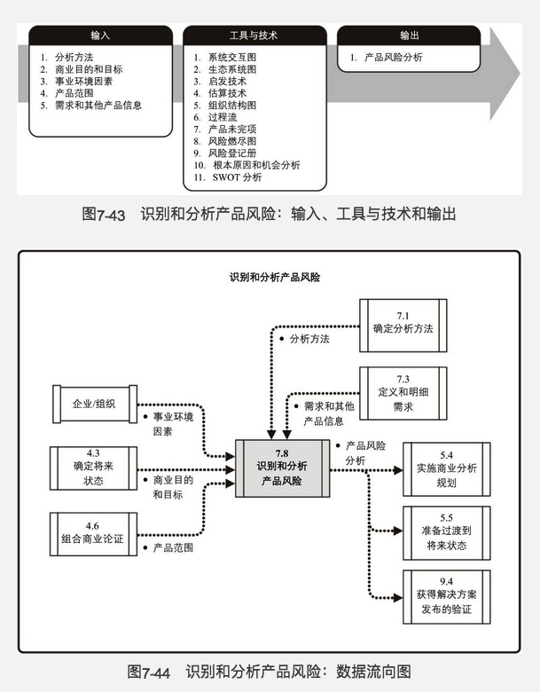

**活动**

* 识别产品风险
* 执行定性风险分析
* 执行定量风险分析 
* 规划风险应对
	* 消极风险或威胁
		* 规避
		* 转移
		* 减轻
		* 接受, 不主动采取措施
	* 积极风险
		* 开拓
		* 提高
		* 分享
		* 接受, 不主动采取措施
* 实施风险应对
* 监督风险

**识别和分析风险, 需要考虑以下可能产生风险**

* 假设, 假设不成立
* 约束条件, 约束解决方案
* 依赖性, 依赖不成立
* 问题, 风险转换为问题, 问题转换为风险

#### 7.8.1 输入

* 分析方法
* 商业目的和目标
* 事业环境因素
* 产品范围
* 需求和其他产品信息

#### 7.8.2 工具与技术

* 系统交互图
* 生态系统图
* 启发技术
* 估算技术
* 组织结构图
* 过程流
* 产品未完项
* 风险燃尽图
* 风险登记册
	* 风险编号
	* 风险描述
	* 记录日期
	* 风险责任人
	* 状态
	* 更新
	* 影响评级
	* 概率评级
	* 风险敞口, 影响乘以概率的积
	* 触发器
	* 风险应对
	* 风险应对责任人
	* 权变计划, 风险发生采取的行动
* 根本原因和机会分析
* `SWOT`

#### 7.8.3 输出

* 产品风险分析
	* 已识别的产品风险
	* 可能的应对措施清单
	* 相对评级和风险优先级列表
	* 征兆和警告标志
	* 近期需要应对的风险
	* 需要额外分析和应对的风险
	* 定性分析结果的趋势
	* 总风险敞口
	* 关注低优先级风险列表

### 7.9 评估产品设计选项

**分析和比较解决方案设计选项, 以及应用该评估结果对所提的设计选项提供建议的过程**

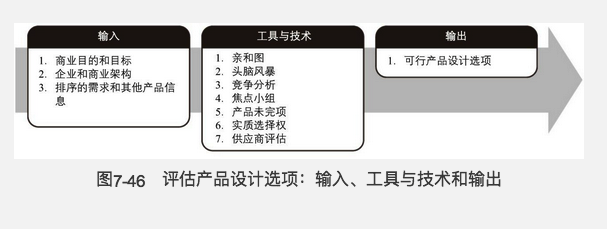

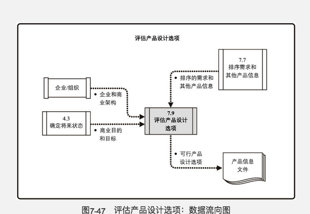

#### 7.9.1 输入

* 商业目的和目标
* 企业和商业架构
* 排序的需求和其他产品信息

#### 7.9.2 工具与技术

* 亲和图
* 头脑风暴
* 竞争分析
* 焦点小组
* 产品未完项
* 实质选择权, 推迟决策
* 供应商评估

#### 7.9.3 输出

* 可行产品设计选项, 设计选项展现了如何构建解决方案, 体现了每个选项的优缺点. 可行产品设计项由相关方进行评审以确保其能实现商业目的和目标, 并且是可行的. 

## 8. 跟踪和监督

用于在需求和其他产品信息之间确立关系和依赖性的过程, 有助于确保需求得到批准和管理, 并且需求变更的影响也得到评估.

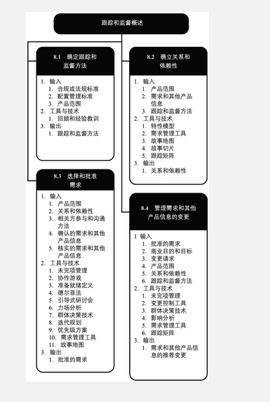

**核心概念**

通过在对象之间建立链接来在整个产品生命周期中跟新信息的能力.

### 8.1 确定跟踪和监督方法

**如何跟踪, 以及定义如何管理需求变更的过程**

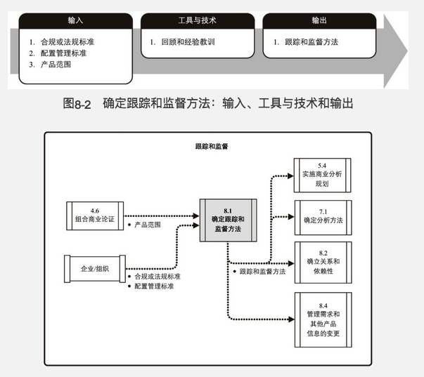

跟踪和监督能够保证:

* 跟踪过程将最终产品中确实需求的可能性降到最小
* 跟踪过程的维护不浪费或耗时
* 变更管理过程确保了变更符合商业目标或项目目标
* 变更管理过程使实时必要的变更变得简单
* 跟踪和变更管理过程符合组织标准, 满足法规要求, 还能应对未来需要, 包括提供有关超出当前项目的长期且有价值的产品信息.

跟踪的组件

* 要跟中的对象
* 跟踪所需要细节水平
* 建立和维护的关系
* 如何汇总关系
* 推动需求声明周期的需求状态(批准, 顺延或拒绝)

变更管理的组件

* 如何提出需求变更
* 如何评审变更
* 如何记录变更管理的决策
* 如何沟通需求变更
* 批准变更后, 如何完成和获得其他产品信息的变更
* 需求变更过程中的角色和责任

#### 8.1.1 输入

* 合规或法规标准
* 配置管理标准, 乙烯类正式记录的过程, 模板和文件
* 产品范围

#### 8.1.2 工具与技术

* 回顾和经验教育

#### 81.3 输出

* 跟踪和监督方法

### 8.2 确立关系和依赖性

**跟踪或设定需求和其他产品信息之间的联系的过程**

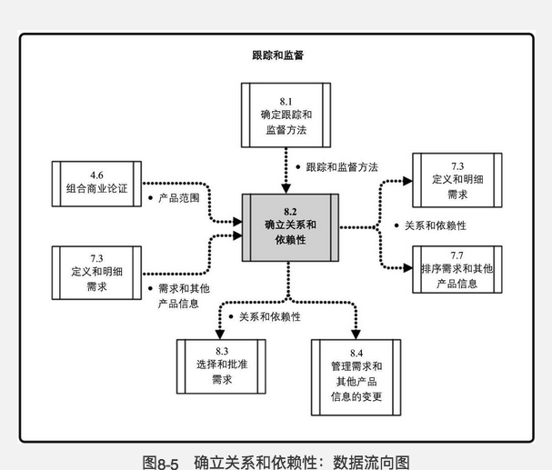

作用:

* **确保产品信息能提升商业机制且符合客户的期望**, 将产品信息追踪到商业需要, 目的和目标确保相关性.
* **管理范围** 显示非增值的产品信息.
* **最小化确认需求的可能性** 跟踪确保产品信息在细化, 实施过程中没有丢失.
* **进行影响分析** 分析变更影响
* **做出发布决策** 通过信息依赖性, 为发布决策提供信息

需求之间的关系

* 子集
* 实施依赖性
* 效益或价值依赖性

#### 8.2.1 输入

* 产品范围
* 需求和其他产品信息
* 跟踪和监督方法

#### 8.2.2 工具与技术

* 特性模型
* 需求管理工具
* 故事地图

### 8.3 选择和批准需求

**协商和确认哪些需求应纳入迭代, 发布或项目中**

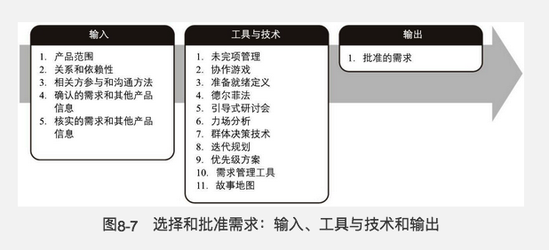

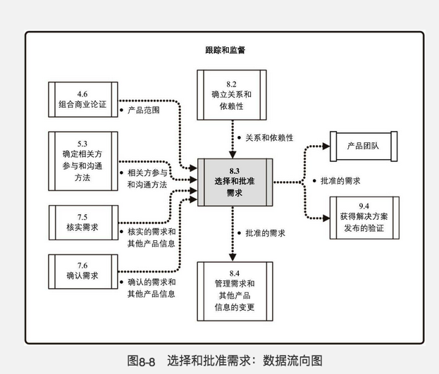

#### 8.3.1 输入

* 产品范围
* 关系和依赖性
* 相关方参与和沟通方法
* 确认的需求和其他产品信息
* 合适的需求和其他产品信息

#### 8.3.2 工具与技术

* 未完项管理
* 协作游戏
* 准备就绪定义
* 德尔菲法
* 引导式研讨会, 调解相关方分歧的首要技术
* 力场分析, 决策技术
* 群体决策技术, 做出最终决策
	* 独裁型
	* 德尔菲法
	* 力场分析
	* 服从多数
	* 相对多数
	* 全体一致
* 迭代规划
* 优先级方案, 排序的不同方法
* 需求管理工具
* 故事地图

#### 8.3.3 输出

* 批准的需求
	* 经过核实, 质量足够高
	* 经过确认, 需求满足商业需要

### 8.4 管理需求和其他产品系的变更

**理解变更的价值和影响来检查项目中出现的变更或缺陷的过程**

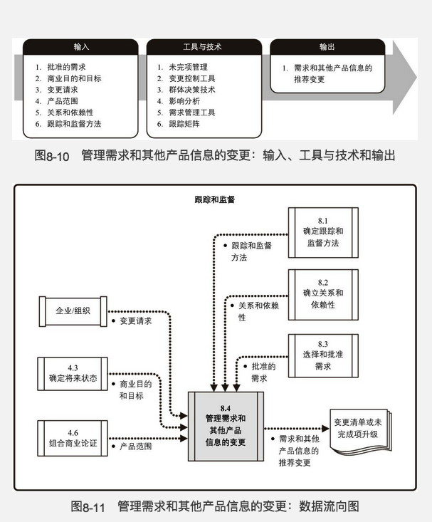

变更是在需求已基准化之后所要求的的修改. 没更可能在任一时间点发生.

变更品股后可以进行以下步骤

* 变更批准
* 变更延期
* 拒绝变更
* 需要更多信息

#### 8.4.1 输入

* 批准的需求
* 商业目的和目标
* 变更请求
* 产品范围
* 关系和依赖性
* 跟踪和监督方法

#### 8.4.2 工具与技术

* 未完项管理
* 变更控制工具
	* 配置管理系统(`CMS`)
	* 版本控制系统(`VCS`)
* 群体决策技术
* 影响分析
* 需求管理工具
* 跟踪矩阵

#### 8.4.3 输出

* 需求和其他产品信息的推荐变更

## 9. 解决方案评价

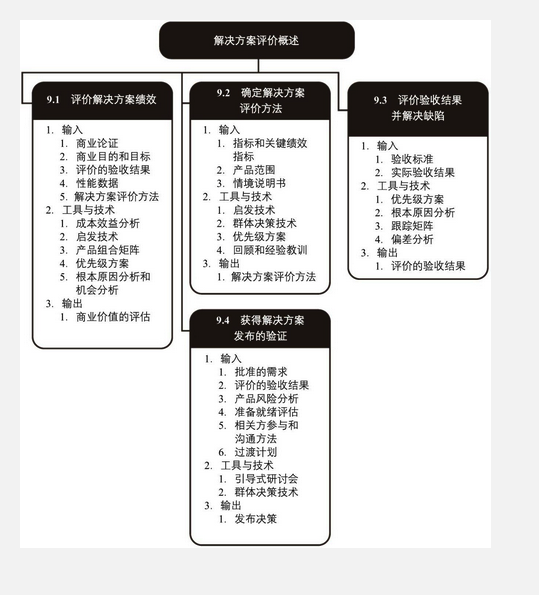

**解决方案评价的核心概念** 用来评价解决方案是否已达到预期的商业结果.

### 9.1 评价解决方案绩效

**评价解决方案, 以确定实施的解决是否按预期交付商业价值的过程**

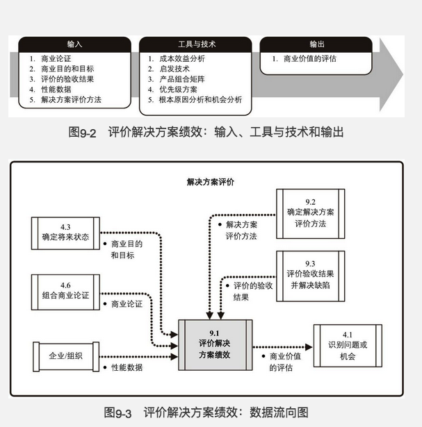

可以在项目的任何过程中采用.

错失商业价值的根本原因如下:

* 技术原因
* 商业实践或约束
* 对产品或其预期用途的抵制
* 产品使用者采用投机方法规避真实或可感知(可预见)的解决方案局限性

#### 9.1.1 输入

*  商业论证
*  商业目的和目标
*  评价的验收结果, 是验收标准与实际结果的比较, 以及它们之间差异的根本原因
*  性能数据
*  解决方案评价方法, 确定了将使用哪些类型的测量指标来评价预期的商业价值是否已经实现

#### 9.1.2 工具与技术

* 成本效益分析, 解决方案相对于其成本所提供的效益
* 启发技术
	* 引导式他研讨会
	* 焦点小组
	* 访谈
	* 观察法
* 产品组合矩阵, 增长份额矩阵,  定性分析产品的市场分析象限图
	* 纵轴, 市场增长率
	* 横轴, 市场份额
* 优先级方案
* 根本原因分析和机会分析

#### 9.1.3 输出

* 商业价值的评估, 将解决方案的语气商业价值与已实现的实际价值进行比较的结果. 如果没有实现期望的商业价值, 则该评估应包括原因.

### 9.2 确定解决方案评价方法

**确定评价哪些方面, 如何测量绩效, 由谁来测量绩效**

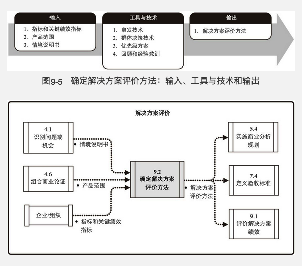

选择了或定义了绩效指标和测量指标

确定解决方案评价方案应包括

* 何时, 什么频率进行
* 运用哪些评价技术
* 如何分析和报告评价结果
* 如何告知相关方, 以及正式程度
* 使用哪些指标, 如何与商业目的和目标挂钩

#### 9.2.1 输入

* 指标和关键绩效指标, 可量化的测量.
* 产品范围
* 情境说明书

#### 9.2.2 工具与技术

* 启发技术
	* 文件分析
	* 引导式研讨会
	* 访谈
* 群体决策技术
* 优先级方案
* 回顾和经验教训

#### 9.2.3 输出

* 解决方案评价方法. 何时, 如何, 谁, 用什么指标评价解决方案

### 9.3 评价验收结果并解决缺陷

**评价验收结果并解决缺陷**

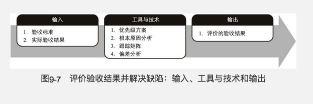

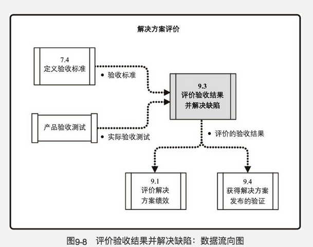

验收测试和验收标准之间比较的结果, 并为如何解决不满足验收标准的情境提供推荐方案.

测试结果来自

* 探索性测试和用户验收测试
* 生活时光测试
* 试生产或模拟生产测试
* 在场景中的功能测试
* 非功能性需求测试

解决缺陷的推荐方案

* 权变措施, 不影响产品其他功能或导致产品异常工作
* 通过变更请求实施产品改进
* 对产品的测量方法和测量内容进行调整
* 识别是否需要对缺陷的技术原因进行调整
* 通过沟通就如何使用产品向客户或用户进行澄清

#### 9.3.1 输入

* 验收标准
* 实际验收结果, 由质量控制团队将测试结果与验收标准进行比较后得到

#### 9.3.2 工具与技术

* 优先级方案
* 根本原因分析
* 跟踪矩阵
* 偏差分析, 实际测试结果与基准或期望值之间的可量化的偏差

#### 9.3.3 输出

* 评价的验收结果,  验收标准与实际结果的汇总比较, 可能包含解决缺陷的办法.

### 9.4 获得解决方案发布的验证

**为是否将(部分)解决方案发布到生产中并最终交接给运营团队做出决策**

在构建的解决方案与发布的解决方案间为相关方验收创建一个商定的中断.

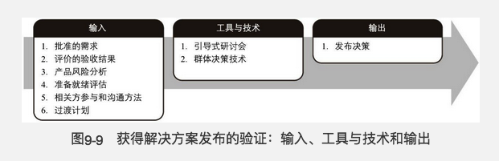

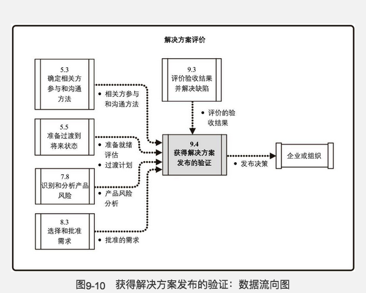

发布决策通常基于以下条件

* 由评价的验收结果来证明解决方案的可接受性
* 确认该组织已经做好发布准备
* 确认为准备发布而进行的过度活动已完成到必要的程度, 包括协调并发的多个解决方案
* 对其他剩余的产品风险和权变措施的验证

#### 9.4.1 输入

* 批准的需求
* 评价的验收结果
* 产品风险分析
* 准备就绪评估
* 相关方参与和沟通方法
* 过渡计划

#### 9.4.2 工具与技术

* 引导式研讨会
* 群体决策技术

#### 9.4.3 输出

* 发布决策, 发布或部分发布, 延迟或不批准和阻止解决方案的协议