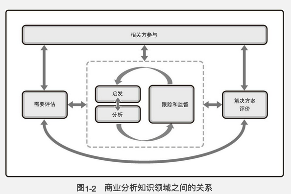

# 第二部分

## 1. 引论

### 1.3 商业分析和需求

商业分析

* 确定**问题和机会**
* 识别**商业需要**并提出可行的解决方案以满足这些需要并支持战略决策
* 启发, 分析, 明确, 沟通和管理需求和其他产品信息
* 定义效益及测量和实现效益的方法, 并且对这些结果进行分析.

**商业分析是为了交付与商业目标一致并给组织提供持续价值的解决方案而实施的一组活动**

**需求**是存在产品,  服务或结果中以满足商业需要所必须的条件或能力.

### 1.11 知识领域

* 需要评估, 分析当前的商业问题或机会
* 相关方参与
* 启发
* 分析
* 跟踪和监督
* 解决方案评价

### 1.12 商业分析过程组

* 定义和匹配过程组
* 启动过程组
* 规划过程组
* 执行过程组
* 监控过程组
* 发布过程组

## 2. 定义和匹配过程组

**定义范围, 将产品, 项目与整体组织钻率相匹配所实施的过程**

## 3. 启动过程组

商业论证转换为章程

## 4. 规划

确定执行商业分析获得懂最佳方法所实施的商业分析过程

## 5. 执行

## 6. 监控

* 促进持续和适当的相关方沟通和参与粗横渡
* 评估项目组合, 项目集和项目中建议的产品变更的影响
* 通过评估商业分析获得实施情况来提高商业分析绩效

