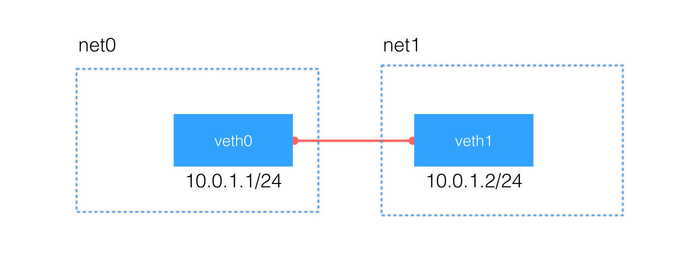

# ip netns

---

## 简介

`netns(network namespace)`是在linux中提供网络虚拟化的一个项目, 使用`netns`网络空间虚拟化可以在本地虚拟化出多个隔离的网络空间, 它们有独自的网络栈信息. 不管是虚拟机还是容器, 运行的时候仿佛自己就在独立的网络中.

使用`netns`创建的网络空间独立于当前系统的网络空间, 其中的网络设备以及`iptables`规则都是独立的, 就好像进入了另外一个网络一样.

### 创建虚拟网络空间

`ip netns add ns1`,创建一个名为`ns1`的网络空间, 虚拟网络空间除了网络是虚拟以外, 文件系统完全和当前系统共享. 如果相同名字的`namespace`已经存在, 命令会报`Cannot create namespace`的错误.

```shell
[root@localhost ~]# ip netns add ns1
[root@localhost ~]# ip netns list
ns1
[root@localhost ~]# ip netns add ns1
Cannot create namespace file "/var/run/netns/ns1": File exists
```

`ip netns`命令创建的`network namesapce`会出现在`/var/run/netns/`目录下, 如果需要管理其他不是`ip netns`创建的额`network namespace`, 只要在这个目录下创建一个指向对应`network namespace`文件的链接就行.

对于每个`network namespace`来说, 会有**独立**的网卡, 路由表, `ARP`表, `iptables`等和网络相关的资源.

### 删除网络空间

`ip netns del ns1`

### 在虚拟网络空间执行命令

`ip netns exec net0 'command'`可以在对应的`network namespace`中执行命令(和网络无关命令执行的结果和在外部执行没有区别).

```shell
[root@localhost ~]# ip netns exec ns1 bash
[root@localhost ~]# ifconfig -a
lo: flags=8<LOOPBACK>  mtu 65536
        loop  txqueuelen 1  (Local Loopback)
        RX packets 0  bytes 0 (0.0 B)
        RX errors 0  dropped 0  overruns 0  frame 0
        TX packets 0  bytes 0 (0.0 B)
        TX errors 0  dropped 0 overruns 0  carrier 0  collisions 0

[root@localhost ~]#
```

`ifconfig -a`查看包括未启动的网络设备, 发现默认添加了一个本地回路设备, 其他什么都没有.

执行`bash`命令了之后, 后面所有的命令都是在这个`network namespace`中执行的, 好处是不用每次执行命令都要把`ip netns exec NAME`补全, 缺点是你无法清楚知道自己当前所在的`shell`, 容易混淆.

通过修改 bash 的前缀信息可以区分不同 shell:

```shell
[root@localhost ~]# ip netns exec ns1 /bin/bash --rcfile <(echo "PS1=\"namespace ns1> \"")
namespace ns1> ls
anaconda-ks.cfg  test
namespace ns1>
```

每个`namespace`在创建的时候会自动创建一个`lo`的`interface`, 它的作用和linux系统中默认看到的`lo`一样, 都是为了实现`loopback`通信. 如果希望`lo`能工作，不要忘记启用它:

```shell
[root@localhost ~]# ip netns exec ns1 /bin/bash --rcfile <(echo "PS1=\"namespace ns1> \"")
namespace ns1> ip link set lo up
namespace ns1> ifconfig
lo: flags=73<UP,LOOPBACK,RUNNING>  mtu 65536
        inet 127.0.0.1  netmask 255.0.0.0
        inet6 ::1  prefixlen 128  scopeid 0x10<host>
        loop  txqueuelen 1  (Local Loopback)
        RX packets 0  bytes 0 (0.0 B)
        RX errors 0  dropped 0  overruns 0  frame 0
        TX packets 0  bytes 0 (0.0 B)
        TX errors 0  dropped 0 overruns 0  carrier 0  collisions 0
```

默认情况下, `network namespace`是**不能和主机网络, 或者其他`network namespace`通信**的.

## network namespace 之间通信

有了不同`network namespace`之后, 也就有了网络的隔离, 但是如果它们之间没有办法通信, 也没有实际用处. 要把两个网络连接起来, linux提供了`veth pair`. 可以把`veth pair`当做是双向的`pipe`(管道), 从一个方向发送的网络数据, 可以直接被另外一端接收到. 或者也可以想象成两个`namespace`直接通过一个特殊的虚拟网卡链接起来.

我们再创建另外一个`network namespace`，这里我们使用`net0`和`net1`两个名字.

```shell
[root@localhost ~]# ip netns add ns0
[root@localhost ~]# ls /var/run/netns/
ns0  ns1
```

使用`ip link add type veth`来创建一对`veth pair`出来, `veth pair`是无法单独存在, 删除其中一个, 另一个也会自动消失.

```shell
[root@localhost ~]# ip link add type veth
[root@localhost ~]# ip link
...
4: veth0@veth1: <BROADCAST,MULTICAST,M-DOWN> mtu 1500 qdisc noop state DOWN mode DEFAULT qlen 1000
    link/ether 96:fe:e6:61:7e:6e brd ff:ff:ff:ff:ff:ff
5: veth1@veth0: <BROADCAST,MULTICAST,M-DOWN> mtu 1500 qdisc noop state DOWN mode DEFAULT qlen 1000
    link/ether 96:16:fa:62:97:db brd ff:ff:ff:ff:ff:ff
```

创建`veth pair`的时候可以指定它们的名字, 比如`ip link add vethfoo type veth peer name vethbar`创建出来的两个名字就是`vethfoo`和`vethbar`.

如果 pair 的一端接口处于`DOWN`状态，另一端能自动检测到这个信息，并把自己的状态设置为`NO-CARRIER`.

我们能看到名字为`veth0`和`veth1`两个网络接口，名字后面的数字是系统自动生成的.接下来, 要做的是把这对`veth pair`分别放到已经两个`namespace`里面，这个可以使用`ip link set DEV netns NAME`来实现.

```shell
[root@localhost ~]# ip link set veth0 netns ns0
[root@localhost ~]# ip link set veth1 netns ns1
[root@localhost ~]# ip netns exec ns0 ip addr
1: lo: <LOOPBACK> mtu 65536 qdisc noop state DOWN qlen 1
    link/loopback 00:00:00:00:00:00 brd 00:00:00:00:00:00
4: veth0@if5: <BROADCAST,MULTICAST> mtu 1500 qdisc noop state DOWN qlen 1000
    link/ether 96:fe:e6:61:7e:6e brd ff:ff:ff:ff:ff:ff link-netnsid 1
[root@localhost ~]# ip netns exec ns1 ip addr
1: lo: <LOOPBACK,UP,LOWER_UP> mtu 65536 qdisc noqueue state UNKNOWN qlen 1
    link/loopback 00:00:00:00:00:00 brd 00:00:00:00:00:00
    inet 127.0.0.1/8 scope host lo
       valid_lft forever preferred_lft forever
    inet6 ::1/128 scope host
       valid_lft forever preferred_lft forever
5: veth1@if4: <BROADCAST,MULTICAST> mtu 1500 qdisc noop state DOWN qlen 1000
    link/ether 96:16:fa:62:97:db brd ff:ff:ff:ff:ff:ff link-netnsid 0
[root@localhost ~]#
```

最后, 我们给这对`veth pair`配置上`ip`地址, 并启用它们.

```shell
开启veth0
[root@localhost ~]# ip netns exec ns0 ip link set veth0 up
配置ip地址
[root@localhost ~]# ip netns exec ns0 ip addr add 10.0.1.1/24 dev veth0
[root@localhost ~]# ip netns exec ns0 ip route
10.0.1.0/24 dev veth0  proto kernel  scope link  src 10.0.1.1
[root@localhost ~]# ip netns exec ns1 ip link set veth1 up
[root@localhost ~]# ip netns exec ns1 ip addr add 10.0.1.2/24 dev veth1
[root@localhost ~]# ip netns exec ns1 ip route
10.0.1.0/24 dev veth1  proto kernel  scope link  src 10.0.1.2
```

每个`namespace`中, 在配置完`ip`之后, 还自动生成了对应的路由表信息, 网络`10.0.1.0/24`数据报文都会通过`veth pair`进行传输. 使用`ping`命令可以验证它们的连通性:

```shell
[root@localhost ~]# ip netns exec ns0 ping -c 3 10.0.1.2
PING 10.0.1.2 (10.0.1.2) 56(84) bytes of data.
64 bytes from 10.0.1.2: icmp_seq=1 ttl=64 time=0.042 ms
64 bytes from 10.0.1.2: icmp_seq=2 ttl=64 time=0.042 ms
64 bytes from 10.0.1.2: icmp_seq=3 ttl=64 time=0.042 ms

--- 10.0.1.2 ping statistics ---
3 packets transmitted, 3 received, 0% packet loss, time 2000ms
rtt min/avg/max/mdev = 0.042/0.042/0.042/0.000 ms
```

我们创建的网络拓扑结构如下所示:



#### 本地回环

```shell
注意ns0的本地lo没有开启
[root@localhost ~]# ip netns exec ns0 ip addr show
1: lo: <LOOPBACK> mtu 65536 qdisc noop state DOWN qlen 1
    link/loopback 00:00:00:00:00:00 brd 00:00:00:00:00:00
4: veth0@if5: <BROADCAST,MULTICAST,UP,LOWER_UP> mtu 1500 qdisc noqueue state UP qlen 1000
    link/ether 96:fe:e6:61:7e:6e brd ff:ff:ff:ff:ff:ff link-netnsid 1
    inet 10.0.1.1/24 scope global veth0
       valid_lft forever preferred_lft forever
    inet6 fe80::94fe:e6ff:fe61:7e6e/64 scope link
       valid_lft forever preferred_lft forever
       
自己ping自己然而ping不同
[root@localhost ~]# ip netns exec ns0 ping -c 3 10.0.1.1
PING 10.0.1.1 (10.0.1.1) 56(84) bytes of data.
^C
--- 10.0.1.1 ping statistics ---
3 packets transmitted, 0 received, 100% packet loss, time 2009ms

ns1 的本地回环是启动的
[root@localhost ~]# ip netns exec ns1 ip addr show
1: lo: <LOOPBACK,UP,LOWER_UP> mtu 65536 qdisc noqueue state UNKNOWN qlen 1
    link/loopback 00:00:00:00:00:00 brd 00:00:00:00:00:00
    inet 127.0.0.1/8 scope host lo
       valid_lft forever preferred_lft forever
    inet6 ::1/128 scope host
       valid_lft forever preferred_lft forever
5: veth1@if4: <BROADCAST,MULTICAST,UP,LOWER_UP> mtu 1500 qdisc noqueue state UP qlen 1000
    link/ether 96:16:fa:62:97:db brd ff:ff:ff:ff:ff:ff link-netnsid 0
    inet 10.0.1.2/24 scope global veth1
       valid_lft forever preferred_lft forever
    inet6 fe80::9416:faff:fe62:97db/64 scope link
       valid_lft forever preferred_lft forever
 
自己ping自己可以ping通
[root@localhost ~]# ip netns exec ns1 ping -c 3 10.0.1.2
PING 10.0.1.2 (10.0.1.2) 56(84) bytes of data.
64 bytes from 10.0.1.2: icmp_seq=1 ttl=64 time=0.014 ms
64 bytes from 10.0.1.2: icmp_seq=2 ttl=64 time=0.027 ms
^C
--- 10.0.1.2 ping statistics ---
2 packets transmitted, 2 received, 0% packet loss, time 999ms
rtt min/avg/max/mdev = 0.014/0.020/0.027/0.007 ms
```

## 使用`bridge`链接不同的`namespace`

虽然`veth pair`可以实现两个`network namespace`之间的通信, 但是当多个`namespace`需要通信的时候, 就无能为力了.

多个网络设备通信, 需要考虑交换机和路由器. 因为这里考虑的只是同个网络, 所以只用交换机的功能. linux 当然也提供了虚拟交换机的功能.

和`bridge`有关的操作也可以使用命令`brctl`, 这个命令来自`bridge-utils`这个包.

创建需要的`bridge`, 名字叫做`br0`.

```shell
[root@localhost ~]# ip netns add ns0
[root@localhost ~]# ip netns add ns1
[root@localhost ~]# ip link add br0 type bridge
[root@localhost ~]# ip link set dev br0 up
[root@localhost ~]# ip link add type veth
[root@localhost ~]# ip addr show
...
4: br0: <BROADCAST,MULTICAST,UP,LOWER_UP> mtu 1500 qdisc noqueue state UNKNOWN qlen 1000
    link/ether e2:a9:4c:69:04:1e brd ff:ff:ff:ff:ff:ff
    inet6 fe80::e0a9:4cff:fe69:41e/64 scope link
       valid_lft forever preferred_lft forever
5: veth0@veth1: <BROADCAST,MULTICAST,M-DOWN> mtu 1500 qdisc noop state DOWN qlen 1000
    link/ether ce:93:5d:f5:1e:8b brd ff:ff:ff:ff:ff:ff
6: veth1@veth0: <BROADCAST,MULTICAST,M-DOWN> mtu 1500 qdisc noop state DOWN qlen 1000
    link/ether d6:5c:b6:d3:56:b6 brd ff:ff:ff:ff:ff:ff
    
把其中一个 veth(veth1) 放到 net0 里面，设置它的 ip 地址并启用它:
[root@localhost ~]# ip link set dev veth1 netns ns0
修改名字为 eth0
[root@localhost ~]# ip netns exec ns0 ip link set dev veth1 name eth0
[root@localhost ~]# ip netns exec ns0 ip addr add 10.0.1.1/24 dev eth0
[root@localhost ~]# ip netns exec ns0 ip link set dev eth0 up
```

最后，把另一个 veth(veth0)连接到创建的`bridge`上, 并启用它:

```shell
[root@localhost ~]# ip link set dev veth0 master br0
[root@localhost ~]# ip link set dev veth0 up
[root@localhost ~]# bridge link
5: veth0 state UP @(null): <BROADCAST,MULTICAST,UP,LOWER_UP> mtu 1500 master br0 state forwarding priority 32 cost 2
```

我们在类似的操作`ns1`

```shell
[root@localhost ~]# ip link add type veth
[root@localhost ~]# ip addr show
...
4: br0: <BROADCAST,MULTICAST,UP,LOWER_UP> mtu 1500 qdisc noqueue state UP qlen 1000
    link/ether ce:93:5d:f5:1e:8b brd ff:ff:ff:ff:ff:ff
    inet6 fe80::e0a9:4cff:fe69:41e/64 scope link
       valid_lft forever preferred_lft forever
5: veth0@if6: <BROADCAST,MULTICAST,UP,LOWER_UP> mtu 1500 qdisc noqueue master br0 state UP qlen 1000
    link/ether ce:93:5d:f5:1e:8b brd ff:ff:ff:ff:ff:ff link-netnsid 0
    inet6 fe80::cc93:5dff:fef5:1e8b/64 scope link
       valid_lft forever preferred_lft forever
7: veth1@veth2: <BROADCAST,MULTICAST,M-DOWN> mtu 1500 qdisc noop state DOWN qlen 1000
    link/ether ae:3e:88:4b:aa:f4 brd ff:ff:ff:ff:ff:ff
8: veth2@veth1: <BROADCAST,MULTICAST,M-DOWN> mtu 1500 qdisc noop state DOWN qlen 1000
    link/ether 62:3f:6a:7f:31:eb brd ff:ff:ff:ff:ff:ff

[root@localhost ~]# ip link set dev veth1 netns ns1
[root@localhost ~]# ip netns exec ns1 ip link set dev veth1 name eth0

设置不同的ip
[root@localhost ~]# ip netns exec ns1 ip addr add 10.0.1.2/24 dev eth0
[root@localhost ~]# ip netns exec ns1 ip link set dev eth0 up
[root@localhost ~]# ip link set dev veth2 master br0
[root@localhost ~]# ip link set dev veth2 up
[root@localhost ~]# bridge link
5: veth0 state UP @(null): <BROADCAST,MULTICAST,UP,LOWER_UP> mtu 1500 master br0 state forwarding priority 32 cost 2
8: veth2 state UP @(null): <BROADCAST,MULTICAST,UP,LOWER_UP> mtu 1500 master br0 state forwarding priority 32 cost 2

从ns0测试ping通ns1
[root@localhost ~]# ip netns exec ns0 ping -c 3 10.0.1.2
PING 10.0.1.2 (10.0.1.2) 56(84) bytes of data.
64 bytes from 10.0.1.2: icmp_seq=1 ttl=64 time=0.024 ms
64 bytes from 10.0.1.2: icmp_seq=2 ttl=64 time=0.050 ms
^C
--- 10.0.1.2 ping statistics ---
2 packets transmitted, 2 received, 0% packet loss, time 1000ms
rtt min/avg/max/mdev = 0.024/0.037/0.050/0.013 ms
```

这和`docker`默认的`bridge`网络模型非常相似. 当然要实现每个`namespace`对外网的访问还需要额外的配置(设置默认网关, 开启`ip_forward`, 为网络添加`NAT`规则等).

