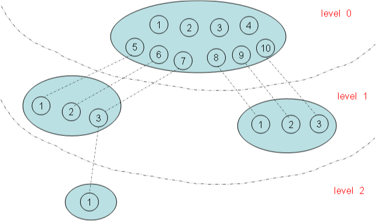

# PID, TGID, PGID, SID

---

Linux内核使用`task_struct`数据结构来**关联所有与进程有关的数据和结构**, Linux 内核**所有涉及到进程和程序的所有算法都是围绕该数据结构建立的**.

## 进程ID类型

(Process)进程, (Thread)线程

* `PID`: 这是Linux中在其命名空间中唯一标识**进程**而分配给它的一个号码.
* `TGID`: 是一个进程中, 如果**以`CLONE_THREAD`标志来调用clone建立的进程就是该进程的一个线程**, 它们处于一个线程组, 该线程组的ID叫做TGID. 处于相同的线程组中的所有进程都有相同的TGID; 线程组组长的TGID与其PID相同；一个进程没有使用线程, 则其TGID与PID也相同.
* `PGID`: 另外, **独立的进程可以组成进程组**, 进程组可以简化向所有组内进程发送信号的操作, 例如用管道连接的进程处在同一进程组内. 进程组ID叫做PGID, 进程组内的所有进程都有相同的PGID, 等于该组组长的PID.
* `SID`: 几个进程组可以合并成一个会话组, (使用`setsid`系统调用), 可以用于终端程序设计. 话组中所有进程都有相同的SID.

## PID 命名空间

命名空间是为操作系统层面的**虚拟化**机制提供支撑. 目前实现的有六种不同的命名空间, 分别为:

* **mount**命名空间
* **UTS**命名空间
* **IPC**命名空间
* **用户**命名空间
* **PID**命名空间
* **网络**命名空间

命名空间简单来说提供的是对全局资源的一种抽象, 将资源放到不同的容器中(不同的命名空间), 各容器彼此隔离. 命名空间彼此隔离. 

命名空间有的还有**层次关系**, 



上图有四个命名空间, 一个父命名空间衍生了两个子命名空间, 其中的一个子命名空间又衍生了一个子命名空间. 以PID命名空间为例, 由于**各个命名空间彼此隔离**, 所以每个命名空间都可以有`PID`号为`1`的进程. 但又由于命名空间的层次性, **父命名空间是知道子命名空间的存在**, 因此子命名空间要映射到父命名空间中去, 因此上图中 `level 1`中两个子命名空间的六个进程分别**映射到其父命名空间**的`PID`号`5~10`.

命名空间增大了`PID`管理的复杂性, 对于某些进程可能有多个PID--**在其自身命名空间的PID以及其父命名空间的PID**, 凡能看到该进程的命名空间都会为其分配一个PID. 因此就有:

* **全局ID**: 在**内核本身**和**初始命名空间中**唯一的ID, 在系统启动期间开始的`init`进程即属于该初始命名空间. 系统中每个进程都对应了该命名空间的一个PID, 叫全局ID, **保证在整个系统中唯一**.
* **局部ID**: 对于属于某个**特定的命名空间**, 它在其命名空间内分配的ID为局部ID, **该ID也可以出现在其他的命名空间中**.

## 进程ID管理数据结构

Linux内核在设计管理ID的数据结构时, 要充分考虑以下因素:

* 如何快速地根据进程的`task_struct`,`ID类型`, `命名空间`找到`局部ID`.
* 如何快速地根据局部ID, 命名空间, ID类型找到对应进程的`task_struct`.
* 如何快速地给新进程在可见的命名空间内分配一个唯一的`PID`.

一个`PID`对应一个`task_struct`

如果:

* 先不考虑进程之间的关系
* 不考虑命名空间

仅仅是一个PID号对应一个task_struct, 那么我们可以设计这样的数据结构.

```C
struct task_struct {
    //...
    struct pid_link pids;
    //...
};

struct pid_link {
    struct hlist_node node;  
    struct pid *pid;          
};

struct pid {
    struct hlist_head tasks;        //指回 pid_link 的 node
    int nr;                       //PID
    struct hlist_node pid_chain;    //pid hash 散列表结点
};
```

**pid的nr值:表示命名空间中的标识**

每个进程的`task_struct`结构体中有一个指向`pid`结构体的指针, `pid`结构体包含了`PID`号. 结构示意图如下图:


* `pid_hash[]`: 这是一个hash表的结构, 根据`pid`的`nr`值哈希到其某个表项, 若有多个`pid`结构对应到同一个表项, 这里解决冲突使用的是散列表法. 现在怎么**根据PID值怎样快速地找到task_struct结构体**?
	1. 首先通过`PID`计算`pid`挂接到哈希表`pid_hash[]`的表项.
	2. 遍历该表项, 找到`pid`结构体中`nr`值与`PID`值相同的那个`pid`.
	3. 最后根据内核的`container_of`机制就能找到`task_struct`结构体.
* `pid_map`: 这是一个位图, 用来唯一分配PID值的结构, 图中灰色表示已经分配过的值, 在新建一个进程时, 只需在其中找到一个为未配过的值赋给`pid`结构体的`nr`, 再将`pid_map`中该值设为已分配标志. 这也就解决了上面的第3个问题——如何快速地分配一个全局的PID.

至于上面的第1个问题就更加简单, 已知`task_struct`结构体, 根据其`pid_link`的`pid`指针找到`pid`结构体, 取出其`nr`即为`PID`号.

## 进程ID有类型之分

如果考虑进程之间有复杂的关系, 如线程组, 进程组, 会话组，这些组均有组ID:

* 线程组: TGID
* 进程组ID: PGID
* 会话组ID: SID
