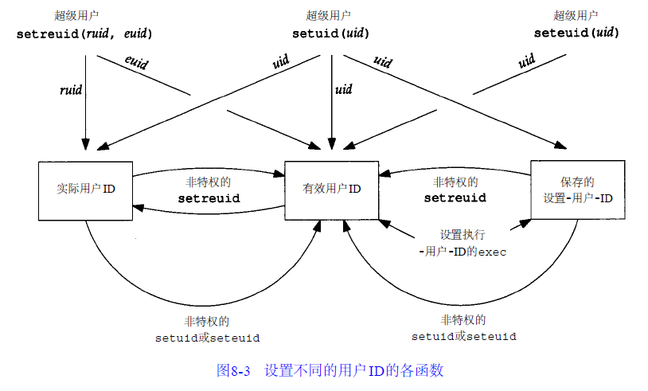

# setuid seteuid setreuid 

---

## int setuid(uid_t uid) 

* 若进程具有超级用户权限, 则`setuid`将实际用户ID,有效用户ID及保存的设置用户ID设置为uid.
* 若进程没有超级用户权限, 但是`uid`等于实际用户ID或保存的设置用户ID, 则setuid只将有效用户ID设置为uid.

## int seteuid(uid_t uid) 

* 若进程具有超级用户权限, 则setuid只将有效用户ID设置为uid 
* 若进程没有超级用户权限，则setuid只将有效用户ID设置为uid, 但是uid必须等于实际用户ID或保存的设置用户ID

## int setreuid(uid_t ruid, uid_t euid) 

* 针对设置用户ID位的程序: 交换有效用户ID和保存的设置用户ID
* 针对没有设置用户ID位的程序: 交换有效用户ID和实际用户ID

## 示例图

## 概念店

### setuid 和 seteuid 区别

`setuid()`用来重新设置执行目前进程的用户识别码, 不过,要让此函数有作用,其有效的用户识别码必须为`0(root)`. 在Linux下, 当`root`使用`setuid()`来变换成其他用户识别码时,`root`权限会被抛弃, 完全转换成该用户身份, 也就是说, 该进程往后将不再具有可`setuid()`的权利. 如果只是想**暂时抛弃`root`权限**, 稍后想重新取回权限, 则必须使用`seteuid()`.

