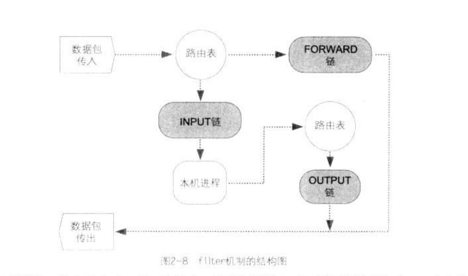
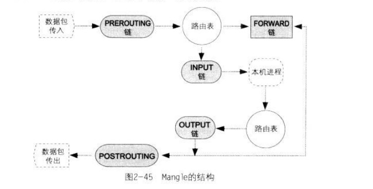
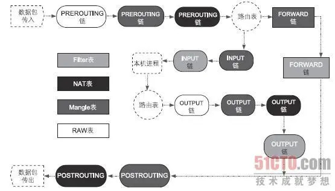
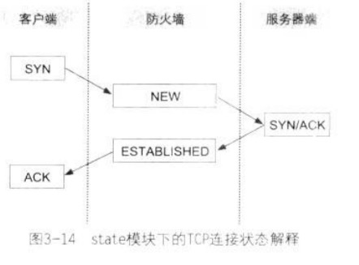

# README

## 1. 防火墙的基本概念

### 1.1 TCP/IP的基本概念

* 应用层: 主要用于定义客户端与服务器端的数据交换方法。
* 传输层：定义数据传输方法。
* 网络层：使用IP地址来定位网络上的每一台计算机，并采用路由方法决定数据传输路径，将数据传输到正确的目的端。
* 链路层，又称为数据链路层或网络接入层，也就是网络的基础设施。任务是传输和接收实体网络层传输的光电信号。

### 1.3 TCP、UDP及Socket的关系

在`OS`的网络系统中会有两个`Socket`, 分别是`TCP Socket`及`UDP Socket`, `Socket`上各有`65536`个洞，范围为`0 ~ 65535`, 我们称为`Port0 ~ Port65535`。

端口的分类

* 公认端口: 0 ~ 1023
* 注册的端口: 1024 ~ 49151
* 动态端口: 49152 ~ 65535
	* 供临时使用，几乎所有客户端应用程序都会使用动态端口。

### 1.6 防火墙的分类

* 数据包过滤防火墙
	* 链路层
	* 网络层，检查范围只有一个数据包，无法检查内容
	* 路由表
* 应用层防火墙
	* 应用层，应用程序过滤进程会受到该连接的所有的包，所以可以把数据还原，检查内容。但是无法处理应用程序过滤进程不支持的通信协议。所以，应用层防火墙的使用范围较小。

### 1.7 常见的防火墙结构

* 单机防火墙，客户只能有一个公网`ip`, 通过`NAT`转换分配对外的服务主机使用。所谓的单机防火墙通常是软件，而这个软件是工作在网卡的驱动程序上，凡是要进入主机的数据报，都会受到这个防火墙的监控，由此达到维护本机安全的目的。
	* 优点: 价格低廉
	* 缺点: 任何来自因特网的攻击行为，都由主机承担。

* 网关式防火墙
	* 部署在网关位置，可以防护整体网络（单机防火墙的包范围只有本机）

* 透明防火墙
	* 一个网桥设备，并且在网桥设备上赋予过滤器（Filter）功能。网桥是工作在OSI第二层的网络设备，因此不会有任何路由的问题，并且网桥上可以不需要设置任何的IP，如此就没有路由问题。即防火墙主机无需设置IP，即使黑客要攻击这个防火墙，也可能会因为没有目的端IP而无功而返。

## 2. Netfilet/iptables

`Netfilter`存放规则的内存块被分为四个**表**(Table)

* `filter`: 过滤，起到防火墙作用。
* `nat`: Network Address Translation, 功能是IP分享
* `managle`: 通过`managle`机制来修改经过防火墙内数据包的内容
* `raw:` 负责加快数据包穿过防火墙机制的速度，由此提高防火墙的性能

### 2.6 Netfilter的filter机制



**链**

* INPUT: 网络上其他主机发送给本机进程的数据包
* OUTPUT: 本机进程产生的数据包，如本机启动浏览器访问网络上的其他主机
* FORWARD: 数据包路过本机, 如服务器扮演路由器角色

对应INPUT、OUTPUT和FORWARD三个链。

### 2.7 规则的匹配方式

规则匹配方式为"优先"匹配。

添加规则时，先来后到。匹配规则时，从第一条规则逐一向下匹配。如果第一条规则决定丢弃，则丢弃。反之如果第一条规则决定放行，则放行。**不管后面的规则内容是什么**。

如果没有规则匹配到，则走默认策略。默认策略在每个链的对底端。默认策略只能放行(ACCEPT)或丢弃(DROP)。默认是放行(ACCEPT)。

### 2.8 Netfilter与iptables的关系

`iptables`是编辑`Netfilter`规则的工具。

### 2.9 iptables工具的使用方法

`iptables`命令可以划分为两个部分

1. `iptables`命令参数
2. 规则语法

#### 2.9.1 iptables命令参数

`iptables -t TABLE - 操作方法 规则`

* `TABLE`
	* `filter`, 没有标明，默认为`filter`
	* `nat`
	* `managle`
	* `raw`

处理方式, `-j`后面跟的命令

* ACCEPT: 允许通过
* DROP: 将数据包丢掉、此种处理方式将导致来源端误以为数据包丢失而不断重新发送数据包。这个动作将持续到连接超时为止
* REJECT: 将数据包丢掉，并回送一个Destination Unreachable的`icmp`数据包给发送端，发送端应用程序在收到这个错误信息数据包后，会终止连接。

### 2.10 使用`iptables`机制来构建简单的单机防火墙

#### 2.10.2 解决无法在防火墙主机上对外建立连接的问题

在`TCP/IP`模型中，连接状态共分十二种，但在`state`模块（`xt_state.ko`）的描述中只有四种

* `ESTABLISHED`
* `NEW`
* `RELATED`
* `INVALID`

如在`TCP/IP`标准定义中，`UDP`及`ICMP`数据报是没有连接状态的，但在`state`模块的定义中，任何数据报都有连接状态

**ESTABLISHED**

只要数据报能够成功穿过防火墙，那么之后的所有数据报（包括反向的所有数据报），其状态都会是`ESTABLISHED`。

所以解决无法在防火墙主机上对外建立连接，可以用`state`模块匹配所有`ESTABLISHED`状态的数据包。

**NEW**

`NEW`与协议无关，其所指的是每一条连接中的第一个数据包。

**RELATED**

`RELATED`状态的数据包其含义是指"被动产生的应答数据包, 而且这个数据包不属于现在任何的连接”。

如使用`traceroute`命令，主机发送出一个`TCP`协议的数据报，但因为这个数据包的声明周期已尽，而遭到第N个路由器丢弃。接着，这个路由器就会回送一个`ICMP`数据包给发送端，请注意!最右边的主机送出的是`TCP`包，这一是条“连接”，但第三个路由器回送的是`ICMP`数据包，很明显，这是另一条新连接，而这个数据包之所以会产生，完全是因为第一条连接的存在才产生应答的数据包，且该数据包不属于任意现有的连接。

即，只要应答的数据包是因为本机先送出一个数据包而导致另一条连接的产生，那么这个新连接的所有数据包都属于`RELATED`状态的数据包。

**INVALID**

`INVALID`状态是指"状态不明的数据包", 也就是不属于`ESTABLISHED`、`NEW`及`RELATED`的数据包。凡是`INVALID`状态的数据包皆视为“恶意”的数据报，因此，请将`INVALID`状态的数据包丢弃掉。

#### 2.10.3 管理防火墙规则数据库的办法

**iptables工具的规则数据库**

使用`service iptables save`命令把所有`Netfilter`规则存储到`/etc/sysconfig/iptables`文件中，让`iptables`服务器开机启动，则重新开机后会自动将规则从文件中载入到`Netfilter`的各个链中。

**shell**

### 2.11 使用`filter`机制来构建网关式防火墙

### 2.12 `Netfilter`的`NAT`机制

`NAT`是`Network Address Transaltion`的缩写，即“网络地址转换”。

`NAT`应用在客户端的主要目的是隐藏客户端的`IP`, 由此达到阿博湖客户端主机免于遭受因特网攻击的行为，以及节省公用`ip`的使用了。

`NAT`应用在服务端的主要用途是保护服务器端主机在因特网上的安全。

#### 2.12.2 私有IP

* A类: `10.0.0.0 ~ 10.255.255.255`, 子网掩码: `255.0.0.0`
* B类: `172.16.0.0 ~ 172.32.255.255`, 子网掩码: `255.255.0.0`
* C类: `192.168.0.0 ~ 192.168.255.255`, 子网掩码: `255.255.255.0`

#### 2.12.4 数据包传输方向与SNAT及DNAT的关系

* 变更`Source IP`的机制称为`SNAT`
* 变更`Destionation IP`的机制称为`DNAT`

无论NAT机制有多少种，都是由SNAT和DNAT所共同搭配出来的。


**PREROUTING链**

当我们下发“规则”要去修改数据包的`Destion IP`时，需要将规则置于PREROUTING链中。

因此PREROUTING链的功能在于执行`DNAT`任务。

==PREROUTING链的位置在整个NAT机制的最前面==。因此数据包一旦进入`NAT`机制，数据包内的`Dstion IP`即被修改。

**POSTROUTING链**

POSTROUTING链的任务是修改数据包内的"来源端IP", POSTROUTING链的功能在于执行`SNAT`任务。

== POSTROUTING链的位置在整个NAT机制的最末端==。因此执行`SNAT`操作时，`Source IP`是在整个`NAT`机制的最末端才会修改的。

**OUTPUT链**

==和`filter`表的OUTPUT链毫无关系==

因为本机进程生成数据包并向外发送，这个数据包会先交给路由表来判断路由，接着数据包进入`OUTPUT`链，最后进入`POSTROUTING`链，然后送离本机。**这个数据包不可能送到`PREROUTING`链内**.

`NAT`特别设计了一个名为`OUTPUT`链的机制，这个链的功能是执行`DNTA`任务，其对象就是本机进程产生炳耀外送的这些数据包。

#### 2.12.5 NAT的分类

**一对多NAT**

"让大家共用一个公网IP来上网", 也称为`ip`分享器

* 节省公网`ip`的使用量
* 隐藏企业内部主机的`ip`地址

不管我们下达的是`SNAT`或`DNAT`的规则，`NAT`机制都会自动帮我们判别"另一个方向的应答数据包“，因此，我们只需要下达单一方向的规则即可。

设定公网`ip`

* `-j SNAT --to Public IP`, 公网`ip`固定
* `-j MASQUERADE`, 公网`ip`不固定

**多对多NAT**

先决条件：拥有多个公网ip, 且是连续的。

`-j SNAT --to 10.0.1.200 - 10.0.1.205`

会循环使用公网`ip`。

**一对一NAT**

为每个服务单一设置映射`ip`

**NAPT**

`NAPT(Network Address Port Translation)`

### 2.13 `Netfilter`的`Mangle`机制



当一个数据包"穿过"防火墙时，可以通过`Mangle`的机制来修改数据包的内容。

* 修改`IP`包头的`TTL`值
	* 如修改由`linux`主机发送的数据包，将这些数据包的`TTL`值改为`128`, 让黑客误以为是`Windows`操作系统；也可以将`Windows`曹组哦系统所送出的数据包`TTL`值改为`64`, 让黑客误以为是`Linux`系统。
* 修改`IP`包头的`DSCP`值或对特定的数据报设置特征
	* `QOS(Quality of Service)`机制，`QOS`机制可以让我们在有限的带宽中，有效分配不同的带宽给不同的协议来使用。
	* `QOS`是由两个不同部分组成
		* 数据包分类器
		* 带宽分配器
	* 数据先进入"数据包分类器"，数据包即会被加以分类，被分类后的数据报接着进入"带宽分配器"，再由带宽分配器决定各类数据包可以使用多少网络带宽
		* 通过`IP`包内的`DSCP`值类分类，通过`Managle`机制来修改`IP`包内的`DSCP`值，如, 把`DSCP`值改为`0000-01`, 后在"带宽分配器"上设置，如果数据包内的`DSCP`值为`0000-01`, 就给予`xxKB/s`的带宽
		* 使用`Managle`机制来为数据包标识识别码

```
#修改SSH协议的数据报，修改后的DSCP值为43

iptables -t mangle -A OUTPUT -p tcp --dport 22 -j DSCP --set-dscp 43
```

### 2.14 `Netfilter`的`raw`机制



## 3. `Netfilter`的匹配方式及处理方法

### 3.1.1 内置的匹配方式

**接口的匹配方式**

```
-i xxx , 进入接口的数据包
-o xxx, 出接口的数据包
```

**Source/Destination Address匹配**

```
-d: 匹配目的端IP
-s: 匹配来源端IP
```

**协议**

```
-p 协议

-p icmp 与 -p 1 等效（1代表icmp）
```

**icmp**

* `icmp`的请求包: `Type=0、Code=0`
* `icmp`的应答包: `Type=0、Code=0`

希望别人`ping`不到我们，我们可以`ping`到别人

```
iptables -A INPUT -p icmp --icmp-type 8 -j DROP
```

### 3.1.2 从模块扩展而来的匹配方式

**TCP**

匹配端口

```
--dport 20
--sport 20:50, 支持范围匹配, 匹配端口20到端口50之间的范围
```

`TCP-Flags`的匹配

TCP-Flags

* 位1: Finish, 连接终止信号
* 位2: Synchronize, 连接请求信号
* 为3: Reset, 立即终止信号
* 位4: Acknowledge, 确认应答信号

三次握手

```
客户端 --SYN--> 服务端
客户端 <--SYN, ACK-- 服务端
客户端 --ACK--> 服务端
```

四次挥手

```
客户端 --FIN--> 服务端
客户端 <--ACK-- 服务端
客户端 <--FIN-- 服务端
客户端 --ACK--> 服务端
```

```
#检查"所有"TCP-Flags, 但只有 syn 和 fin 两个标记同时为 1 时，数据包才会删选出来

iptables -A INPUT -p tcp --tcp-flags ALL SYN,FIN -j DROP
```

**UDP**

只能匹配

* `--sport`
* `--dport`

**MAC地址匹配**

不能用在`OUTPUT`和`POSTROUTING`的规则链上（OUTPUT是自己发出的数据包，不是接收的数据包，所以没有源mac地址， POSTROUTING是要路由出去了，源mac要换成自己的了，也不是接收到的数据包），这是因为封包要送出网卡后，才能由网卡驱动程序透过 ARP 通讯协议查出目的地的 MAC 地址，所以 iptables 在进行封包对比时，并不知道封包会送到那个网络接口去（MAC地址是绑定到网卡上的）。

```
-m mac --mac-source xx:xx:xx:xx:xx
```

**Multiport的匹配**

```
-m multiport --dports 21,22,23,35
```

**匹配数据包的MARK值**

```
#设置mark值

-j MARK --set-mark xxx
```

```
#匹配mark值

-m mark --mark xx
```
**`Owner`的匹配**

* `--uid-owner userid|username`
* `--gid-owner groupid|groupname`

只能在本机使用，因为这些要匹配的特征不会随着数据包送到网上。

**`IP`范围的匹配**

```
-m iprange --src-range xx.xx.xx-xx.xx.xx
```

* `--src-range`: 匹配"来源地址"范围
* `--dst-range`: 匹配"目的地址"范围

**`TTL`值的匹配**

* `-m ttl --ttl-eq 64`: 匹配`TTL`值“等于”64
* `-m ttl --ttl-lt 64`: 匹配`TTL`值“小于”64
* `-m ttl --ttl-gt 64`: 匹配`TTL`值“大于”64

**数据包的状态匹配**

