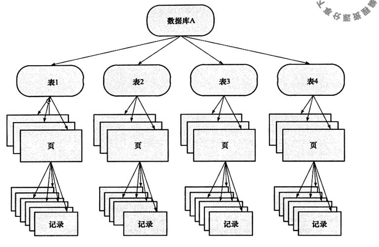
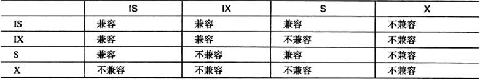

# InnoDB锁 X S IX IS

## 锁定义

### 共享锁

共享锁(S), 是`Share`的缩写, 共享锁的锁粒度是行或者元组(多行). **一个事务获得了共享锁之后, 就可以对锁定范围内的数据进行`读`操作**. (注意这里是**读**操作)

```
SELECT * FROM table_name WHERE ... LOCK IN SHARE MODE
```

### 排他锁

排他锁(X), 是`eXclusive`的缩写, 排他锁的粒度和共享锁一样, 也是行或者元组. **一个事务获得排他锁之后, 就可以对锁定范围内的数据执行`insert/delete/update`操作**. (注意这里是**写**操作).

对于`UPDATE、DELETE和INSERT`语句, InnoDB会自动给涉及数据集加排他锁(X).

对于普通SELECT语句，InnoDB不会加任何锁.

事务可以通过以下语句显示给记录集加共享锁或排他锁:

```
SELECT * FROM table_name WHERE ... FOR UPDATE
```

### 共享所 排他锁 区别

如果是一个事务T1获得了行r的共享锁，那么另外一个事务T2可以立即获得行r的共享锁, 因为读取并没有改变行r的数据, 称这种情况为锁兼容Lock Compatible. 但若有其他事务T3想获得行r的排他锁, 则必须等待事务T1, T2释放行r的共享锁---这种情况称为锁不兼容.

X锁与任何锁都不兼容，而S锁仅和S锁兼容. 需要特别注意, S和X都是**行锁**, 兼容是指通一行记录row锁的兼容情况.


### 意向锁

InnoDB支持多粒度. 这种锁定**允许事务在行级别上的锁和表级别上的锁同时存在**. 为了支持在不通粒度上进行加锁操作, InnoDB存储引擎支持一种额外的锁方式, 称为意向锁(Intention Lock). 

**意向锁是InnoDB自动加的, 不需用户干预**

意向锁是**将锁定的对象分为多个层次**, 意向锁意味着**事务希望在更细粒度(fine granularity)上进行加锁**.



InnoDB存储引擎支持意向锁设计比较简练, 其**意向锁即为表级别锁**. 计目的主要是为了**在一个事务上揭示下一个行将别请求的锁类型**. 其支持两种意向锁:

* 意向共享锁 `IS LOCK` 事务想要**获得一张表中某几行的共享锁**. (注意是获取某几行, 是要锁行)
* 意向排他锁 `IX LOCK` 事务想要**获得一张表中某几行的排他锁**. (注意是获取某几行, 是要锁行)

#### 冲突

* IX, IS是表级锁，不会和行级的X，S锁发生冲突. **只会和表级的X，S发生冲突**.
* 行级别的X和S按照普通的共享、排他规则即可. 所以之前的示例中第2步不会冲突, 只要写操作不是同一行,就不会发生冲突.

**意向锁是在添加行锁之前添加**

当再向一个表添加表级`X`锁的时候:

* 如果没有意向锁的话, 则需要遍历所有整个表判断是否有行锁的存在, 以免发生冲突.
* 如果有了意向锁, 只需要判断该意向锁与即将添加的表级锁是否兼容即可. **因为意向锁的存在代表了,有行级锁的存在或者即将有行级锁的存在. 因而无需遍历整个表, 即可获取结果**

**意向锁是用来提高所冲突监测性能的**.



该矩阵中`X`,`S`都是表级锁(如alter table)

##### 示例 1

```
用X锁锁表，是不需要申请IX的.

用X锁锁行，才需要申请IX.

比如alter table改变表结构的语句，可能需要把整个表锁起来，这个就是表级别锁，加这个锁，不需要提前持有IX锁，如果其他事务当前持有这个表的IX锁，那么alter table语句就会被阻塞，正如兼容表格中看到的，X和IX是不兼容的.
```

##### 示例 2

```
假如session1开启事务，更改表的id=1行，那么顺序是先申请IX锁，再锁定id=1的行X锁，此时不提交事务。session2开启事务，更新表的id=2，那么顺序是先申请IX锁，由于IX兼容，所以可以获得IX锁，然后再锁定id=2的行的X锁，可以获得id=2的行锁X么

对于session2中id=2是否可以获得行锁、是否与session中id=1的锁冲突，已经和IX锁这个概念没有关系了。如果id是主键，session2隔离级别为read commited，那么是可以获得id=2的行锁的，不与id=1的加锁冲突.
```

##### 示例 3

```
假设有一个张表Student,有100万条数据,其中有三行:
	
	Name 	Age

  	张三    -11

  	李四    -13

  	王五    14
  	
程序员A发现数据有错误,有一些学生的年龄有负数,他连接数据库,打算把所有的负数变成正数,并且希望在修改的时候,别人不可以读取数据.此时他对两行数据加了X排他锁.
   
程序员B发现有几个的姓名写错了,要修改,这时他打算给整张表加上S锁,也就是,别人可以读取数据,但是不能修改.这时数据库需要判断,这张表是否可以加S锁?如何判断呢:要看这张表中的100万行数据中有没有X锁,如果被加锁的这两行数据刚好在最后,那么要判断100万次才能得出结论:有一行加了X锁,该表不能加S锁,请等待该锁释放!显然这速度慢得多.
    
假如有了意向锁,在A连接的时候,给行加上X锁的时候,对该表加上IX锁.B连接申请表的S锁之前,先看到该表有IX锁,就马上知道需要等待,而不需要去判断每一行的锁了.
 ```
 
 上文重点**要看这张表中的100万行数据中有没有X锁,如果被加锁的这两行数据刚好在最后,那么要判断100万次才能得出结论:有一行加了X锁,该表不能加S锁,请等待该锁释放!显然这速度慢得多**。
