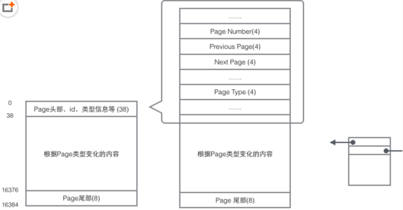
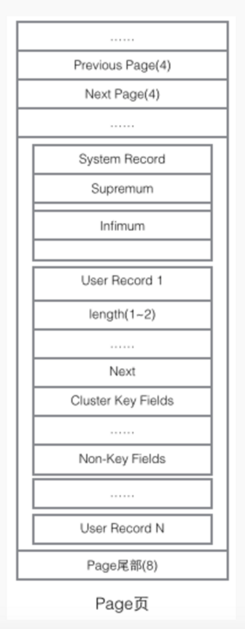
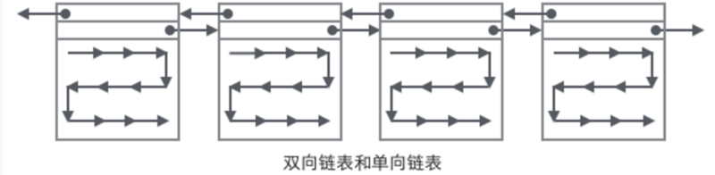

# Innodb 页的概念

`Page`是`Innodb`存储的最基本结构, 也是Innodb磁盘管理的最小单位, 与数据库相关的所有内容都存储在`Page`结构里. 

Page分为几种类型:

* 数据页(B-Tree Node)
* Undo页(Undo Log Page)
* 系统页(System Page)
* 事务数据页(Transaction System Page)等
* 每个数据页的大小为16kb, 每个Page使用一个32位(一位表示的就是0或1)的int值来表示, 正好对应Innodb最大64TB的存储容量(16kb * 2^32=64tib)
一个Page的基本结构如下：

## 头部数据

每个`page`都有通用的头和尾, 但是中部的内容根据`page`的类型不同而发生变化, 头部的数据如下

page头部保存了两个指针, 分别指向前一个Page和后一个Page, 头部还有Page的类型信息和用来唯一标识Page的编号. 根据这个指针分布可以想象到Page链接起来就是一个**双向链表**.

## 主体数据

在`Page`的主体部分, 主要关注数据和索引的存储, 他们都位于`User Records`部分, `User Records`占据`Page`的大部分空间, `User Records`由一条条的`Record`组成, 每条记录代表索引树上的一个节点(非叶子节点和叶子节点);在一个单链表的内部, 单链表的头尾由两条记录来表示, 字符串形式的"Infimum"代表开头, "Supremum"表示结尾; System Record 和 User Record是两个平行的段;

Innodb中存在四种不同的Record, 分别是

* 主键索引树非叶子节点
* 主键索引树叶子节点
* 辅助键索引树非叶子节点
* 辅助键索引树叶子节点

这四种节点Record格式上有差异, 但是内部都存储着Next指针指向下一个Record.

### User Record

`User Record`在`Page`内以单链表的形式存在, 最初数据是按照插入的先后顺序排列的, 但是随着新数据的插入和旧数据的删除, 数据物理顺序发生改变, 但是他们依然保持着逻辑上的先后顺序

把`User Record`组织形式和若干`Page`组织起来, 就得到了稍微完整的形式:

### 如何定位一个Record

## 整体的查找过程

## 简介的树形查找示意图