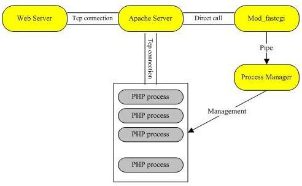

#2.1 生命周期和Zend引擎

####SAPI接口

`PHP架构图`:

SAPI(Server Application Programming Interface)指的是PHP具体应用的编程接口,就像PC一样,无论安装哪些操作系统,只要满足了PC的接口规范都可以在PC上正常运行,PHP脚本要执行有很多种方式,通过Web服务器,或者直接在命令行下,也可以嵌入在其他程序中.

通常,我们使用Apache或者Nginx这类Web服务器来测试PHP脚本,或者在命令行下通过PHP解释器程序来执行.脚本执行完后,Web服务器应答,浏览器显示应答信息,或者在命令行标准输出上显示内容.

虽然通过Web服务器和命令行程序执行脚本看起来很不一样,实际上它们的工作流程是一样的.命令行参数传递给PHP解释器要执行的脚本,相当于通过url请求一个PHP页面.脚本执行完成后返回响应结果,只不过命令行的响应结果是显示在终端上.

`脚本执行的开始都是以SAPI接口实现开始的`.只是不同的SAPI接口实现会完成他们特定的工作,例如Apache的mod_php SAPI实现需要初始化从Apache获取的一些信息,在输出内容是将内容返回给Apache,其他的SAPI实现也类似.

####开始和结束

PHP开始执行以后会经过两个主要的阶段:

* `处理请求之前`的`开始阶段`
* `处理请求之后`的`结束阶段`

**开始阶段**

 开始阶段有两个过程:
 
 * 模块初始化阶段(MINIT), `在整个SAPI生命周期内`(例如Apache`启动以后的整个生命周期内`或者命令行程序整个`执行过程中`),该过程只进行`一次`.
 * 模块激活阶段(RINT),该过程发生在`请求阶段`,例如通过url请求某个页面,则在`每次请求之前都会进行模块激活`(RINIT请求开始).
 
例如PHP注册了一些扩展模块,则在MINIT阶段会**`回调`**所有模块的MINIT函数.模块在这个阶段可以进行一些初始化工作,例如注册常量,定义模块使用的类等等.模块在实现时可以通过如下宏来实现这些**`回调函数`**:

		PHP_MINIT_FUNCTION(myphpextension)
		{
		    // 注册常量或者类等初始化操作
		    return SUCCESS; 
		}

请求到达之后PHP初始化执行脚本的基本环境,例如创建一个执行环境,包括保存PHP运行过程中变量名称和值内容的符号表,以及当前所有的函数以及类等信息的符号表.然后PHP会调用所有模块的RINIT函数,在这个阶段各个模块也可以执行一些相关的操作,块的RINIT函数和MINIT回调函数类似:

		PHP_RINIT_FUNCTION(myphpextension)
		{
		    // 例如记录请求开始时间
		    // 随后在请求结束的时候记录结束时间。这样我们就能够记录下处理请求所花费的时间了
		    return SUCCESS; 
		}

**结束阶段**

请求处理完后就进入了结束阶段,一般脚本执行到末尾或者通过调用exit()或die()函数,PHP都将进入结束阶段.结束阶段也分为两个环节:

* 一个在`请求结束后`停用模块(RSHUTDOWN,对应RINIT),
* 一个在`SAPI生命周期结束`(Web服务器退出或者命令行脚本执行完毕退出)时关闭模块(MSHUTDOWN,对应MINIT)

		PHP_RSHUTDOWN_FUNCTION(myphpextension)
		{
		    // 例如记录请求结束时间，并把相应的信息写入到日至文件中。
		    return SUCCESS; 
		}

**几个重要的函数**

`PHP_MINIT_FUNCTION(MyModule)`

当`模块`被Zend Engine(ZE)`加载`后,例如Apache启动,加载了PHP模块,ZE会对每一个扩展模块调用此函数(如果有的话),可以在该函数里进行一些`初始化`操作.

`PHP_RINIT_FUNCTION(MyModule)`

对于每一个"`使用`"该模块的`PHP脚本请求前`,都执行该函数(如果有的话),最好的例子: Session扩展模块,如果在一个PHP脚本里执行session.start(),Session模块的PHP_RINIT_FUNCTION()将被调用.

`PHP_RSHUTDOWN_FUNCTION(MyModule)`

与PHP_RINIT_FUNCTION()相反,该函数是在一个`PHP脚本执行完毕后执行`.

`PHP_MSHUTDOWN_FUNCTION(MyModule)`

当ZE收到shutdown信号后,例如apache卸载PHP模块,ZE对每一个模块调用此函数，最后关闭自己的核心子系统

####单进程SAPI生命周期

CLI/CGI模式的PHP属于单进程的SAPI模式.这类的请求在处理一次请求后就关闭.

经过如下环节,SAPI接口实现就完成了其生命周期:

* 开始
* 请求开始
* 请求关闭
* 结束

**启动**

在调用每个模块的模块初始化前,会有一个初始化的过程,包括:

`初始化若干全局变量`:

这里的初始化全局变量大多数情况下是将其设置为`NULL`,有一些除外,比如设置zuf(zend_utility_functions).

		以zuf.printf_function = php_printf为例,这里的php_printf在zend_startup函数中会被赋值给zend_printf作为全局函数指针使用,而zend_printf函数通常会作为常规字符串输出使用,比如显示程序调用栈的debug_print_backtrace就是使用它打印相关信息.

`初始化若干常量`:

这里的常量是PHP自己的一些常量,这些常量要么是`硬编码在程序中`,比如`PHP_VERSION`.要么是写在`配置头文件中`,比如`PEAR_EXTENSION_DIR`,这些是写在`config.w32.h`文件中.

`初始化Zend引擎和核心组件`:

前面提到的`zend_startup`函数的作用就是`初始化Zend引擎`,这里的初始化操作包括:

* 内存管理初始化
* 全局使用的函数指针初始化(zend_printf等)
* 对PHP源文件进行词法分析
* 语法分析
* 中间代码执行的函数指针的赋值
* 初始化若干HashTable(比如函数表,常量表等等)
* 为ini文件解析做准备
* 为PHP源文件解析做准备
* 注册内置函数(如strlen、define等)
* 注册标准常量(如E_ALL、TRUE、NULL等)
* 注册GLOBALS全局变量
* ...

`解析php.ini`:

`php_init_config`函数的作用是`读取php.ini文件`,`设置配置参数`,加载zend扩展并注册PHP扩展函数.此函数分为如下几步:

* 初始化参数配置表
* 调用当前模式下的ini初始化配置

比如CLI模式下,会做如下初始化:

		INI_DEFAULT("report_zend_debug", "0");
		INI_DEFAULT("display_errors", "1");

不过在其它模式下却没有这样的初始化操作.接下来会的各种操作都是查找ini文件:

1. 判断是否有php_ini_path_override,在CLI模式下可以通过`-c`参数指定此路径(在php的命令参数中-c表示在指定的路径中查找ini文件).
2. 如果没有php_ini_path_override,判断php_ini_ignore是否为非空(忽略php.ini配置,这里也就CLI模式下有用,使用`-n`参数).
3. 如果不忽略ini配置,则开始处理php_ini_search_path(查找ini文件的路径),这些路径包括CWD(当前路径，不过这种不适用CLI模式),执行脚本所在目录,环境变量PATH和PHPRC和配置文件中的PHP_CONFIG_FILE_PATH的值.
4. 在准备完查找路径后,PHP会判断现在的ini路径(php_ini_file_name)`是否为文件`和`是否可打开`.如果这里ini路径是文件并且可打开,则会使用此文件,也就是CLI模式下通过-c参数指定的ini文件的优先级是最高的.其次是PHPRC指定的文件,第三是在搜索路径中查找php-%sapi-module-name%.ini文件(如CLI模式下应该是查找php-cli.ini文件),最后才是搜索路径中查找php.ini文件.

`全局操作函数的初始化`:

`php_startup_auto_globals`函数会初始化在用户空间所使用频率很高的一些全局变量,如:`$_GET`、`$_POST`、`$_FILES`等.这里只是初始化,所调用的`zend_register_auto_global`函数也只是`将这些变量名添加到CG(auto_globals)这个变量表`.

`php_startup_sapi_content_types`函数用来初始化SAPI对于不同类型内容的处理函数,里的处理函数包括POST数据默认处理函数、默认数据处理函数等.

`初始化静态构建的模块和共享模块(MINIT)`

`php_register_internal_extensions_func`函数用来注册静态构建的模块,也就是默认加载的模块,我们可以将其认为内置模块.在PHP5.3.0版本中内置的模块包括PHP标准扩展模块(`ext/standard/`目录,这里是我们用的最频繁的函数,比如字符串函数,数学函数,数组操作函数等等),日历扩展模块、FTP扩展模块、session扩展模块等.这些内置模块并不是一成不变的,在不同的PHP模板中,由于不同时间的需求或其它影响因素会导致这些默认加载的模块会变化，,比如从代码中我们就可以看到mysql、xml等扩展模块曾经或将来会作为内置模块出现.

`模块初始化会执行两个操作`:

1. 将这些`模块注册到已注册模块列表`(`module_registry`),如果注册的模块已经注册过了,PHP会报`Module XXX already loaded`的错误.
2. 将`每个模块中包含的函数注册到函数表`(`CG(function_table)`),如果函数无法添加,则会报`Unable to register functions, unable to load`.

在注册了静态构建的模块后,PHP会`注册附加的模块`,不同的模式下可以加载不同的模块集,比如在CLI模式下是没有这些附加的模块的.

在内置模块和附加模块后,接下来是`注册通过共享对象`(如DLL)和php.ini文件灵活配置的扩展.

`在所有的模块都注册后`,PHP会马上执行`模块初始化操作`(`zend_startup_modules`).它的整个过程就是`依次遍历每个模块`, 也就是在本小节前面所说的用`宏` `PHP_MINIT_FUNCTION`包含的内容,

`禁用函数和类`:

`php_disable_functions`函数用来禁用PHP的一些函数.这些被禁用的函数来自PHP的配置文件的`disable_functions`变量.其禁用的过程是调用`zend_disable_function函数将指定的函数名从CG(function_table)函数表中删除`.

`php_disable_classes`函数用来禁用PHP的一些类.这些被禁用的类来自PHP的配置文件的disable_classes变量.其禁用的过程是调用`zend_disable_class函数将指定的类名从CG(class_table)类表中删除`.

**激活ACTIVATION**

在处理了文件相关的内容,PHP会调用`php_request_startup`做`请求初始化操作`.除了图中显示的调用每个模块的请求初始化函数外,还做了较多的其它工作,其主要内容如下:

`激活Zend引擎`:

`gc_reset`函数用来`重置垃圾收集机制`(>PHP5.3).

`init_compiler`函数用来`初始化编译器`,将编译过程中放在opcode里的数组清空,准备编译时需要用的数据结构等等.

`init_executor`函数用来`初始化中间代码执行过程`.在编译过程中,函数列表,类列表等都存放在编译时的全局变量中,在准备执行过程时,会将这些列表赋值给执行的全局变量中,如:EG(function_table) = CG(function_table);`中间代码执行是在PHP的执行虚拟栈中`,初始化时这些栈等都会一起被初始化.除了栈,还有存放变量的符号表(EG(symbol_table))会被初始化为50个元素的hashtable,存放对象的EG(objects_store)被初始化了1024个元素.PHP的执行环境除了上面的一些变量外,还有错误处理,异常处理等等,这些都是在这里被初始化的.`通过php.ini配置的zend_extensions也是在这里被遍历调用activate函数`.

`激活SAPI`:

`sapi_activate`函数用来`初始化` `SG(sapi_headers)`和`SG(request_info)`,并且针对HTTP请求的方法设置一些内容,比如当请求方法为HEAD时,设置SG(request_info).headers_only=1;此函数最重要的一个操作是处理请求的数据,其最终都会调用`sapi_module.default_post_reader`.而sapi_module.default_post_reader在前面的模块初始化是通过php_startup_sapi_content_types函数注册了.默认处理函数为main/php_content_types.c文件中php_default_post_reader函数.此函数会将POST的原始数据写入$HTTP_RAW_POST_DATA变量.

在处理了post数据后,PHP会通过sapi_module.read_cookies读取cookie的值,在CLI模式下,此函数的实现为sapi_cli_read_cookies,而在函数体中却只有一个return NULL.

如果当前模式下有设置activate函数,则运行此函数,激活SAPI,在CLI模式下此函数指针被设置为NULL.

`环境初始化`:

这里的环境初始化是指在用户空间中需要用到的一些环境变量初始化,这里的环境包括服务器环境,请求数据环境等.实际到我们用到的变量,就是`$_POST`、`$_GET`、`$_COOKIE`、`$_SERVER`、`$_ENV`、`$_FILES`.和`sapi_module.default_post_reader`一样,sapi_module.treat_data的值也是在模块初始化时.通过php_startup_sapi_content_types函数注册了默认数据处理函数为main/php_variables.c文件中php_default_treat_data函数.

		以$_COOKIE为例,php_default_treat_data函数会对依据分隔符,将所有的cookie拆分并赋值给对应的变量.

`模块请求初始化`:

PHP通过`zend_activate_modules`函数实现模块的请求初始化,也就是我们在图中看到`Call each extension's RINIT`.此函数通过`遍历`注册在`module_registry`变量中的所有模块,调用其`RINIT`方法实现模块的请求初始化操作.

**运行**

`php_execute_script`函数包含了运行PHP脚本的全部过程.

当一个PHP文件需要解析执行时,它可能会需要执行三个文件:

1. 一个前置执行文件(`php.ini文件通过auto_prepend_file参数`,如果将这个参数设置为空,则禁用对应的执行文件)
2. 当前需要执行的主文件
3. 一个后置执行文件(`php.ini文件通过auto_append_file参数`,如果将这个参数设置为空,则禁用对应的执行文件)

对于需要解析执行的文件:

`生成中间代码(zend_compile_file)`:

通过`zend_compile_file`(compile_file函数)做词法分析,语法分析和中间代码生成操作,返回此文件的所有`中间代码`.

`执行中间代码(zend_execute)`:

如果解析的文件有生成有效的中间代码,则调用zend_execute(execute函数)执行中间代码.

`异常处理`:

如果在执行过程中出现异常并且用户有定义对这些异常的处理,则调用这些异常处理函数.

`返回结果`:

在所有的操作都处理完后,PHP通过`EG(return_value_ptr_ptr)`返回结果.

**DEACTIVATION**

PHP关闭请求的过程是一个若干个关闭操作的集合,这个集合存在于`php_request_shutdown`函数中.这个集合包括如下内容:

1. 调用所有通过`register_shutdown_function()`注册的函数.这些在关闭时调用的函数是在用户空间添加进来的.

		一个简单的例子,我们可以在脚本出错时调用一个统一的函数,给用户一个友好一些的页面,这个有点类似于网页中的404页面.
		
2. 执行所有可用的`__destruct`函数.这里的析构函数包括在`对象池EG(objects_store)`中的所有对象的析构函数以及`EG(symbol_table)`中各个元素的析构方法.
3. 所有的`输出刷出去`.
4. `发送HTTP应答头`.这也是一个输出字符串的过程,只是这个字符串可能符合某些规范.
5. 遍历每个模块的关闭请求方法,执行模块的请求关闭操作,这就是我们在图中看到的`Call each extension's RSHUTDOWN`.
6. 销毁全局变量表(PG(http_globals))的变量.
7. 通过`zend_deactivate`函数,`关闭` `词法分析器`,`语法分析器`和`中间代码执行器`.
8. 调用每个扩展的post-RSHUTDOWN函数.只是基本每个扩展的post_deactivate_func函数指针都是NULL.
9. 关闭SAPI,通过sapi_deactivate销毁SG(sapi_headers)、SG(request_info)等的内容.
10. 关闭流的包装器,关闭流的过滤器.
11. 关闭内存管理.
12. 重新设置最大执行时间.

**结束**

`flush`

sapi_flush`将最后的内容刷新出去`.其调用的是sapi_module.flush,在CLI模式下等价于fflush函数.

`关闭Zend引擎`

zend_shutdown将关闭Zend引擎.

此时对应图中的流程,我们应该是执行每个模块的关闭模块操作.在这里只有一个`zend_hash_graceful_reverse_destroy`函数将`module_registry`销毁了.当然,
它最终也是调用了关闭模块的方法的,其根源在于在初始化module_registry时就设置了这个hash表析构时(**`注意是hash表析构时`**)调用ZEND_MODULE_DTOR宏.ZEND_MODULE_DTOR宏对应的是`module_destructor`函数.在此函数中会调用模块的`module_shutdown_func`方法.即`PHP_RSHUTDOWN_FUNCTION`宏产生的那个函数.

在关闭所有的模块后,PHP继续`销毁全局函数表`,`销毁全局类表`,`销售全局变量表等`. 通过`zend_shutdown_extensions` `遍历` `zend_extensions所有元素`,调用每个扩展的`shutdown`函数.

**示例:php的memcached扩展**

`第一阶段` 是PHP模块初始化阶段(**`MINT`**),可以初始化扩展内部变量,分配资源和注册资源处理器,在整个PHP实例生命周期内.该过程只执行一次.

		    PHP_MINIT_FUNCTION(memcached) {       
		        zend_class_entry ce;      
		        memcpy(&memcached_object_handlers,zend_get_std_object_handlers(), sizeof(zend_object_handlers));      
		    	memcached_object_handlers.clone_obj = NULL;     /* 执行了一些类似的初始化操作 */       
		    	return SUCCESS;   
		    }  

`第二阶段` 是请求初始化阶段(**`RINT`**),在模块初始化并`激活`后,会创建PHP运行环境,同时调用所有模块注册的RINT函数,调用`每个扩展的请求初始化函数`,设定特定的环境变量,分配资源或执行其他任务,如审核等.

		PHP_RINIT_FUNCTION(memcached) {       
        	/* 执行一些关于请求的初始化 */        
        	return SUCCESS;   
    	}  

`第三阶段` 请求处理完成后,会调用PHP_RSHUTDOWN_FUNCTION进行`回收`,这是每个扩展的请求关闭函数,执行最后的清理工作.Zend引擎执行清理过程,垃圾收集,对之前的请求期间用到的每个变量执行unset.请求完成可能是执行到脚本完成,也可能是调用die()或exit()函数完成.

`第四阶段` 当PHP生命周期结束时候,PHP_MSHUTDOWN_FUNCTION对模块进行回收处理,这是每个扩展的模块关闭函数,用于关闭自己的内核子系统.

		    PHP_MSHUTDOWN_FUNCTION(memcached) { 
		    	/* 执行关于模块的销毁工作 */ 						UNREGISTER_INI_ENTRIES(); 
		    	return SUCCESS; 
		    }  
	
####SAPI常见的运行模式	

* CLI和CGI模式(单进程模式)
* 多进程模式
* 多线程模式
* FastCGI模式
* 嵌入式

**CLI/CGI模式**

CLI和CGI都属于`单进程模式`,PHP的`生命周期在一次请求中完成`.也就是说每次执行PHP脚本,都会执行四个INT和SHUTDOWN事件.图例和解释在上文的**`单进程SAPI生命周期`**

		
**多进程SAPI生命周期**

通常PHP是编译为`apache`的一个`模块`来处理PHP请求.Apache一般会采用多进程模式(`prefork`),Apache启动后会fork出多个子进程,每个进程的内存空间独立,每个子进程都会经过开始和结束环节,不过每个进程的开始阶段只在进程fork出来以来后进行,在整个进程的生命周期内可能会`处理多个请求`.`只有`在`Apache关闭`或者`进程被结束`之后才会进行`关闭阶段`.在这两个阶段之间会随着每个请求 重复 `请求开始-请求关闭的环节`.

**多线程的SAPI生命周期**

多线程模式和多进程中的某个进程类似,不同的是在整个进程的生命周期内会**`并行`**的重复着 `请求开始-请求关闭的环节`.

**FastCGI模式**

Nginx+PHP-FPM用的就是FastCGI模式,Fastcgi是一种特殊的CGI模式,是一种常驻进程类型的`CGI`,运行后可以`Fork多个进程`,`不用`花费时间`动态`的`Fork子进程`,也不需要每次请求都调用MINT/MSHUTDOWN.PHP通过PHP-FPM来管理和调度FastCGI的进程池.Nginx和PHP-FPM通过本地的TCP Socket和Unix Socket进行通信.

PHP-FPM进程管理器自身初始化,启动多个CGI解释器进程等待来自Nginx的请求.当客户端请求达到PHP-FPM,管理器选择到一个CGI进程进行处理,`Nginx将CGI环境变量和标准输入发送到一个PHP-CIG子进程`.PHP-CGI子进程处理完成后,将标准输出和错误信息返回给Nginx,当PHP-CGI子进程关闭连接时,请求处理完成.PHP-CGI子进程等待着下一个连接.

可以想象CGI的系统开销有多大.每一个Web 请求PHP都必须重新解析php.ini,载入全部扩展并始化全部数据结构.使用FastCGI,所有这些都只在进程启动时发生一次.

**内嵌模式(Embedded)**

这种SAPI和CLI模式一样.

