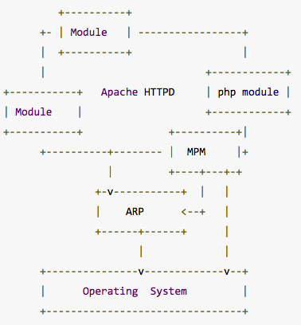
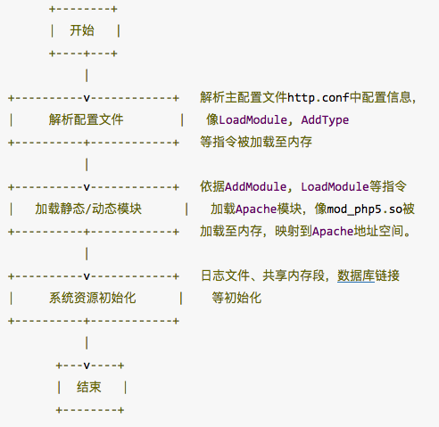
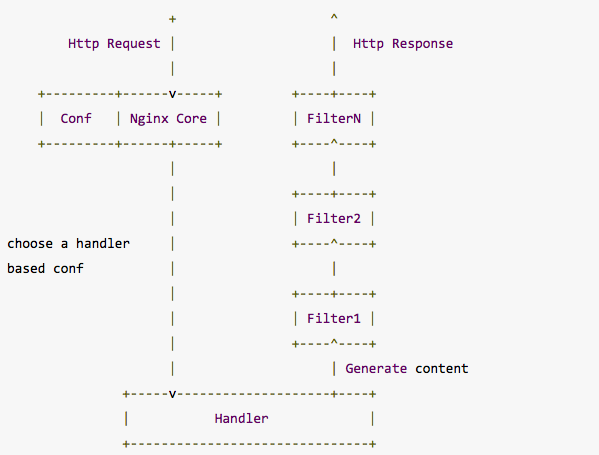

#从运行原理及使用场景看Apache和Nginx

---

[参考连接](http://www.linuxeye.com/Linux/2003.html,"参考连接")

###Web服务器

WWW(WORLD WIDE WEB)服务器,主要功能:

* 应用层使用HTTP协议.
* HTML文档格式.
* 浏览器统一资源定位器(URL).

Web服务器常常以`B/S`(Browser/Server)方式提供服务.浏览器和服务器的交互方式如下:

1. 浏览器向服务器发出HTTP请求(Request).
2. 服务器收到浏览器的请求数据,经过分析处理,向浏览器输出响应数据(Response).
3. 浏览器收到服务器的响应数据,经过分析处理,将最终结果显示在浏览器中.

`Apache`和`Nginx`都属于`Web服务器`,两者都实现了HTTP 1.1协议.

###Apache

####概述

Apache HTTP Server是Apache软件基金会的一个开放源代码的网页服务器,可通过简单的API扩充,将Perl／Python等解释器编译到服务器.

####Apache组件

Apache是`基于` `模块化设计的`,核心代码并不多,大多数的功能都被分散到各个模块中,各个模块在系统启动的时候按需载入.

**MPM(Multi -Processing Modules)**

MPM(Multi -Processing Modules,多重处理模块)是Apache的核心组件之一,Apache通过MPM来`使用操作系统的资源`,对`进程和线程池进行管理`.Apache为了能够获得最好的运行性能,针对不同的平台(Unix/Linux、Window)做了优化,`为不同的平台提供了不同的MPM`,用户可以根据实际情况进行选择,其中最常使用的MPM有 **`prefork`** 和 **`worker`** 两种.服务器以哪种方式运行,取决于安装Apache过程中指定的MPM编译参数,在X系统上默认的编译参数为 `prefork`.

`不支持真正的线程`(大多数Unix),采用`预派生子进程(prefork)`方式.

`支持线程的平台`(Windows或者Solaris),采用`多进程多线程混合的worker模式`.

**APR(Apache portable Runtime Library)**

Apache可移植运行库,它是一个`对操作系统调用`的`抽象库`,用来`实现Apache内部组件` `对操作系统的使用`,`提高`系统的`可移植性`.

		Apache对于php的解析,就是通过众多Module中的php Module来完成的.
		
####Apache生命周期

")

这个生命周期是在`perfork`工作下的示意,从图中可以看出,Apache对于`每一个请求都要启动一个单独的进程来处理`.

####Apache的工作模式

**prefork的工作原理**

一个单独的`控制进程(父进程)`负责`产生子进程`,这些`子进程`用于`监听请求并作出应答`.Apache总是试图保持一些`备用的(spare)`或是`空闲的`子进程用于迎接即将到来的请求.这样客户端就无需在得到服务前等候子进程的产生.在Unix系统中,`父进程`通常以`root`身份运行以便`绑定80端口`,而 Apache产生的`子进程`通常以一个`低特权的用户`运行.User和Group指令用于配置子进程的低特权用户.运行子进程的用户必须要对他所服务的内容有`读取`的权限,但是对服务内容之外的其他资源必须拥有尽可能少的权限.

**worker的工作原理**

每个`进程`能够拥有的`线程数量`是`固定`的.服务器会根据负载情况增加或减少进程数量.一个单独的控制进程(父进程)负责子进程的建立.每个`子进程`能够`建立ThreadsPerChild数量的服务线程和一个监听线程`.该`监听线程` `监听` `接入请求`并将其`传递给服务线程处理和应答`.Apache总是试图维持一个备用(spare)或是空闲的服务线程池.这样,客户端无须等待新线程或新进程的建立即可得到处理.在Unix系统中,`父进程`通常以`root`身份运行以便`绑定80端口`,而 Apache产生的`子进程`通常以一个`低特权的用户`运行.User和Group指令用于配置子进程的低特权用户.运行子进程的用户必须要对他所服务的内容有`读取`的权限,但是对服务内容之外的其他资源必须拥有尽可能少的权限.

####Apache的运行

**启动阶段**

Apache主要进行:

* `配置文件解析`(例如http.conf以及Include指令设定的配置文件等)
* `模块加载`(例如modphp.so,modperl.so等)
* `系统资源初始化`(例如日志文件、共享内存段等)

在这个阶段,Apache为了获得系统资源最大的使用权限,将以特权用户root(X系统)或超级管理员administrator(Windows系统)完成启动.

**运行阶段**

Apache主要工作是处理用户的服务请求.在这个阶段,Apache放弃特权用户级别,使用普通权限,这主要是基于安全性的考虑,防止由于代码的缺陷引起的安全漏洞.

由于Apache的Hook机制,Apache 允许模块(包括内部模块和外部模块,例如mod_php5.so,mod_perl.so等)将自定义的函数注入到请求处理循环中.mod_php5.so/php5apache2.dll就是将所包含的自定义函数,通过Hook机制注入到Apache中,在Apache处理流程的各个阶段负责处理php请求.

Apache将请求处理循环分为11个阶段:

* `Post-Read-Request`: 在正常请求处理流程中,这是模块可以插入钩子的第一个阶段.对于那些想很早进入处理请求的模块来说,这个阶段可以被利用.
* `URI Translation`: 将请求的URL映射到本地文件系统.`mod_alias`就是利用这个阶段工作的.
* `Header Parsing`: 检查请求的头部.`mod_setenvif`就是利用这个阶段工作的.
* `Access Control`: 根据配置文件检查是否允许访问请求的资源.Apache的标准逻辑实现了允许和拒绝指令.`modauthzhost`就是利用这个阶段工作的.
* `Authentication`: 按照配置文件设定的策略对用户进行认证,并设定用户名区域.
* `Authorization`: 根据配置文件检查是否允许认证过的用户执行请求的操作.权限管理.
* `MIME Type Checking`: 根据请求资源的MIME类型的相关规则,判定将要使用的内容处理函数.
* `FixUp`: 这是一个通用的阶段,允许模块在内容生成器之前,运行任何必要的处理流程.
* `Response`: 生成返回客户端的内容,负责给客户端发送一个恰当的回复.
* `Logging`: 在回复已经发送给客户端之后记录事务.
* `CleanUp`: 清理本次请求事务处理完成之后遗留的环境,比如文件、目录的处理或者Socket的关闭等等,这是Apache一次请求处理的最后一个阶段.

###Nginx

####概述

Nginx是一款由俄罗斯程序员Igor Sysoev所开发轻量级的网页服务器、反向代理服务器以及电子邮件(IMAP/POP3)代理服务器.

####Nginx的模块与工作原理

Nginx由内核和模块组成,其中,内核的设计非常微小和简洁,完成的工作也非常简单,仅仅通过`查找配置文件` `将客户端请求` `映射` 到一个`location block`(location是Nginx配置中的一个指令,用于URL匹配),而在这个`location`中所配置的`每个指令`将会`启动不同的模块去完成相应的工作`.

**Nginx的模块从结构划分**

* `核心模块`: HTTP模块,EVENT模块和MAIL模块.
* `基础模块`: HTTP Access模块、HTTP FastCGI模块、HTTP Proxy模块和HTTP Rewrite模块.
* `第三方模块`: HTTP Upstream Request Hash模块、Notice模块和HTTP Access Key模块.

**Nginx的模块从功能上划分**

* `Handlers(处理器模块)`: 此类模块`直接处理请求`,并进行输出内容和修改headers信息等操作.Handlers处理器模块一般只能有一个.
* `Filters(过滤器模块)`: 此类模块主要`对其他处理器模块输出的内容进行修改操作`,最后由Nginx输出. 
* `Proxies(代理类模块)`: 此类模块是Nginx的HTTP Upstream之类的模块,这些模块主要与后端一些服务比如FastCGI等进行交互,实现服务代理和负载均衡等功能.

Nginx本身做的工作实际很少,当它接到一个HTTP请求时,它仅仅是通过查找配置文件将此次请求映射到一个location block,而此location中所配置的各个指令则会启动不同的模块去完成工作,因此模块可以看做Nginx真正的劳动工作者.

通常一个location中的指令会涉及一个handler模块和多个filter模块(多个location可以复用同一个模块).

`handler模块负责处理请求,完成响应内容的生成,而filter模块对响应内容进行处理`.

**Nginx架构及工作流程**

这个架构类似于Apache的Worker工作状态,Nginx的每一个Worker进程都管理着大量的线程,真正处理请求的是Worker之下的线程.

所有实际上的业务处理逻辑都在worker进程.worker进程中有一个函数,执行无限循环,不断处理收到的来自客户端的请求,并进行处理,直到整个nginx服务被停止.

Worker中这个函数执行内容如下:

1. 操作系统提供的机制(例如epoll,kqueue等)产生相关的`事件`.
2. 接收和处理这些事件,如是接受到数据,则产生更高层的request对象.
3. 处理request的header和body.
4. 产生响应,并发送回客户端.
5. 完成request的处理.
6. 重新初始化定时器及其他事件.

###Nginx和FastCGI 

**FastCGI**

FastCGI是一个可伸缩地,高速地在`HTTP server`和`动态脚本语言`(如PHP)间`通信`的`接口`.

FastCGI是从CGI发展改进而来的.传统CGI接口方式的主要缺点是性能很差,`因为每次HTTP服务器遇到动态程序时都需要重新启动脚本解析器来执行解析`(性能差的原因),然后将结果返回给HTTP服务器.这在处理高并发访问时几乎是不可用的.另外传统的CGI接口方式安全性也很差,现在已经很少使用了.

FastCGI接口方式采用C/S结构,可以将`HTTP服务器`和`脚本解析服务器`**`分开`**,同时在脚本解析服务器上启动一个或者多个脚本解析守护进程.当HTTP服务器每次遇到动态程序时,可以将其直接交付给FastCGI进程来执行,然后将得到的结果返回给浏览器.这种方式可以让HTTP服务器专一地处理静态请求或者将动态脚本服务器的结果返回给客户端,这在很大程度上提高了整个应用系统的性能.

**Nging和FastCGI合作**

Nginx不支持对外部程序的直接调用或者解析,所有的外部程序(包括PHP)必须通过`FastCGI`接口来调用.FastCGI接口在Linux下是socket(这个socket可以是文件socket,也可以是ip socket).

**Nginx下PHP的运行过程**

`PHP-FPM`是管理FastCGI的一个`管理器`,它作为PHP的插件存在.

1. FastCGI进程管理器php-fpm自身初始化,启动主进程php-fpm和启动`start_servers`个CGI子进程.主进程php-fpm主要是管理fastcgi子进程,监听`9000`端口.`fastcgi子进程等待来自Web Server的连接`.

2. 当客户端请求到达Web Server Nginx是时,Nginx通过`location`指令,将所有以php为后缀的文件都交给`127.0.0.1:9000`来处理.

3. FastCGI进程管理器PHP-FPM`选择并连接到一个子进程CGI解释器`.Web server将CGI环境变量和标准输入发送到FastCGI子进程.

4. FastCGI子进程完成处理后将标准输出和错误信息从同一连接返回Web Server.`当FastCGI子进程关闭连接时,请求便告处理完成`.

5. FastCGI子进程接着等待并处理来自FastCGI进程管理器`(如果是php:PHP-FPM)`(运行在 WebServer中)的下一个连接.

###Apache和Nginx比较

####功能对比

Nginx和Apache一样,都是`HTTP服务器软件`,在功能实现上都采用模块化结构设计,都`支持通用的语言接口`,如PHP、Perl、Python等,同时还`支持正向和反向代理`,虚拟主机,URL重写,压缩传输,SSL加密传输等.

1. 在功能实现上,Apache的所有模块都支持动、静态编译,而Nginx模块都是静态编译的.
2. 对FastCGI的支持,Apache对Fcgi的支持不好,而Nginx对Fcgi的支持非常好.
3. 在处理连接方式上,Nginx支持epoll,而Apache却不支持.
4. 在空间使用上,Nginx安装包仅仅只有几百K,和Nginx比起来Apache绝对是庞然大物.

`Nginx相对apache的优点`:

* 轻量级,同样的web服务,比apache`占用更少的内存及资源`.
* `静态处理`,Nginx 静态处理性能比 Apache 高3倍以上.
* `抗并发`,`nginx` `处理请求`是`异步非阻塞的`,而`apache`则是`阻塞`型的,在高并发下nginx 能保持低资源低消耗高性能.在Apache+PHP(`prefork`)模式下,如果PHP处理慢或者前端压力很大的情况下,很容易出现Apache`进程数飙升`,从而`拒绝服务`的现象.
* 高度模块化的设计,编写模块相对简单.

`apache相对nginx的优点`:

* `rewrite`,比nginx的rewrite强大.
* 稳定.
* Apache对PHP支持比较简单,Nginx需要配合其他后端用.

`选择Nginx的优势`:

1. 作为Web服务器: Nginx处理`静态文件`,`索引文件`,`自动索引的效率非常高`.
2. 作为代理服务器,Nginx可以实现无缓存的反向代理加速,提高网站运行速度.
3. 作为负载均衡服务器,Nginx既可以在内部直接支持Rails和PHP,也可以支持HTTP代理服务器对外进行服务,同时还支持简单的容错和利用算法进行负载均衡.
4. 在性能方面,Nginx是专门为性能优化而开发的,在实现上非常注重效率.它采用内核`Poll模型(epoll and kqueue )`,可以`支持更多的并发连接`,最大可以支持对50 000个并发连接数的响应,而且只占用很低的内存资源.
5. 在稳定性方面,Nginx采取了分阶段资源分配技术,使得CPU与内存的占用率非常低.Nginx官方表示,Nginx保持10 000个没有活动的连接,而这些连接只占用2.5MB内存,因此,类似DOS这样的攻击对Nginx来说基本上是没有任何作用的.
6. 在高可用性方面,Nginx支持热部署,启动速度特别迅速,因此可以在不间断服务的情况下,对软件版本或者配置进行升级,即使运行数月也无需重新启动,几乎可以做到7×24小时不间断地运行.

