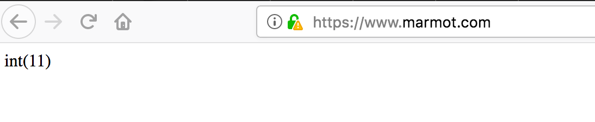

# 使用私有证书搭建https

---

今天需要给`mongo`添加私有证书, 顺便测试下给`http`添加私有证书.

在[openssl命令(私有证书)](../linux命令/openssl 命令(私有CA办法证书).md)这章节已经说明了怎么签署证书, 我拿示例的`httpd`证书做的示例.

首先我们从服务器下载如下两个文件:

* httpd.cert
* httpd.key

修改`nginx`的配置文件

```
listen       80;
listen 443;
ssl on;
ssl_certificate /var/www/html/public/httpd.cert;
ssl_certificate_key /var/www/html/public/httpd.key;
```

重启`nginx`. 访问`https://www.xxx.com/`. 这时候浏览器可能会限制你的访问, 添加到例外中, 则现在可以正常使用`https`访问该网站了.

