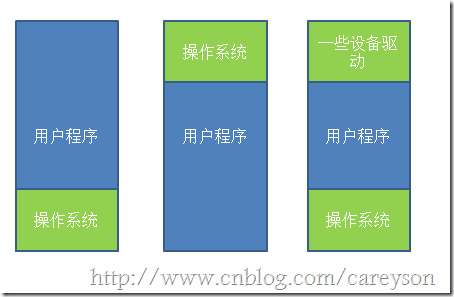
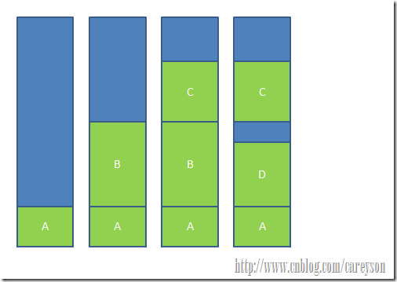
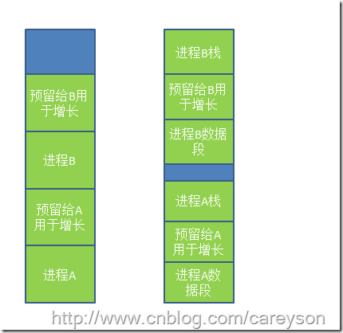
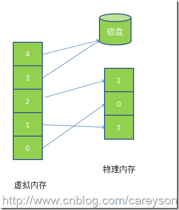
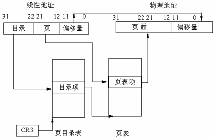
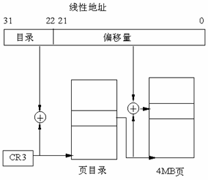
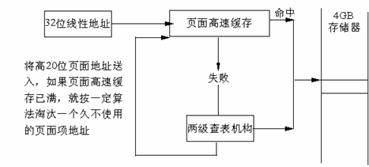

# 操作系统内存详解

---

### 进程的简单介绍

进程是占有资源的最小单位, 这个资源当然包括内存. 在现代操作系统中, 每个进程所能访问的内存是互相独立的(一些交换区除外). 而进程中的线程所以共享进程锁分配的内存空间.

在操作系统的角度来看, `进程 = 程序 + 数据 + PCB(进程控制块)`.

### 没有内存抽象

在早些操作系统中,并没有引入内存抽象的概念.程序直接访问和操作的都是物理内存.比如当执行如下指令时:

		mov reg1, 1000
		
这条指令会将物理地址1000中的内容赋值给寄存器.这种内存操作方式使得操作系统中存在多进程变得完全不可能.比如MS-DOS,你必须执行完一条指令后才能接着执行下一条.如果是多进程的话,由于直接操作物理内存地址,当一个进程给内存地址1000赋值后,另一个进程也同样给内存地址赋值,那么第二个进程对内存的赋值会覆盖第一个进程所赋的值,这会造成两条进程同时崩溃.

没有内存抽象对于内存的管理通常非常简单,除去操作系统所用的内存之外,全部给用户程序使用.或是在内存中多留一片区域给驱动程序使用,如图所示:

第一种情况操作系统存于RAM中,放在内存的低地址,第二种情况操作系统存在于ROM中,存在内存的高地址,一般老式的手机操作系统是这么设计的.

如果这种情况下,想要操作系统可以执行多进程的话,唯一的解决方案就是和硬盘搞交换,当一个进程执行到一定程度时,整个存入硬盘,转而执行其它进程,到需要执行这个进程时,再从硬盘中取回内存,只要同一时间内存中只有一个进程就行,这也就是所谓的交换(Swapping)技术.但这种技术由于还是直接操作物理内存,依然有可能引起进程的崩溃.

所以,通常来说,这种内存操作往往只存在于一些洗衣机,微波炉的芯片中,因为不可能有第二个进程去征用内存.

### 内存抽象

为了解决直接操作内存带来的各种问题,引入的地址空间(Address Space),这允许每个进程拥有自己的地址.这还需要硬件上存在两个寄存器,基址寄存器(base register)和界址寄存器(limit register),第一个寄存器保存进程的开始地址,第二个寄存器保存上界,防止内存溢出.

		mov reg1,20

这时,实际操作的物理地址并不是20,而是根据基址和偏移量算出实际的物理地址进程操作,此时操作的实际地址可能是:

		mov reg1,16245

在这种情况下,任何操作虚拟地址的操作都会被转换为操作物理地址.而每一个进程所拥有的内存地址是完全不同的,因此也使得多进程成为可能.

但此时还有一个问题,通常来说,内存大小不可能容纳下所有并发执行的进程.因此,交换(Swapping)技术应运而生.这个交换和前面所讲的交换大同小异,只是现在讲的交换在多进程条件下.交换的基本思想是,将闲置的进程交换出内存,暂存在硬盘中,待执行时再交换回内存,比如下面一个例子,当程序一开始时,只有进程A,逐渐有了进程B和C,此时来了进程D,但内存中没有足够的空间给进程D,因此将进程B交换出内存,分给进程D.如图所示:

我们还发现一个问题,进程D和C之间的空间由于太小无法另任何进程使用,这也就是所谓的外部碎片.一种方法是通过紧凑技术(Memory Compaction)解决,通过移动进程在内存中的地址,使得这些外部碎片空间被填满.还有一些讨巧的方法,比如内存整理软件,原理是申请一块超大的内存,将所有进程置换出内存,然后再释放这块内存,从而使得从新加载进程,使得外部碎片被消除.这也是为什么运行完内存整理会狂读硬盘的原因.另外,使用紧凑技术会非常消耗CPU资源,一个2G的CPU每10ns可以处理4byte,因此多一个2G的内存进行一次紧凑可能需要好几秒的CPU时间.

### 进程内存是动态变化的

实际情况下,进程往往会动态增长,因此创建进程时分配的内存就是个问题了,如果分配多了,会产生内部碎片,浪费了内存,而分配少了会造成内存溢出.一个解决方法是在进程创建的时候,比进程实际需要的多分配一点内存空间用于进程的增长.一种是直接多分配一点内存空间用于进程在内存中的增长,另一种是将增长区分为数据段和栈(用于存放返回地址和局部变量),如图所示.

### 空间不足的解决方案

当预留的空间不够满足增长时,操作系统首先会看相邻的内存是否空闲,如果空闲则自动分配,如果不空闲,就将整个进程移到足够容纳增长的空间内存中,如果不存在这样的内存空间,则会将闲置的进程置换出去.

### 内存的管理策略

当允许进程动态增长时,操作系统必须对内存进行更有效的管理,操作系统使用如下两种方法之一来得知内存的使用情况,分别为

1. 位图(bitmap) 
2. 链表

使用位图,将内存划为多个大小相等的块,比如一个32K的内存1K一块可以划为32块,则需要32位(4字节)来表示其使用情况,使用位图将已经使用的块标为1,未使用的标为0.而使用链表，则将内存按使用或未使用分为多个段进行链接,这个概念如图所示。

使用链表中的P表示进程,0-2是进程,H表示空闲,3-4表示是空闲.

使用位图表示内存简单明了,但一个问题是当分配内存时必须在内存中搜索大量的连续0的空间,这是十分消耗资源的操作.相比之下,使用链表进行此操作将会更胜一筹.还有一些操作系统会使用双向链表,因为当进程销毁时,邻接的往往是空内存或是另外的进程.使用双向链表使得链表之间的融合变得更加容易.

还有,当利用链表管理内存的情况下,创建进程时分配什么样的空闲空间也是个问题.通常情况下有如下几种算法来对进程创建时的空间进行分配.

* 临近适应算法(Next fit)—从当前位置开始,搜索第一个能满足进程要求的内存空间 
* 最佳适应算法(Best fit)—搜索整个链表,找到能满足进程要求最小内存的内存空间 
* 最大适应算法(Wrost fit)—找到当前内存中最大的空闲空间 
* 首次适应算法(First fit) —从链表的第一个开始,找到第一个能满足进程要求的内存空间

### 虚拟内存(Virtual Memory)

虚拟内存是现代操作系统普遍使用的一种技术.前面所讲的抽象满足了多进程的要求,但很多情况下,现有内存无法满足仅仅一个大进程的内存要求(比如很多游戏,都是10G+的级别).在早期的操作系统曾使用覆盖(overlays)来解决这个问题,将一个程序分为多个块,基本思想是先将块0加入内存,块0执行完后,将块1加入内存.依次往复,这个解决方案最大的问题是需要程序员去程序进行分块,这是一个费时费力让人痛苦不堪的过程.后来这个解决方案的修正版就是虚拟内存.

虚拟内存的基本思想是,每个进程有用独立的逻辑地址空间,内存被分为大小相等的多个块,称为页(Page).每个页都是一段连续的地址.对于进程来看,逻辑上貌似有很多内存空间,其中一部分对应物理内存上的一块(称为页框，通常页和页框大小相等),还有一些没加载在内存中的对应在硬盘上,如图所示.

虚拟内存实际上可以比物理内存大,当访问虚拟内存时,会访问MMU(内存管理单元)去匹配对应的物理地址(比如图5的0，1，2),而如果虚拟内存的页并不存在于物理内存中(如图的3,4),会产生缺页中断,从磁盘中取得缺的页放入内存,如果内存已满,还会根据某种算法将磁盘中的页换出.

而虚拟内存和物理内存的匹配是通过页表实现,页表存在MMU中,页表中每个项通常为32位,既4byte,除了存储虚拟地址和页框地址之外,还会存储一些标志位,比如是否缺页,是否修改过,写保护等.可以把MMU想象成一个接收虚拟地址项返回物理地址的方法.

因为页表中每个条目是4字节,现在的32位操作系统虚拟地址空间会是2的32次方,即使每页分为4K,也需要2的20次方*4字节=4M的空间,为每个进程建立一个4M的页表并不明智.因此在页表的概念上进行推广,产生二级页表,二级页表每个对应4M的虚拟地址,而一级页表去索引这些二级页表,因此32位的系统需要1024个二级页表,虽然页表条目没有减少,但内存中可以仅仅存放需要使用的二级页表和一级页表,大大减少了内存的使用.

### 分页机制

#### 为什么使用两级页表

假设每个进程都占用了4G的线性地址空间,页表共含1M个表项,每个表项占4个字节,那么每个进程的页表要占据4M的内存空间.为了节省页表占用的空间,我们使用两级页表.每个进程都会被分配一个页目录,但是只有被实际使用页表才会被分配到内存里面.一级页表需要一次分配所有页表空间,两级页表则可以在需要的时候再分配页表空间.

#### 两级页表结构

两级表结构的第一级称为页目录,存储在一个4K字节的页面中.页目录表共有1K个表项,每个表项为4个字节,并指向第二级表.线性地址的最高10位(即位31~位32)用来产生第一级的索引,由索引得到的表项中,指定并选择了1K个二级表中的一个表.
两级表结构的第二级称为页表,也刚好存储在一个4K字节的页面中,包含1K个字节的表项,每个表项包含一个页的物理基地址.第二级页表由线性地址的中间10位(即位21~位12)进行索引,以获得包含页的物理地址的页表项,这个物理地址的高20位与线性地址的低12位形成了最后的物理地址,也就是页转化过程输出的物理地址.

#### 线性地址到物理地址的转换

### 扩展分页

从奔腾处理器开始,Intel微处理器引进了扩展分页,它允许页的大小为4MB.

### 页面高速缓存

### 页面替换算法

因为在计算机系统中,读取少量数据硬盘通常需要几毫秒,而内存中仅仅需要几纳秒.一条CPU指令也通常是几纳秒,如果在执行CPU指令时,产生几次缺页中断,那性能可想而知,因此尽量减少从硬盘的读取无疑是大大的提升了性能.而前面知道,物理内存是极其有限的,当虚拟内存所求的页不在物理内存中时,将需要将物理内存中的页替换出去,选择哪些页替换出去就显得尤为重要,如果算法不好将未来需要使用的页替换出去,则以后使用时还需要替换进来,这无疑是降低效率的,让我们来看几种页面替换算法.

**最佳置换算法(Optimal Page Replacement Algorithm)**

最佳置换算法是将未来最久不使用的页替换出去,这听起来很简单,但是无法实现.但是这种算法可以作为衡量其它算法的基准。

**最近不常使用算法(Not Recently Used Replacement Algorithm)**

这种算法给每个页一个标志位,R表示最近被访问过,M表示被修改过.定期对R进行清零.这个算法的思路是首先淘汰那些未被访问过R=0的页,其次是被访问过R=1,未被修改过M=0的页,最后是R=1,M=1的页.

**先进先出页面置换算法(First-In,First-Out Page Replacement Algorithm)**

这种算法的思想是淘汰在内存中最久的页,这种算法的性能接近于随机淘汰.并不好.

**改进型FIFO算法(Second Chance Page Replacement Algorithm)**

这种算法是在FIFO的基础上,为了避免置换出经常使用的页,增加一个标志位R,如果最近使用过将R置1,当页将会淘汰时,如果R为1,则不淘汰页,将R置0.而那些R=0的页将被淘汰时,直接淘汰.这种算法避免了经常被使用的页被淘汰.

**时钟替换算法(Clock Page Replacement Algorithm)**

虽然改进型FIFO算法避免置换出常用的页,但由于需要经常移动页,效率并不高.因此在改进型FIFO算法的基础上,将队列首位相连形成一个环路,当缺页中断产生时,从当前位置开始找R=0的页,而所经过的R=1的页被置0,并不需要移动页.如图所示:

最久未使用算法(LRU Page Replacement Algorithm)

LRU算法的思路是淘汰最近最长未使用的页.这种算法性能比较好,但实现起来比较困难.

**算法 描述**

* 最佳置换算法 无法实现,最为测试基准使用
* 最近不常使用算法 和LRU性能差不多
* 先进先出算法 有可能会置换出经常使用的页
* 改进型先进先出算法 和先进先出相比有很大提升
* 最久未使用算法 性能非常好，但实现起来比较困难
* 时钟置换算法 非常实用的算法

#### 总结

上面几种算法或多或少有一些局部性原理的思想.局部性原理分为时间和空间上的局部性:

1. 时间上,最近被访问的页在不久的将来还会被访问.

2. 空间上,内存中被访问的页周围的页也很可能被访问.

