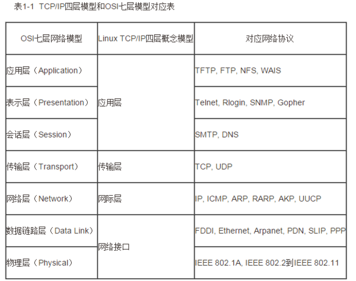

#OSI七层模型和 TCP/IP四层模型

####TCP/IP四层模型

`TCP/IP`是一组协议的代名词,它还包括许多协议,组成了TCP/IP协议簇.

TCP/IP通讯协议采用了4层的层级结构,每一层都`呼叫它的下一层所提供的网络来完成自己的需求`.

**应用层**

应用程序间沟通的层,如简单电子邮件传输(SMTP),文件传输协议(FTP),网络远程访问协议(Telnet)等.

**传输层**

在此层中,它提供了节点间的数据传送服务,如传输控制协议(TCP),用户数据报协议(UDP),TCP和UDP给数据包加入传输数据并把它传输到下一层中,这一层负责传送数据,并且确定数据已被送达并接收.

**互连网络层**

负责提供基本的数据封包传送功能,让每一块数据包都能够到达目的主机(但不检查是否被正确接收),如网际协议(IP).

**网络接口层**

对实际的网络媒体的管理,定义如何使用实际网络(如Ethernet、Serial Line等)来传送数据.

####OSI七层模型

OSI(Open System Interconnection,开放系统互连)七层网络模型称为开放式系统互联参考模型,是一个逻辑上的定义,一个规范,它把网络从逻辑上分为了7层.每一层都有相关,相对应的物理设备,比如路由器,交换机.

OSI 七层模型是一种框架性的设计方法,建立七层模型的主要目的是为`解决异种网络互连时所遇到的兼容性问题`,其最主要的功能使就是帮助不同类型的主机实现数据传输.

它的最大优点是将`服务`,`接口`和`协议`这三个概念明确地区分开来,通过七个层次化的结构模型使不同的系统不同的网络之间实现可靠的通讯.

服务说明某一层为上一层提供一些什么功能,接口说明上一层如何使用下层的服务,而协议涉及如何实现本层的服务.

* `服务`: 服务说明某一层为上一层提供一些什么功能.
* `接口`: 说明上一层如何使用下层的服务.
* `协议`: 如何实现本层的服务.

**七层模型**

* 应用层
* 表示层
* 会话层
* 传输层
* 网络层
* 数据链路层
* 物理层

**物理层**

OSI模型的第一层,该层包括物理连网媒介,如电缆连线连接器.物理层的协议产生并检测电压以便发送和接收携带数据的信号.

物理层的主要功能是:利用传输介质为`数据链路层`提供物理连接,实现比特流的透明传输.

在这一层,数据还没有被组织,仅作为`原始的位流或电气电压处理`,`单位是bit比特`.

**数据链路层**

OSI模型的第二层,它控制网络层与物理层之间的通信.它的主要功能是`如何在不可靠的物理线路上进行数据的可靠传递`.为了保证传输,从网络层接收到的数据被分割成特定的可被物理层传输的`帧`.`帧是用来移动数据的结构包`,它包括:

* 原始数据
* 发送方的物理地址
* 接收方的物理地址
* 检错和控制信息

其中的`地址`确定了`帧将发送到何处`,而`纠错`和`控制信息`则`确保帧无差错到达`.如果在传送数据时,接收点检测到所传数据中有差错,就要通知发送方重发这一帧.

数据链路层(DataLinkLayer):在物理层提供比特流服务的基础上,建立相邻结点之间的数据链路,通过差错控制提供数据帧(Frame)在信道上无差错的传输,并进行各电路上的动作系列. 接收来自物理层的位流形式的数据,并封装成帧,传送到上一层;同样,也将来自上层的数据帧,拆装为位流形式的数据转发到物理层;并且,还负责处理接收端发回的确认帧的信息,以便提供可靠的数据传输.

数据链路层在不可靠的物理介质上提供可靠的传输.该层的作用包括:物理地址寻址、数据的成帧、流量控制、数据的检错、重发等.

数据链路层协议的代表包括: SDLC、HDLC、PPP、STP、帧中继等.

**网络层**

OSI模型的第三层,主要功能是将网络地址翻译成对应的物理地址,并决定如何将数据从发送方路由到接收方.

过路由选择算法,为报文或分组通过通信子网选择最适当的路径.该层控制`数据链路层`与`传输层`之间的信息转发,建立,维持和终止网络的连接.

具体地说,`数据链路层的数据在这一层被转换为数据包`,然后通过路径选择、分段组合、顺序、进/出路由等控制,`将信息从一个网络设备传送到另一个网络设备`.

一般地,数据链路层是解决同一网络内节点之间的通信,而网络层主要解决不同子网间的通信.例如在广域网之间通信时,必然会遇到`路由(即两节点间可能有多条路径)选择问题`.

在实现网络层功能时,需要解决的主要问题如下:

* `寻址`:`数据链路层`中使用的物理地址(如MAC地址)仅解决网络内部的寻址问题.在不同子网之间通信时,为了识别和找到网络中的设备,每一子网中的设备都会被分配一个唯一的地址.由于各子网使用的物理技术可能不同,因此这个地址应当是逻辑地址(如IP地址).
* `交换`: 规定不同的信息交换方式.常见的交换技术有:线路交换技术和存储转发技术,后者又包括报文交换技术和分组交换技术.
* `路由算法`:当源节点和目的节点之间存在多条路径时,层可以根据路由算法,通过网络为数据分组选择最佳路径,并将信息从最合适的路径由发送端传送到接收端.
* `连接服务`:与`数据链路层`流量控制不同的是,`前者控制的是网络相邻节点间的流量`,后者控制的是`从源节点到目的节点间的流量`.其目的在于`防止阻塞`,并进行`差错检测`.

**传输层**

OSI`下3层`的主要任务是`数据通信`,`上3层`的任务是`数据处理`.而传输层(`Transport Layer`)是OSI模型的第4层.因此该层是`通信子网`和`资源子网`的接口和桥梁,起到承上启下的作用.

该层的主要任务是:向用户提供可靠的端到端的差错和流量控制,保证报文的正确传输.`传输层`的作用是`向高层屏蔽下层数据通信的细节`,即向用户透明地传送报文.该层常见的协议:TCP/IP中的TCP协议、Novell网络中的SPX协议和微软的NetBIOS/NetBEUI协议.

`传输层`提供`会话层`和`网络层`之间的传输服务,这种服务从`会话层`获得数据,并在必要时,对数据进行分割.然后,传输层将数据传递到网络层,并确保数据能正确无误地传送到网络层.因此,传输层负责提供两节点之间数据的可靠传送,当两节点的联系确定之后,传输层则负责监督工作.综上,传输层的主要功能如下:

* `传输连接管理`: 提供建立、维护和拆除传输连接的功能.传输层在网络层的基础上为高层提供"面向连接"和"面向无接连"的两种服务.
* `处理传输差错`: 提供可靠的"面向连接"和不太可靠的"面向无连接"的数据传输服务、差错控制和流量控制.在提供"面向连接"服务时,通过这一层传输的数据将由目标设备确认,如果在指定的时间内未收到确认信息,数据将被重发.(`面向连接`和`面向无连接`在下文)
* `监控服务质量`

**会话层**

会话层(Session Layer)是OSI模型的第5层,是`用户应用程序和网络之间的接口`.

主要任务是:`向两个实体的表示层提供建立和使用连接的方法`.将不同实体之间的`表示层`的连接称为`会话`.因此会话层的任务就是`组织和协调两个会话进程之间的通信`,并对数据交换进行管理.

用户可以按照半双工、单工和全双工的方式建立会话.当建立会话时,用户必须提供他们想要连接的远程地址.而这些地址与MAC(介质访问控制子层)地址或网络层的逻辑地址不同,它们是为用户专门设计的,更便于用户记忆.域名(DN)就是一种网络上使用的远程地址.

会话层的具体功能如下:

* `会话管理`: 允许用户在两个实体设备之间建立,维持和终止会话,并支持它们之间的数据交换.例如提供单方向会话或双向同时会话,并管理会话中的发送顺序,以及会话所占用时间的长短.
* `会话流量控制`: 提供会话流量控制和交叉会话功能.
* `寻址`: 使用远程地址建立会话连接.
* `出错控制`: 从逻辑上讲会话层主要负责数据交换的建立,保持和终止,但实际的工作却是接收来自传输层的数据,并负责纠正错误.会话控制和远程过程调用均属于这一层的功能.但应注意,此层检查的错误不是通信介质的错误,而是磁盘空间、打印机缺纸等类型的高级错误.

**表示层**

表示层(Presentation Layer)是OSI模型的第六层,它对来自`应用层的命令和数据进行解释`,对各种语法赋予相应的含义,并按照一定的格式传送给会话层.其主要功能是"处理用户信息的表示问题,如编码,数据格式转换和加密解密"等.

表示层的具体功能如下:

* `数据格式处理`: 协商和建立数据交换的格式,解决各应用程序之间在数据格式表示上的差异.
* `数据的编码`: 处理字符集和数字的转换.例如由于用户程序中的数据类型(整型或实型、有符号或无符号等)、用户标识等都可以有不同的表示方式,因此,在设备之间需要具有在不同字符集或格式之间转换的功能.
* `压缩和解压缩`: 为了减少数据的传输量,这一层还负责数据的压缩与恢复.
* `数据的加密和解密`: 可以提高网络的安全性.

**应用层**

应用层(Application Layer)是OSI参考模型的`最高层`,它是计算机用户,以及各种应用程序和网络之间的接口.其功能是直接向用户提供服务,完成用户希望在网络上完成的各种工作.它在其他6层工作的基础上,负责完成网络中应用程序与网络操作系统之间的联系,建立与结束使用者之间的联系,并完成网络用户提出的各种网络服务及应用所需的监督,管理和服务等各种协议.此外,该层还负责协调各个应用程序间的工作.

应用层为用户提供的服务和协议有: 文件服务、目录服务、文件传输服务（FTP）、远程登录服务(Telnet)、电子邮件服务（E-mail）、打印服务、安全服务、网络管理服务、数据库服务等.上述的各种网络服务由该层的不同应用协议和程序完成.

应用层的主要功能如下:

* `用户接口`: 应用层是用户与网络,以及应用程序与网络间的直接接口,使得用户能够与网络进行交互式联系.
* `实现各种服务`: 该层具有的各种应用程序可以完成和实现用户请求的各种服务.

**小结**

下面4层(物理层、数据链路层、网络层和传输层)主要提供数据传输和交换功能,即以节点到节点之间的通信为主.

第4层作为上下两部分的桥梁.

而上3层(会话层、表示层和应用层)则以提供用户与应用程序之间的信息和数据处理功能为主.

`下4层主要完成通信子网的功能`,`上3层主要完成资源子网的功能`.

**通信子网**

`通信子网`由网卡、线缆、集线器、中继器、网桥、路由器、交换机等设备和相关软件组成.

**资源子网**

资源子网由连网的服务器、工作站、共享的打印机和其它设备及相关软件所组成.

####TCP/IP四层模型和OSI七层模型对应

TCP/IP与OSI最大的不同在于OSI是一个理论上的网络通信模型,而TCP/IP则是实际运行的网络协议.

###知识点整理

####面向连接和面向无连接

**面向连接**

面向连接,是指通信双方在进行通信之前,要事先在双方之间建立起一个完整的可以彼此沟通的通道.这个通道也就是连接,在通信过程中,整个连接的情况一直可以被实时地监控和管理.

`TCP`是面向连接的.

**面向无连接**

而无连接的通信,就不需要预先建立起一个联络两个通信节点的连接来,需要通信的时候,发送节点就可以往"网络"上送出信息,让信息自主地在网络上去传,一般在传输的过程中不再加以监控,让该信息的传递在网上尽力而为地往目的地节点传送.

`UDP`是面向无连接的

