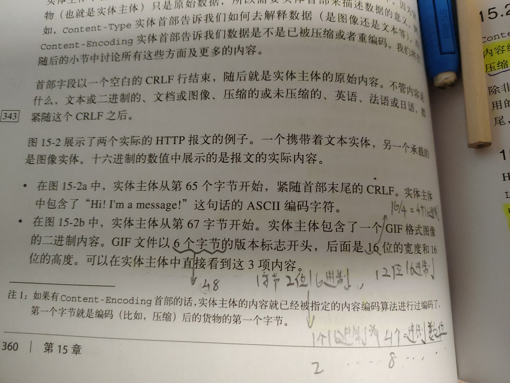
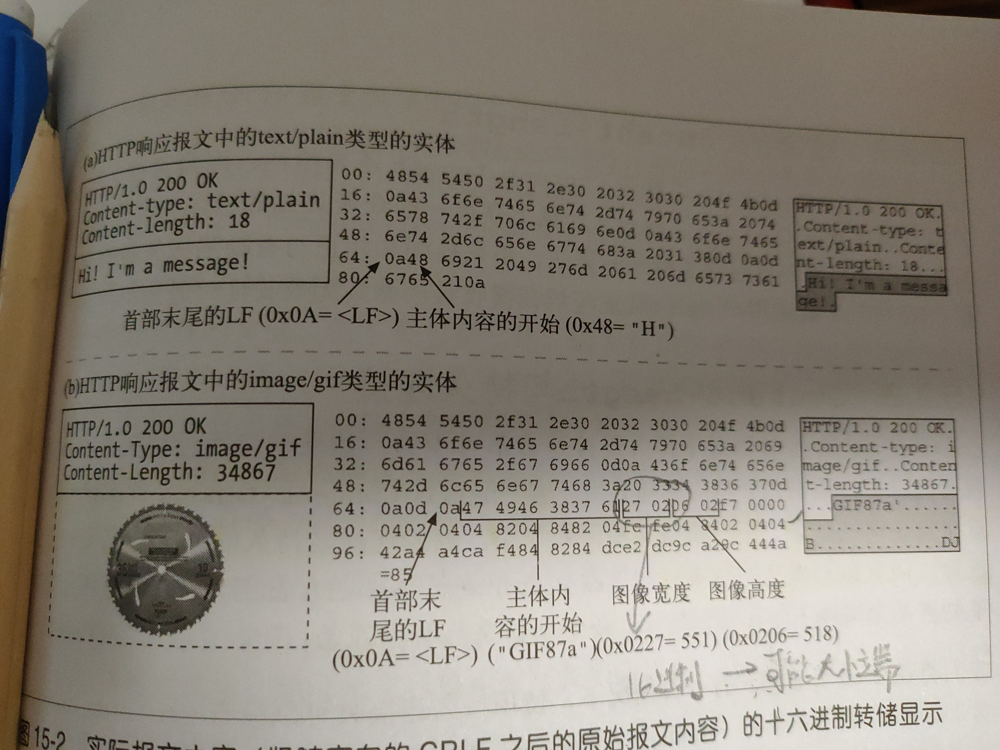
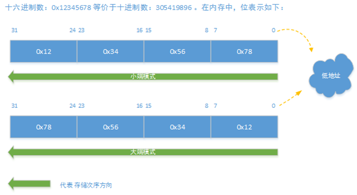

# HTTP 传输图片

## 背景

今天突然想看看一张图片在`HTTP`层传输的过程是什么样的, 翻了下`HTTP`权威指南. 其中看到一部分.

关键字**后面是16位的宽**...

对应后面数字图中是**27 02**, 但是计算的时候是**0x0227**

## 解析

1个16进制是4个二进制数位, **2个16进制是8个二进制数位, 一个字节**.

这里图片计算的是是**反过来的**, 因为原来了解过大小端.

**大端模式**, 是指**数据的高字节保存在内存的低地址中，而数据的低字节保存在内存的高地址中**，这样的存储模式有点儿类似于把数据当作字符串顺序处理：地址由小向大增加，而数据从高位往低位放.

**小端模式**, 是指数据的高字节保存在内存的高地址中，而数据的低字节保存在内存的低地址中，这种存储模式将地址的高低和数据位权有效地结合起来，高地址部分权值高，低地址部分权值低，**和我们的逻辑方法一致**.

在网络上传输数据时，由于数据传输的两端对应不同的硬件平台，采用的存储字节顺序可能不一致。所以**在TCP/IP协议规定了在网络上必须采用网络字节顺序，也就是大端模式**.

小端是按照我们逻辑理解的顺序, 大端是反过来的. 所以这里计算的时候需要反过来.

### 大小端示例

`0x12345678`

## 结论

这里是二进制用16进制解释, 同时因为在配合`Content-Type`告知我们如何解释数据. `Content-Length`告诉我们实体长度.

具体实际大小端转换还是要看主机`CPU`. 这里计算的时候是`0x0227`只是人为计算所以我们人为的转换下, 具体要不要转换是看`CPU`.
