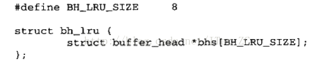
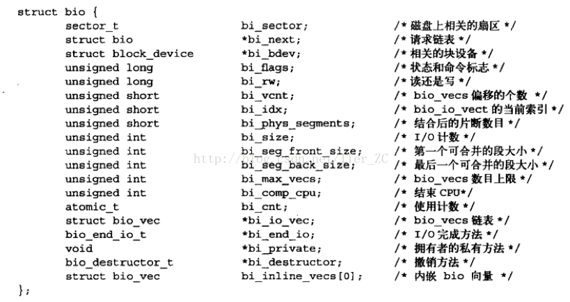
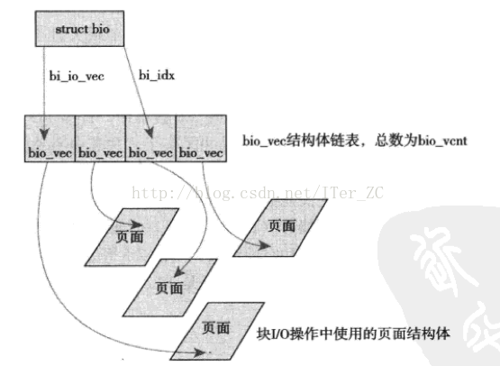
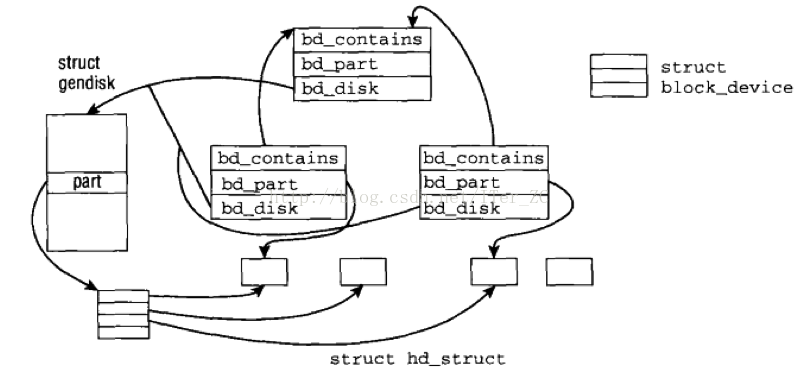
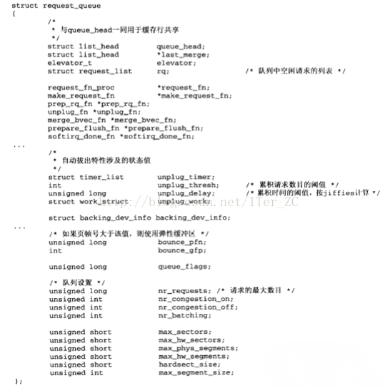
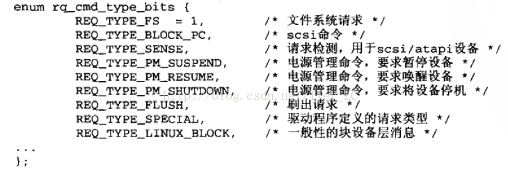
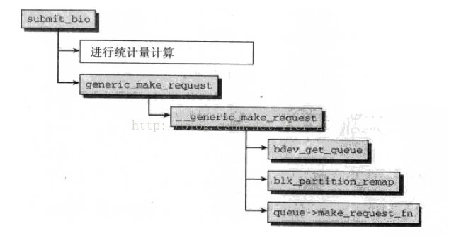

# 理解块IO层

---

文件按照`inode-block`的结构存储在磁盘上.

`Linux`把设备分为三种:

1. **块**设备, 用来**永久**存储文件信息, 支持顺序访问和随机访问(按块号访问), 比如磁盘, 光盘等.
2. **字符**设备, 只能顺序访问, 比如键盘.
3. **网络**设备, 只能顺序访问, 比如网卡, 蓝牙设备.

**`Linux`把所有`IO`设备都当做文件**, **网络设备是例外**, 块设备字符设备都可以在文件系统的目录树上找到，一般都在`/dev`下面, 但是网络设备不在目录树上. 对应网络操作, Unix/Linux的设计者把它认为是一种进程间通信技术, 是`IPC`的一种, 而不是文件, 所以没有把网络设备挂载到文件系统的目录树上. 但是网络`socket`操作底层实现的时候还是抽象成了文件操作.

字符设备和网络设备都**只支持顺序访问**, 从内核的角度来说, 仅仅需要控制一个当前读写位置, 实现相对比较简单. 而块设备要支持随机访问, 需要实现数据的缓存, 脏数据的回写等等, 对块设备的每一分优化就能带来整个系统性能的提升, 所以Linux设计了一个专门的块IO层子系统来处理块设备的访问.

块IO层在早期的Linux版本中也叫**缓冲区高速缓存(buffer)**, 早期的Linux版本不支持虚拟内存机制, 所以不要页的操作, 只关注于块的操作, 只需要给定一个设备号和块号就能操作缓冲区高速缓存和块设备. 现代的Linux采用虚拟内存机制来管理内存, 页是虚拟内存管理的最小单位, 所以采用了页缓存来作为虚拟内存机制的缓存. 在Linux 2.4内核里面存在两个独立的缓存:

1. 页缓存, 针对页.
2. 缓冲区高速缓存, 针对块.

同一份磁盘数据可能要存在于两个缓存中, 需要额外的同步操作. 在Linux 2.6内核中把这两个缓存进行了整合, 因为页和块也是可以相互映射的, 所以两者的整合是顺其自然的, 这样一份磁盘的数据只需要存在于一个缓存就行了. 页缓存面向的是虚拟内存, 块IO层是面向块设备, 这篇主要从块设备和内核的交互的角度来理解块IO层, 也就是以前所说的缓冲区高速缓存.

**当然缓冲区高速缓存还有一部分是独立存在的, 因为有些情况下还需要块级别访问块设备的数据, 比如超级块的读取直接用的块IO读写. 这个独立的缓冲区高速缓存被实现成一个LRU的缓存**.

比如我们用`free`命令查看操作系统的内存使用情况可以看到独立的`buffer`和`cache`区域, `buffers`就是独立的缓冲区高速缓存, `cached`就是页缓存. 既然是缓存, 那么在内存不够的情况下是可以被交换出去的, 所以free命令提供了+ - buffers/cache的计算得到的空闲内存的值.

**对于文件操作的系统调用来说, 比如`read()`,`write()`, 它们是直接面向页缓存和缓冲区高速缓存的, 页缓存和缓冲区高速缓存对进程来说就是一个存储系统, 进程不需要关注底层的设备的读写, 由页缓存和缓冲区高速缓存来和底层设备交互**.

**缓冲区高速缓存的设计思路就是把内存缓冲区的一个缓冲块和磁盘文件系统的磁盘块绑定起来, 这样一个缓冲块就和磁盘块一一对应, 只需要把两者数据同步就完成了磁盘数据的读写**. 缓冲块的大小和磁盘块大小是一样的.

内核采用`buffer_head`结构来描述一个缓冲块:

1. `b_state`表示缓冲块的状态, 比如是否是脏的需要写回磁盘，是否是uptodate, 表示是最新的数据，可以安全地被多个进程共享.
2. `b_page`指向了这个缓冲块对应的页缓存的物理页, 和页缓存系统结合起来.
3. `b_blocknr`表示它对应的磁盘块号.
4. `b_bdev`指向了对应的设备, `b_bdev + b_blocknr`就可以确定一个唯一的磁盘块.
5. `b_count`引用计数, 当b_count不为0的时候, 这个缓冲块不能被交换出去.

超级块的读写还是使用了缓冲块的IO操作, 直接用缓冲块绑定底层的磁盘块. 针对`buffer_head`缓冲块, 有几个重要的操作，比如`bread()`,`__getblk()`

1. `bread()`总是返回一个包含最新数据的缓冲块, 早期的`read()`系统调用底层就是采用了`bread()`实现的. 当`bread()`发生缓冲不命中的情况, 就会挂起当前的进程进入不可中断的阻塞, 直到缓冲块被加载到内存.
2. `__getblk()`总是返回一个非Null的缓冲块(buffer_head), 可能是之前就在缓冲区的缓冲块, 也可能是新建的缓冲块.

目前还有一个独立的基于LRU算法的缓冲区高速缓存, 它是一个buffer_head的数组结构.

在Linux 2.6内核之前, `buffer_head`作为缓冲区高速缓存的主要数据结构起着重要作用, 但是Linux2.6把页缓冲和缓冲区高速缓冲做了整合, 现在内核更倾向于操作页面结构, 抽象层次更高, 粒度更大, 而一个页可以对应多个缓冲块, 执行IO的效率也更高.

`buffer_head`仅仅表示一个缓冲区, 当读写操作涉及到多个块时, 需要分解成对多个`buffer_head`的操作, `buffer_head`是一个比较重的结构, 这样会造成不必要的负担和空间浪费. **Linux 2.5内核引入了bio的结构体, 是一种更灵活和轻量级的容器, 来处理多个块的请求, 是目前内核中块IO操作的基本容器**.

`bio`结构体定义如下:

1. `bi_bdev`指向块设备.
2. `bi_io_vec`指针指向了一个`bio_vec`的结构体数组, 一个`bio_vec`表示一个页片段的请求, 是一个三元组`<page, offset, length>`, 即片段所在的物理页, 块在物理页中的偏移量, 请求的块的长度. 这样`bi_io_vec`表示了一组页片断的IO请求.
3. `bi_idx`指向当前处理的`bio_vec`结构, 
4. `bi_vcnt`表示`bi_io_vec`数组的长度.
5. `bio_cnt`是引用计数, 如果为0表示bio可以被撤销.

`bio_vec`又叫IO向量, 它的结构如下:

1. `bv_page`指向了IO操作对应实际物理页page结构, 这些页用于从设备接收数据, 向设备发送数据.
2. `bv_len`表示IO操作的数据的字节长度.
3. `bv_offset`表示操作开始的位置, 以字节为单位.

**这3个变量可以确定一个唯一的IO操作的位置**. `bio_vec`和`bio`的对应关系如下所示:

`bio`是可以描述**1个或多个**页的块IO操作, 可以处理不连续的块的操作, 实现了所谓的**分散-聚集IO**操作, 比`buffer_head`更加灵活. 当然`buffer_head`的存在还很有必要, 它负责描述磁盘块到缓冲块和页面的映射, 只是从块IO的角度被弱化了, 不在做IO操作的容器.

## 请求队列和IO调度

是IO调度, 当块IO请求通过`bio`和`buffer_head`传递到`bdev`设备时, 备驱动程序会把这些块IO请求加入到一个请求队列中去, 由`request_queue`结构体表示, 请求队列中的每一项都是一个`request`结构, 表示**一个单独的块IO请求**. 设备驱动程序每次从请求队列的队头取一个请求, 然后执行真正的设备的读写操作.

因为磁盘上的块是连续的, 内存中的块是不连续的, 所以如果每来一个请求就执行一次真正的磁盘操作, 那么性能肯定很差. IO调度层就是为了优化磁盘读写的性能而设计的.

IO调度程序会对请求队列中的请求进行合并和排序操作, 把**对连续的磁盘块的IO请求进行合并**, 减少磁盘寻道的时间, 这样可以极大地提高系统整体的性能.

请求队列和块设备的交互如下图所示, 块IO读写不会直接通过调用底层设备的驱动程序的读写直接与设备交互, 而是抽象了一个通用磁盘操作, 它提供了一系列的通用函数, 比如`generic_read_file`, `generic_write_file`, 在这些通用函数里面对块IO请求进行组织调度, 再调用底层设备读写来交互.

内核是如何表示块设备的? 对内核来说, 如果一个磁盘上有多个分区, 那么一个分区就是一个块设备, 块设备由`block_device`结构表示:

1. `bd_part`指向一个`hd_struct`结构, 这个结构是分区的结构, 包含了这个分区从哪个扇区开始, 到哪个扇区结束的信息.
2. `bd_contains`指向整个块设备的`block_device`对象.
3. `bd_inode`, 每个块设备对内核还是都是文件, 所以块设备也对应一个`inode`号.
4. `db_disk`指向一个`gendisk`结构, 这个结构就是通用磁盘对象, 由它来管理请求队列和块设备通用操作.

通用磁盘`gendisk`结构如下, 它维护了一个`request_queue`请求队列, 以及`hd_struct`分区数组.

分区`hd_struct`的结构就比较简单, 对一个分区来说, 最重要的就是起始扇区和结束扇区.

* `start_sect`: 磁盘中分区的起始扇区.
* `nt_sects`: 分区的长度(总共的扇区数).

块设备`block_device`, 分区`hd_struct`, 通用磁盘对象`gendisk`的关系如下: 

整个设备的`block_device`对象`bd_list`指针指向了它的分区的`block_device`对象链表. 每个分区的`block_device`用`bd_contains`指针指向整个设备的`block_device`, 用`bd_part`指向分区`hd_struct`信息, 用`bd_disk`指向一个`gendisk`对象. 一个`gendisk`对象指向一个设备的`block_device`, 并维护到这个`block_device`的请求队列`requet_queue`.

请求队列`request_queue`的结构:

1. `queue_head`是请求头, 也就是每次要处理的请求.
2. `elevator`指向实际的IO调度算法实现对象.
3. `rq`指向未处理的请求链表, 请求队列采用双向链表(doubly linked list)的结构, 便于对请求的排序和合并.
4. 接下来是一组函数指针, 指向对请求队列的操作函数, 比如`make_request_fn`会新建一个请求.
5. `softirq_done_fn`是设备传输结束后采用软中断机制通知设备传输完成后进行的回调函数.

请求队列中的每一个请求`request`的结构如下:

1. `q`指向这个请求所在的请求队列`request_queue`.
2. 一个请求要么在请求队列的工作队列上, 要么在完成队列上, `queuelist`表示请求队列的工作队列，`donelist`表示完成队列.
3. `sector`表示这个请求当前需要传输的扇区号, 带`hard_`前缀的扇区结构和不带`hard_`前缀的结构语义一样, 只是带`hard_`结构的表示实际物理设备而非虚拟设备, 主要是`RAID`的时候有区别, 因为`RAID`把几个物理设备当做一个虚拟设备.
4. `bio`指向了这个请求所对应的`bio`对象, 内核先创建`bio`对象作为块IO请求的容器, 然后再创建`request`来表示一个**实际发起的块IO请求**.
5. `biotail`指向最后一个`bio`对象, **一个`request`可以对应多个`bio`, 因为`request`可以合并**, 所以采用链表来表示这个请求所有的`bio`. `bio`描述了一个块IO所涉及的块的情况, 比如页号, 偏移量, 操作的长度等等.
6. `elevator`指向了这个请求所采用的`IO`调度算法.

请求可用于向块设备传送控制命令, 可以作为数据包命令载体. `cmd_type`表示请求的类型, `cmd_flags`表示用于请求的一组通用标志.

可用于请求的类型有如下这些, 最常用的就是`REQ_TYPE_FS`,即文件系统请求, 表示和块设备实际的数据传输请求.

请求的标志有如下这些, 最重要的是`__REQ_RW`, 指明了数据传输的方向, 未置位表示读请求, 置位表示写请求.

内核中有几种IO调度的算法, 内核中把它们叫做电梯`elevator`, 比如Linus电梯算法, 最终期限IO调度程序, 预测IO调度程序, 完全公平的排队IO调度程序, 空操作的IO调度程序等等, 默认采用的是完全公平的排队IO调度程序.

## 内核提交块IO请求所涉及的操作

* 首先创建一个bio实例描述IO操作的区域, 然后将bio实例嵌入到请求中, 放在请求队列. `submit_bio`函数用于根据`bio`实例来创建一个新的`request`, 并使用`make_request_fn`将请求放到请求队列.

* 内核利用IO调度处理请求队列并执行bio操作.