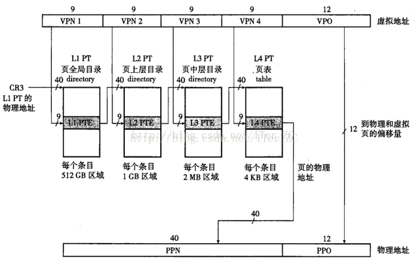
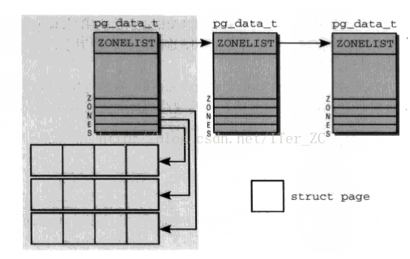
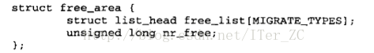
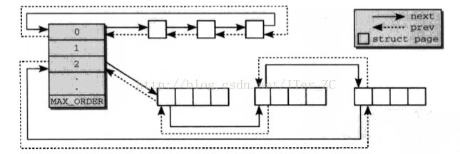
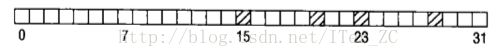
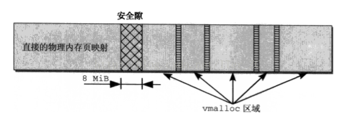
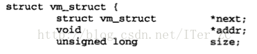
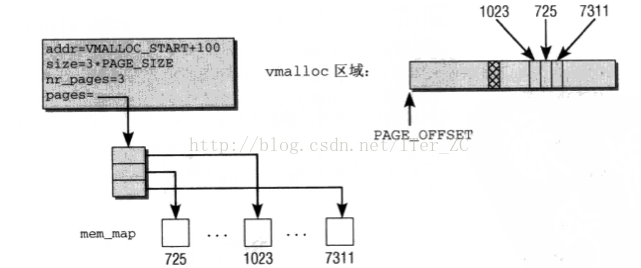

# 理解物理内存管理

内存管理包括

* 虚拟内存机制
* 物理内存管理

## 物理内存地址空间和虚拟内存地址空间

说到虚拟内存的时候我们知道虚拟内存地址空间分为两部分:

1. 内核地址空间
2. 用户进程地址空间

这两个地址空间都使用虚拟地址, 也就是说程序使用的都是虚拟地址. 从虚拟地址映射到实际物理地址时有所区别:

1. 内核使用物理内存时可以直接通过虚拟地址和内核地址空间的起始值的偏移量来计算得到实际物理内存的地址.
2. 进程使用物理内存必须通过页表结构进行转换.

对应内核地址空间来说,

1. 如果内核虚拟地址空间 > 物理内存地址空间时, 那么物理内存地址空间可以全部映射到内核虚拟地址空间. 在目前64位机器的情况下基本都是这种情况, 由于硬件的限制, 可用的物理内存远小于可用的内核虚拟地址空间.
2. 如果内核虚拟地址空间 < 物理内存地址空间时, 物理内存地址空间的一部分映射到内核虚拟地址空间, 剩余的物理内存地址空间被称为高端内存(`high memory`), 内核会采取额外的映射机制来访问这些高端内存. 这种情况在之前的32位机器上是常态, 在32位机器下, 内核地址空间和用户进程地址空间的比例默认为`1:3`, 也就是说4G的虚拟地址空间, 内核地址空间占1G, 而可用的物理内存可达到4G, 内核地址空间还必须预留一部分作为内核运行使用, 所以可用的内核地址空间对物理内存地址空间的映射为896MB，剩余的物理内存地址空间都是高端内存.

对于64位机器来说, 虚拟内存地址空间远大于可用的物理内存地址空间, 所以虚拟内存地址空间划分成内核地址空间和用户进程地址空间时就比32位机器的地址空间富裕很多, 整个64位虚拟地址空间分为上下半部和中间禁用区三部分, 可以看到虚拟地址的第0到46位都是任意设置的, 而47位到63位对于内核地址空间来说都是0, 对于用户进程地址空间都是1. 这种虚拟地址称为规范的地址, 其他的都是不规范的地址. 所以在64位机器来说内核虚拟地址空间和用户进程虚拟地址空间都是2的47次.


下图是更细节的描述, **内核的虚拟内存地址空间的起始部分是对物理内存地址空间的一致性映射, 然后是vmalloc区域, 然后是给内核使用的其他内存区域**.


页表和一个虚拟地址的映射关系:

1. 对于64位机器, 4KB的页大小来说, `Offset`表示该地址在页内的偏移量, 所以`Offset`的长度=12, 2的12次方正好是4KB.
2. `PGD,PUD,PMD,PTE`各位的长度都是9，也就是每级页表的页表项都是512个.
3. 这样总共64位的虚拟地址长度使用了48位, 已经远大于目前可用的物理内存地址空间.

对于页表管理, 2.6.10以前, 使用了3级页表目录管理的方式:

* `Page Global Directory (PGD)`
* `Page Middle Directory (PMD)`
* `Page Table (PTE)`

从2.6.11开始, 为了配合64位CPU的体系结构, 使用了4级页表目录管理的方式:

* `Page Global Directory (PGD)`
* `Page Upper Directory (PUD)`
* `Page Middle Directory (PMD)`
* `Page Table (PTE)`

PGD每个条目中指向一个`PUD`, `PUD`的每个条目指向一个`PMD`, `PMD`的每个条目指向一个`PTE`, `PTE`的每个条目指向一个页面(`Page`)的物理首地址. 因此一个线性地址被分为了5个部分, 如下图:


而页表结构如下, 每级页表实际就是一个一个的数组, 数组项的长度是64位的, 上级页表的页表项存放着下级页表的物理内存地址, 而最后的`PTE`页表项存放的就是实际物理内存页的页号. 有了物理内存页的页号我们就可以找到对应物理内存页. **物理内存地址空间就是按照物理页长度划分的一个数组**. **`PTE`页表项既然存放的是物理内存页号, 那么肯定不需要64位长度, 剩下的位可以用作标志位来提供额外的功能, 比如读写执行等权限控制, 是否是脏页, 是否被交换到了交换区等等**.

**物理内存的页组织成了唯一一个数组, 就是我们上面说的`mem_map`结构, 而虚拟内存的页却采用了页表结构, 组织成了多级数组结构, 这样的目的主要就是减少页表的长度**. 虚拟内存当然也可以和物理内存一样只使用一个唯一的数组, 但是虚拟内存地址空间有2的64次方这么大, 如果使用固定长度的数组来表示, 那么有大量的数组项是空的, 因为物理内存没这么大. 每个进程要维护自己的页表, 这样虚拟内存也使用一个数组来表示, 就造成了极大的内存浪费, 因为存储页表是需要物理内存的.

采用了页表这样的多级数组结构后, 可以**按需分配数组**, 使用多少物理内存就分配多少虚拟地址空间的页表项, 这样极大地压缩了页表长度, 节省了物理内存.

**关于页表, 需要记住的是用户进程的虚拟地址是和这个地址对应的页表数组索引可以互相转化计算**.



## 物理内存数据结构

Linux要支持NUMA架构和非NUMA架构等多种硬件体系架构, 在NUMA架构下, 每个CPU独享一个本地内存, 在非NUMA架构比如SMP架构下, 多个CPU共享一个物理内存, Linux对物理内存的管理必须要适用这多种架构.

所以Linux对物理内存的管理分为几个层次:

1. 最顶层是**结点**, 在内核中是`pg_data_t`结构的实例.
2. 每个结点又最多分为3个**内存域**, 比如上面说的不可以直接映射的高端内存, 可以直接映射的普通内存, 已经给`DMA`(Direct Memory Access，直接内存存取, 是一种不经过CPU而直接从内存存取数据的数据交换模式. 在DMA模式下, CPU只须向DMA控制器下达指令, 让DMA控制器来处理数据的传送, 数据传送完毕再把信息反馈给CPU, 这样就很大程度上减轻了CPU资源占有率, 可以大大节省系统资源.)用的内存域.
3. 每个内存域都关联了一个**mem_map结构的数组, 数组项都是`page`实例**. `page`结构表示物理内存页帧, 是最重要的物理内存的表示结构. 相当于把整个内存域的物理内存地址空间按页大小(4KB-2MB)划分成一个数组,这个数组就是`mem_map`, 数组项就是`page`. 得到了`page`结构, 就得到了物理内存页帧的位置, 物理内存页帧的状态.



`page`的结构如下:

1. `flags`表示该物理内存页帧的状态.
2. `_count`表示该页被引用的计数器.
3. `private`指针当在`PagePrivate`标志下, 用来指向该页缓存对应的底层`buffer cache`的`buffer_head`链表指针, 当设置了`PageSwapCache`的时候, 表示这个页对应的页交换区的位置信息.
4. `mapping`指针当作为文件的页缓存时, 指向该文件`inode`对应的`address_space`地址空间. 如果页是匿名内存, 即没有后备文件, 那么指向`anon_vma`匿名区域对象.
5. `virtual`指向这个物理内存地址对应的虚拟内存地址.


## 物理内存分配

Linux内核在机器启动时被加载到物理内存, 内核镜像在物理内存的存储结构如下所示:

1. 第一个物理页帧4KB的空间是预留给BIOS使用的.
2. 接下来的640KB区域预留未使用, 原因是紧邻该区域的后面一块空间给加载ROM使用, ROM是不可写的，所以如果这640KB给内核使用, 必须保证内核小于640KB.


可以通过查看`/proc/iomem`来查看物理内存实际的分配情况, 可以看到, 内核代码是用第1MB物理地址开始的

```
[ansible@production-front-1 ~]$ cat /proc/iomem
00000000-00000fff : reserved
00001000-0009fbff : System RAM
0009fc00-0009ffff : reserved
000a0000-000bffff : PCI Bus 0000:00
000c0000-000c8bff : Video ROM
000e0000-000fffff : reserved
  000f0000-000fffff : System ROM
00100000-efffffff : System RAM
  01000000-0164b2ba : Kernel code
  0164b2bb-01a75abf : Kernel data
  01c17000-01f34fff : Kernel bss
  2b000000-350fffff : Crash kernel
f0000000-fbffffff : PCI Bus 0000:00
  f0000000-f1ffffff : 0000:00:02.0
    f0000000-f1ffffff : cirrusdrmfb_vram
  f2000000-f2ffffff : 0000:00:03.0
    f2000000-f2ffffff : xen-platform-pci
  f3000000-f3000fff : 0000:00:02.0
    f3000000-f3000fff : cirrusdrmfb_mmio
fc000000-ffffffff : reserved
  fec00000-fec003ff : IOAPIC 0
  fee00000-fee00fff : Local APIC
100000000-20fffffff : System RAM
```

当内核初始化完成之后, 对物理内存的管理由伙伴系统承担, 下面看看伙伴系统的基本原理.

上面说了每个结点的内存分为3个域, 域采用`zone`数据结构, 包含一个`free_area`数组. 数组的下标是`阶order`. 阶是伙伴系统的一个重要术语, 描述了内存分配的数量单元. 内存块的长度是`2^order`, 阶的范围是`0-MAX_ORDER`. MAX_ORDER默认是11, 也就是说一次分配可以请求的最大页数是2^11 = 2048个页, `free_area`结构包含了一个`free_list`链表. `free_list`是用于连接空闲页的页链表, 页链表包含大小相同的连续内存区. 比如free_area[0]表示0阶的空闲区域, 它的页链表包含的都是连续的空闲单页. free_area[1]表示1阶的空闲区域, 它的页链表包含的是连续的空闲双页.




`free_area`数组和`free_list`链表的组成如下图所示. `free_list`里面大小相同的单元叫做伙伴, 伙伴之间不需要连续, 采用链表相联.



上图所示: `0`为`2^0=1`, 只有一个空闲区域. `2`为`2^2=4`则表示4个.

系统当前伙伴系统信息可以通过`cat /proc/buddyinfo`查看:

```
[ansible@production-front-1 ~]$ cat /proc/buddyinfo
Node 0, zone      DMA      1      0      0      1      2      1      1      0      1      1      3
Node 0, zone    DMA32   2335   1604   2702   2376    776    188     37     14     18      0      0
Node 0, zone   Normal   3947   2453   1923   1417    735    195     14      1      0      0      0
```

伙伴系统的特点是简单高效, 只使用了双链表结构, 它可以高效的分配连续的内存区域. 对于用户进程来说, 物理内存碎片的问题影响还不大, 因为用户进程利用页表来访问物理内存, 只要虚拟地址是连续的即可, `vmalloc`可以支持非连续的物理内存. 但是对于内核来说, 它直接映射了物理内存地址空间, 如果物理内存碎片多, 那么影响内核的内存分配. 比如下面这个结构, 虽然只有4页被分配了, 但是对伙伴系统来说, 它能分配的最大连续页只能是8页, 因为分配的页数都是2的幂, 虽然有连续的15个页, 但是伙伴系统最大只能分配8页.



为了解决内存碎片的问题, 内核采用了反碎片的设计, 试图从最初开始尽可能防止碎片.

内核将已分配的页分为三种类型:

1. 不可移动页`Unmovable`. 内核中的已分配页基本属于这个类型, 不能移动位置.
2. 可回收页`Reclaimable`. 不能直接移动, 但是可以删除, 其内容可以重新再生, 比如映射到文件的内存, 可以重新读取文件内容来加载页.
3. 可移动页`Movable`. 用户空间的以分配页基本属于这个类型, 因为用户空间利用页表访问物理内存，可以通过复制页到新的位置, 然后更新页表项来实现.

反碎片的设计就是将相同移动性的页分到一组. 我们可以看到`free_area`里面的`free_list`链表实际是按照移动性`MIGRATE_TYPES`分组的.

**伙伴系统是内核用来分配大块内存的, 它只能分配2的幂的页. slab分配器是内核用来分配细粒度的内存分配器. 它们于C语言库的malloc这种可以按照字节大小来分配内存的分配器不同. 伙伴系统分配器和slab分配器是最底层的内核级内存分配器, 其他语言机的内存分配器都是基于它们来工作的**.

关于内存分配系统, 需要注意的是**所有的内存分配系统都是在初始化时预先获得了一块物理内存, 在这个物理内存区域内再进行分配, 释放内存实际上就是把分配的内存返还给内存分配器**.

1. 比如内核的伙伴系统分配器, 内核在初始化时会语言确定各个内存域的上下边界, 然后初始化各个内存域的各种数据结构, 比如`page`实例, 然后把这个内存域交给伙伴系统分配器.
2. 比如`Java`的内存管理, 也是在`Java`进程启动的时候指定了各个内存区域的大小, 确定边界, 然后在Java进程启动时就预先向内核申请了`Java`进程管理的大部分内存. Java的内存分配和垃圾回收都是在这块预先分配的内存区域进行的.

## vmalloc

内核使用`vmalloc`在虚拟内存地址空间分配连续的虚拟内存地址, 这些连续的虚拟内存地址可以映射到不连续的物理内存页, 从而利用内存碎片. 内核的虚拟内存地址空间有一块专门的空间是给`vmalloc`使用的, 每个vmalloc区域之后用空洞隔开, 防止错误的虚拟地址引用.



每个用`vmalloc`函数创建的`vmalloc`区域对象都对应内核的一个`vm_struct`结构体:

1. `addr`表示这个`vmalloc`区域的起始虚拟地址, `size`表示这个`vmalloc`区域的长度, 这两个参数就确定了一个`vmalloc`区域的边界.
2. `flags`标志位表示了一组`vmalloc`区域的标志.
3. `pages`是一个`page`数组, 表示这个`vmalloc`区域对应的实际物理内存地址, 可以是不连续的. `nr_pages`表示这个`pages`数组的长度.
4. `next`指针指向下一个`vmalloc`区域对象, 所有的vmalloc区域对象组成一个**单链表结构**.




`vmalloc`区域对象和物理内存的映射关系如下:



## slab分配器

伙伴系统分配器用来分配以页为大小的大内存空间, 内核同样需要按字节大小等细粒度分配内存空间的分配器, slab分配器就是这样一个分配器:

1. 分配细粒度的内存空间, 是内核的`kmallocAPI`的底层实现. `slab`分配器对计算机高速缓存影响小, 原因是不会每次都分配页, 减少页表的操作. 而伙伴系统分配器每次都要更新页表, 而更新页表会影响高速缓存和TLB单元.
2. 用作内核的缓存, 缓存内核创建的数据结构的对象实例.

`slab`分配器和伙伴系统的关系:


而slab分配器是基于对象进行管理的， 相同类型的对象归为一类(如进程描述符就是一类)， 每当要申请这样一个对象, slab分配器就从一个slab列表中分配一个这样大小的单元出去, 而当要释放时, 将其重新保存在该列表中, 而不是直接返回给伙伴系统, 从而避免这些内碎片. slab分配器并不丢弃已分配的对象, 而是释放并把它们保存在内存中. 当以后又要请求新的对象时, 就可以从内存直接获取而不用重复初始化. 