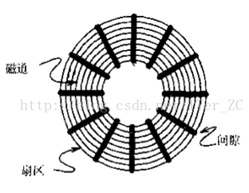
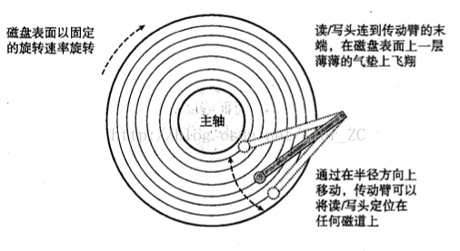
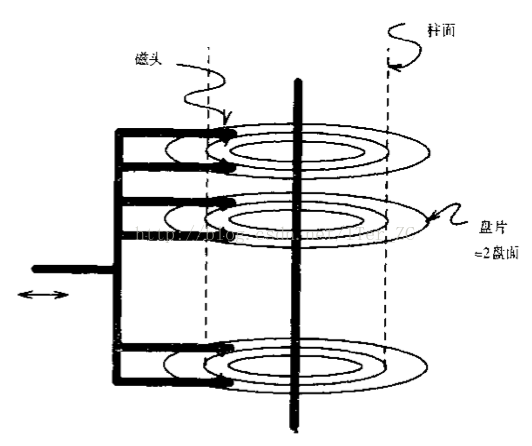

# 理解磁盘的机制

---

磁盘是一种重要的存储器, 位于主存结构的下方, 是永久存储的介质.

磁盘这块主要有几个部分的概念:

1. 磁盘的基本结构和工作原理.
2. 如何在虚拟内存机制下与内存高效地交换数据.
3. 磁盘如何保证数据存储的可靠性及故障恢复.

## 磁盘的基本结构和工作原理

从单个磁盘来说, 由一个个的同心圆组成, **一个同心圆就是一个磁道, 每个磁道由多个扇区组成, 每个扇区之前由没有磁性的间隙分隔. 扇区有磁性物质, 支持读和写操作. 每个磁道的扇区数量是一个常量, 每个扇区的大小一般是4KB. 扇区是磁盘基本的物理单元**.

1. 硬盘有数个盘片, 没盘片两个面, 每个面一个磁头.
2. 同一盘片不同半径的同心圆为磁道.
3. 不同盘片相同半径构成的圆柱面即柱面.
4. 公示: 存储容量 = 磁头数x磁道(柱面)数x每道扇区数x每扇区字节数.

每一个盘面对应一个传动臂, 传动臂的头部有一个读/写头可以读和写磁盘介质. 传动臂可以覆盖所有的磁道, 通过旋转盘面和移动传动臂, 就可以访问到盘面所有扇区的数据.

一般的硬盘都有多个盘面构成, 每个盘面都有上述的结构. 一个硬盘上的多个传动臂是固定在一起的, 也就是同时移动的半径都是一样的. 这样同一时刻位于多个磁头下的的各个磁道构成一个柱面, 采用多个盘面的好处是可以同时读取同一个柱面的数据.

我们知道存储系统都采用逻辑单元块来表示基本的数据单位, 这样可以提高存储的效率, 比如虚拟内存采用页为基本的存储单位. 同样在磁盘领域, 也用块这个逻辑单元来管理磁盘. 扇区是基本的物理单元, 大小为4KB. 磁盘块一般为4KB - 64KB, 包含一个或者多个扇区. 主存和磁盘交换数据时以块为基本单位.

每一个磁盘都有一个磁盘控制器来管理一个或多个磁盘. 磁盘处理器的作用有:

1. 控制传动臂, 将磁头定位到一个特定的半径位置.
2. 选择一个准备读写的盘面, 定位到特定的扇区.
3. 将从所要求的扇区读取的二进制数据传送到主存, 或者将主存的数据写回到磁盘的扇区.

看一个实际的磁盘的参数, Megatron 747磁盘有下列参数:

1. 8个圆盘, 16个盘面.
2. 每个盘面有2^16次个磁道.
3. 每个磁道平均有256个扇区.
4. 每个扇区有4KB个字节.

所以它是 16个盘面 * 2^16个磁道 * 256个扇区 * 4KB个字节 = 1TB的大小. 一个磁道存放1MB字节. 如果一个块是16KB, 那么1个块使用4个连续的扇区, 一个磁道上有32个块.

磁道的续写有3个步骤, **寻道时间 + 旋转延迟 + 传输时间**:

1. 磁盘控制器将磁头组合定位在磁盘块所在磁道的柱面上所需要的**寻道时间**.
2. 磁盘控制器等待访问块的第一个扇区转到磁头下, 即**旋转延迟**.
3. 磁盘控制器读写数据时, 数据所在的扇区和扇区间的空隙经过磁头, 即**传输时间**.

寻道时间取决于磁头到它访问位置的距离, 如果磁头刚好在要访问的柱面, 那么寻道时间为0, 但需要1ms的时间来启动磁头. 磁头需要10ms的时间来经过所有的磁道, 所以寻道时间在 0 - 10ms, 平均5ms, 磁盘旋转一圈的时间约为10ms, 因此旋转延迟是0 - 10ms, 平均为5ms, 传输时间相对很小, 在毫秒以下.

所以读取磁盘的1个字节的平均延迟是10ms,最大延迟差不多是它的两倍.

提高磁盘读写速度方法就是尽量减小寻道时间和旋转延迟:

1. 按柱面组织数据, 将要一起访问的块放在同一个柱面, 这样可以经常避免寻道时间, 也可能避免旋转延迟.
2. 将数据分隔存储在多个相对较小的磁盘而不是放在一个大磁盘, 这样可以让更多的磁头组设备分别去访问磁盘块, 可增加单位时间内的磁盘块访问量.
3. 镜像磁盘, 把两个或者更多的数据副本放在不同的磁盘上, 一方面保证了数据的冗余存储, 另一方面也可以让我们一次访问多个磁盘块.
4. 把连续的块预加载到主存的缓冲区, 这是空间局部性的使用, 从缓存原理的角度来加速磁盘访问.

### 从虚拟内存的角度理解磁盘和主存的数据交换

首先理解一下CPU是如何来向磁盘IO请求数据的. 计算机的各个组件通过总线连接, 总线包括数据总线, 地址总线, 控制总线等. CPU采用内存映射IO的技术来访问IO设备. 虚拟地址空间有专门的地址, 称为IO端口, 来于IO设备通信, 当一个设备连接到总线后, 它被映射到一个或多个端口.

假设磁盘控制器被映射到`0xa0`端口, CPU发起IO读的流程如下:

1. CPU把命令, 逻辑块号, 目的虚拟内存地址写到0xa0端口, 发起一个磁盘读请求.
2. 磁盘控制器把逻辑块号翻译成对应的扇区位置读取扇区, 由DMA(直接内存访问, Direct Memery Access)控制器执行磁盘数据到内存的传输, 不需要CPU的参与.
3. 当DMA传输结束后, 磁盘控制器采用中断的方式通知CPU读取完毕.

有几个注意点:

1. CPU只发起读请求和**最后由中断获知读操作结束**, 其他时间可以执行其他任务, 提高了CPU的使用率.
2. **内存一般都会有一个缓冲区来于磁盘交互** 这实际也是缓存原理的使用, 在内存中开辟了一个缓冲区, 实际的内存读写与缓冲区交互, 缓冲区和磁盘交互, 这样提高了内存读写的效率.
3. 内存和磁盘的传输数据以**块为最小单位**, 这个也是缓存原理的应用, 一次传输一个或多个块.

从虚拟内存的角度来说, 虚拟页和磁盘中的块映射起来, 当虚拟页被加载到内存的物理页的时候, 就由DMA把虚拟内存对应的磁盘块加载到内存的对应地址的物理页中. 当物理页写回到磁盘时, 也是由DMA把数据传输到磁盘控制器, 由磁盘控制器写到磁盘块对应的扇区. 内存和磁盘交换数据的时候实际采用了内存的缓冲区来加速磁盘的访问速度.

**缓冲区的目的是适配两个速度不一致的设备**, 从磁盘的工作原理我们看到磁盘操作是一个很慢的操作, 内存操作相比磁盘操作是一个很快的操作, 为了让内存对磁盘的读写不必等待磁盘操作返回再返回, 操作系统设置了内存缓冲区来加速对磁盘的访问速度.

内存缓冲区是缓存原理的使用, 它是磁盘和内存之间传输数据的一个重要的组件. 内存缓冲区由缓存块组成, **缓存块的大小和磁盘块的大小是一样的**. 每个缓存块都有一个buffer_head数据结构, 里面存储了这个缓存块对应的磁盘的deviceId和磁盘块, 这样相当于把一个缓存块和一个物理的磁盘块绑定了. **磁盘和内存缓冲区之间交换数据以块为基本单位**.

有了内存缓冲区, CPU要访问某个磁盘文件的某些数据, 只需要提供该数据所处的磁盘块号, 就可以从内存缓冲区寻找是否已经缓存了该磁盘块的内容.

另外磁盘还专门设置了一块交换区swap来存放从内存中交换出来的页, swap是和操作系统的页面回收子系统相关的, 和内存缓冲区没有直接关系.

## 磁盘如何保证数据的可靠性和故障恢复

磁盘保证数据存储的可靠性主要就是靠冗余. 而冗余又有很多策略, 比如:

1. 单块磁盘的稳定存储, 把扇区按照两两结对, 比如X和Y成对, 每次写的时候X和Y都要写同样的数据, 这样当其中之一出现故障, 就可以用另外一块来恢复. 两个扇区同时出现故障的情况很小.
2. 多块磁盘组成的磁盘阵列RAID, RAID0就是采用冗余镜像的方式.
3. 软件保证的冗余, 比如HDFS采用了3份冗余存储的策略.

磁盘故障通常有几种:

1. 间歇性故障, 读或写一个扇区的某次尝试没有成功, 但是经过反复尝试又能成功地读写.
2. 介质损坏, 磁盘的一位或多个位永久地损坏了, 导致读不可能读取某些扇区.
3. 写故障, 尝试写一个扇区时, 即不能正确地写, 也不能检索先前写入的扇区, 可能是写的时候供电中断引起的.
4. 磁盘崩溃, 整个磁盘永久不可读.

对于间歇性故障, 采用奇偶校验的方式,可以快速地检查出某次读写是否成功。磁盘控制器会通过奇偶校验的方式来检查读写是否正确,失败的话会进行重试,如果超过尝试次数,就返回读写失败.

对于磁盘中部分位的损坏,或者写故障,可以采用上面说的单块磁盘稳定存储的方式,把扇区结对存储,这样可以降低介质损坏和写故障的影响.

对于整个磁盘的崩溃,可以采用硬件方式的RAID磁盘阵列,或则软件保证的多个磁盘的冗余存储,来应对整个磁盘崩溃的影响,并可以快速回复损坏磁盘的数据.