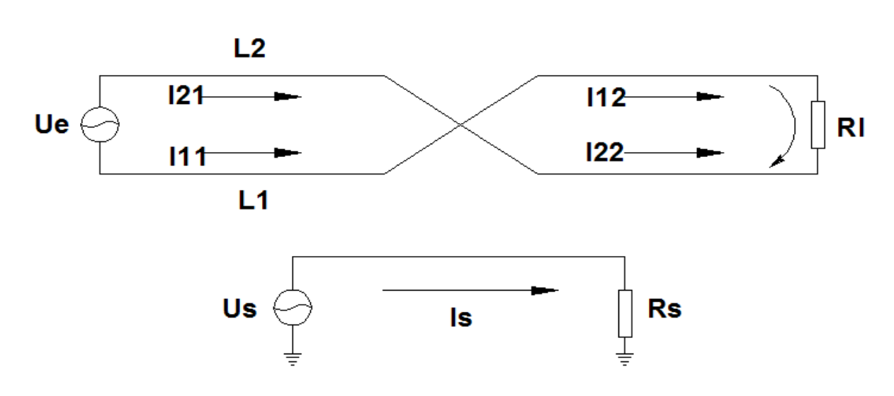
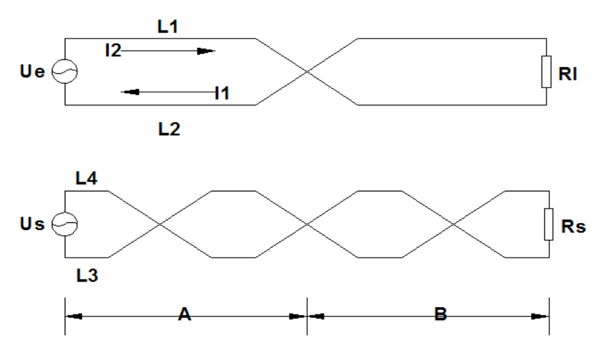

# 双绞线抗干扰原理

---

## 双绞线的两根导线传输电流的方向

只有两根导线才能形成回路,所以,两根线中的电流永远是**大小相同,方向相反的**.双线并行或是扭绞,两根导线中的电流形成的磁场强度相等,方向相反,所以就可以相互抵消.

## 双绞线对外部干扰的抑制

干扰信号对**平行线**的干扰, 见图. `Us`为干扰信号源, 干扰电流`Is`在双线的两条导线`L1,L2`上产生的干扰电流分别是`I1`和`I2`. 由于`L1`举例干扰源较近, 因此, `I1>I2`, `I=I1-I2≠0`, 有干扰电流存在.

干扰信号对**扭绞双线**回路的干扰,见图,与平行线不同的是, 双线回路在中点位置进行了一次扭绞. 在`L1`上存在干扰电流`I11`和`I12`, 在`L2`上存在干扰电流`I21`和`I22`, 干扰电流`I=I21+I22-I11-I22`, 由于两段线路的条件相同, 所以, 总干扰电流`I=0`. 所以只要设置合理的绞距, 就能达到消除干扰的目的.

## 同一电缆内部各线对之间的串扰

两个未绞双线回路间的串扰, 见图. 其中`Ue`为主串回路, `Us`为被串回路. 导线`L1`上的电流`I1`在被串回路`L3`和`L4`中产生感应电流`I31`和`I41`, `I41>I31`, 在被串回路中形成串扰电流`I11=I41-I31`, 同样, 导线`L2`上的电流`I2`在被串回路`L3`和`L4`中产生感应电流`I32`和`I42`, `I42>I32`, 在被串回路中形成串扰电流`I12=I32-I42`, 总干扰电流`I=I11+I12`, 由于`L1`与`L3`,`L4`的距离比`L2`较近, `I=I11+I12>0`, 在回路`Us`中形成干扰.

两个绞距相同的回路如图所示. 回路`Ue`和回路`Us`同时在中点位置做扭绞, 因此, 两个回路的`4`根导线之间的相对关系与未绞是完全相同的, 根据以上分析可知, 是不能起到消除串扰的作用. `Ue`和`Us`分别在对方回路中产生干扰电流`Is`和`Ie`, 所以当两个绞合的双线回路绞距相同时, 不能消除串扰.

两个绞距不同的双线回路见图, 回路`Ue`在中点作扭绞. 回路`Us`除在中点作扭绞外, 还在`A`段和`B`段的二分之一处分别做扭绞.

下面以回路`Ue`为主串回路, 回路`Us`为被串回路. 分为`A,B`两段, 先分析`A`段的串扰. 在`A`段内, 回路`Ue`未作扭绞, 而回路`Us`在二分之一处做扭绞. 由于回路`Us`在`A`段中点扭绞, 导线`L1`对回路`Us`的干扰电流为零. 同样道理, 导线`L2`对回路`Us`的干扰电流也为零. 因此, 在`A`段, 回路`Ue`对回路`Us`的串扰电流为零.

`B`段的情况与`A`段完全相同, 在`B`段串扰电流也为零. 因此, 回路`Ue`对回路`Us`的总串扰为零. 所以, 两个独立的双绞线回路, 只要涉及合理的绞距, 是可以消除相互串扰.

