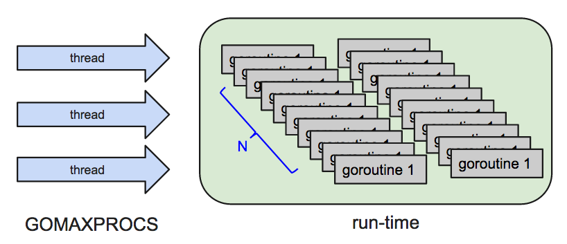

#14 并发concurrency

[地址](http://edu.51cto.com/lesson/id-32321.html "地址")

###笔记

---

**并发concurrency**

`Go 的高并发`: 官方实现的超级线程池. 每个 4-5KB 的栈内存占用和由于实现机制而大幅减少的创建和销毁开销.

并发主要由切换时间片来实现"同时"运行, 在并行则是直接利用多核实现多线程的运行, 但 Go 可以设置使用核数, 发挥多核计算机的能力.

Goroutine 奉行通过通信(`Channel`)来共享内存, 而不是共享内存来通信.

**示例**

		func main(){
			go GO();//Goroutine
		}

		func Go(){
			fmt.Println("GO GO GO!!!")
		}
		上述列子无任何输出, main()函数结束,整个程序声明周期结束, 不管其他线程是否结束
		
		修改:
		func main(){
			go GO();//Goroutine
			time.Sleep(2 * time.Second)
		}
		输出: GO GO GO!!!
		
		
**Channel**

* Channel 是 `goroutine` 沟通的桥梁, 大都是阻塞同步的

		func main(){
			c := make(chan bool)
			go func(){//放入匿名函数中
				fmt.Println("GO GO GO!!!")
				c <- true
			}()
			<- c //没有内容所有阻塞,当输出GO GO GO,存入内容,然后 main 函数才退出
		}

		func Go(){
			fmt.Println("GO GO GO!!!")
		}

* 通过 `make` 创建, `close` 关闭
* `Channel` 是引用类型
* 可以使用 `for range` 来迭代不断操作 `channel`
	
		func main(){
			c := make(chan bool)
			go func(){//放入匿名函数中
				fmt.Println("GO GO GO!!!")
				c <- true
				close(c)//关闭channel
			}()
			for _, v := range c {//迭代的时候channel在等待值进去
				fmt.Println(v) 
			}	
			//因为colse(c)关闭,所以main函数退出, 如果没有close的时候,提示所有的goroutine都在等待中,死锁
		}

		func Go(){
			fmt.Println("GO GO GO!!!")
		}
		
		输出:
		Go GO GO!!!
		true
		
* 可以设置`单向`或`双向`通道,`单向`通道分为2类:只能存,只能取.
* 可是设置缓存大小, 在未被填充满前不会发生阻塞. 缓存为0,就是阻塞的.
	* 有缓存是异步的,无缓存是同步阻塞的 

**Select**

* 可处理一个或多个 `channel` 的发送与接收
* 同时有多个可用的 `channel` 时按`随机顺序`处理
* 可用空的 `select` 来阻塞 `main` 函数 (空的既没有发送,也没有接收)
* 可设置超时

		c := make(chan bool)
		select {
			case v := <-c:
				fmt.Println(v)
			case <- time.After(3 * time.Second):
				fmt.Println("Timeout")
		}

`示例`:

		c1,c2 := make(chan int), make(chan string)
		go func(){				
			for{
				select{
					//v 都是局部变量
					case v,ok := <-c1:
						if !ok {
							o <- true
							break
						}	
						fmt.Println("c1",v)		 
					case v,ok := <-c2:
						if !ok {
							o <- true
							break
						}	
						fmt.Println("c2",v)	
					}
				}
			}()
		
		c1 <- 1
		c2 <- "hi"
		c1 <- 3
		c2 <- "hello"
		
		close(c1)
		close(c2)
		
		<-o //一旦读到值 main 函数就退出
		
				
###整理知识点

---

**goroutine和锁**

goroutine里所谓"无锁"的优点只在单线程下有效,如果$GOMAXPROCS > 1并且协程间需要通信,Go运行库会负责加锁保护数据,这也是为什么sieve.go这样的例子在多CPU多线程时反而更慢的原因 .

####并发和并行

* 并发是并行的必要条件,如果一个程序本身就不是并发的,也就是只有一个逻辑控制流,那么我们不可能让其被并行处理.
* 并发不是并行的充分条件,一个并发的程序,如果只被一个CPU流水线进行处理(通过分时),那么它就不是并行的.
* 并发只是更符合现实问题本质的表达方式,并发的最初目的是简化代码逻辑,而不是使程序运行的更快.

**并发**

`单核`

并发 `concurrency` 是将 `process` 切割成多个可执行单位 (`coroutine`), 如果多个 `process` 时则在 `coroutine` 中交互执行, 这样不会因为某一个 `process` 执行太久造成其他 `process` 无法处理. **`但是这样不会增加执行效率,总执行时间是一样的`**.

和 `thread` 不同的是, `thread` 是属于 `os` 层面上的, 且 `thread` 非常消耗系统资源.

**并行**

`多核`

并行 `parallelism` 是多个 `process` 由多个 cpu 去执行,可以**`增加执行效率,缩短执行时间`**

**goroutine**

go 用 `goroutine` 实现了 `concurrency`. 使用者只要设定最大的 `thread` 数量, 和系统是多少 CPU, run-time 就会帮你处理剩下的`thread`管理.

GO默认是使用一个CPU核的, 除非设置`runtime.GOMAXPROCS`

**goroutine的Happens Before**

 Within a single goroutine, reads and writes must behave as if they executed in the order specified by the program. That is, compilers and processors may reorder the reads and writes executed within a single goroutine only when the reordering does not change the behavior within that goroutine as defined by the language specification. Because of this reordering, the execution order observed by one goroutine may differ from the order perceived by another. For example, if one goroutine executes a=1; b=2;, another might observe the updated value of b before the updated value of a.

* a = 1; 
* b = 2;

如果只有一个goroutine 读写行为和它们在程序中的位置一致 就是说 编译器和处理器只能在保证读写在程序中的正确行为时 比如读写顺序 才有可能对读写进行优化  举例来说 在一个goroutine中执行 另一个goroutine中可能会在a之前察觉到b的更新操作

To specify the requirements of reads and writes, we define happens before, a partial order on the execution of memory operations in a Go program. If event e1happens before event e2, then we say that e2 happens after e1. Also, if e1 does not happen before e2 and does not happen after e2, then we say that e1 and e2happen concurrently.

为了定义读写的需求 我们给Go程序的内存操作 定义了一个偏序“发生在X之前”  如果时间e1发生在e2之前 那么我们认为e2事件出现在e1后 同样的 如果e1不出现在e2之前 并且又不出现在e2之后 那么我们认为e1和e2是并行的

Within a single goroutine, the happens-before order is the order expressed by the program.

在同一个goroutine中 “发生在X之前”这个次序和程序中表达出来的次序是一致的

A read r of a variable v is allowed to observe a write w to v if both of the following hold:

对v的写操作w 如果想被v的读操作r观察到 需要满足下面两个条件：

* r does not happen before w.  
  r不发生在w之前
* There is no other write w' to v that happens after w but before r.     
  没有其它的写操作w` 发生在w之后 r之前

To guarantee that a read r of a variable v observes a particular write w to v, ensure that w is the only write r is allowed to observe. That is, r is guaranteed to observe w if both of the following hold:

想要保证读操作r 可以观察到特定的w写操作给 v 需要确保w是r唯一可以观察到的写操作 也就是说 只有满足下面条件后 才得以保证r观察到w 

* w happens before r.  w发生在r之前
* Any other write to the shared variable v either happens before w or after r. 任何其它对v的写 要么发生在w之前 要么在r之后

This pair of conditions is stronger than the first pair; it requires that there are no other writes happening concurrently with w or r.

这两个条件要比之前的两个条件更加严苛 它需要没有其它的写操作和w或者r是并行发生的

Within a single goroutine, there is no concurrency, so the two definitions are equivalent: a read r observes the value written by the most recent write w to v. When multiple goroutines access a shared variable v, they must use synchronization events to establish happens-before conditions that ensure reads observe the desired writes.

在单一goroutine环境下 没有并行的说法 所以上面两对条件是相同的 读操作观察到对变量v的最近一次写 当多个goroutine同时访问共享变量v时 它们需要利用同步事件来建立“发生在X之前”这个条件 来确保读可以观察到写

The initialization of variable v with the zero value for v's type behaves as a write in the memory model.

v变量用对应类型的零值初始化行为 在内存模型中 和写变量v是类似的

Reads and writes of values larger than a single machine word behave as multiple machine-word-sized operations in an unspecified order.

如果读写的值大于一个机器字 它们的行为和 多机器字操作类似 次序不确定 

**示例1:传统for循环统计运行时间**

		func main(){
		
			fmt.Println("start:",time.Now().String())
			
			for i := 0; i < 10; i++ {
				Increase(i)
			}

			fmt.Println("end:", time.Now().String())
		}
		
		func Increase(index int){
			a := 1
			for i := 0; i < 1000000000; i++ {
				a += 1
			}
			fmt.Println(index,a)

		}
		
		输出:
		start: 2015-08-28 15:31:42.638566869 +0800 CST
		0 1000000001
		1 1000000001
		2 1000000001
		3 1000000001
		4 1000000001
		5 1000000001
		6 1000000001
		7 1000000001
		8 1000000001
		9 1000000001
		end: 2015-08-28 15:31:46.72737112 +0800 CST
		运行时间 4s
		
**示例2:goroutine针对for循环统计运行时间**
	
	func main(){
		
		wg := sync.WaitGroup{}
		wg.Add(10)
		fmt.Println("start:",time.Now().String())
		for i := 0; i < 10; i++ {
			go Increase(&wg,i)
		}
		wg.Wait()
		fmt.Println("end:", time.Now().String())
	}

	func Increase(wg *sync.WaitGroup, index int){
		a := 1
		for i := 0; i < 1000000000; i++ {
			a += 1
		}
		fmt.Println(index,a)

		wg.Done()
	}
	
	输出:
	start: 2015-08-28 15:33:15.80255095 +0800 CST
	0 1000000001
	1 1000000001
	2 1000000001
	3 1000000001
	4 1000000001
	5 1000000001
	6 1000000001
	7 1000000001
	8 1000000001
	9 1000000001
	end: 2015-08-28 15:33:19.868182997 +0800 CST
	运行时间 4s
	
**示例3:设置GOMAXPROCS(1个CPU)针对for循环统计运行时间**

	func main(){
		
		untime.GOMAXPROCS(1)
		wg := sync.WaitGroup{}
		wg.Add(10)
		fmt.Println("start:",time.Now().String())
		for i := 0; i < 10; i++ {
			go Increase(&wg,i)
		}
		wg.Wait()
		fmt.Println("end:", time.Now().String())
	}

	func Increase(wg *sync.WaitGroup, index int){
		a := 1
		for i := 0; i < 1000000000; i++ {
			a += 1
		}
		fmt.Println(index,a)

		wg.Done()
	}
	
	输出:
	start: 2015-08-28 15:33:53.804808 +0800 CST
	0 1000000001
	1 1000000001
	2 1000000001
	3 1000000001
	4 1000000001
	5 1000000001
	6 1000000001
	7 1000000001
	8 1000000001
	9 1000000001
	end: 2015-08-28 15:33:57.798379501 +0800 CST
	运行时间 4s
	单核,还是并发,没有提升效率
	
**示例3:设置GOMAXPROCS(多个CPU)针对for循环统计运行时间**

`显著提升效率`

	func main(){
		
		//Go运行库最多会启动$GOMAXPROCS个线程来运行goroutine
		untime.GOMAXPROCS(runtime.NumCPU())//测试电脑是runtime.NumCPU() = 4
		wg := sync.WaitGroup{}
		wg.Add(10)
		fmt.Println("start:",time.Now().String())
		for i := 0; i < 10; i++ {
			go Increase(&wg,i)
		}
		wg.Wait()
		fmt.Println("end:", time.Now().String())
	}

	func Increase(wg *sync.WaitGroup, index int){
		a := 1
		for i := 0; i < 1000000000; i++ {
			a += 1
		}
		fmt.Println(index,a)

		wg.Done()
	}
	
	start: 2015-08-28 17:31:44.140650061 +0800 CST
	2 1000000001
	6 1000000001
	1 1000000001
	8 1000000001
	3 1000000001
	9 1000000001
	7 1000000001
	5 1000000001
	4 1000000001
	0 1000000001
	end: 2015-08-28 17:31:46.253747516 +0800 CST
	运行时间2s,提升效率