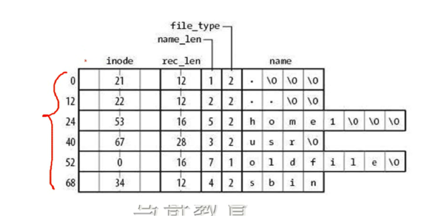

#09_01 磁盘及文件系统管理详解之三

###笔记

---

**CPU4个级别**

由`外`到`内`4个环. 最里面是`ring0`,最外面是`ring3`. ring1 和 ring2 暂时没有使用.

* 内核使用`ring0`
* 用户进程使用`ring3`

**block size**

1024(1k),2048(2k),4096(4k)

**inode bitmap**

`inode bitmap`: 代表的是Inode的使用情况,每个byte代表一个inode,如果是`1`则表示`被使用`,如果是`0`表是`空闲`.

**block bitmap**

`block bitmap`: 一个block bitmap占用一个block大小,而block bitmap中每个bit表示一个对应block的占用情况,0表示对应的block为空,为1表示相应的block中存有数据

**super block**

`super block`, `超级块`. 保存整个`分区`的`全局信息`(a.有多少个块组.b.每个块组中包含多少个块.). 有多个备份.

**块组描述表**

记录块组名,记录每个块组从哪个块开始,哪个块结束.有多个备份(块组边界信息).

**boot block**

`boot bloack`: 预留出来,不能存数据。存放`操作系统` bootloader(多系统的时候),`单一系统bootloader`存放于  `MBR`.

**GDT**

块组描述表.`Group Description Table`

**目录**

`目录是张表`:

* `inode`: inode number
* `name_len`: 名称长度
* `file_type`: 文件类型

**磁盘块引用格式**

逐层引用

**ext3**

`ext3`: journal file system 日志文件系统

###整理知识点

---

磁盘块引用格式,逐层引用?