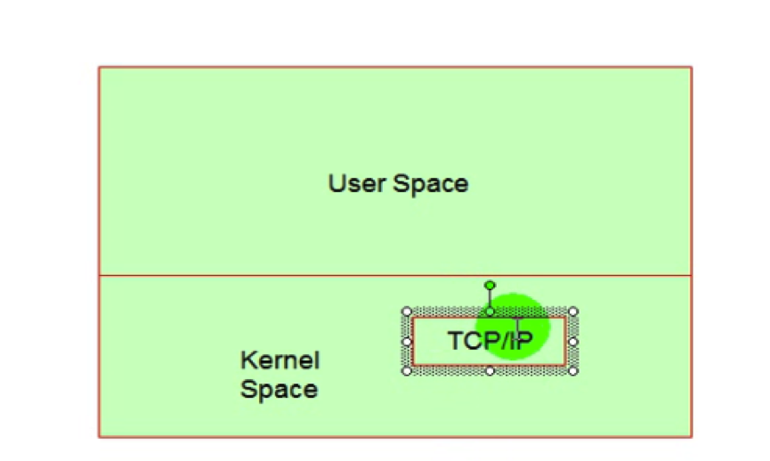

#11_03 Linux网络配置之三 TCP报文

###笔记

---

**网络地址(A,B,C,D,E)**

`/ip/ipAddress`,已经整理笔记

**路由协议**

* 每条路径都有成本.
* 每一个路由器只关心下一跳.
* 路由器路由表中每一个条目叫做`路由条目`. 分为 `主机路由` 和 `网络路由`.
* `0.0.0.0` 是默认路由

**TCP**

TCP 传输控制协议 `Transmission Control Protocol`. 传输前`先握手`,`三次`握手.

TCP协议中的`三次握手`(`连接`)和`四次挥手`(`断开`)

**UDP**

UDP 用户数据报协议 `User Datagram Protocol`. 传输时`只管发送`,`不管发送是否到达`.

即时通讯软件 -> UDP, 速度快.

**TCP,UDP**

端到端,进程到进程

**IP**

主机到主机通信

**Ethernet,ppp,ATM**

点到点通信

**通信子网**

**资源子网**

应用层协议,http 等...
 
**TCP/IP**

* User Space(用户空间 存储用户进程)
* Kernel(内核空间)

`用户` 通过 `用户空间`(命令) 设置 `内核空间` `TCP/IP`.

通过命令设置是`临时的`(`即时`生效), 通过配置文件设置是`永久的`(`不即时`生效),每次重启开机读取配置文件

 

**bonding**

2块网卡系统绑成`一个逻辑网卡`. 可以`同时传输`,也可以`一个传输一个备用`.

###整理知识点

---

**子网**

IP地址由两部分组成,即`网络号(Network ID)`和`主机号(Host ID)`.`网络号`标识的是Internet上的一个`子网`,而`主机号`标识的是子网中的`某台主机`.

`网络号`和`主机号`通过`子网掩码`计算. 在`/IP/ipAddress`文章中.