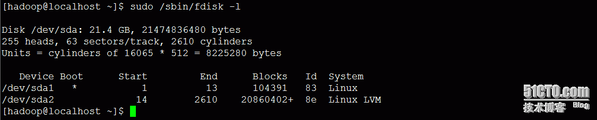

#17_03_sudo详解

---

####用户只有两类

管理员 和 普通用户

####sudo

**su**

switch user

**sudo**

切换用户执行某条命令.

sudo COMMAND.

类似`suid`执行文件属主的身份.

用来定义某个用户能够以另外哪一个用户的身份(可能不是管理员)通过哪些主机执行什么命令.

sudo 执行需要输入密码,防止其他用户执行命令.

sudo 在默认情况下,在第一次输入密码后,会把密码认证信息记录下来,有效期为5分钟.`sudo -k`下次再执行命令无论是否超过5mins,都必须要提供密码.

**sudo程序本身就是一个设置了SUID位的二进制文件**

		ls -l /usr/bin/sudo
		---s--x--x 1 root root 130720 4月   1 01:09 /usr/bin/sudo
		
它的所有者是root,所以每个用户都可以像root那样执行该程序.设置了SUID的程序在运行时可以给使用者以所有者的EUID.

**sudo 和 suid**

设置一个命令文件的`suid`和用`sudo`来运行它是不同的概念.`sudo`需要的不是目标用户的密码,而是执行`sudo`的用户的密码.

`sudo`个人觉得是一个大的配置,不局限于以一个进程的属主(`suid`)或者属组(`sgid`)来执行.而且其可以限制更多,如`谁`在`哪些主机` `以谁的身份` `执行哪些命令` `可以输入或者不输入密码`.

**sudo的配置文件**

`/etc/sudoers`

这个文件的权限是`440`,避免被其他用户查看.

不建议使用`vim`编译该文件,因为不能检查语法.使用`visudo`专门用来编辑配置文件的`sudoers`命令.这个命令会检查语法的正确性.

每一行定义了一个sudo条目.

**sudo条目的语法格式**

`who`	`which_hosts=(runas)` 	`TAG:` `command`

* `who`: 谁,可以使用`User_Alias`
* `which_hosts`: 在哪些主机,可以使用`Host_Alias`
* `runas`: 以谁的身份,`Runas_Alias`
* `command`: 执行哪些命令,`Cmnd_Alias`
* `TAG`:
	* `NOPASSWD`: 这个标签后的所有命令,用户不需要在输入密码.

可以用`default`关键字定义默认属性.

**sudo别名**

类似定义的`组`.

支持4类别名:

* 用户别名: User_Alias, 多个用户可以定义为一个组,让一个组有这样一个权限.
* 主机别名: Host_Alias
* 用户身份别名: Runas_Alias
* command: Cmnd_Alias, 命令最好使用绝对路径.

别名必须全部而且只能使用大写英文字母的组合.

可以使用`!别名`,表示取反.

用户别名:
 
		User_Alias ALIASNAME = 用户名,组名都可以.组名之前需要加上%.还可以包含其他已经定义的用户别名
		
Host_Alias:

		Host_Alias ALIASNAME = 主机名,IP,网络地址,或者其他主机别名.
		
Runas_Alias:

		用户名
		%组名
		其他的Runas别名
		
Cmnd_Alias:

		命令路径
		目录(此目录内的所有命令)
		其它实现定义过的命令别名				
		
**示例**

`hadoop`用户,以`root`身份执行,`useradd`(无需输入密码)和`usermod`命令(需要输入密码).

		hadoop	ALL=(root)	NOPASSWD: /usr/sbin/useradd, PASSWD: /usr/sbin/usermod	
		
`hadoop`用户,`hadoop`组,`useradmin`组,以`root`身份执行`useradd`,`usermod`,`userdel`,`passwd`命令,但是不能修改`root`密码.		
		
		User_Alias USERADMIN = hadoop, %hadoop, %useradmin
		Cmnd_Alias USERADMINCMND = /usr/sbin/useradd, /usr/sbin/usermod, /usr/sbin/userdel, /usr/bin/passwd [A-Za-z]*, ! /usr/bin/passwd root
		
		USERADMIN	ALL=(root) NOPASSWD: USERADMINCMND
		
`/usr/bin/passwd [A-Za-z]*`(开头大小写字母,后面跟任意字符)这样匹配是因为,`passwd`后面不跟任何参数就是默认修改`root`密码.这样我们让这个命令后面必须跟字符
		
####sudo命令

* `-l`: 列出当前用户可以使用的所有`sudo`类命令
* `-k`: 让认证信息失效
			
####/var/log/secure

sudo 使用过程都会比记录在该日志文件内.
		
		[chloroplast@iZ94jqmwawyZ ~]$ sudo tail /var/log/secure
		Jul 20 11:09:32 iZ94jqmwawyZ sudo: chloroplast : TTY=pts/2 ; PWD=/home/chloroplast ; USER=root ; COMMAND=/bin/tail /var/log/secure
			
###整理知识点

---

####sudo的基本实例用法

**hadoop用户可以在任何地点以管理员的身份执行命令useradd(无需密码)和usermod(需要密码)**

			
		hadoop  ALL=(root) NOPASSWD:/usr/sbin/useradd, PASSWD:/usr/sbin/userdel

切换至hadoop用户测试结果:

**hadoop用户和组可以在任何地点以管理员的身份执行命令执行 增,删,改,设置用户名密码,但不允许设置管理员的密码**

		User_Alias USERADMIN = hadoop, %hadoop
		Cmnd_Alias USERADMINCMND = /usr/sbin/useradd, /usr/sbin/usermod, /usr/sbin/userdel, /usr/bin/passwd [A-Za-z]*, ! /usr/bin/passwd root
		USERADMIN ALL=(root) NOPASSWD: USERADMINCMND

**hadoop用户只能在192.168.1.120主机远程登录并以管理员身份执行ifconfig eth0命令**

		Cmnd_Alias NETCMND = /sbin/ifconfig eth0
		hadoop 192.168.1.120 = (root) NOPASSWD:NETCMND
		
使用`192.168.1.104`测试,如图:

		
使用`192.168.1.120`测试,如图:

**hadoop用户可以在任何地点以任何的身份执行所有命令,等同于root**

			hadoop  ALL=(ALL)       ALL

####euid 和 suid

内核主要是根据euid和egid来确定进程对资源的访问权限.一个`进程`如果没有`SUID`或`SGID`位,则euid=uid  egid=gid,分别是运行这个程序的用户的uid和gid.

		kevin用户的uid和gid分别为204和202,foo用户的uid和gid为200,201,kevin运行myfile程序形成的进程的euid=uid=204,egid=gid=202,内核根据这些值来判断进程对资源访问的限制,其实就是kevin用户对资源访问的权限,和foo没关系.
		
如果一个程序设置了SUID,`则euid和egid变成被运行的程序的所有者的uid和gid`.

		如kevin用户运行myfile,euid=200,egid=201,uid=204,gid=202,则这个进程具有它的属主foo的资源访问权限.
		
SUID的作用就是这样: 让本来没有相应权限的用户运行这个程序时,可以访问他没有权限访问的资源.