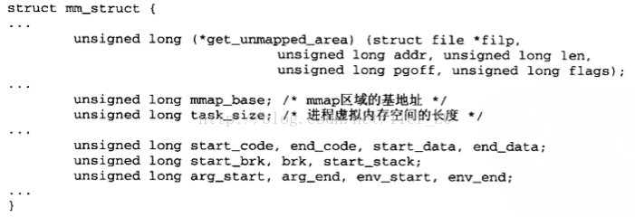
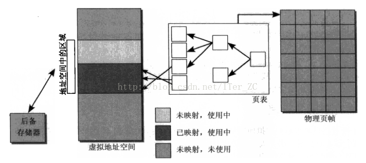
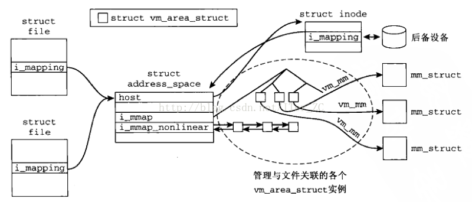

# 深入理解内存映射mmap

---

Linux的虚拟内存管理是基于`mmap`来实现的. `vm_area_struct`是在`mmap`的时候创建的, `vm_area_strcut`代表了一段连续的虚拟地址, 这些虚拟地址相应地映射到一个后备文件或者一个匿名文件的虚拟页. 一个`vm_area_struct`映射到一组连续的页表项. 页表项又指向物理内存page, 这样就把一个文件和物理内存页相映射.

来理解一下虚拟地址映射的过程: 拿到一个虚拟地址, 根据已有的`vm_area_struct`看这个虚拟地址是否属于某个`vm_area_struct`:

1. 如果没有匹配到, 就报段错误, 访问了一个没有分配的虚拟地址.
2. 如果匹配到了`vm_area_struct`, 根据虚拟地址和页表的映射关系, 找到对应的页表项`PTE`, 如果`PTE`没有分配, 就报一个缺页异常, 去加载相应的文件数据到物理内存, 如果`PTE`分配, 就去相应的物理页的偏移位置读取数据.

虚拟页的三种状态的实际含义如下:

1. **未分配**虚拟页: 指的是没有使用`mmap`建立`vm_area_struct`, 所以也就没有对应到具体的页表项.
2. **已分配**虚拟页, **未映射**到物理页: 指的是已经使用了`mmap`建立的`vm_area_struct`, 可以映射到对应的页表项, 但是页表项没有指向具体的物理页.
3. **已分配**虚拟页, **已映射**到物理页: 指的是已经使用了`mmap`建立的`vm_area_struct`, 可以映射到对应的页表项, 并且页表项指向具体的物理页.

mmap要么映射到一个后备文件, 要么映射到一个匿名文件. 操作系统分配物理内存时实际用到了匿名文件的mmap.

## mmap和虚拟内存管理

内核定义了`mm_struct`结构来表示一个用户进程的虚拟内存地址空间.

1. `start_code`,`end_code`指定了进程的代码段的边界, `start_data`,`end_data`指定了进程数据段的边界. 在ELF二进制文件映射到虚拟内存地址空间后, 这几个长度就不会再改变.
2. `start_brk`, `brk`指定了堆的边界. `start_brk`表示堆的起始地址, 在进程整个生命周期不会改变, `brk`表示堆的结束位置, 会随着堆的长度改变而改变.
3. `stack_top`指定了栈的起始位置.
4. `task_size`指定了用户进程地址空间的长度, 也就是用户进程地址空间的顶部边界.
5. `mmap_base`指定了用户进程虚拟地址空间中用作内存映射部分的地址的基地址, 这个位置不是随机的, 通常是`TASK_SIZE / 3`位置处.



**这里各个区域的地址都是用户进程的虚拟地址**, 用户进程使用虚拟地址和页表结构来访问内存.

1. 首先根据所在区域的虚拟地址转换成对应的页表数组的数组项索引, 找到页表索引最后定位到PTE中保存的物理内存页的页号, 加上虚拟地址低12位的offset来确定一个唯一的物理内存地址.
2. 如果物理内存地址所在的页存在, 就返回该物理地址存放的内容. 如果不存在就触发缺页异常. 虚拟内存管理采用按需分配 + 缺页异常机制来管理页表项和分配对应的物理内存页. **当一个虚拟地址对应的页表项不存在时, 先创建页表结构, 再分配物理内存页, 再修改页表**.



进程的`mm_struct`除了包含虚拟内存地址空间布局的信息, 还包含了虚拟内存区域`vm_area_struct`的信息.

**虚拟内存区域`vm_area_struct`是内核管理用户进程虚拟地址空间的方式, 实际上数据段, 文本段, 共享库这些都是通过`vm_area_struct`来管理的**.


`vm_area_struct`有两种组织形式, 一种是单链表, 包含了所有创建的`vm_area_struct`实例, 一种是红黑树结构, 加速区域的查找. **这两个数据结构都是面向同一份`vm_area_struct`实例, 只是组织形式不同**.

再考虑一下`vm_area_struct`和页表的关系, `vm_area_struct`本质上是一段用户进程的虚拟地址, 而我们知道虚拟地址和页表数组的索引是对应的, 页表数组的最后一级PTE数组的数组项存放着物理内存页的页号, 这样就建立了虚拟内存地址到物理内存地址的对应关系.

1. 有一种情况是先有虚拟地址, 再由访问虚拟地址引起缺页异常去加载物理内存, 再更新页表建立虚拟地址, 页表, 物理内存三者的联系.
2. 有一种情况(mmap)是先从设备加载文件, 建立`address_space`, 页缓存(物理内存), 再创建vm_area_struct结构, 更新页表, 返回虚拟地址.

`vm_area_struct`的结构体如下:

1. `vm_start`, `vm_end`表示区域的开始位置和结束位置, 确定了区域的边界. 两个`vm_area_struct`不会出现交叉的情况.
2. `vm_page_prot`表示这个区域的页的访问权限.
3. `shared`结构处理有后备文件的内存映射, 和后备文件的`address_space`地址空间关联起来.
4. `anon_vma_node`, `anon_vma`处理匿名文件共享内存映射的情况, 映射到同一物理内存页的映射都保存在一个链表中.
5. `vm_pgoff`, `vm_file`都是处理有后备文件内存映射的情况, 获得该映射在文件的页偏移量, 以及打开文件`file`实例的信息.


对于有后备文件的映射, 内核还提供了一个优先查找树结构, 来加速确定一个文件和所有映射到这个文件的虚拟内存区域`vm_area_struct`实例的关系, 从而可以得到所有映射到这个文件的进程信息.

**这张图表示了一个后备文件被mmap映射后内核建立的一些数据结构, 涉及到了内存管理的数据和文件系统的数据**.



内核提供了一系列的函数对虚拟内存区域v`m_area_struct`进行操作, 比如创建, 删除, 合并, 查找等等. 而mmap是C标准库提供给用户程序的一个函数来使用内存映射, 建立起文件地址空间和虚拟内存区域的映射关系.

## mmap的4种类型

mmap分为有后备文件的映射和匿名文件的映射, 这两种映射又有私有映射和共享映射之分. 所以mmap可以创建4种类型的映射.

1. 后备文件的共享映射, 多个进程的`vm_area_struct`指向同一个物理内存区域, 一个进程对文件内容的修改, 会被其他进程可见. 对文件内容的修改会被写回到后备文件.
2. 后备文件的私有映射, 多个进程的`vm_area_struct`指向同一个物理内存区域, 采用写时拷贝的方式, 当一个进程对文件内容做修改, 不会被其他进程看到. 另外对文件内的修改也不会被写回到后备文件. 当内存不够需要进行页回收时, 私有映射的页被交换到交换区. 一般用在加载共享代码库.
3. 匿名文件的共享映射, 内核创建一个初始都是0的物理内存区域, 然后多个进程的`vm_area_struct`指向这个共享的物理内存区域, 对该区域内容的修改对所有进程可见. 匿名文件在页回收时被交换到交换区.
4. 匿名文件的私有映射, 内核创建一个初始都是0的物理内存区域, 对该区域内容的修改只对创建者进程可见. 匿名文件在页回收时被交换到交换区. `malloc()`底层是用了匿名文件的私有映射来分配大块内存.

比如下面的例子, mmap会涉及到物理内存的变化(加载后备文件到页缓存, 或者分配都是0的物理内存块), 创建`vm_area_struct`虚拟内存区域实例, 更新页表.

```c
// 后备文件的共享映射  
fd = open("/home/xxx/a.txt", O_RDWR)  
addr = mmap(NULL, length, PROT_READ | PROT_WRITE, MAP_SHARD, fd, 0)  
  
// 匿名文件的私有映射  
fd = open("/dev/zero", O_RDWR)  
addr = mmap(NULL, length, PROT_READ | PROT_WRITE, MAP_PRIVATE, fd, 0)  
```
 
内存映射的用途很多:
 
1. 后备文件的共享映射可以用作内存映射IO来对大文件进行操作, 比普通IO减少一次复制. 需要注意的是内存映射IO涉及到内核的很多操作, 比如`vm_area_struct`的创建, 页表的修改等等, 比普通IO的操作更复杂. 小文件的读写使用普通IO更合适.
2. 后备文件的私有映射可以用作共享库二进制文件代码段, 数据段的加载.
3. 匿名文件的共享映射可以用作fork时让父子进程共享匿名映射分配的内存.
4. 匿名文件的私有映射可以用作进程的私有内存分配.

## 内核对堆空间的管理
 
实际上从内核的管理用户进程虚拟地址空间的角度来说, 内存映射是管理用户进程虚拟地址空间的主要手段, 通过建立`vm_area_struct`来分配虚拟内存区域. 内核对堆空间的分配主要是`brk`系统调用, `brk`系统调用本质上也是利用了匿名文件私有映射, 分配初始化0的物理内存页, 建立`vm_area_struct`, 然后更新页表结构. `brk`系统调用分配的内存最小单位是页, 需要按页对齐, 从`start_brk`位置向上扩展, 也就是说从内核的角度来说, 每次对堆空间的分配最小就是一页, 更细粒度的字节内存空间分配由C语言标准库实现的.